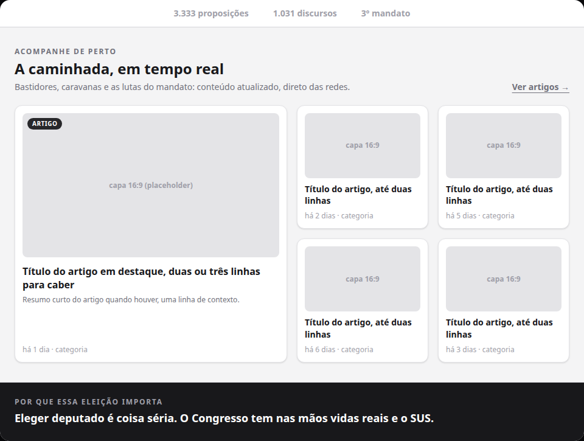
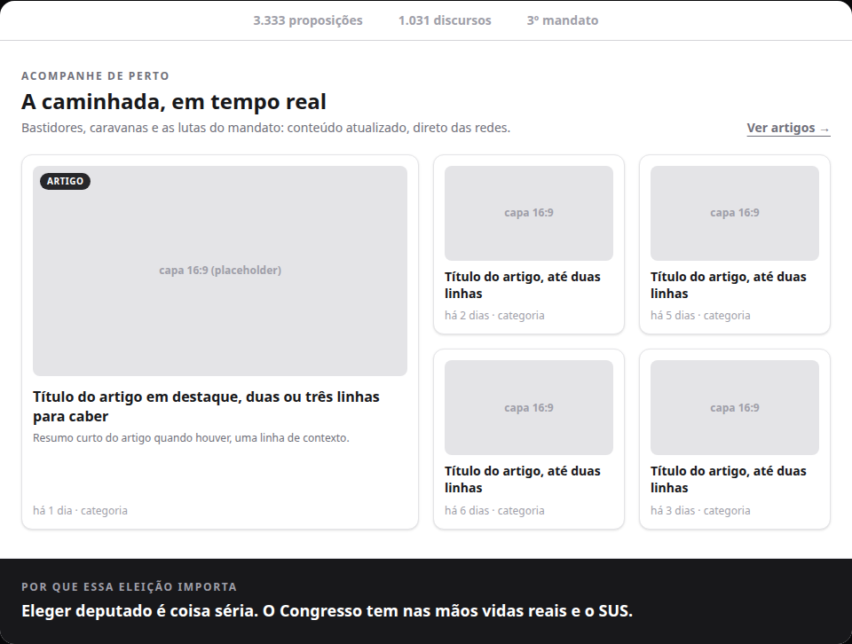
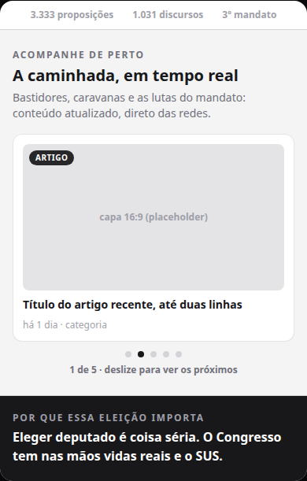

# Separar visualmente a seção "Acompanhe de perto" da prova social na home

Status: rascunho
Atualizado em: 2026-08-18
Issue: #33
Priority: P2
Model: composer-2.5
Impeccable: B — encaixe na seção "Acompanhe de perto" da home pública (jorgesolla1313)
Rascunho UI: docs/plans/separacao-visual-secao-conteudos-home-ui-draft.html + PNGs embutidos abaixo
Appetite: ~0,5 dia de eng — uma superfície, mudança de fundo/borda
Responsável: —

## Intenção

A home de campanha ganhou (S1) a seção "Acompanhe de perto" entre a prova social (faixa de
números "3.333 proposições…") e "Por que essa eleição importa". Mas a prova social e a seção de
conteúdos compartilham o **mesmo fundo branco** e ficam coladas: não dá para ver onde uma termina
e a outra começa. O wireframe aprovado desenhava a seção como uma zona própria (card com
hairlines sobre página de papel); na home toda branca esse desenho se perdeu. A separação precisa
voltar a existir — sem mexer em conteúdo, dados ou comportamento (o fail-closed de esconder a
seção inteira sem posts visíveis continua valendo).

## Persona e fluxo

- **Persona / contexto:** visitante da home pública de campanha, navegando pelo celular ou
  desktop na reta final; rola a página do hero para a prova social e depois para o conteúdo.
- **Job principal:** perceber que a faixa de números (curriculum) acabou e que começou uma zona
  nova — conteúdo atualizado da campanha.
- **Fluxo desejado:** a prova social aparece como hoje; a seção "Acompanhe de perto" começa com
  uma fronteira visível (fundo próprio e/ou linhas), os cards brancos se destacam; abaixo, o
  contraste forte com a seção escura já resolve a passagem seguinte.
- **Anti-goals de produto:** não redesenhar a seção (cards, carrossel, links, textos seguem
  iguais); não mexer no hero nem em outras seções; não criar terceira cor nova de marca.

### Rascunho UI (B/C/D)

Cena 1 (recomendado, desktop) — a seção ganha banda de fundo própria, cards brancos saltam:

Cena 2 (alternativo, desktop) — fundo continua branco, separação só por hairlines:

Cena 3 (recomendado, mobile ~390px):

## Objetivo e aceite

- A fronteira entre a faixa de prova social e a seção "Acompanhe de perto" fica visível de
  imediato, sem hover e sem rolagem extra — no desktop e no mobile.
- Os cards de conteúdo continuam legíveis e destacados dentro da seção.
- Nada além da separação muda: textos, links, ordem das seções, carrossel e o comportamento
  fail-closed (sem posts visíveis, a seção some e Prova → Problema voltam a ser contíguos —
  agora a divisão entre eles passa a ser a fronteira da seção escura, que já existe).

## Dados (intenção)

- **Vou apresentar dados?** Não — nenhum número novo; só a superfície da seção muda.

## Direção no codebase (hipótese)

- **Áreas prováveis:** `src/components/CampaignContentSection.tsx` (fundo/borda da seção, hoje
  `bg-white`) e/ou `src/app/(frontend)/styles.css` (token de cor existente, ex. `--campaign-band`
  `#ebe9e9`, `--campaign-line`). A home em si (`src/app/(frontend)/(home)/page.tsx`) não deve
  precisar mudar — a seção é um componente próprio.
- **Precedente a olhar:** `docs/plans/secao-conteudos-home-artigos.md` (S1) e o wireframe
  aprovado `docs/campanha/wireframe-solla-1313.html` (seção 7 usa `border-top/bottom: 1px solid
var(--line)` sobre zona de cor própria) — a intenção é restaurar esse desenho na home branca.
- **Risco de acoplamento:** a mesma `--campaign-band` já é fundo da seção "Nossa caminhada" e do
  placeholder de capa dos cards; o executor deve conferir o contraste final de cada opção com
  esses usos (as seções não são adjacentes, então não há conflito direto).

## Dependências

- Nenhuma (S1 entregue e em produção; S2/S3/S4 seguem em paralelo, o mesmo arquivo pode ser
  tocado — serializar só se houver PR simultâneo no componente).

## Fora de escopo

- Redesenho da seção de conteúdos (cards, badges, carrossel, links) — fica nas Issues S2/S3/S4.
- Trocar a cor de fundo de outras seções ou da página inteira (hero, prova social, bandeiras).
- Novo token de cor de marca — usar paleta existente.

## Rabbit holes de produto

- **"Já que vou mexer, dá um polimento geral na seção".** Explosão de escopo: redesenho, nova
  paleta, microinterações. **Corte neste item:** só a fronteira com a seção anterior.
- **"Separa tudo com linhas na página toda".** Mexe no shell da home inteira. **Corte:** a
  divisão com a seção escura abaixo já existe; só a passagem Prova → Conteúdos está sem fronteira.

## Questões em aberto (produto)

- **Qual o meio de separação?** **Opções:** A — banda de fundo própria na seção (recomendado,
  ritmo branco → banda → escuro → banda na página) | B — hairlines (borda fina) mantendo fundo
  branco, fiel ao wireframe | C — banda + hairlines juntas. **Recomendação:** A — é o que lê de
  longe na home toda branca; B é o mínimo e fica de fallback. _(assumido — validar com produto no
  gate)_
- **Se banda: usar a mesma `--campaign-band` da seção "Nossa caminhada"?** **Opções:** sim |
  outro tom existente. **Recomendação:** sim — é a "banda cinza" da paleta, já aprovada em
  produção; repetir o tom em seções não adjacentes cria ritmo, não confusão.

## Referências

- GitHub Issue #33
- Issue S1 (entregue): `secao-conteudos-home-artigos.md` / #17 (Forgejo)
- Wireframe aprovado: `docs/campanha/wireframe-solla-1313.html` (seção 7)
- Rascunho UI (gate): `docs/plans/separacao-visual-secao-conteudos-home-ui-draft.html`
- `src/components/CampaignContentSection.tsx` — seção alvo (hoje `bg-white`, linha 52)
- `src/app/(frontend)/styles.css` — tokens `--campaign-band` / `--campaign-line`
