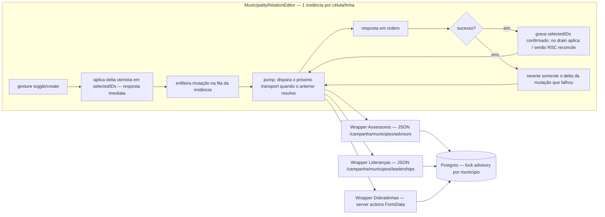

# Impl: Serializar mutações do editor de relações por célula

Status: rascunho
Atualizado em: 2026-08-24
Issue: #378
Intenção: docs/plans/serializar-mutacoes-editor-relacao-municipios.md
Appetite restante: ~0,5 dia eng; manter sem migration, rota nova, mudança de access ou de contratos

## Leitura da intenção

- **Outcome:** mutações de uma mesma célula persistidas na ordem em que foram solicitadas, mantendo a resposta otimista imediata. O editor compartilhado (`MunicipalityRelationEditor`) hoje dispara `onToggle`/`onCreate` em paralelo (`void (async () => …)()` L194/L234) e reconcilia por "última confirmação vence" (`requestSeqRef` L111, `latestConfirmedRef` L112, `finishRequest` L166-171) — a ordem de chegada das transações no banco pode divergir da ordem de intenção, e a falha reverte só o delta local da própria mutação (L195-202, L235-242), podendo apagar alteração posterior válida. É exatamente esse o bug-alvo.
- **O que NÃO negociar:** resposta otimista imediata (nenhum bloqueio de UI durante salvamento); sem fila global — a chave de serialização é a instância do editor (célula/linha); células e linhas diferentes continuam salvando em paralelo; falha intermediária não apaga alteração posterior válida nem deixa o editor preso em loading; sem versionamento otimista/idempotency key no servidor (o servidor já serializa por lock advisory por município — a fila é puramente client-side); sem mudança de schema/migrations/access/rotas/contratos; os três wrappers (Assessores, Lideranças, Dobradinhas) e call sites não mudam de props.
- **O que reavaliar:** o destino da máquina de sequência atual (`requestSeqRef`/`latestConfirmedRef`/`pendingCountRef`) — a fila encadeada muda a premissa do teste `municipalityRelationEditor.unit.spec.tsx` L31-79 (fora-de-ordem → em-ordem), que precisa ser reescrito no mesmo commit; o `tempID` negativo de criação (`-requestSeq` L229) fica acoplado ao contador de sequência e precisa de contador próprio; se a fila vira hook co-locado testável ou permanece inline no editor (decisão de engenharia, não de produto).

## Abordagem recomendada

**Opções consideradas:** A) fila encadeada por instância do editor (transporte serializado, delta otimista imediato, revert por-mutação) | B) manter requisições paralelas e só reordenar a aplicação local | C) abortar a fila na primeira falha
**Recomendação:** A — resolve o problema na origem (ordem de chegada/execução no banco, não a aplicação local), mantém o aceite de falha intermediária (reverte só o delta da mutação que falhou e segue a fila) e preserva a resposta imediata. Com respostas em ordem, `latestConfirmedRef` e o reconcile RSC continuam válidos sem comparação de sequência.
**Rejeitadas:** B porque a divergência é a ordem da transação no servidor — reordenar a aplicação local não reordena o banco e mantém o transporte fora de ordem; C porque viola o aceite ("falha intermediária não apaga alteração posterior válida") e pode deixar display divergente do servidor.

### Decisões de engenharia

**Onde vive a fila**
Opções: dentro do `MunicipalityRelationEditor` (por instância) | hook compartilhado em `lib/` | por-wrapper
Recomendação: dentro do editor (por instância) — o editor já é dono da máquina otimista (pending/sequência/reconcile) e cada célula é uma instância do editor montada por linha (`cell: (municipality) => …` em `MunicipalityList.tsx` L496/L550/L583; cards em `MunicipalityMobileCard.tsx` L344/L374/L395), então a fila por instância serializa exatamente as mutações daquela célula e deixa células/linhas diferentes em paralelo, como o aceite exige. Os wrappers têm transportes diferentes (JSON routes vs server actions FormData) mas ambos retornam `Promise<MunicipalityRelationMutationResult>` — a serialização é agnóstica ao transporte. Para testabilidade, a fila pode ser um hook pequeno co-locado em `src/components/campaign/shared/` (ex. `useRelationMutationQueue.ts`), sem exportar contrato público.
Alternativas rejeitadas: hook em `lib/` porque há um único consumidor (YAGNI dentro do appetite de ~0,5 dia; não existe utilidade de fila/promise-chain em `lib/` hoje — não inventar caminho paralelo; a intenção pede fila por instância/célula); por-wrapper porque duplicaria a serialização em três wrappers, vazaria a política de ordenação para o transporte e reabriria a divergência que B159 consolidou no editor.

**Política de falha na fila**
Opções: (a) encadear promises — cada mutação só dispara quando a anterior resolve — e reverter apenas o delta da mutação que falhou, mantendo as posteriores na fila | (b) manter requisições paralelas e só reordenar a aplicação | (c) abortar a fila na falha
Recomendação: (a) — o aceite exige que falha intermediária não apague alteração posterior válida; com encadeamento as respostas chegam em ordem, a semântica de `latestConfirmedRef`/reconcile RSC continua válida e o estado final persistido reflete a ordem de intenção. A falha de A reverte o delta otimista de A (closure do elo, como hoje L195-202/L235-242) e a fila segue processando B — B foi construída sobre o estado otimista e o servidor nunca viu A, então estado final = baseline + B, idêntico ao display pós-revert.
Alternativas rejeitadas: (b) não resolve o problema — a divergência é a ordem da transação no banco; (c) viola o aceite e pode deixar o editor com estado divergente do servidor.

**Interação durante requisição pendente**
Opções: aplicar o delta otimista imediatamente e enfileirar o transporte | esperar a requisição em voo terminar para aplicar o próximo delta
Recomendação: delta otimista imediato + transporte serializado — o aceite exige "resposta imediata da interface" e o anti-goal "não bloquear a UI durante salvamento"; o toggle seguinte não espera a rede, apenas o seu transporte espera a vez na fila.
Alternativas rejeitadas: esperar a requisição reintroduz o bloqueio que o editor otimista foi criado para eliminar e contradiz o fluxo "continuar vendo a resposta otimista" da intenção.

**Dobradinha sem `selectedIDs` na resposta**
Opções: a fila passa a exigir `selectedIDs` em todo sucesso | a fila serializa só o transporte e mantém a confirmação pelo RSC quando a lista não vem
Recomendação: a fila serializa o transporte e nunca depende de `selectedIDs` — no contrato `MunicipalityRelationMutationResult`, `selectedIDs` é opcional por design (B159), e o toggle de dobradinha retorna só `{ status: 'success' }` (`MunicipalityStateDeputyRelationCell.tsx` L83-85); a confirmação continua vindo do RSC (`currentIDs`/efeito L119-124) e, quando a lista vem (JSON de assessores/lideranças), o drain aplica o último `selectedIDs` confirmado.
Alternativas rejeitadas: exigir a lista quebraria o contrato e forçaria mudança no wrapper/server action de dobradinha — fora do escopo ("não mudar contratos").

**Destino de `requestSeqRef`/`latestConfirmedRef`/`pendingCountRef`**
Opções: manter a máquina de sequência paralela e adicionar a fila por fora | substituir pela fila, preservando o que ainda faz sentido
Recomendação: substituir — com respostas em ordem, `requestSeqRef` perde a função (o "maior sequência confirmada" é sempre a última resposta); `pendingCountRef` vira o tamanho da fila (busy derivado dela, decrementado em `finally` de cada elo — nunca preso); `latestConfirmedRef` permanece com a mesma semântica (último `selectedIDs` confirmado aplicado no drain quando a fila esvazia), sem comparação de sequência. O `tempID` negativo de create deixa de ser `-requestSeq` (L229) e passa a um contador monotônico próprio da instância (`-1, -2, …`), desacoplando o sentinela pendente da ordenação e preservando a invariante `isPendingCreateID` (L71).
Alternativas rejeitadas: manter a máquina paralela ao lado da fila duplicaria dois mecanismos de concorrência no mesmo componente (divergência provável, teste pior, mais código para o appetite).

### Componentes / mudanças

- **`src/components/campaign/shared/MunicipalityRelationEditor.tsx`** — dono da fila por instância: `toggle`/`create` aplicam delta otimista imediato e enfileiram o transport; pump serializado (cada elo dispara quando o anterior resolve); falha reverte só o delta do próprio elo e segue a fila; busy derivado do tamanho da fila; `latestConfirmedRef` mantido sem sequência; reconcile de props externas, bridges de criação e canal de falha (`useCampaignCellFailureChannel`) preservados.
- **`src/components/campaign/shared/useRelationMutationQueue.ts`** (novo, co-locado) — fila testável isoladamente: `enqueue(mutation, revertDelta)`, pump encadeado, drain, busy; sem exportar contrato público (opcional se ficar inline no editor, mas a fase 1 exige teste isolado — recomenda-se o hook co-locado).
- **Wrappers** (`MunicipalityListAdvisorsControl.tsx`, `MunicipalityListLeadershipsControl.tsx`, `MunicipalityStateDeputyRelationCell.tsx`) — sem mudança de contrato; esperado zero diff (continuam retornando `Promise<MunicipalityRelationMutationResult>`).
- **Call sites** (`MunicipalityList.tsx`, `MunicipalityMobileCard.tsx`, `MunicipalityListMobileCards.tsx`) — sem mudança.
- **`tests/unit/municipalityRelationEditor.unit.spec.tsx`** — reescrever o teste L31-79 (premissa muda: fora-de-ordem → em-ordem) e adicionar casos de fila; ver "Fases verificáveis".
- **Migration:** sem migration — nenhuma mudança de schema.
- **Access / Consent:** nenhuma política nova — fila client-side pura, mesmo staff gate/escopo servidor intactos.
- **UI:** Impeccable A — nenhuma mudança visual; comportamento de transporte apenas. B (microfeedback de fila, ex. spinner por chip) rejeitado porque não está no aceite, adiciona churn visual sem pedido de produto e o trigger já sinaliza busy (`triggerBusy`/spinner L297/L314).

## Fases verificáveis

1. **Fila modelada e testada** — implementar a fila encadeada (hook co-locado ou inline) com: enqueue de `{ mutation, revertDelta }`, pump disparando um transport por vez, drain com aplicação do último `selectedIDs` confirmado, busy derivado da fila. Testes unit isolados com transporte simulado (array de resolvers manuais, como o padrão `pending` de `municipalityRelationEditor.unit.spec.tsx` L32-38): sucesso em ordem; mutação B enfileirada durante A pendente **não dispara** o transport até A resolver; falha de A reverte só o delta de A e B ainda dispara e persiste; estado persistido final = baseline + B; drain sem `selectedIDs` (dobradinha) não sobrescreve e confia no RSC; busy nunca preso em erro.
2. **Integração ao editor sem mudar contratos** — `toggle`/`create` passam a enfileirar; remover `requestSeqRef` e o acoplamento do `tempID`; `pendingCountRef` → fila; `latestConfirmedRef` preservado; reescrever o teste L31-79 **no mesmo commit** para pinar o novo comportamento (B só dispara após A; falha de A não reverte B); manter verdes os testes de dedupe de create adotado por RSC (L81-127), known-entries vs opções (L129-160) e overlay.
3. **Validação dos 3 fluxos + gates** — suíte de wrappers intacta: assessores/lideranças (`campaignMunicipalityLeadershipsCreate.unit.spec.tsx` com `vi.mock('@/lib/campaignJsonRequest')`) e dobradinha (`municipalityStateDeputyRelationCell.unit.spec.tsx` com `commitAction` mockado e assert de FormData L62-67) verdes sem diff; cobertura indireta (`campaignCellEditOverlay.unit.spec.ts` L47-89, `campaignComponents.unit.spec.ts` L977-1010) verde; paralelismo entre instâncias (duas células em dois editors: transports disparam concorrentes) pinado em teste; `pnpm gate:fast` (lint + typecheck + test:unit) verde e `pnpm test:int` verde (int chamam `*Record` direto, sem transporte — a fila não as toca).

## Rabbit holes / Não escopo (engenharia)

- Não criar fila global nem por página; a chave de serialização é a instância do editor (célula/linha).
- Não adicionar retry, idempotency key ou versionamento otimista no servidor — a intenção exclui e o lock advisory por município já serializa no servidor.
- Não mudar `MunicipalityRelationTriggerProps`/`MunicipalityRelationMutationResult`, props de `MunicipalityList`/`MunicipalityMobileCard` nem os call sites.
- Não refatorar as rotas JSON (`/campanha/municipios/advisors`, `/leaderships`) nem as server actions de dobradinha; não unificar transportes.
- Não tocar `useCampaignCellAutosave` — abort-superseded é a política correta para célula de valor único; fila é para a lista de relações. Guardar como precedente, não como base.
- Não migrar `RelationChipCell` nem outros call sites de células de relação fora desta lista.
- Não debounce/coalescing de mutações: duas mutações rápidas são duas transações na ordem, não uma.
- Não mudar o comportamento de close/unmount: requests em voo continuam (close já é o commit) e falha pós-close vai a toast pelo canal existente (`useCampaignCellFailureChannel`).

## Adiado com gatilho (triage do /simplify)

- **Teste dedicado do create resolvendo `success` sem `createdEntry`** (branch defensiva herdada de B159 que reverte + reporta `createErrorMessage`; comportamento verificado no código, sem teste próprio). Gatilho: próxima mexida no `MunicipalityRelationEditor` OU evidência de drift de contrato (um wrapper devolvendo sucesso sem `createdEntry`). O teste de create falho em fila (`error`) já cobre o revert; o caso `success`-sem-entry é ~10 linhas quando o editor for tocado.

## Riscos e mitigação

- **Reconcile RSC durante fila ativa:** props externas chegando com a fila não vazia são adotadas (efeito L119-124) e o drain pode sobrescrever com o último `selectedIDs` confirmado. Mitigar: preservar a semântica atual (reset de `latestConfirmedRef` na adoção externa quando a fila está vazia; com fila ativa as respostas em ordem são consistentes com o RSC, pois o servidor serializa) e pinar em teste (rerender com `currentIDs` no meio da fila).
- **Editor preso em loading:** qualquer caminho de erro que esqueça o decremento deixa busy verdadeiro. Mitigar: busy derivado exclusivamente do tamanho da fila, decrementado em `finally` de cada elo; teste pinando erro seguido de sucesso na mesma fila.
- **Reversão errada de delta:** com a fila encadeada, cada falha deve reverter só o delta da própria mutação. Mitigar: o elo carrega seu `revertDelta` capturado no enqueue (closure), como hoje (L195-202/L235-242); teste pinando falha de A com B pendente.
- **Regressão nos wrappers:** a fila pode vazar exigência de resposta. Mitigar: contrato intacto; wrappers verdes sem diff; caso dobradinha sem `selectedIDs` coberto.
- **Teste L31-79 muda de premissa:** se reescrito depois do commit da fila, o CI quebra. Mitigar: reescrever no mesmo commit da mudança.
- **Unmount com fila não vazia:** elos em voo completam no servidor e os `setState` seguintes são no-ops (mesmo comportamento de hoje). Mitigar: nenhuma mudança de comportamento; documentar no teste de close que não há aborto.

## Aceite de engenharia

- [ ] Aceite de produto da intenção coberto: 2+ mutações rápidas da mesma célula enviadas na ordem da interação; falha intermediária não apaga alteração posterior válida nem deixa o editor preso em loading; células e linhas diferentes salvam em paralelo; testes de conclusão e falha fora de ordem no transporte simulado confirmam o estado persistido final
- [ ] Fila por instância do editor; nenhuma fila global
- [ ] `toggle`/`create` aplicam delta otimista imediato e enfileiram o transporte (UI nunca bloqueada)
- [ ] Falha reverte somente o delta da mutação que falhou e a fila continua; busy derivado da fila, nunca preso
- [ ] Contratos `MunicipalityRelationTriggerProps`/`MunicipalityRelationMutationResult` e props dos call sites intactos; wrappers sem diff
- [ ] Dobradinha sem `selectedIDs` continua confirmando via RSC
- [ ] Teste L31-79 atualizado para pinar a nova semântica (ordem + falha) no mesmo commit; novos testes de fila (B só após A; falha de A não reverte B) e de paralelismo entre instâncias
- [ ] `pnpm gate:fast` verde e `pnpm test:int` verde; sem migration, sem mudança de access/rotas/contratos públicos
- [ ] Invariantes AGENTS/engineering-standards preservadas (sem twin; dono existente editado; testes no padrão da casa)

## Self-score decision-quality

4/5 — por critério:

- **Decisões caras registradas com opções/rejeitadas:** 5/5 — as cinco deliberações obrigatórias (local da fila, política de falha, interação pendente, dobradinha sem `selectedIDs`, destino da máquina de sequência) estão no formato Opções/Recomendação — porque/Alternativas rejeitadas.
- **Cabe no appetite com cortes explícitos:** 4/5 — escopo contido ao editor + testes; cortes explícitos de retry/servidor/global/coalescing; pequena incerteza residual na interação RSC-durante-fila, endereçada por teste em vez de prova formal.
- **Rabbit holes nomeados:** 5/5 — lista nomeada com gatilhos de corte (global, servidor, autosave, `RelationChipCell`, unificação de transportes).
- **Reutiliza donos existentes, não cria twin:** 5/5 — fila dentro do editor que já é dono da máquina otimista; nenhum caminho paralelo novo em `lib/`; wrappers e call sites intocados.
- **Outcome e lockdowns da intenção intactos:** 4/5 — sem mudança visual, de contratos ou de servidor; a mudança de premissa do teste L31-79 é consequência direta e necessária do outcome (ordem garantida), não escopo extra.
