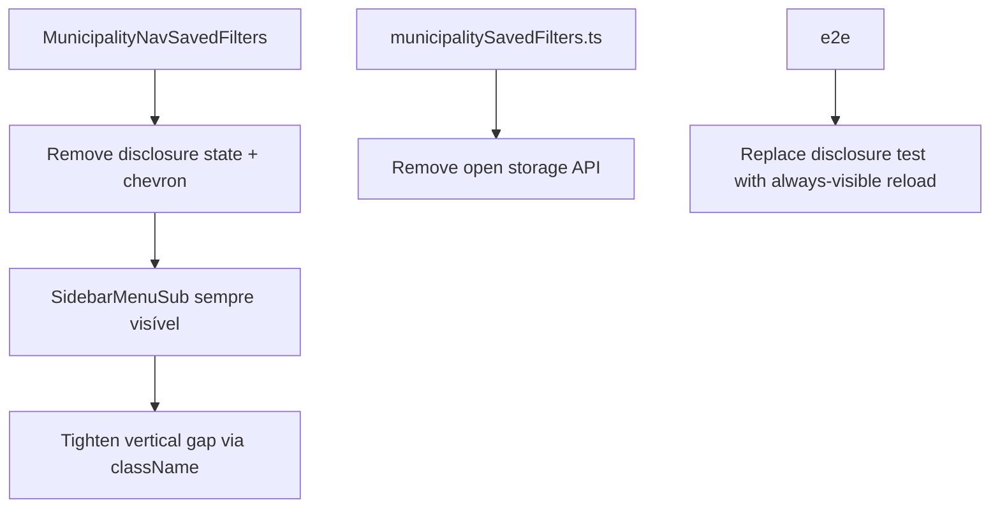

# Impl: B124 — Sidebar Municípios: filtros salvos colados (sem disclosure)

Status: aprovado
Atualizado em: 2026-08-02
Issue: #253
Intenção: docs/plans/sidebar-filtros-salvos-proximidade.md
Appetite restante: ~0,5 dia eng (dentro)

## Leitura da intenção

- **Outcome:** Atalhos de filtro salvo aparecem sempre visíveis, indentados e colados logo abaixo de Municípios — leem como filhos, não como seção própria.
- **O que NÃO negociar:** sem chevron/disclosure/hover; Apagar+Desfazer intactos; `listQueryMatch` puro; sem serializador de URL no layout `(app)`; a11y (`aria-label` na lista, `aria-current` no ativo).
- **O que reavaliar:** hipótese de editar `Sidebar.tsx` — preferir ajuste local em `MunicipalityNavSavedFilters` via `className` no `SidebarMenuSub`.

## Abordagem recomendada

**Opções consideradas:**

- **A:** Só esconder chevron mas manter estado open — rejeitada (viola aceite).
- **B:** Mover sub-lista para fora do `SidebarMenuItem` de Municípios — rejeitada (quebra semântica de filho; mais churn).
- **C (recomendada):** Remover disclosure no componente existente; apagar API de open; apertar `mt`/`py` no `SidebarMenuSub` localmente.

**Recomendação:** C — menor diff, dono correto, aceite coberto.

### Componentes / mudanças

- **`MunicipalityNavSavedFilters.tsx`:** remover chevron, `open` state, `useEffect` de auto-open, imports mortos; lista sempre montada; foco no delete aponta para link de Municípios; `className` com `-mt-0.5 py-0` para proximidade.
- **`municipalitySavedFilters.ts`:** remover `OPEN_STORAGE_KEY`, `read/writeMunicipalitySavedFiltersOpen`; manter `removeItem(OPEN_STORAGE_KEY)` em `clear` para limpar legado no logout.
- **`CampaignSidebar.tsx`:** atualizar comentário do slot children (sem disclosure).
- **Migration:** sem migration.
- **UI:** Impeccable B — shape (sub-lista indentada) + craft (gap) + critique (sem controles órfãos).

### Dados → forma

N/A — navegação localStorage inalterada.

## Fases verificáveis

1. **Server/utilities** — remover API de open; limpar exports mortos.
2. **UI** — componente always-on + spacing.
3. **Testes** — ajustar e2e disclosure → always-visible após reload; `pnpm gate:fast`; `pnpm push`.

## Rabbit holes / Não escopo (engenharia)

- Não refatorar `SidebarMenuSub` globalmente.
- Não adicionar rótulo "Filtros salvos".
- Não truncar lista a 4 itens.

## Riscos e mitigação

- **Foco ao apagar último filtro:** resolver sucessor como link `Municípios` no mesmo `li` (já existia como fallback).
- **Legado `localStorage` open:** `clearMunicipalitySavedFilters` no logout remove a chave antiga.

## Aceite de engenharia

- [x] Aceite de produto da intenção ainda coberto
- [x] Invariantes AGENTS/engineering-standards
- [x] Testes e2e ajustados (sem disclosure)
