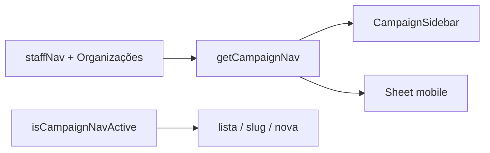

# Impl: Sidebar — entrada para Organizações

Status: aprovado
Atualizado em: 2026-08-02
Issue: #313
Intenção: docs/plans/sidebar-organizacoes.md
Appetite restante: ~0,25 dia eng (um item de nav; sem migration)

## Leitura da intenção

- **Outcome:** Staff (coordenador, assessor, candidato) descobre `/campanha/organizacoes` pela sidebar desktop e Sheet mobile; liderança não vê o item; destino ativo em lista, detalhe e `/nova`.
- **O que NÃO negociar:** lockdown de `leader`; não redesenhar sidebar; não duplicar lista; href canônico `/campanha/organizacoes`.
- **O que reavaliar:** hipótese de importar `ORGANIZATIONS_LIST_PATH` — `nav.ts` usa literais (precedente Conceitos) para não puxar módulos ao client bundle; manter literal.

## Abordagem recomendada

**Opções consideradas:** A) item após Lideranças | B) após Dobradinhas | C) antes de Apoiadores  
**Recomendação:** **A** — afinidade domínio orgs ↔ lideranças; alinhado à recomendação da intenção.  
**Rejeitadas:** B/C — sem ganho de descoberta; A é o modelo mental acordado.

### Componentes / mudanças

- **`staffNav`** (`src/components/campaign/shell/nav.ts`): inserir `{ title: 'Organizações', href: '/campanha/organizacoes', icon: LandmarkIcon }` logo após Lideranças; import `LandmarkIcon` de lucide-react (instituições — distinto de `HandshakeIcon` e `Building2` usado em município no dashboard).
- **Migration:** sem migration
- **Access / Consent:** nenhum — `getCampaignNav` já exclui `leader`; staff vê por default (mesmo que Lideranças/Demandas)
- **UI:** Impeccable B — encaixe no shell existente; `CampaignSidebar` e Sheet já consomem `getCampaignNav`; `isCampaignNavActive` já cobre paths aninhados (`/nova`, `[slug]`)

### Dados → forma

N/A — só navegação.

## Fases verificáveis

1. **Nav** — uma linha em `staffNav` + ícone
2. **Testes** — unit: href presente para staff, ausente para leader; `isCampaignNavActive` em lista/detalhe/nova
3. **Gates** — `pnpm gate:fast`; entrega `pnpm push`

## Rabbit holes / Não escopo (engenharia)

- Reordenar demais itens além do encaixe após Lideranças
- Exportar constante de href (só `MUNICIPALITY_NAV_HREF` tem consumidor especial B18)
- `staffSecondaryNav` — destino de trabalho, não referência

## Riscos e mitigação

- **Leader vê link:** mitigado — `getCampaignNav('leader')` retorna `leaderNav` separado
- **Active state em `/nova`:** mitigado — `isCampaignNavActive` usa `pathname.startsWith(\`${href}/\`)`

## Aceite de engenharia

- [x] Aceite de produto da intenção ainda coberto
- [x] Invariantes AGENTS/engineering-standards
- [x] Testes de domínio previstos (unit) para nav + active state
