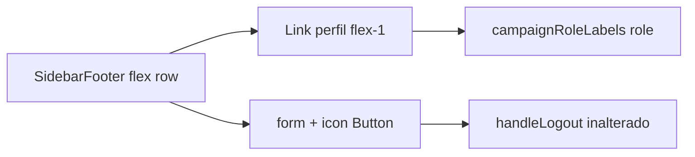

# Impl: Sidebar — papel no perfil + Sair como ícone

Status: aprovado
Atualizado em: 2026-08-02
Issue: #272
Intenção: docs/plans/sidebar-perfil-sair-icone.md
Appetite restante: ~0,5 dia eng (dentro)

## Leitura da intenção

- **Outcome:** Rodapé da sidebar mostra nome + papel; logout vira ícone à direita na mesma linha — sem botão full-width “Sair”.
- **O que NÃO negociar:** destino `/campanha/perfil`; limpeza client-side no logout; rótulos pt-BR existentes; leader lockdown; não mexer no badge de escopo do topo (B130 é outro item).
- **O que reavaliar:** hipótese de manter `<form>` separado abaixo do link — melhor linha única com flex.

## Abordagem recomendada

**Opções consideradas:**

- **A:** Ícone dentro do `<Link>` com stopPropagation — rejeitada (acidental logout / a11y confusa).
- **B:** `DropdownMenu` de conta — rejeitada (fora de escopo / rabbit hole).
- **C (recomendada):** Flex row: link de perfil (`flex-1`) + `<form>` com `Button` ghost `size-11` + `LogOutIcon`; subtítulo = `campaignRoleLabels[user.role]`.

**Recomendação:** C — mínimo diff no dono `CampaignSidebar.tsx`; comportamento de logout preservado.

### Componentes / mudanças

- **`CampaignSidebar.tsx`:** footer em `flex`; subtítulo papel; `LogOutIcon`; botão ícone com `aria-label` dinâmico; `handleLogout` e limpezas intactas.
- **Migration:** sem migration.
- **Access / Consent:** N/A.
- **UI:** Impeccable B — shape (linha única) + craft (ghost icon 44px) + a11y (`aria-label`, `sr-only` não necessário se label no botão).

### Dados → forma

N/A — rótulo de papel já na sessão (`campaignRoleLabels`).

## Fases verificáveis

1. **UI** — footer densificado em `CampaignSidebar.tsx`.
2. **Testes** — unit existente de tokens sidebar; opcional assert de `campaignRoleLabels` no source.
3. **Gates** — `pnpm gate:fast`; `pnpm push`.

## Rabbit holes / Não escopo (engenharia)

- Remover `CampaignScopeBadge` do topo (B130).
- Bottom nav / perfil page / confirmação de logout.

## Riscos e mitigação

- **Toque acidental:** alvos separados (link vs botão) — mitigado por layout flex explícito.
- **Spinner sem texto:** `aria-label` “Saindo…” no submit — mitigado.

## Aceite de engenharia

- [x] Aceite de produto da intenção coberto
- [x] Invariantes AGENTS/engineering-standards
- [x] Testes de domínio: shell unit spec de tokens mantido
