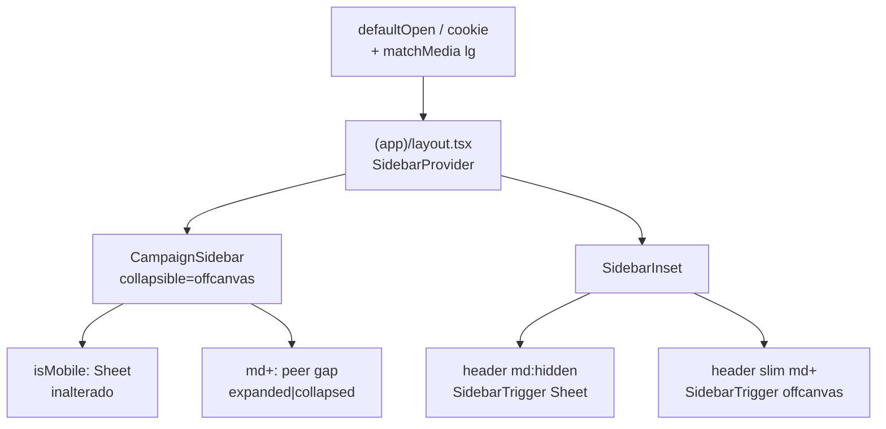

# Sidebar recolhido em tablet (/campanha)

Status: rascunho
Atualizado em: 2026-07-26
Item do roadmap: [docs/roadmap.md](../roadmap.md) (Trilha B, item B38)
Impeccable: B — encaixe no shell `CampaignSidebar` + layout `(app)`; sem rota nova
Appetite: ~0,5 dia eng; ligar collapsible shadcn + trigger em md+ + default por faixa de viewport; sem migration
Responsável: —

## Design (Impeccable)

Âncoras: `PRODUCT.md` (register `product` — Field Desk; clareza sob pressão / field + desk) / `DESIGN.md` (Rail Mist sidebar; hybrid mobile top bar Mandate Red vs rail desktop) · tema `data-theme='campaign'`.

Na implementação (`implement-roadmap-item`): craft compacto → critique → polish (só chrome do shell; sem redesign de nav/itens).

Brief compacto:

- **Persona / contexto:** Assessor / CG em iPad ou laptop estreito (768–1023 px) varre listas densas; o rail de 16 rem rouba viewport da tabela. No desktop largo (≥1024) o rail aberto continua o padrão de mesa.
- **Job principal:** no tablet, ganhar largura de conteúdo por padrão e reabrir a navegação com um botão óbvio; no desktop, rail aberto por padrão com toggle opcional.
- **Estratégia de cor:** Restrained — reusa tokens `sidebar-*` e o `SidebarTrigger` já estilizado; sem segunda chrome bar inventada.
- **Edit where you see:** não — só chrome de navegação.
- **Anti-goals:** reinventar drawer/sidebar fora do primitivo shadcn; rail de ícones como obrigação (ver Decisões); mudar bottom nav mobile; persistência de preferência que lute com o default de produto por faixa.

## Dados → decisão → apresentação

Dados: N/A — chrome de navegação; nenhum KPI/série/mapa.

## Contexto

O shell de `/campanha` já monta o **Sidebar shadcn** completo:

- Layout (`src/app/(campaign)/campanha/(app)/layout.tsx`): `SidebarProvider` + `CampaignSidebar` + `SidebarInset`; `SidebarTrigger` só no header mobile (`md:hidden`).
- `CampaignSidebar` força `collapsible="none"` — em `md+` o rail fica **sempre expandido** (`w-(--sidebar-width)` = 16 rem), sem gap offcanvas/icon.
- Mobile (`useIsMobile`, breakpoint **768** em `src/hooks/use-mobile.ts`): o próprio `Sidebar` renderiza `Sheet` — comportamento que o produto quer **manter**.

Pedido de produto (2026-07-26): em **tablet** o sidebar deve nascer **recolhido**, com botão para expandir; mobile permanece recolhido (Sheet); **desktop aberto por padrão**, ainda podendo abrir/fechar. **Buscar no shadcn antes de inventar** — o kit local já expõe `collapsible: 'offcanvas' | 'icon' | 'none'`, `SidebarTrigger`, cookie `sidebar_state` e atalho ⌘/Ctrl+B.

Referência de bloco shadcn: **sidebar-07** (collapse + `SidebarTrigger` no inset) — padrão a espelhar no layout, não a copiar o sample de breadcrumb/nav.

Soft histórico: FD2 Fase 5 (“Sidebar layout-transition”) era motion cortável; este item é o **comportamento responsivo** pedido, não só transição CSS.

## Objetivos

- Em viewport **tablet** (`md` … abaixo de `lg`, i.e. 768–1023 px): sidebar desktop **colapsado por padrão**; `SidebarTrigger` visível para expandir/recolher.
- Em viewport **desktop** (`lg`+, ≥1024 px): sidebar **aberto por padrão**; toggle continua disponível.
- Em viewport **mobile** (&lt;768): Sheet + header vermelho + bottom nav **inalterados**.
- Reusar o primitivo em `src/components/ui/Sidebar.tsx` (`collapsible`, `SidebarProvider`/`SidebarTrigger`); sem segundo sistema de drawer.
- Guardrails: sem migration, sem collection, sem Consent, sem server action; `print:hidden` / unlock print do E16 preservados; leader/staff nav (`nav.ts`) intactos.

## Decisões travadas

- **Trilha B com ID B38 (não fill-in anônimo).** Chrome do shell da vertical inteira, pedido explícito de produto, paralelizável e cortável — merece nó no grafo. (2026-07-26, roadmap-item.) **Rejeitado:** só fill-in sem ID (some no grafo ao lado de B18); absorver em R6 (atrasa quick win de viewport); inventar componente fora do shadcn Sidebar.
- **`collapsible="offcanvas"` (não `"icon"`, não manter `"none"`).** Recolhido = gap `w-0` / rail fora da tela; conteúdo ganha a largura toda — o job do tablet nas listas densas. Expandir = `SidebarTrigger` (e ⌘B). **Rejeitado:** `"icon"` (rail 3 rem + tooltips; obriga adaptar logo/perfil/role badge e ainda come viewport — sidebar-07 é referência de _toggle_, não de modo); `"none"` (status quo); Sheet também em tablet (duplica o idioma mobile e perde o peer-gap do desktop).
- **Faixas:** mobile &lt;768 (Sheet, já); tablet 768–1023 (`md`…`lg-1`) default **collapsed**; desktop ≥1024 (`lg+`) default **expanded**. Alinha ao `md:` já usado no layout/bottom nav e ao `lg` Tailwind padrão. **Rejeitado:** tablet = tudo `md+` collapsed (mata o default aberto no desktop); breakpoint custom 900 px fora do design system; só CSS sem estado (não liga o trigger shadcn).
- **Default inicial: viewport quando não há cookie `sidebar_state`; cookie vence depois do primeiro toggle.** `SidebarProvider` já grava o cookie — não reinventar storage. No layout RSC: ler cookie se existir; senão `defaultOpen` derivado do User-Agent/viewport é frágil — preferir efeito client mínimo na 1ª montagem sem cookie (matchMedia `min-width: 1024px`) **ou** passar `defaultOpen` só do cookie e, sem cookie, `true` no SSR + sync tablet→`setOpen(false)` uma vez. **Rejeitado:** ignorar cookie sempre (apaga preferência); cookies separados por faixa (overkill); auto-collapse em todo `resize` (briga com o usuário).
- **`SidebarTrigger` visível em `md+`** (não só mobile). Colocar num header slim do `SidebarInset` (ou strip sticky) com `hidden md:flex` / espelho do mobile — o trigger mobile do top bar vermelho permanece `md:hidden`. **Rejeitado:** só atalho de teclado; trigger flutuante fora do inset; esconder trigger no desktop (pedido: manter abrir/fechar).
- **i18n e naming:** identificadores em inglês (`defaultOpen`, `collapsible="offcanvas"`); copy/`aria-label` do trigger já em pt-BR (“Abrir ou fechar menu da campanha”).

## Questões em aberto

- **Onde pousa o trigger em `md+`: header slim permanente no inset vs. só quando `state === 'collapsed'`?** **Opções:** A) slim bar sempre com trigger (como sidebar-07) | B) trigger só no estado collapsed (máxima densidade no desktop aberto). **Recomendação:** **A** — affordance descoberta e simétrica com o mobile; altura ~`min-h-11` touch; no desktop aberto o custo é uma fileira fina. _(assumido — validar no craft)_
- **Sem cookie: sync tablet com `useEffect`+`matchMedia` ou `defaultOpen={false}` global?** **Opções:** A) sync uma vez por faixa na 1ª hidratação | B) defaultOpen false para todos (desktop começa fechado — conflita com o pedido) | C) só cookie+defaultOpen true. **Recomendação:** **A**. _(assumido)_

## Abordagem proposta

Componentes:

- **`CampaignSidebar`** (`src/components/campaign/shell/CampaignSidebar.tsx`): trocar `collapsible="none"` → `collapsible="offcanvas"`; manter classes de borda/`h-svh`/`print:hidden` compatíveis com o container do primitivo (revisar no craft — o ramo `offcanvas` usa o wrapper `peer`/`md:flex`, não o `div` simples do `"none"`).
- **`(app)/layout.tsx`**: (1) header slim `hidden md:flex` com `SidebarTrigger` (e branding mínimo se o critique pedir — senão só o botão); (2) `SidebarProvider` com `defaultOpen` alinhado ao cookie quando existir; (3) se necessário, ilha client mínima (`CampaignSidebarOpenDefault` ou props no provider) para aplicar default tablet collapsed / desktop open **uma vez** na ausência de cookie — **não** bifurcar o primitivo `Sidebar.tsx` sem necessidade.
- **`src/components/ui/Sidebar.tsx`**: depth check — **preferir zero patch**. Só tocar se o default responsivo exigir API (ex. exportar nome do cookie / ler estado). Não reinstalar o bloco inteiro do registry.
- **Smoke visual:** 360 (Sheet), 768/820 (collapsed + trigger), 1280 (open + toggle). Print do dossiê (E16) sem regressão de chrome.
- **Migration**: Sem migration, sem collection, sem server action.

Depth check: reusa `Sidebar`/`SidebarProvider`/`SidebarTrigger`/`useSidebar` já no produto; espelha sidebar-07 só no _padrão_ de trigger no inset. Sem segundo drawer, sem fork do shadcn.

## Dependências

- Nenhuma dura de outro plano. Reusa shell e primitivo existentes.
- Soft: **B18** (submenu de filtros salvos sob Municípios) — hover/expand assume rail utilizável; com offcanvas collapsed o usuário precisa expandir antes do 2º nível. Documentar na implementação do B18 se este landar antes; não bloqueia B38.
- Soft: FD2 Fase 5 / R6 — motion de layout; fora do appetite deste item.

## Não escopo

- Redesenhar itens de nav, bottom nav, ou `nav.ts` / papéis.
- Modo `collapsible="icon"` / tooltips por ícone (sidebar-07 full).
- Preferências de usuário no Payload / settings de perfil.
- Mudar `MOBILE_BREAKPOINT` (768) ou unificar todos os `useIsMobile` do app.
- Submenu B18 / Visitados — planos próprios.

## Rabbit holes

- **Patch profundo em `Sidebar.tsx` “para tablet nativo”.** Explode diff com o registry e knip/a11y do primitivo. **Mitigação:** configurar via props/`defaultOpen`/layout; patch mínimo só com comentário se inevitável.
- **Auto-collapse em todo resize / orientação.** Briga com preferência e cookie. **Mitigação:** default só na 1ª montagem sem cookie.
- **Aproveitar para refatorar logo/perfil/secondary nav.** Fora do appetite. **Mitigação:** só o necessário para offcanvas não quebrar overflow (labels já truncam via `SidebarMenuButton`).

## Adiado com gatilho

- **`collapsible="icon"` como opção de densidade.** Revisitar se, após uso real em tablet, a mesa pedir nav por ícone sem abrir o rail (evidência ≥2 atores ou critique R6).
- **Persistir preferência por faixa (tablet vs desktop).** Revisitar se o cookie único gerar atrito medido (abre tablet “preso” aberto após uso no desktop).

## Referências

- `docs/roadmap.md` (Trilha B · B38; Janela 1)
- `src/components/ui/Sidebar.tsx` — `collapsible`, cookie, `SidebarTrigger`, ramo mobile Sheet
- `src/hooks/use-mobile.ts` — `MOBILE_BREAKPOINT = 768`
- `src/components/campaign/shell/CampaignSidebar.tsx` — hoje `collapsible="none"`
- `src/app/(campaign)/campanha/(app)/layout.tsx` — Provider + trigger só mobile
- shadcn block **sidebar-07** (registry) — padrão Trigger no inset
- `docs/plans/field-desk-ux-pos-critique.md` — Fase 5 motion (adjacente, não escopo)
- `docs/plans/filtros-salvos-municipios.md` — B18 soft no sidebar
- AGENTS.md — naming; shell campaign
- `PRODUCT.md` / `DESIGN.md` — Field Desk / Rail Mist / hybrid mobile bar
