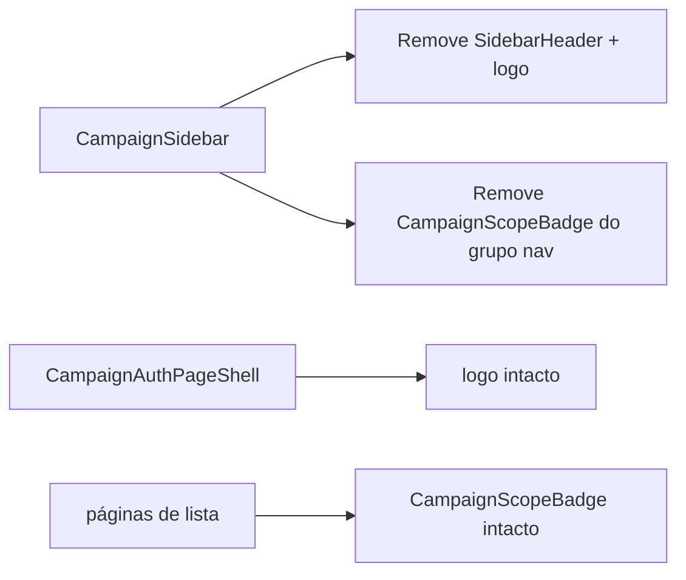

# Impl: Sidebar /campanha — sem logo nem chip de escopo no topo

Status: aprovado
Atualizado em: 2026-08-02
Issue: #271
Intenção: docs/plans/sidebar-sem-logo-escopo.md
Appetite restante: ~0,5 dia (herdado)

## Leitura da intenção

- **Outcome:** O topo da sidebar (desktop e Sheet mobile) não exibe logo nem badge de papel; a lista de navegação começa no topo, alinhada com o header da área principal. Login mantém logo; chips de escopo em páginas permanecem.
- **O que NÃO negociar:** `CampaignScopeBadge` e `CampaignLogo` seguem vivos fora da sidebar; leader lockdown e nav por role intactos; auth shell inalterado.
- **O que reavaliar:** A hipótese de editar só `CampaignSidebar.tsx` confirma-se — não há outro call site de logo/badge na sidebar.

## Abordagem recomendada

**Opções consideradas:**
- A — Remover `SidebarHeader` inteiro e o badge do primeiro `SidebarGroup` em `CampaignSidebar.tsx`
- B — Esconder via CSS (`hidden`) mantendo DOM
- C — Mover logo para o rodapé

**Recomendação:** A — remoção direta no dono; menos DOM, sem degrau vertical, sem código morto.
**Rejeitadas:** B (DOM fantasma, testes frágeis); C (fora do escopo de produto).

### Componentes / mudanças

- **`CampaignSidebar`** (`src/components/campaign/shell/CampaignSidebar.tsx`): remover `SidebarHeader` (logo link), `CampaignScopeBadge` e imports órfãos (`CampaignLogo`, `CampaignScopeBadge`, `SidebarHeader`, `campaignRoleLabels`).
- **Migration:** sem migration
- **Access / Consent:** N/A
- **UI:** Impeccable B — encaixe no shell; nav cola no topo do `SidebarContent`; footer com avatar/perfil inalterado.

### Dados → forma

N/A — chrome estrutural.

## Fases verificáveis

1. **UI** — editar `CampaignSidebar.tsx`; limpar imports
2. **Gates** — `pnpm gate:fast`; push via `pnpm push`

## Rabbit holes / Não escopo (engenharia)

- Não tocar `CampaignScopeBadge` em páginas de conteúdo
- Não alterar `CampaignAuthPageShell` nem `campaign-logo.tsx`
- Não redesenhar padding do `SidebarGroup` além do que a remoção naturalmente resolve

## Riscos e mitigação

- **Teste de convenção que pinne logo na sidebar:** `campaignComponents.unit.spec.ts` lê o source — verificar que pins de shell (`collapsible`, `print:hidden`, tokens) permanecem válidos.
- **Alinhamento vertical:** remover `SidebarHeader` com `border-b` elimina o degrau; header principal já é `min-h-11` — aceite visual coberto pela remoção, sem padding compensatório artificial.

## Aceite de engenharia

- [x] Aceite de produto da intenção ainda coberto
- [x] Invariantes AGENTS/engineering-standards
- [x] Testes de domínio previstos (unit source pins existentes; sem access/write)
