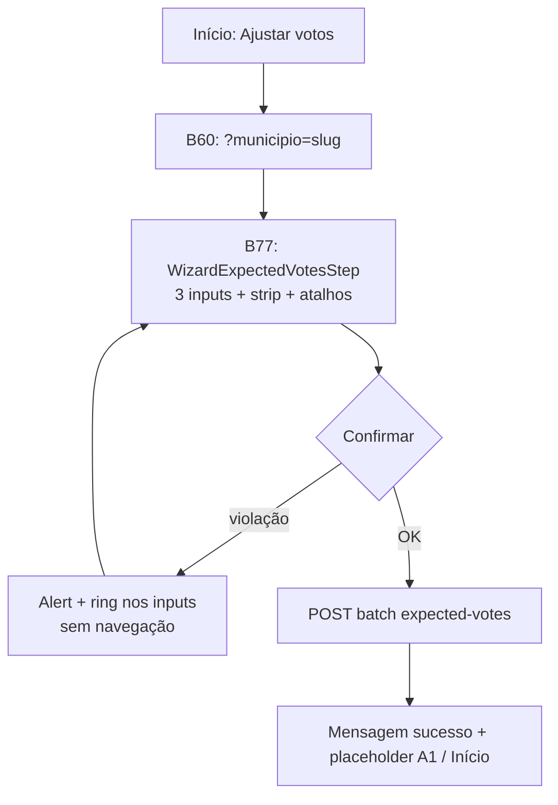

# Simplificar ajuste de votos no wizard (três cenários numa tela)

Status: rascunho
Atualizado em: 2026-07-30
Item do roadmap: [docs/roadmap.md](../roadmap.md) (Trilha B, item B77 — UX-1 wizards)
Impeccable: B — encaixe em `WizardExpectedVotesStep` existente; espelha o popover da lista de municípios
Appetite: ~0,75–1 dia eng; substituir ritual `?cenario=` por editor único + confirm; reuso de strip/inputs/atalhos; sem migration
Responsável: —

## Design (Impeccable)

Âncoras: `PRODUCT.md` (Clarity under pressure; Feel the action) / `DESIGN.md` · referência visual = `MunicipalityListExpectedVotesControl` + `VoteEstimateScenarioInputs` (`variant="compact"`) · tema `campaign`.

Na implementação (`implement-roadmap-item`): **craft compacto → critique → polish** (não shape novo — a estrutura já existe na lista).

Brief compacto:

- **Persona / contexto:** CG no celular, após escolher município (B60 ✓), quer ajustar Cairu −100 ou Salinas 300→150 sem três confirmações sequenciais.
- **Job principal:** ver e editar **os três cenários juntos**, aplicar atalhos no campo em foco e salvar uma vez.
- **Estratégia de cor:** Restrained; warning de coerência = `Alert` warning/destructive do tema; inputs violados com `ring-destructive` / `border-destructive` — não Signal Red decorativo.
- **Edit where you see:** não — fluxo wizard com **submit explícito** (exceção `campanha-edit-where-you-see`); mas a **forma** do editor copia o popover da lista (não inventar layout novo).
- **Anti-goals:** voltar ao ritual média→pessimista→otimista com `router.replace`; auto-save por cenário; input hero gigante isolado; chart/gauge dos três números.

## Dados → decisão → apresentação

- **Vou apresentar dados?** Sim — três inteiros (`expectedVotes` pessimista/média/otimista) e a posição relativa da média entre extremos.
- **Decisões desbloqueadas:** staff define a faixa de projeção da mesa por município antes de seguir o ritual A1 (sinal/tendência B63/B64).
- **Forma escolhida:** **número + contexto** — três inputs lado a lado + **faixa** (`VoteEstimateScenarioStrip`) mostrando onde a média cai entre pessimista e otimista. **Rejeitado:** chart de área; três gauges; % estadual; tabela extra.
- **Profile:** 3 inteiros ≥0, ordem lógica `pessimistic ≤ central ≤ optimistic`; escala relativa só na faixa (min–max dos três preenchidos).
- **Anti-goals de dado:** não misturar `declaredVotes` de liderança; não mostrar cobertura E8 neste passo (wiring A1).

## Contexto

**B61** (entregue 2026-07-29) implementou o ajuste de votos no wizard como **três passos** explícitos (`?cenario=central|pessimistic|optimistic`), um input grande por passo, atalhos `2×`/±50/±100 e navegação ao cenário violado com banner (**B76** ✓ corrigiu regressão do banner no jump). O ritual cumpre a decisão travada de B61 (“um cenário por vez”), mas na prática o fluxo ficou **pesado**: três CTAs, três trocas de URL e lógica de violação distribuída entre passos.

Pedido (2026-07-30): **uma tela** com os três cenários, UI **semelhante ao popover** de votos estimados na lista de municípios (`MunicipalityListExpectedVotesControl`), atalhos no **input selecionado**, validação de coerência **só ao confirmar** — se violar, não avança, mostra warning e **destaca os inputs** que quebram a regra.

Invariante de servidor permanece: `getVoteEstimateOrderViolation` / `VOTE_ESTIMATE_ORDER_ERROR_MESSAGE` (`src/lib/voteEstimate.ts`).

## Objetivos

- Substituir o ritual `?cenario=` em `atualizar-votos` por **um único passo** após `?municipio=`.
- Layout: `VoteEstimateScenarioStrip` (faixa com marcador da média entre extremos) + grid 3 colunas de inputs (labels/aria como no compact da lista).
- Atalhos `2×` · `±50` · `±100` aplicam sobre o **cenário com foco** (`focusedScenario`); default de foco = `central` ao abrir.
- CTA único **“Salvar estimativas →”** (ou `wizardVoteFinalCtaLabel` existente): valida drafts → se violação, **permanece na tela**, `Alert` com mensagem de `getWizardVoteViolation`, inputs violados com estado de erro visual; se OK, **POST batch** igual B61 (`POST /campanha/municipios/expected-votes`).
- Remover navegação `router.replace` entre cenários e estado `violationEditedScenario` / “Voltar para cenário editado” (substituídos por highlight inline).
- `acoes/[slug]/page.tsx`: não ler `?cenario=` para `atualizar-votos`; canonicalizar URLs legadas com `?cenario=` → redirect sem o param (ou ignorar param).
- Staff-only; sem migration / Consent / contrato JSON novo.
- Testes: unit do step (foco + atalho + confirm bloqueado + highlight); atualizar e2e B61 (um passo, violação sem troca de URL).

## Decisões travadas

- **Uma tela com três inputs** (emenda explícita à decisão B61 “um cenário por vez”). **Fonte:** pedido CG 2026-07-30 após uso do ritual de três passos. **Rejeitado:** manter três passos com polish incremental (B76 já mostrou que a complexidade de estado entre URLs é frágil).
- **Validação só no confirm** — não bloquear atalho nem `onChange` por ordem. **Rejeitado:** validação per-keystroke (atrasa atalhos); jump automático ao cenário violado (pedido explícito: não avançar, destacar campos).
- **Atalhos no input focado**, não no “cenário ritual atual”. **Rejeitado:** atalhos sempre na média; atalhos no último editado sem foco visível.
- **Reuso visual da lista** — strip + grid compact. **Rejeitado:** novo componente wizard-only duplicando `VoteEstimateScenarioInputs`; input gigante central de B61.
- **Gravação batch no confirm** (igual B61). **Rejeitado:** três POSTs por cenário.
- **i18n:** ids `central`/`pessimistic`/`optimistic`; copy pt-BR nos labels existentes (`voteEstimateScenarioLabels`).

## Questões em aberto

- **Extrair editor compartilhado wizard+lista?** **Opções:** A) wizard monta `VoteEstimateScenarioStrip` + inputs inline | B) estender `VoteEstimateScenarioInputs` com `mode: 'autosave' | 'draft'` + `focusedScenario` + `violationScenarios`. **Recomendação:** B se o diff do wizard fica &lt;~40 linhas de duplicação; A se o hook de draft da lista (debounce/autosave) contaminaria o wizard. _(assumido na implementação — validar no `/simplify`)_

## Abordagem proposta

Componentes:

- **`WizardExpectedVotesStep`** (`src/components/campaign/shared/WizardExpectedVotesStep.tsx`): reescrever corpo — estado local `drafts` para os três cenários (mesma sanitização numérica que `VoteEstimateScenarioInputs`); `focusedScenario`; barra `VoteEstimateScenarioStrip` com `activeScenario={focusedScenario}` e `markerMode="active-only"` (média entre extremos); grid 3 inputs com highlight quando `violationScenarios` inclui o cenário; row de atalhos (`VOTE_SHORTCUTS` + `applyVoteShortcut` em `focusedScenario`); CTA confirm chama `getWizardVoteViolation` → POST ou erro inline. Remover props `currentScenario` e efeitos de troca de cenário.
- **`VoteEstimateScenarioInputs`** (`src/components/campaign/votePledge/VoteEstimateScenarioInputs.tsx`): opcional — exportar subpartes ou adicionar props `onFocusScenario`, `errorScenarios`, `commitMode: 'manual'` se B reduz duplicação sem puxar `useCampaignCellAutosave`.
- **`acoes/[slug]/page.tsx`**: para `atualizar-votos` + `municipio`, renderizar step sem `resolveWizardScenarioParam`; redirect canônico se só `cenario` na query.
- **`wizardVoteEstimate.ts`**: manter `applyVoteShortcut`, `getWizardVoteViolation`, `parseWizardVoteDraft`; **deprecar** uso de `getNextWizardVoteScenario`, `wizardVoteStepCtaLabel`, `WIZARD_VOTE_SCENARIO_EDIT_ORDER` no wizard (podem permanecer se testes/utilidades ainda referenciam — knip na entrega).
- **`campaignActionRoutes.ts`**: `wizardActionHref` — parar de emitir `?cenario=` para votos; links internos legados redirecionam.
- Sem migration, sem collection, sem server action nova.

## Dependências

- **B59** ✓ (chassis), **B60** ✓ (município), **B61** ✓ (endpoint batch + step existente), **B76** ✓ (lógica de violação — absorvida inline).
- Soft: **B75** (header mobile — título “Ajustar votos” + subtítulo município).
- Reuso: `VoteEstimateScenarioStrip`, `applyVoteShortcut`, `getWizardVoteViolation`, `MUNICIPALITY_EXPECTED_VOTES_ENDPOINT`, `CampaignWizardShell`.

## Não escopo

- Preview de cobertura E8 no passo → wiring A1 / lista (`MunicipalityListGoalCoverageCell`).
- Auto-save debounced estilo B27 na lista — lista mantém `useCampaignCellAutosave`; wizard mantém confirm explícito.
- Orquestrador A1 completo (sinal B63, tendência B64, resumo) → planos respectivos.
- Mudar invariante `pessimistic ≤ central ≤ optimistic` ou mensagens de servidor.

## Rabbit holes

- **Generalizar `VoteEstimateScenarioInputs` para wizard + lista + detalhe.** Se alguém “só completar”: props para autosave, foco, violação, popover vs full page — vira segundo design system. **Mitigação:** wizard copia o layout compact (strip + grid) e compartilha só strip + `applyVoteShortcut`; extrair só se `/simplify` medir duplicação &gt;~60 linhas.
- **Reintroduzir `?cenario=` para deep-link.** Mitigação: redirect canônico sem param; um passo só.

## Adiado com gatilho

- **Animação da faixa ao mover foco entre inputs.** Revisitar se critique Impeccable pedir feedback além do marcador `active-only` (hoje suficiente para o pedido).

## Referências

- `docs/roadmap.md` — B77, UX-1 wizards
- `docs/plans/ajuste-votos-wizard.md` — ritual anterior (as-built B61)
- `docs/plans/corrigir-coerencia-wizard-ajuste-votos.md` — B76 (substituído por validação inline)
- `docs/plans/fluxos-acao-primeiro-inicio.md` — A1
- `src/components/campaign/municipality/MunicipalityListExpectedVotesControl.tsx` — referência UX
- `src/components/campaign/votePledge/VoteEstimateScenarioInputs.tsx` — compact layout
- `src/components/campaign/votePledge/VoteEstimateScenarioStrip.tsx` — faixa relativa
- `src/components/campaign/shared/WizardExpectedVotesStep.tsx` — alvo da refatoração
- `src/lib/wizardVoteEstimate.ts` — atalhos e violação
- `src/lib/voteEstimate.ts` — invariante de ordem
- `tests/unit/wizardExpectedVotesStep.unit.spec.tsx`, `tests/e2e/campaignHomeActions.e2e.spec.ts`
- AGENTS.md — naming, sem migration, `overrideAccess: false` nos loaders
