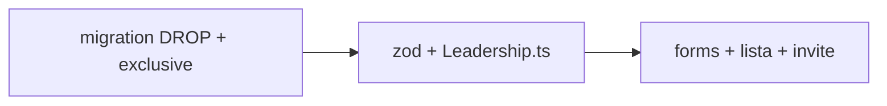

# Simplificar modelo de liderança (exclusivo + limpeza)

Status: entregue 2026-07-30 (org permanece — ver revisão)
Atualizado em: 2026-07-30
Item do roadmap: [docs/roadmap.md](../roadmap.md) (Trilha B, item B69 — UX-1 / A4)
Impeccable: B — schema + forms/lista/convite existentes; UI de grid do wizard = **B70**
Appetite: ~1–1,25 dia eng; uma migration (drop + `exclusive`); zod/collection/UI lista/forms/invite
Responsável: —

**Revisão 2026-07-30 (decisão de produto, pré-implementação):** `organization` **permanece** — o conceito mapeia como as relações políticas se ramificam na região (várias lideranças na mesma org, ex. SindMed). O escopo final dropou apenas `sector`/`sectorNotes`/`consentNote`; a vertical `/campanha/organizacoes`, o join `leadership.organizations`, badges/colunas/contadores e `activity.organizations` ficam intactos. Confirmado na mesma sessão: `exclusive` aparece na lista (badge "Não exclusivo") + toggle nos forms; coluna Organizações continua texto simples (melhoria vira fill-in).

## Design (Impeccable)

Âncoras: `PRODUCT.md` / `DESIGN.md` · tema `campaign`. Superfícies tocadas = ficha/lista/convite já no Field Desk — craft compacto, não shape de rota nova.

Na implementação: craft compacto → critique → polish.

Brief compacto (B, direção clara):

- **Persona:** CG/assessor atualizando rede no ritual A4; formulário longo = abandono.
- **Job principal:** gravar só o que a mesa usa no dia a dia — contato, status, observação, exclusividade — sem setor/org/consentimento externo.
- **Estratégia de cor:** Restrained.
- **Edit where you see:** sim nas superfícies existentes (B32 status; forms `/liderancas`); exclusividade entra nos forms internos + no form do **B70**.
- **Anti-goals:** segundo cadastro de pessoa; dropar Consent do **convite** LGPD; inventar join exclusividade×município nesta fatia.

## Dados → decisão → apresentação

Dados: N/A como métrica nova — boolean categórico + remoção de campos. Decisão = “esta liderança ainda articula **só** conosco?” (sim/não) e menos atrito de cadastro.

## Contexto

`leadership` (`src/collections/Leadership.ts`) carrega hoje: `organizations`, `sector`/`sectorNotes`, `consentNote` (“Registro de consentimento **externo**”), além de `supportStatus`, `notes`, `stateDeputies`, municípios e o trio de Consent do **convite** (`consent` / `consentContentHash` / `consentedAt`).

Pedido de produto (2026-07-29), no pacote A4 / Cairu ([fluxos-acao-primeiro-inicio.md](fluxos-acao-primeiro-inicio.md)), **ajustado em 2026-07-30**:

1. Conceito de parceria **exclusiva** (default = exclusivo): liderança que era a articuladora principal e passa a dividir votos com outro candidato deixa de ser exclusiva — e pode voltar. Não é “principal vs secundária” na v1 (ranking implícito); é **exclusividade do apoio**.
2. Remover da mesa os conceitos pouco usados: **setor** (e notas de setor), **registro de consentimento externo** (`consentNote`). **Organização fica** (revisão 2026-07-30): ramificação das relações políticas — várias lideranças na mesma org (SindMed).
3. “A própria liderança é a dobradinha” — `stateDeputy` hoje é entidade por **nome** (sem `Contact`); `leadership` tem `Contact` único. Não unificar collections neste item.

Lista `/campanha/liderancas` já filtra/ordena por `sector` (B29 ✓). Invite autofill ainda pede `sector`/`sectorNotes`.

## Objetivos

- Migration `20260730_043306_simplify_leadership_fields`:
  - **DROP** `sector`, `sector_notes`, `consent_note` (+ `enum_leadership_sector`).
  - **ADD** `exclusive` boolean **NOT NULL DEFAULT true** (backfill implícito = todos nascem exclusivos — honesto com o default de produto). Gerada em duas passadas não-interativas (drop, depois add) e fundida à mão — o prompt interativo de rename trava sem TTY; o `NOT NULL` foi emendado sobre o SQL gerado.
- Collection + zod (`src/lib/schemas/leadership.ts`): espelhado; `exclusive` staff-managed como `supportStatus`/`notes`.
- Removido de create/internal forms, list columns/filters/sort de setor, badges de setor no dossiê; `sector`/`sectorNotes` fora dos view models.
- Invite: `sector`/`sectorNotes` fora do schema + `CampaignInviteForm` + redemption profile write (o trio `consent*` do LGPD do convite intacto).
- Lista: coluna setor → coluna **"Apoio exclusivo"** com badge outline "Não exclusivo" só quando `false` (Restrained; badge não compete com os vermelhos da linha).
- **Checkbox padrão-marcado + input hidden "false"** no form de criação (último valor vence), para que desmarcar grave `false` e ausência total da chave caia no default do zod — pin de int cobre os três caminhos.
- Sem Consent novo. Sem UI de grid do wizard (**B70**).
- Unit/int: create default `exclusive: true`; update para `false`; `?sector=` legado canonicaliza fora; invite sem setor.

## Decisões travadas

- **Campo `exclusive: boolean`, default `true`, no documento `leadership`.** **Rejeitado:** `principal`/`prioritaria` (sugerem ranking 1º/2º, não o relato “dividiu apoio”); exclusividade por par liderança×município nesta fatia (caro — join/metadata; o relato do CG é sobre a parceria com a campanha, não nuance A vs B). Gatilho abaixo se a mesma pessoa precisar ser exclusiva em um município e não em outro.
- **Dropar `sector`, `sectorNotes`, `consentNote`.** **Rejeitado:** deixar opcionais “por se acaso” (campos mortos travam atualização); dropar o trio `consent*` do **convite** (é LGPD `lideranca-autopreenchimento`, Onda 0 — distinto do `consentNote` externo).
- **`organization` PERMANECE (revisão 2026-07-30, produto).** O rascunho dropava o join; revertido — a org mapeia ramificações políticas (SindMed com várias lideranças). **Rejeitado na revisão:** remover a vertical `/campanha/organizacoes` inteira (avaliada e descartada pelo produto na conversa); dropar `activity.organizations` junto.
- **“Liderança é a dobradinha” = reusar `stateDeputy` + `leadership.stateDeputies`.** Criar/vincular a ficha de dobradinha com o nome da pessoa; chips B31 ✓ já expressam a rede. **Rejeitado:** collection unificada; `Contact` obrigatório em `stateDeputy` agora; flag `actsAsStateDeputy` sem entity (segunda verdade). Atalho “criar dobradinha a partir desta liderança” → Adiado.
- **i18n:** identifier `exclusive`; copy “Apoio exclusivo” / “Não exclusivo”.

## Questões em aberto

- ~~**Badge “Não exclusivo” na lista `/liderancas` neste item ou só no B70?**~~ **Fechado 2026-07-30 (produto):** na lista — coluna própria com badge outline só quando `false`.
- **Exclusividade por município?** **Opções:** A documento (v1) | B join. **Recomendação:** A; revisitação no Adiado. _(assumido — validar com produto se Cairu tiver o mesmo nome em dois municípios com papéis diferentes)_

## Abordagem proposta

Componentes (como entregue):

- Migration + `Leadership.ts` + `src/lib/schemas/leadership.ts` + invite schema.
- `LeadershipForm` / `LeadershipInternalForm` — remover setor/consentNote; checkbox `exclusive` (default on; hidden "false" na criação).
- `liderancas/page.tsx` + `leadershipListUrl` / filters — dropar `sector`; coluna "Apoio exclusivo".
- `leadershipData.ts` — view models sem setor/`sectorNotes`/`consentNote`; incluir `exclusive` (orgs mantidas).
- `CampaignInviteForm` + redemption + page data — sem setor.
- **Migration:** sim (`20260730_043306_simplify_leadership_fields`, drop + add boolean default true NOT NULL).

## Dependências

- Nenhuma de outro plano aberto. Soft: B29 ✓ / B31 ✓ / B32 ✓ (superfícies a limpar). Desbloqueia **B70**.

## Não escopo

- Grid de tiles + form do wizard A4 → **B70**.
- Wiring “quer também liderança?” no A1 → fatia A1.
- Unificar `stateDeputy` com `Contact` / atalho criar-dobradinha → Adiado.
- Collection `organization` e a vertical `/campanha/organizacoes` — **intactas por decisão 2026-07-30** (inclui `leadership.organizations`, badges no painel/dossiê e contadores do `organizationData`).

## Rabbit holes

- **Exclusividade por município + histórico de mudanças.** **Mitigação:** boolean no doc; nota em `notes` se precisar matizar.
- **Backfill `exclusive: false` a partir de texto em `notes`.** **Mitigação:** não — default true; mesa corrige no wizard.

## Adiado com gatilho

- **Exclusividade por município.** Revisitar quando a mesma liderança tiver papéis opostos em ≥2 municípios no mesmo ritual.
- **Atalho “Criar / vincular dobradinha” a partir da ficha/wizard.** Revisitar quando B70 shippar e a mesa pedir o gesto ≥2× na mesma semana.
- **`stateDeputy.contact` opcional.** Revisitar se dedupe nome↔pessoa virar dor (E4R / onboarding).

## Referências

- [fluxos-acao-primeiro-inicio.md](fluxos-acao-primeiro-inicio.md) (A4) · [simplificar-modelo-sinal.md](simplificar-modelo-sinal.md) (precedente B62) · [autosave-status-lista-liderancas.md](autosave-status-lista-liderancas.md) · [ordenacao-filtros-lista-liderancas.md](ordenacao-filtros-lista-liderancas.md)
- `src/collections/Leadership.ts` · `src/lib/schemas/leadership.ts` · `src/utilities/leadership/*` · `src/utilities/access/municipalities.ts` · `CampaignInviteForm.tsx`
- AGENTS.md — migrations; Contact único; Consent por chave (convite intacto)
- `PRODUCT.md` / `DESIGN.md`
