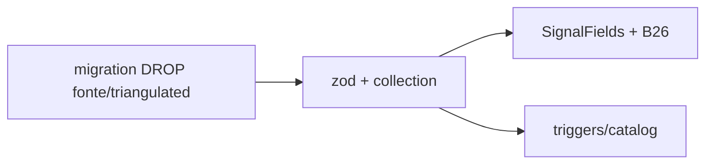

# Simplificar modelo de sinal (tipo + texto; sem fonte/triangulado)

Status: entregue em código 2026-07-29
Atualizado em: 2026-07-29
Item do roadmap: [docs/roadmap.md](../roadmap.md) (Trilha B, item B62 — UX-1 / C12 sinais)
Impeccable: B — schema + forms existentes (`MunicipalitySignalFields`, B26, admin); UI nova de escolha = **B63**
Appetite: ~0,75–1 dia eng; migration drop + zod/collection/UI lista/detail; rename de labels; ajuste E11
Responsável: —

**Revisão 2026-07-29 (as-built):** entregue conforme o plano, com duas decisões da sessão e dois achados: (1) **E11 triage 1 por presença** — o usuário decidiu que sinal de adversário registrado lê como confirmado ("eles não vão adicionar sinais improváveis"), divergindo do default "ramo fonte única" abaixo; `adversarySignal: { present: true } | null`, P1 triage 1, fator único "Sinal de adversário registrado". (2) **scrub "broker" = só o modelo de sinal** — `activity.origin` (`Pedido de broker`) e as strings "broker" do suggestionCatalog (staff-only) ficaram para o gatilho já registrado. Achados da auditoria incorporados: form duplicado em `MunicipalityUpdateForm.tsx`, readouts `municipalityUpdatePageData.ts` + `MunicipalityUpdateFeed.tsx` (detalhe + dossiê), glossário `campaignIntelligenceConcepts.ts`; migration gerada reemitia `ADD VALUE 'adiada'` (drift de snapshot da cadeia `.json` — removido à mão; o snapshot desta migration sara a cadeia). Bônus de gate: e2e `campaignMunicipalities` "advisor scopes…" obsoleto desde B43 (home liderança → `/campanha/contatos`, redirect pós-B43) atualizado; pin de bypass do `municipalityElectoralBaseline` 9→8 (drift pré-existente em main). Gate: 876 unit / 489 int / e2e alvo verde / build; Aikido 0 findings.

## Dados → decisão → apresentação

Dados: N/A neste item como superfície nova — remove campos; labels novas alimentam **B63** e B26.

## Contexto

C12 ✓ tipou `municipalityUpdate` `kind: 'sinal'` com `signalType`, `signalSource` (obrigatório) e `triangulated`. B26 ✓ e `MunicipalitySignalFields` expõem os três. Pedido de produto (2026-07-29, gate confirmado): **sinais = só tipo + texto**; dropar Fonte e Triangulado; **renomear rótulos** para militantes PT ~60 anos (sem “broker”).

E11 ✓ lê `triangulated` em sinais de adversário (`municipalityTriggers.ts` / `suggestionCatalog`) — ao dropar, o motor trata presença do sinal como o ramo “fonte única” (ou só “há sinal”), sem segunda dimensão.

## Objetivos

- Migration: remover colunas `signal_source` e `triangulated` de `municipality_update` (e enums/admin conforme snapshot Payload); `pnpm migrate:create simplify_municipality_signal_fields`.
- Zod `municipalityUpdateCreateSchema`: para `kind: 'sinal'`, exigir `signalType` + `body`; **não** exigir `signalSource`; remover `triangulated`.
- Collection `MunicipalityUpdate`: dropar fields; ajustar `beforeValidate` que hoje exige fonte.
- Labels/descriptions (enum **values** preservados — sem rewrite de rows):

  | value               | label               | description curta                         |
  | ------------------- | ------------------- | ----------------------------------------- |
  | `invasao`           | Invasão             | Adversário ocupando nosso espaço          |
  | `esfriamento`       | Rede esfriou        | Aliados pararam de responder / cairam     |
  | `visita_adversario` | Adversário apareceu | Visita ou agenda dele no município        |
  | `proposta_broker`   | Alguém pediu algo   | Liderança/intermediário pediu ou ofereceu |
  | `outro`             | Outro               | Fato importante que não encaixa acima     |

- Atualizar `MunicipalitySignalFields`, B26 form, detail/dossier readouts, int tests, seeds se houver.
- E11: remover branch `triangulated` do input de sugestão; copy do catálogo que cita "triangulado" / "fonte única" no eixo de adversário → presença do sinal basta e **lê como confirmada (triage 1 — decisão da sessão 2026-07-29)**; recalibrar texto mínimo; **não** reabrir E15.
- Sem Consent novo. Sem UI de grid do wizard (isso é **B63**).

## Decisões travadas

- **Modelo = `signalType` + `body` apenas.** **Rejeitado:** manter fonte/triangulado opcionais “por se acaso” (pedido: simplificar; campos mortos confundem mesa).
- **Enum values estáveis; só labels/descriptions mudam.** **Rejeitado:** renomear `proposta_broker` → `proposta_intermediario` neste slice (migration de dados + grep em E11/tests sem ganho de UX). Gatilho: se copy interna/código ainda vazar “broker” em string de usuário após labels — aí rename.
- **E11 sem dimensão triangulado.** **Rejeitado:** inventar proxy (“texto longo = triangulado”); manter coluna só para o motor.
- **i18n:** ids `invasao`…; copy pt-BR nova.

## Questões em aberto

- **Textos longos do drawer de info (B63) — quem redige?** **Opções:** A eng com copy provisória no plano B63 | B assessoria. **Recomendação:** A no ship (o quê / consequências / quando usar em 3–5 frases); B revisa no R6. _(assumido)_

## Abordagem proposta

Componentes:

- Migration + `MunicipalityUpdate.ts` + `municipalityUpdate.ts` schema.
- `MunicipalitySignalFields.tsx` — select de tipo + textarea; sem checkbox/fonte.
- `municipalityTriggers.ts` / `suggestionCatalog.ts` — dropar `triangulated` do tipo de input.
- View models de update/dossier — parar de exibir fonte/triangulado.
- **Migration:** sim (drop columns; sem backfill necessário além de drop).

## Dependências

- Dura: **C12** ✓. Soft: B26 ✓ (superfície a atualizar). Desbloqueia **B63**.

## Não escopo

- Grid de botões + drawer de info + “Pular” → **B63**.
- Novos tipos de sinal (Perda de apoio / Novo apoio do rascunho UX-1) — **não** expandir taxonomia neste item; só renomear os 5 existentes. Gatilho: sessão pedir tipo que não cabe em `outro`.

## Rabbit holes

- **Reescrever taxonomia inteira + migração de valores históricos.** **Mitigação:** labels only.
- **Unificar `kind` urgente/nota com sinal.** **Mitigação:** fora — C12 já separou.

## Adiado com gatilho

- **Rename enum `proposta_broker`.** Revisitar se `broker` ainda aparecer em UI/admin após labels (grep pt-BR + admin).
- **Novos signalType values.** Revisitar com evidência de mesa (tipos que caem sempre em `outro`).
- **`FieldError` de `signalType` no detalhe (`MunicipalityUpdateForm`).** Gap pré-existente: o form inline não renderiza erro de servidor no select de tipo (a lista B26 já usa `MunicipalitySignalFields` com `FieldError`). **Gatilho:** **B63** (wizard + unificação dos dois forms de sinal).
- **Unificar `MunicipalitySignalFields` + bloco inline do detalhe.** Duplicação aceitável pós-B62 (só tipo + textarea); **gatilho:** **B63** (3º call site do wizard).
- **Consulta de existência de sinais no loader E11.** Hoje `limit: 0` na janela de 28d é barato; se o volume crescer, trocar por agregado/exists — **gatilho:** fila de sugestões lenta ou >N sinais/dia por município em produção.

## Referências

- [registro-fundacao.md](registro-fundacao.md) · [registrar-sinal-lista-municipios.md](registrar-sinal-lista-municipios.md) · [motor-de-sugestoes.md](motor-de-sugestoes.md) · `src/lib/schemas/municipalityUpdate.ts` · `src/collections/MunicipalityUpdate.ts` · `MunicipalitySignalFields.tsx` · `municipalityTriggers.ts`
- AGENTS.md — migrations; `overrideAccess: false`
- Impeccable: B — craft compacto nos forms existentes
