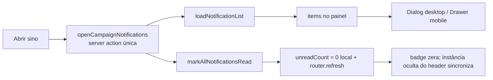

# Impl: Sino de notificações: ler ao abrir + painel limpo + modal centrado no desktop

Status: aprovado
Atualizado em: 2026-08-10
Issue: #522
Intenção: docs/plans/sino-notificacoes-leitura-auto-modal-desktop.md
Appetite restante: herdado (~0,5–1 dia eng; a mudança é contida — uma action + um componente + testes)

## Leitura da intenção

- **Outcome:** abrir o sino marca todas as notificações do usuário como lidas (badge zera sem clique, "Marcar todas como lidas" deixa de existir); o painel não exibe título "Notificações" nem botão "Fechar" em nenhum tamanho; desktop = modal central com X no canto superior direito + clique fora fecha (par Dialog/Drawer do C94); mobile = bottom sheet; destaque visual de "não lida" sai (nada fica não lido depois da abertura).
- **O que NÃO negociar:** guardrail leader lockdown (notificações continuam por destinatário `recipient`); nenhuma mudança de acesso, consentimento ou schema; gatilho do sino é slot existente — não trocar contrato; anti-goals: sem leitura individual, sem central de notificações.
- **O que reavaliar:** a intenção assume disparar `markAllCampaignNotificationsRead` na abertura (ação existente + listagem separada = 2 round trips). É caro de reverter? Não — é barato escolher na implementação; decidido aqui (abaixo).

## Abordagem recomendada

**Opções consideradas:** A | B
**Recomendação:** B — **ação única `openCampaignNotifications`** (lista + marca como lida numa só action, um round trip), porque: (1) a semântica de produto é literalmente "abrir = ler" — a mutation mora na própria ação de abertura, sem efeito colateral em loader; (2) elimina a janela em que a lista renderiza itens "não lidos" enquanto a marcação viaja; (3) o fluxo do painel continua 1 round trip por abertura (hoje é 1 só de listagem; com A seriam 2).
**Rejeitadas:** A — chamar `markAllCampaignNotificationsRead` em paralelo ao `listCampaignNotifications` no `useEffect` de abertura: difere menos, mas são 2 round trips, possível flash de dot "não lida" quando a listagem vence a marcação, e mantém uma ação que só existiria para um botão removido. E marcar **no fechar** (rabbit hole de produto, já cortado pela intenção).

### Componentes / mudanças

- **`markAllNotificationsRead(payload, user)`** (`src/utilities/notification/notificationList.ts` — módulo dono dos dados do painel do sino, ao lado de `countUnreadNotifications`/`loadNotificationList`): find unread por `recipient = user.id` (limit 200, como hoje) + `Promise.all` de updates `{ readAt }`, `overrideAccess: true` (mesmo padrão da action atual: destinatário verificado na action pelo session user, bypass admin com justificativa própria — a coleção `notification.update` é `canWriteNotifications`, staff/admin). Retorna o número marcado. Extraída para ser testável (int spec) — a action hoje in-line não é testável sem sessão.
- **`openCampaignNotifications`** (`src/app/(campaign)/campanha/actions/notifications.ts`, substitui `listCampaignNotifications` + `markAllCampaignNotificationsRead`): `runCampaignFormAction` → getCampaignUser (auth required) → `loadNotificationList` + `markAllNotificationsRead` → `revalidatePath('/campanha', 'layout')` quando `markedCount > 0` → `{ items, markedCount, message }` (message satisfaz o contrato do ladder — reworded para "Notificações atualizadas.", verdadeiro em ambos os casos). Erro → `{ message }` (genericMessage: `CAMPAIGN_NOTIFICATION_LOAD_ERROR_MESSAGE` nova em `campaignNotificationCopy.ts`, compartilhada com o fallback do cliente; copy `CAMPAIGN_NOTIFICATION_MARK_ALL_READ_ERROR_MESSAGE` sai — knip pegaria export órfão).
- **`CampaignNotificationBell`** (`src/components/campaign/shell/CampaignNotificationBell.tsx`): `useIsMobile()` → desktop `Dialog` (shadcn, X + clique fora + Esc nativos) / mobile `Drawer` (handle de swipe, sem header/footer) — precedente `CalendarFeedDialog` (C94). Remove `DrawerHeader`/título/contador, `DrawerFooter`, `handleMarkAllRead`, dot de não lida e highlight `isUnread` no item. Título/descrição `sr-only` no Dialog **e** no Drawer (Radix e base-ui exigem nome acessível; a intenção proíbe título visual — sr-only satisfaz ambos). Loading: 2 skeletons `animate-pulse` enquanto `isPending && items.length === 0`; erro com `role="alert"`; itens com focus-visible ring; sheet mobile com `pb-[max(1rem,env(safe-area-inset-bottom))]`; `max-h-[85dvh]` nos dois invólucros. `router.refresh()` só quando `markedCount > 0` (re-sincroniza a instância irmã do outro header; race cross-tab documentado em comentário).
- **Migration:** nenhuma. **Access/Consent:** nenhum (mesma superfície de acesso; leader lockdown intacto).
- **UI:** Impeccable C — shape do canvas `plan-c108-ui-draft.canvas.tsx` → craft → critique → polish (sem trigger harden/optimize).

### Dados → forma (se aplicável)

- Contagem: já existe (`badge` + `readAt`) — nada novo. A linha "X não lidas / Tudo em dia" do header sai junto com o título (recomendação A da intenção, assumida). Após marcação automática ela seria sempre "Tudo em dia", sem função.

## Fases verificáveis

1. **Server** (quota ~40%): `markAllNotificationsRead` + int test (marca só as próprias não lidas; deixa as do outro intactas; retorna contagem) → `openCampaignNotifications` substitui as duas actions + remove copy órfã. `pnpm gate:fast` parcial (tsc + testes de domínio).
2. **UI** (quota ~40%): refactor do bell (Dialog/Drawer, sem título/rodapé, auto-read na abertura) + unit test `campaignNotificationBell.unit.spec.tsx` (mock da action: abre → chama a action uma vez, badge zera, sem título/botões, sem dot).
3. **Gates** (quota ~20%): `pnpm gate:fast`; `pnpm push` com o impl plan incluído.

## Rabbit holes / Não escopo (engenharia)

- **Limite 200 da marcação:** manter (inbox com >200 não lidas é patológico; badge pode não zerar 100% nesse caso). Não paginar agora — gatilho de revisita se o badge for visto zerando parcialmente em produção. Documentado no comentário da utility.
- **Batch sem transação (P4-D):** herdado, agora dispara a cada abertura; falha no meio do batch deixa marcação parcial que a próxima abertura completa (idempotente). Deferido com ledger atualizado (P4-D) — envolver em `withPayloadTransaction` é o plano do P4.
- **`readAt` removido do contrato `NotificationListItem`:** o painel nunca mais o lê (nada é não lido após a abertura); o campo continua no schema (badge/`countUnreadNotifications`).
- **Leitura individual / "deixar X como não lida"** — anti-goal da intenção.
- **Reescrever acesso da coleção** para permitir owner-update (`overrideAccess: false`) — mudança de superfície de acesso fora do escopo; o padrão atual (verificação na action + bypass documentado) já é o do repo (Pass 4).
- **Renomear `notificationList.ts`** para algo mais amplo — churn sem ganho; um export novo no módulo dono basta.
- **Sheet.tsx** para o mobile — existe no repo, mas o precedente canônico da intenção é o par Dialog/Drawer do C94; Drawer já está no componente.

## Riscos e mitigação

- **Duas instâncias do bell no layout** (mobile top bar + desktop header montados juntos, uma oculta): a instância aberta zera o badge local; `router.refresh()` re-sincroniza a outra via `initialUnreadCount` (useEffect existente). Mantido o `router.refresh()`.
- **Radix a11y warnings sem `Title`:** sr-only title+description no Dialog; Drawer sem título visível não quebra base-ui, mas recebe sr-only por paridade.
- **Falha de DB na abertura:** action falha → `loadError` exibido, nada marcado (fail-closed, nada de "ler" indevido).
- **`useIsMobile` mede depois do primeiro frame** (desktop no pré-measurement): mesmo comportamento do C94; o gatilho do sino é o mesmo para os dois invólucros.

## Aceite de engenharia

- [x] Aceite de produto da intenção ainda coberto (badge zera na abertura; sem título/botões; modal central desktop; sheet mobile)
- [ ] Invariantes AGENTS/engineering-standards (sem schema/access/Consent; copy pt-BR; identificadores en)
- [ ] Testes de domínio previstos: int `markAllNotificationsRead` (owner-scoped write) + unit do bell (painel limpo + auto-read)
- [ ] Zero dead code (knip): `markAllCampaignNotificationsRead`, `listCampaignNotifications`, copy órfã removidos
