# Impl: C218 — Skill catalogo-falas-web: atualização incremental do catálogo

Status: executado
Atualizado em: 2026-09-24
Issue: #1294
Intenção: docs/plans/skill-catalogo-falas-web.md
Appetite restante: herdado (~1–2 dias eng; um outcome verificável — rodar a skill atualiza o catálogo desde a última execução bem-sucedida e devolve o recibo, sem duplicar)

## Leitura da intenção

- **Outcome:** `/catalogo-falas-web` lê a data da última execução (sem estado anterior = varredura inicial completa), descobre o que apareceu desde então nas plataformas do C215, cura falsos positivos (“revisar” não ingere até confirmação), entrega o lote à esteira de ingestão do C215 e imprime o recibo (período, achados, novos, ignorados, falhas com motivo, custo/tempo) — reexecutar não duplica nem reprocessa o que já está no catálogo.
- **O que NÃO negociar:**
  - A skill não é uma segunda esteira: download/ASR/classificação/upsert/idempotência são do C215 (`scripts/import-web-speeches.mjs`, `src/lib/webSpeech.ts`, `src/utilities/speech/*`); a skill não decide faceta manualmente.
  - Nenhum schema/collection/migration novo, nenhuma UI (Impeccable A), nenhum access novo; o estado da última execução é o **único** estado novo — arquivo gitignored em `data/falas-web/` (gate 2026-09-24).
  - Achado duvidoso marca “revisar” e **não** é ingerido até confirmação; falha de um achado não derruba o lote (sucesso parcial com motivo no recibo).
  - A descoberta não promete cobertura exaustiva: o recibo declara período, achados e limites; a decisão de mecanismo (download/descoberta) é a do C215.
- **O que reavaliar (hipóteses da intenção vs. exploração):**
  - “Janela explícita como `pnpm camara:import --date`”: o CLI do C215 **não tem filtro de data** (`scripts/import-web-speeches.mjs:56-87` só tem `--findings/--out/--limit/--dry-run/--reprocess`). A janela é responsabilidade da **descoberta**; o CLI recebe o lote pronto no envelope `{ generatedAt?, findings[] }` (`src/lib/webSpeech.ts:250-280`).
  - “Precedente `sourceHash` do `reels-tutoriais`”: não precisa — identidade/idempotência já têm dono no C215 (`webSpeechSourceKey` + `findSpeechImportState` + índice unique de `Speech.sourceKey`); a skill não mantém hash próprio.
  - “Watermark de última execução no repo”: confirmado que não existe nada hoje (só o report por execução em `data/falas-web/reports/`); o estado é artefato novo desta entrega, no formato que a implementação decidir (D1).
  - “C215 pode exigir `FALAS_WEB_IMPORT_CONFIRM`”: a flag só é exigida para alvo não-local/override (`scripts/import-web-speeches.mjs:144-156`); no banco local do worktree a rodada não precisa dela e a skill **nunca** a exporta por conta própria.

## Abordagem recomendada

```mermaid
flowchart LR
  CMD["/catalogo-falas-web [revisar|aprovar|descartar]"] --> SKILL["skill catalogo-falas-web<br/>orquestra a rodada"]
  ST[("data/falas-web/last-run.json<br/>lastRunAt · pending · review")] -->|"from = lastRunAt (ou varredura inicial)"| SKILL
  SKILL -->|"janela + queries"| AG["subagente catalogo-falas-web<br/>pesquisa web nas plataformas do C215"]
  AG --> DISC[("data/falas-web/discovery-<stamp>.json<br/>window · findings · review · notes")]
  DISC --> CUR{"curadoria<br/>falso positivo?"}
  CUR -->|"sim"| REV["review[]<br/>não ingere até confirmação"]
  CUR -->|"não"| BATCH[("data/falas-web/batch-<stamp>.json<br/>{ generatedAt, findings[] }")]
  BATCH --> CLI["pnpm falas-web:import --findings<br/>C215: baixa · transcreve · classifica · upsert"]
  CLI --> REPORT[("data/falas-web/reports/<br/>falas-web-<stamp>.json")]
  REPORT --> REC["recibo: período · achados · novos · ignorados · falhas · custo/tempo"]
  REC --> ST
  REV -.->|"aprovar <alvo>"| BATCH
```



**Opções consideradas:** A) skill fina orquestrando: estado → subagente de descoberta com artefato datado → curadoria → lote no contrato do C215 → `pnpm falas-web:import --findings` → leitura do report → recibo + estado | B) estender o CLI do C215 para também descobrir (crawler/SERP dentro do script) | C) a sessão principal descobre e chama o CLI sem subagente nem artefato.
**Recomendação:** A — porque mantém a fronteira que a intenção fixou (a skill orquestra; o C215 ingere), isola o contexto pesado da pesquisa web num subagente com artefato datado/auditável (padrão do researcher dos dossiês) e não cria módulo/serviço novo num repo que não tem SERP nem crawler.
**Rejeitadas:** B porque não existe descoberta web no app (o `src/utilities/socialFeed/*` é o feed oficial do board — C211/C212, não descoberta) e transformar a esteira de mídia/ASR em cliente de rede/descoberta seria a “segunda esteira” que a intenção proíbe; C porque o volume/contexto da pesquisa web contaminaria a sessão do orquestrador e não deixaria artefato com janela declarada para auditar, revisar e reentregar.

### Decisões de engenharia

**D1 — Estado da última execução: `data/falas-web/last-run.json` (gitignored), dono único do watermark + pendências + revisão.**
`Opções: A) arquivo gitignored em data/ (gate); B) derivar do report mais recente em data/falas-web/reports/; C) registro em banco (collection/global).`
`Recomendação: A — porque é a decisão confirmada no gate (“o formato é decidido na implementação”), segue o padrão das famílias de skill (nada novo em data/ fica versionado) e é o único lugar que pode carregar pendências e revisão sem schema novo.`
`Rejeitadas: B porque o report do import não carrega a lista de revisão nem as pendências de retry (o recorte da descoberta e o que aguarda confirmação ficariam sem dono) e o diretório de reports pode ser podado; C porque exigiria migration/collection/access e viola “o estado da última execução é o único estado novo” (sem banco).`

Formato (pinado pelo spec):

```jsonc
{
  "version": 1,
  "lastRunAt": "2026-09-24T18:00:00.000Z",
  "lastStateAt": "2026-09-24T18:07:12.000Z",
  "lastDiscoveryPath": "data/falas-web/discovery-2026-09-24T18-00-00-000Z.json",
  "lastBatchPath": "data/falas-web/batch-2026-09-24T18-03-00-000Z.json",
  "lastReportPath": "data/falas-web/reports/falas-web-2026-09-24T18-03-05-000Z.json",
  "pending": [
    {
      "sourceKey": "web:youtube:abc123",
      "finding": {
        "platform": "youtube",
        "url": "https://www.youtube.com/watch?v=abc123",
        "publishedAt": "2026-09-12",
      },
      "reason": "download: HTTP 403",
      "attempts": 1,
      "addedAt": "2026-09-24T18:07:12.000Z",
    },
  ],
  "review": [
    {
      "sourceKey": "web:instagram:xyz",
      "finding": {
        "platform": "instagram",
        "url": "https://www.instagram.com/reel/xyz/",
        "publishedAt": "2026-09-10",
      },
      "reason": "não confirmado como fala do titular (compilado de terceiro)",
      "flaggedAt": "2026-09-24T18:07:12.000Z",
    },
  ],
}
```

- `lastRunAt` = janela superior da última descoberta importada com sucesso (total/parcial): o `window.to` do artefato, **nunca** o fim do import — assim o que for publicado durante a esteira cai na próxima janela em vez de ficar no vão.
- `lastReportPath` é `null` quando a rodada pula o import (D6); `pending`/`review` carregam o finding integral (reentrega sem depender de artefatos antigos); só URLs/títulos públicos — zero PII.
- Escrita atômica (arquivo temporário + `mv`); estado ilegível/corrompido → **fail-closed**: a rodada não começa e a mensagem diz o caminho e como forçar varredura inicial (remover/renomear). Nunca tratar corrompido como ausente em silêncio.

**D2 — Descoberta: subagente dedicado escreve artefato datado; a skill separa descoberta de lote.**
`Opções: A) subagente de pesquisa web + artefato datado + recibo curto (padrão do researcher dos dossiês); B) a própria sessão principal pesquisa; C) serviço/crawler no app (ou fan-out de subagentes por plataforma).`
`Recomendação: A — porque a pesquisa é o passo pesado de contexto, o artefato datado com window é auditável/reentregável e o recibo curto é o mesmo contrato já testado em .opencode/agent/dossie-solla-cidade.md; um artefato = um escritor.`
`Rejeitadas: B porque infla a sessão do orquestrador e não deixa rastro datado da janela/queries; C porque não há SERP/crawler no app e o fan-out por plataforma não tem volume que justifique (um deputado) — gatilho de revisitação: se a varredura inicial ficar lenta, dividir por plataforma, nunca por item.`

Contrato do artefato `data/falas-web/discovery-<stamp>.json` (stamp no mesmo shape do report do C215, `src/lib/webSpeeches.mjs:131`: ISO com `:`/`.` → `-`, para ordenar cronologicamente):

```jsonc
{
  "generatedAt": "2026-09-24T18:00:00.000Z",
  "window": {
    "from": "2026-09-01T00:00:00.000Z",
    "to": "2026-09-24T18:00:00.000Z",
    "initial": false,
  },
  "queries": ["\"Jorge Solla\" after:2026-09-01", "site:youtube.com \"Jorge Solla\"", "..."],
  "findings": [
    {
      "platform": "youtube",
      "url": "https://www.youtube.com/watch?v=abc123",
      "externalId": "abc123",
      "publishedAt": "2026-09-12",
      "title": "…",
      "channel": "…",
    },
  ],
  "review": [
    {
      "finding": {
        "platform": "instagram",
        "url": "https://www.instagram.com/p/xyz/",
        "publishedAt": "2026-09-10",
      },
      "reason": "…",
    },
  ],
  "notes": [
    "limites declarados: rádio sem arquivo direto não virou finding; Instagram fora da janela descartado",
  ],
}
```

- Plataformas v1 = as do C215 (`youtube|instagram|radio|audio`, `src/lib/webSpeech.ts:11-16`), com queries pelo nome do deputado e variações e âmbito de data na janela; `externalId`/título/canal/duração/thumb quando a plataforma expõe (o yt-dlp completa lacunas).
- Rádio/áudio só viram `finding` com `mediaUrl` direta (o schema do C215 a exige, `src/lib/webSpeech.ts:216-223`); sem ela, entram em `notes` (limite declarado) — não em `review` (aprovar não pode gerar `invalid`).
- O agente devolve **só o recibo curto** (seção “Recibo da descoberta” da skill): janela, contagens por plataforma, `findingsCount`, `reviewCount`, `artifactPath`, limites — nunca o corpo do artefato.
- A skill escreve o lote `data/falas-web/batch-<stamp>.json` no contrato **exato** do C215 (`{ generatedAt, findings }`); a descoberta não escreve o lote nem roda o CLI, e a validação do lote é do C215 (`parseWebSpeechBatch`/`parseWebSpeechFinding`) — a skill não reimplementa o parser.

**D3 — Curadoria: “revisar” vive no artefato e no estado; confirmação/descarte por argumento do comando.**
`Opções: A) marcar e não ingerir, com confirmação explícita (aprovar/descartar); B) ingerir tudo e curar depois; C) descartar automaticamente o duvidoso.`
`Recomendação: A — a intenção fixou “não ingere até confirmação”; o duvidoso é barato de listar e caro de desfazer (custo de ASR + lixo no catálogo), e o caminho de confirmação cabe em $ARGUMENTS sem UI.`
`Rejeitadas: B porque contraria o aceite (falso positivo entraria no catálogo); C porque descarte silencioso perde material real e esconde do recibo o que ficou de fora.`

- Critérios de `review` (relevância/autenticidade, nunca schema): (a) não é fala do titular (homônimo/menção/compilado de terceiro); (b) data não confirmável na janela; (c) provável duplicata semântica por outra URL (sinalizada, não bloqueia — dedupe cross-URL está fora de escopo do C215); (d) metadados que o agente não consegue confirmar.
- Modes do `$ARGUMENTS` (contrato do comando/skill):
  - vazio → rodada (incremental; sem estado = inicial completa);
  - `revisar` → lista numerada de `review` + `pending` (sourceKey, plataforma, título/URL, motivo); não descobre, não ingere, não muda o estado;
  - `aprovar <índice|sourceKey|url|todos>` → promove de `review` (+ `pending` existentes) para um lote e ingere na mesma invocação; o watermark **não** muda (não houve descoberta); sucesso/`skipped` remove da lista, falha vira `pending`;
  - `descartar <índice|sourceKey|url|todos>` → remove de `review`/`pending` com o motivo no recibo; nada é ingerido.
- Índice resolvido contra a listagem corrente, com o mapeamento impresso antes de agir (nada de “aprovar 3” ambíguo).

**D4 — Falhas, sucesso parcial e watermark: exit 0 avança; exit 1 não avança e vira `pending`; retry reentrega.**
`Opções: A) exit 0 (criou/atualizou/pulou ≥1) avança lastRunAt para window.to; falhas e não-considerados viram pending e são reentregues no lote seguinte; exit 1 (nenhum entrou) não avança e os considerados viram pending; B) avança sempre; C) não avança enquanto houver qualquer falha.`
`Recomendação: A — porque “falha de um achado não derruba o lote” é o aceite (sucesso parcial avança) e uma falha sistêmica (yt-dlp ausente, banco fora, envelope inválido) exige recobrir a mesma janela, não escondê-la.`
`Rejeitadas: B porque exit 1 é sinal de falha sistêmica e pode acontecer antes do plano (nenhum considered para virar pending) — avançar perderia a janela sem retry; C porque um link morto congelaria a janela para sempre e toda rodada recomeçaria do mesmo ponto.`

- O recibo lê o **JSON do report** (`data/falas-web/reports/falas-web-<stamp>.json`, o CLI imprime o caminho; escrito antes do exit em `scripts/import-web-speeches.mjs:226-233`) — nunca do stdout nem de memória; em exit 1 o report existe e é lido do mesmo jeito.
- `pending` = `failures[].sourceKey` mapeados de volta ao lote + cauda não considerada por `--limit` (a skill roda o `--dry-run` equivalente e usa `plannedEntries` para saber o que sobrou; sem `--limit`, o summary cobre tudo).
- Retry: os `pending` vão **primeiro** no próximo lote (prioridade); o skip/atualização é decidido pelo C215 (`findSpeechImportState` + `isCompleteWebSpeechState`); `attempts` incrementa por reentrega; nada é descartado automaticamente — `descartar` é o caminho explícito (ex.: plataforma que exige login).
- `duplicates`/`invalid` do C215 não viram pending (duplicata já foi tratada; inválido não melhora por repetição — o conserto é na curadoria/descoberta) e aparecem contados no recibo.

**D5 — Fronteira: a skill só orquestra — nada de download/ASR/faceta/dedupe própria.**
`Opções: A) a skill para no lote e no post-mortem do recibo; aquisição/ASR/classificação/upsert/idempotência ficam no C215; B) a skill baixa mídia/transcreve para “chegar pronta”; C) a skill valida o lote e mantém dedupe própria.`
`Recomendação: A — porque os donos já existem e são testados (yt-dlp/downloadToFile, deepInfraTranscribeSegments, classifySpeech, upsertSpeechBundle, webSpeechSourceKey) e a skill é prosa: qualquer lógica duplicada em prompt divergiria em silêncio.`
`Rejeitadas: B porque é a segunda esteira que a intenção proíbe (custo/credenciais/guardas duplicados); C porque src/lib/webSpeech.ts (schema/canonicalização/sourceKey) e findSpeechImportState são os donos da validação e da idempotência.`

- A descoberta também **não lê o banco**: a garantia de não reprocessar é janela + skip por estado do C215.
- A curadoria é só relevância/autenticidade/janela — temas/alcance/menções são do classificador do C215.

**D6 — Rodada sem achados (findings 0 e pending 0): pula o import e ainda avança o watermark.**
`Opções: A) rodar o CLI com lote vazio só para sair um report; B) pular o import, emitir o recibo a partir do artefato e avançar o estado para window.to; C) não avançar sem import.`
`Recomendação: B — porque “nada novo” é sucesso da rodada; avançar evita recobrir o mesmo período para sempre e o boot do Payload não produz nada.`
`Rejeitadas: A porque faz conexão de banco para um report todo zero; C porque toda rodada vazia recomeçaria do mesmo ponto indefinidamente.`

- Se `pending` não for vazio, há lote: o import roda normalmente (retry).
- Em B, `lastReportPath: null` e o recibo declara “nada novo no período”; o restante do estado é gravado normalmente.

### Componentes / mudanças

- **`.agents/skills/catalogo-falas-web/SKILL.md`** (novo; fonte canônica): Quando usar; argumentos (`revisar`/`aprovar`/`descartar`); fluxo ordenado (estado → descoberta → curadoria → lote → CLI → report → recibo → estado, com o estado gravado **por último**); contrato do estado (D1) e do artefato de descoberta (D2); política de revisão (D3); falhas/watermark/retry (D4); fronteira (D5); pulo do import (D6); recibo literal; troubleshooting (estado corrompido, yt-dlp ausente, `--limit`, plataforma bloqueada, exit 1, primeira rodada grande, banco local fora do ar); guardrails (uma rodada por vez; sem PII; nada commitado — `data/falas-web/` é gitignored, `.gitignore:82`).
- **`.opencode/commands/catalogo-falas-web.md`** (novo; fino): frontmatter só com `description`; corpo cita `` `catalogo-falas-web` ``, aponta `.agents/skills/catalogo-falas-web/SKILL.md` e passa `$ARGUMENTS`; não transcreve o fluxo.
- **`.opencode/agent/catalogo-falas-web.md`** (novo; `mode: subagent`, sem `model:`): papel de descoberta (D2) — recebe a janela, pesquisa as plataformas do C215, escreve `data/falas-web/discovery-<stamp>.json`, devolve só o recibo curto; limites explícitos: não baixa mídia, não transcreve/classifica, não roda `pnpm falas-web:import`, não escreve o lote/estado, não lê o banco, não inventa URL/`mediaUrl`.
- **`tests/unit/opencodeCommands.unit.spec.ts`** (editar): `'catalogo-falas-web'` na lista hardcoded (`:13-25`) — guarda o coupling comando↔skill (nome exato, `$ARGUMENTS`, path do SKILL, `description`, sem `model:`).
- **`tests/unit/catalogoFalasWebSkill.unit.spec.ts`** (novo; pinos de texto, padrão `reelsTutoriaisSkill`/`graficosDadosSkill`): `/catalogo-falas-web`; `data/falas-web/last-run.json` com `lastRunAt`/`pending`/`review` e “gitignored”; artefato `discovery-<stamp>.json` com `window`/`findings`/`review`; `pnpm falas-web:import --findings` e `data/falas-web/reports/`; campos do recibo (período/achados/novos/ignorados/falhas/custo); modes `revisar`/`aprovar`/`descartar`; proibições (não baixa/não transcreve/não classifica/não deduplica); agente `mode: subagent` sem `model:` e receita curta.
- **`docs/changelog/2026-09-24-c218.md`** (novo): entrada curta no padrão do repositório.
- **`docs/plans/skill-catalogo-falas-web-impl.md`** (este arquivo): parte do PR.
- **Migration:** sem migration — nenhum schema/collection/global muda; `data/falas-web/` já é gitignored (`.gitignore:82`) e `pnpm falas-web:import` já existe (`package.json:92`). Sem migration também é a pista de que o PR **não** é plans-only: skill/agent/command + spec entram no diff, então `Closes #1294` é permitido.
- **Access / Consent:** sem mudança — a skill não toca banco; o CLI mantém as guardas (`assertLocalDatabase` + `FALAS_WEB_IMPORT_CONFIRM=1` para alvo não-local) e a skill não exporta a flag; sem PII nova (URLs/títulos públicos; telefone/e-mail nunca).
- **UI:** N/A — Impeccable A; sem superfície de usuário.
- **Nenhum módulo novo de código:** não criar helper em `scripts/lib/*.mjs` (evita entrada em `SCRIPTS_SPEC_PINNED`, `scripts/lib/test-affected-core.mjs:31`) nem módulo top-level em `src/utilities/` (o `codebaseConventions.unit.spec.ts` pina) — a entrega é skill/agent/command + spec de pin.

### Recibo (contrato literal da skill)

```text
[catalogo-falas-web] período: <lastRunAt | "varredura inicial"> → <window.to>
achados: N · revisar: N
novos: N · atualizados: N · ignorados: N · inválidos: N · duplicados: N
falhas: N (pendentes para a próxima rodada)
  - <sourceKey> (<stage>): <motivo>
custo/tempo: <rodada> · ASR <tempo> (~US$ <custo>) · LLM US$ <custo>
estado: data/falas-web/last-run.json (lastRunAt → <window.to>)
```

Mapa: período/achados/revisar vêm do artefato de descoberta; novos/atualizados/ignorados/inválidos/duplicados/falhas/custo/tempo vêm do report do C215 (`created/updated/skipped/invalid/duplicates/failures/asrSeconds/asrCostUsd/llmCostUsd/durationMs`, `scripts/lib/webSpeeches.mjs:95-129`); falha sem report (envelope inválido/CLI morreu antes) vira falha da rodada com o motivo, sem avançar o estado.

### Dados → forma (se aplicável)

- **N/A por decisão da intenção:** o recibo é insumo operacional de quem roda a skill, não superfície de usuário; nada a apresentar, nenhuma forma nova.

## Fases verificáveis

1. **Tracer (skill + command + lista de pinos)** — ~0,3 dia.
   - `.agents/skills/catalogo-falas-web/SKILL.md` com o fluxo ponta a ponta (estado → descoberta → curadoria → lote → CLI → report → recibo → estado) e `.opencode/commands/catalogo-falas-web.md`; `'catalogo-falas-web'` em `tests/unit/opencodeCommands.unit.spec.ts`.
   - Prova barata do contrato (sem rede/mídia): criar `data/falas-web/last-run.json` + um `batch-smoke.json` de 1 finding e rodar `pnpm falas-web:import --findings data/falas-web/batch-smoke.json --dry-run` contra o banco local do worktree (lê o plano, imprime o report e o caminho) — valida estado, envelope, CLI e leitura do report.
2. **Subagente de descoberta + contratos** — ~0,5 dia.
   - `.opencode/agent/catalogo-falas-web.md`; contrato do artefato (D2), critérios de revisão (D3), recibo da descoberta, templates de query por plataforma.
   - Prova manual (rede): rodada de janela estreita no ambiente local, inspeção do `discovery-<stamp>.json` e confirmação de que o agente devolve só o recibo.
3. **Curadoria/estado/retry + spec de pin** — ~0,5 dia.
   - Modes `revisar`/`aprovar`/`descartar`, `pending`/`attempts`/`descartar`, regras de watermark (D4/D6), bloco do recibo, troubleshooting; `tests/unit/catalogoFalasWebSkill.unit.spec.ts`.
4. **Gates** — ~0,25 dia.
   - `pnpm gate:fast` (lint + typecheck + unit); `pnpm push`. A primeira rodada real com download/ASR é do operador (P2, custo de máquina) — a entrega verifica o contrato com `--dry-run` e a descoberta real em janela estreita.

Quota: ~1,5–1,6 dia eng, dentro do appetite herdado. Se apertar, o corte é a conveniência do fan-out/afinação de queries — nunca as garantias: estado/watermark, revisão sem ingestão, retry de pending, recibo honesto e fronteira com o C215.

## Rabbit holes / Não escopo (engenharia)

- Agendador/cron/monitoramento contínuo/fila/alerta — rodada manual sob demanda (intenção).
- Crawler/SERP próprio; plataformas fora da v1 (TikTok/Facebook/X); login/cookies/conteúdo privado; varredura de perfis que não são do deputado.
- Download/ASR/classificação/facetas/serving/dedupe/idempotência na skill (donos do C215); `--reprocess` do CLI não é usado pela skill.
- Dedupe semântico cross-URL/cross-plataforma (mesma fala em dois links) — item próprio (C215 já declarou fora de escopo).
- UI/tela (C216), cortes (C217), paridade das gravações (C219), publicação externa/redes.
- Schema/migration/collection/global/Consent/access; módulo novo em `src/utilities/` ou helper em `scripts/lib/`; alterar o CLI do C215.
- Fan-out de subagentes por plataforma (gatilho de revisitação: varredura inicial lenta).
- Prometer cobertura exaustiva/dashboard de vaidade.

## Riscos e mitigação

- **Descoberta ruidosa / falso positivo.** Critérios de curadoria (D3) + `review` que nunca ingere + contagem “revisar” no recibo; o duvidoso é visível, não silencioso.
- **Link morto/plataforma bloqueada (Instagram sem login).** Falha por achado no report do C215 (`stage`/`error`), vira `pending`; `descartar` explícito quando for crônico; o lote nunca cai por um item.
- **Estado corrompido/ausente.** Fail-closed com mensagem acionável; remover/renomear força varredura inicial; escrita atômica (tmp + `mv`); uma rodada por vez documentada.
- **C215/yt-dlp ausente ou desatualizado.** O CLI falha com hint (`pipx install yt-dlp`, `scripts/import-web-speeches.mjs:108-111`); a skill não instala nem mascara — reporta a falha e mantém `pending`.
- **Janela perdida por falha sistêmica.** Exit 1/envelope inválido não avançam o watermark e os considerados viram `pending`; a rodada seguinte recobre a mesma janela.
- **Varredura inicial cara (horas de vídeo).** `--limit` + dry-run para identificar a cauda → `pending`; recibo com tempo/custo; cobertura declarada em `notes`.
- **Duplicata semântica por outra URL.** Fora de escopo (C215); `review` pode sinalizar “provável duplicata”, sem bloquear; o recibo não promete dedupe cross-URL.
- **Duas rodadas simultâneas sobrescrevendo o estado.** “Uma rodada por vez” documentado; o índice unique do C215 impede duplicata no catálogo mesmo assim.
- **Coupling silencioso com o CLI do C215 (flags/report mudarem).** O spec pina `pnpm falas-web:import --findings`, o caminho do report e os campos usados no recibo; mudança no C215 força atualizar skill + spec no mesmo PR.
- **Recibo mentir.** Sempre derivado do JSON do report (D4), nunca de estimativa/memória.
- **PII no estado.** Só URLs/títulos públicos e motivos operacionais; telefone/e-mail nunca entram.

## Aceite de engenharia

- [ ] Aceite de produto da intenção ainda coberto: rodar a skill atualiza desde a última execução (sem estado = varredura inicial completa), cura “revisar” sem ingerir, entrega o lote ao C215, imprime o recibo (período/achados/novos/ignorados/falhas com motivo/custo-tempo) e reexecutar não duplica nem reprocessa.
- [ ] Invariantes AGENTS/engineering-standards: sem schema/migration/collection/access/Consent; sem UI; sem segundo pipeline de download/ASR/classificação; C215 é o dono da validação, aquisição, idempotência e guardas de execução; copy pt-BR / identificadores em inglês; artefatos gitignored; nenhum módulo novo em `src/utilities/` ou `scripts/lib/`.
- [ ] Estado é o único estado novo (`data/falas-web/last-run.json`), regenerável por remoção, sem PII; a skill nunca exporta `FALAS_WEB_IMPORT_CONFIRM`.
- [ ] Testes: `'catalogo-falas-web'` na lista de `opencodeCommands`; `catalogoFalasWebSkill.unit.spec.ts` pinando os literais do contrato (estado, artefato, CLI, recibo, modes, fronteira, agente subagent sem `model:`); tracer com `pnpm falas-web:import --dry-run`; `pnpm gate:fast` verde.
- [ ] PR não plans-only (skill/agent/command/spec no diff) → `Closes #1294` permitido; changelog `docs/changelog/2026-09-24-c218.md` commitado.

## Self-score de decision-quality

**4,5/5.**

- **Decisões caras com rejeitadas (1):** D1 (dono do estado/watermark), D2 (descoberta por subagente + contrato do artefato), D3 (revisar/confirmar/descartar), D4 (watermark/retry/degradê) e D5 (fronteira com o C215) têm opções e rejeições ancoradas em contrato (`scripts/import-web-speeches.mjs:144-156/226-234`, `src/lib/webSpeech.ts:216-231`, `findSpeechImportState`, `.gitignore:82`, gate 2026-09-24).
- **Cabe no appetite (2):** fases ≈1,5–1,6 dia (tracer → agente/contratos → curadoria/estado/spec → gates), dentro dos ~1–2 dias herdados; tracer cedo (`--dry-run`) antes da descoberta real.
- **Rabbit holes nomeados (3):** agendador/monitoramento, crawler/SERP, plataformas fora da v1, segunda esteira, dedupe cross-URL, UI/cortes, schema/módulo novo, fan-out prematuro.
- **Depth check (4):** reusa o CLI/report/contrato do C215, o padrão de researcher com recibo curto dos dossiês e o pin de comandos; não cria shell, serviço, helper nem collection — nada de twin.
- **Outcome preservado (5):** a engenharia não reescreveu o produto — a rodada continua manual, o duvidoso não entra, o C215 ingere e o recibo é o insumo; o que ficou de fora (tela, cortes, monitoramento) é exatamente o que a intenção cortou.

Perde 0,5 porque duas pontas são declaradamente probabilísticas/externas em vez de garantidas: a qualidade da descoberta web (mitigada por curadoria + `review`, não provada) e a duplicata semântica cross-URL (herdada como fora de escopo do C215) — o plano declara as duas em vez de fingir cobertura.

## Execução — desvios do plano (2026-09-24)

- **`--limit`: a cauda fica no lote, não vira `pending`.** O plano (D4) dizia que a cauda não considerada por `--limit` entraria em `pending`; a implementação deixa os itens no próprio `batch-<stamp>.json` e o recibo diz como terminá-los (`pnpm falas-web:import --findings <path>`, idempotente por skip de estado). Motivo: com `pending` primeiro e um limite fixo, a cauda antiga poderia consumir o limite para sempre e travar descobertas novas; o aceite só exige reportar o que ficou de fora.
- **`--dry-run` virou passo obrigatório de planejamento.** Além de validar o envelope e exigir `invalid`/`duplicates` = 0 (curadoria), é ele que dá o `sourceKey` de cada entrada **na ordem do lote** (`plannedEntries`) — é esse mapeamento por ordem que permite transformar `failures[].sourceKey` do import em `pending` sem a skill recalcular a chave.
- **`aprovar` sempre reentrega os `pending`.** O mode promove os itens escolhidos de `review` e reentrega todos os `pending` no mesmo lote (D3), com o watermark congelado; o que entrar (criado/atualizado/pulado) sai das listas e o que falhar vira `pending`.
- **`sourceKey` opcional no estado + `lastStateAt` (não `lastSuccessfulAt`).** O item de `pending`/`review` grava o `sourceKey` quando conhecido (vem do `plannedEntries` do dry-run) para `revisar`/`aprovar`/`descartar` operarem por chave sem a skill recalcular `webSpeechSourceKey`; e o carimbo da gravação virou `lastStateAt` porque ele avança também em rodada com falhas — "sucesso" do incremental é o `lastRunAt` ter avançado.
- **Falha de planejamento não vira `review`.** `invalid`/`duplicates` no dry-run **não** são "devolvidos a `review`" (item de schema não se resolve por `aprovar` — loop sem saída): a skill para, não avança o watermark e relata os ofensores (índice + erro) no recibo; o estado fica como está. O mesmo vale para a leitura do estado: falha de planejamento/sistêmica não reescreve o watermark.
- **Smoke da descoberta com listener `general`.** O arquivo `.opencode/agent/catalogo-falas-web.md` é carregado pelo opencode no início da sessão; como ele nasceu nesta sessão, o smoke de rede (janela 01–24/09) foi despachado com o contrato do arquivo passado a um listener `general` — numa sessão nova o tipo `catalogo-falas-web` estará disponível. O contrato do arquivo (papel, artefato, recibo, limites) fica pinado pelo spec, como nos subagentes das famílias de dossiê.
- **Smoke local sem ingestão real.** O tracer rodou `--dry-run` de um lote fake e o dry-run do lote descoberto (18 achados, 0 inválidos, 0 duplicados) contra o banco local do worktree; a rodada real com download/ASR fica com o operador (P2), como já registrado no C215. Os artefatos do smoke (`discovery`/`batch`/`reports`) foram removidos depois — `data/falas-web/` fica limpo para a primeira rodada real (que sem `last-run.json` faz varredura inicial completa).

## Simplify — triage dos revisores (2026-09-24)

Dois revisores em paralelo (estrutural + qualidade). **17 achados corrigidos na sessão** (não reabrir): `invalid`/`duplicates` não podem virar `review` (o C215 só reporta duplicata; a skill para, não avança o watermark e relata os ofensores), fronteira de escrita da curadoria (dúvida vai para `review` do estado; o artefato segue com um escritor só), ler o artefato do disco sem pedir o corpo ao subagente, ciclo explícito de `pending` (`sourceKey` opcional vindo do `plannedEntries`; cauda de `--limit` não vira pending), `--limit` igual no dry-run e no import, exceção do lote vazio no recibo, regras de preenchimento do recibo por modo (`aprovar`/`descartar`/exit 1), recuperação da cauda órfã no Troubleshooting, numeração de `aprovar`/`descartar`, `descartar` com o motivo do item, `to = agora` no despacho da descoberta, `lastStateAt` no lugar de `lastSuccessfulAt`, pinos do envelope do lote (`{ generatedAt, findings }`/`batch-<stamp>.json`), do watermark (`lastRunAt` = `window.to`), do dry-run obrigatório e da **negação** de `FALAS_WEB_IMPORT_CONFIRM`.

| ID  | Resumo                                                 | Origem              | Score | Tipo         | Destino                                                            |
| --- | ------------------------------------------------------ | ------------------- | ----- | ------------ | ------------------------------------------------------------------ |
| S1  | Pinso fracos de prosa (`gitignored`, `Exit 0/1`)       | simplify estrutural | 1     | cheap_polish | descartar (contratos reais têm regex próprio)                      |
| S2  | `mediaUrl` de rádio/áudio repetido em 3 camadas        | simplify estrutural | 1     | cheap_polish | descartar (redundância intencional de prompt; spec pina no agente) |
| S3  | Spec re-pina coupling comando↔skill                    | simplify estrutural | 1     | cheap_polish | descartar (precedente dos specs por skill)                         |
| Q1  | Pinos literais de markdown sensíveis a edição de prosa | simplify qualidade  | 1     | cheap_polish | descartar (deliberado, como nos precedentes)                       |
| Q2  | "revisar" (modo) vs `review` (bucket)                  | simplify qualidade  | 1     | cheap_polish | descartar (argumento pt-BR, chave JSON em inglês)                  |
| Q3  | Título do agente em minúscula                          | simplify qualidade  | 1     | cheap_polish | corrigido na sessão                                                |

Veredito do modo autônomo (`--auto`): **0 Issues registradas** — nenhum resto alcança o piso (score ≥3 / expensive_lock ≥4); os descartes são polimento de prosa/spec deliberado. Fechamento: 23 achados → 17 corrigidos na sessão, 6 descartados.
