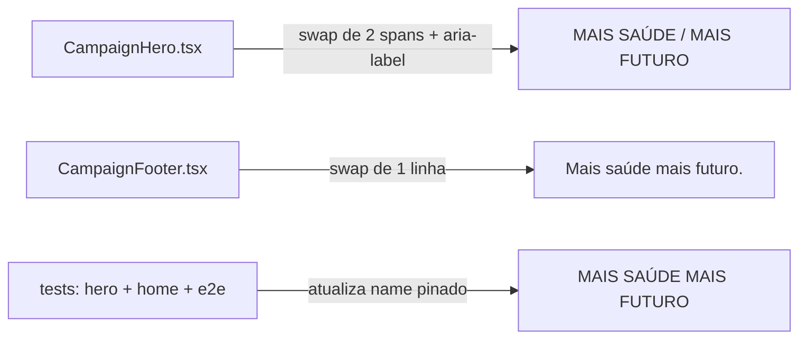

# Impl: Slogan da campanha "Mais saúde mais futuro" no hero e no rodapé

Status: aprovado
Atualizado em: 2026-08-17
Issue: #15
Intenção: docs/plans/slogan-mais-saude-mais-futuro.md
Appetite restante: herdado (~0,25–0,5 dia; diff real é troca de 4 strings em 2 componentes + 3 testes)

## Leitura da intenção

- **Outcome:** o hero e o rodapé da home de campanha exibem o slogan novo "Mais saúde mais futuro" no lugar de "Um mandato do tamanho da Bahia", com o aria-label do h1 acompanhando e os testes que pinam a string antiga atualizados.
- **O que NÃO negociar:** copy fixa no componente (nada de campo editável no admin); anatomia do hero/rodapé intacta (sem redesenho — a referência do Penpot vale só para o texto); cabeçalho da página de artigos NÃO muda (decidido no gate).
- **O que reavaliar:** a hipótese de "segunda linha em peso maior" já é a anatomia atual do componente (`font-medium` → `font-black`) — não há mudança de classes, só de texto.

## Abordagem recomendada

**Opções consideradas:** A | B | C
**Recomendação:** A — troca inline das strings nos dois componentes — porque é o menor diff possível, mantém a copy no componente (convenção atual) e toca exatamente o aceite. A estrutura de duas linhas já existe; a primeira linha segue `font-medium` e a segunda `font-black` (peso maior), como hoje.
**Rejeitadas:**

- B — extrair o slogan para uma constante módulo compartilhado (`src/lib/campaignSlogan.ts`): duas ocorrências não justificam abstração; criaria um módulo novo para esconder duas strings.
- C — tornar o slogan editável via global/collection no admin: anti-goal explícito da intenção ("fora do pedido — copy fixa no componente, como hoje").

### Componentes / mudanças

- **`CampaignHero`** (`src/components/CampaignHero.tsx:88-93`): `aria-label` → `"MAIS SAÚDE MAIS FUTURO"`; primeiro span `Mais saúde`, segundo span `Mais futuro` (JSX em title case; o `uppercase` já vem do CSS do h1, como hoje).
- **`CampaignFooter`** (`src/components/CampaignFooter.tsx:22`): linha do bloco de identificação → `Mais saúde mais futuro.` (sentence case com ponto — padrão tipográfico do rodapé, decidido no gate).
- **Migration:** sem migration (troca de strings em componentes).
- **Access / Consent:** N/A.
- **UI:** Impeccable A (encaixe de copy em superfícies existentes); anatomia, pesos e layout intactos; slogan novo é mais curto, sem risco de quebra de linha.

## Fases verificáveis

1. **Swap de strings** — `CampaignHero.tsx` + `CampaignFooter.tsx`.
2. **Testes** — atualizar os três nomes pinados: `tests/unit/campaignHero.unit.spec.tsx:21`, `tests/unit/campaignHome.unit.spec.tsx:24`, `tests/e2e/frontend.e2e.spec.ts:37` → `'MAIS SAÚDE MAIS FUTURO'` (mesmo formato do name atual: caixa alta, sem ponto).
3. **Gates** — `pnpm test` (unit+int), e2e do frontend, `tsc --noEmit`, `pnpm lint`, `pnpm format:check`, knip, `pnpm check:cycles`, `pnpm build`.

## Rabbit holes / Não escopo (engenharia)

- Caçar a frase antiga em `docs/campanha/*`, `.opencode/` ou skills — registro histórico, não superfície pública (corte da própria intenção).
- `src/app/(frontend)/artigos/page.tsx` ("O mandato do tamanho da Bahia") — fora de escopo decidido no gate.
- Ajustar pesos/classes do h1 para "ficar mais parecido com o Penpot" — o hero real já tem a segunda linha em `font-black`; mudar mais é redesenho.

## Riscos e mitigação

- **Name exato nos testes:** `getByRole` com `name` é match exato do accessible name (vem do `aria-label`) — o valor novo tem que bater sem variação de caixa/ponto. Mitigação: usar exatamente `'MAIS SAÚDE MAIS FUTURO'`, espelhando o padrão atual.
- **Rodapé sem teste pinado:** nenhum teste cobre a linha do rodapé — troca não quebra suíte, e o e2e da home segue cobrindo o hero. Sem teste novo (aceite não pede).

## Aceite de engenharia

- [x] Aceite de produto da intenção ainda coberto (hero duas linhas uppercase + peso maior na segunda; rodapé sentence case com ponto; frase antiga fora das superfícies públicas; testes atualizados)
- [x] Invariantes AGENTS/engineering-standards (sem migration, sem novo módulo, copy no dono)
- [x] Testes de domínio previstos onde strings pinadas mudam (3 arquivos)
