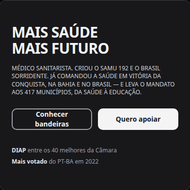
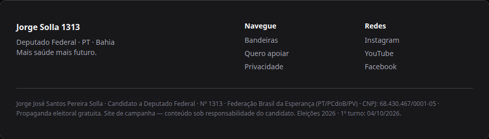

# Slogan da campanha: "Mais saúde mais futuro" no hero e no rodapé

Status: registrado
Atualizado em: 2026-08-17
Issue: #15
Priority: P1
Model: composer-2.5
Impeccable: B — encaixe de copy em `CampaignHero` e `CampaignFooter` (superfícies existentes, sem layout novo)
Rascunho UI: docs/plans/slogan-mais-saude-mais-futuro-ui-draft.html + PNGs embutidos abaixo
Appetite: ~0,25–0,5 dia eng; troca de strings + ajuste de testes; sem migration
Responsável: —

## Intenção

O diretor de comunicação da campanha pediu a troca do slogan "Um mandato do tamanho da Bahia" por
**"Mais saúde mais futuro"** no hero e no rodapé do site de campanha (jorgesolla1313.com.br). O
slogan anterior pertencia ao discurso do mandato vigente; o novo fala da campanha 2026 — saúde é o
tema-âncora do candidato (médico sanitarista, criador do SAMU e do Brasil Sorridente) e o hero já
vende essa biografia. A referência visual é o hero alterado no Penpot: slogan em duas linhas,
uppercase, com a segunda linha em peso maior.

## Persona e fluxo

- **Persona / contexto:** eleitor baiano visitando a home pública da campanha (desktop e celular), primeiro contato com o candidato.
- **Job principal:** reconhecer em 2 segundos o que a campanha propõe — "mais saúde, mais futuro" — antes de ler a biografia e decidir se apoia.
- **Fluxo desejado:** abre a home → lê o slogan novo no hero → (opcional) continua para biografia/apoio → no fim da página, o rodapé repete a mesma frase como assinatura da campanha.
- **Anti-goals de produto:** não redesenhar hero/rodapé (é troca de copy); não alterar CTAs, imagens, biografia ou provas parlamentares; não criar campo editável no admin (fora do pedido — copy fixa no componente, como hoje).

### Rascunho UI (B)

## Objetivo e aceite

- O h1 do hero exibe "MAIS SAÚDE / MAIS FUTURO" (duas linhas, uppercase, segunda linha com peso maior), no lugar de "UM MANDATO DO / TAMANHO DA BAHIA".
- O `aria-label` do h1 acompanha o texto novo (acessibilidade de leitor de tela).
- O rodapé exibe "Mais saúde mais futuro." no bloco de identificação, no lugar de "Um mandato do tamanho da Bahia.".
- A frase antiga deixa de aparecer em qualquer superfície pública do site de campanha (hero e rodapé da home).
- Testes existentes que pinam o slogan antigo (`tests/unit/campaignHero.unit.spec.tsx`, `tests/unit/campaignHome.unit.spec.tsx`, `tests/e2e/frontend.e2e.spec.ts`) são atualizados para o novo.

## Dados (intenção)

Dados: N/A — troca de copy sem métrica nova.

## Direção no codebase (hipótese)

- **Áreas prováveis:** `src/components/CampaignHero.tsx` (h1 em dois spans + `aria-label`), `src/components/CampaignFooter.tsx` (linha do bloco de identificação); home pública em `src/app/(frontend)/(home)/page.tsx` (apenas importa os dois componentes).
- **Precedente a olhar:** o próprio componente atual (a estrutura de duas linhas já existe — muda só o texto); referência visual no Penpot (hero editado pelo diretor).
- **Risco de acoplamento:** nenhum além dos testes que pinam a string — atualizar juntos.

## Dependências

- Nenhuma.

## Fora de escopo

- Redesenho do hero/rodapé (layout, imagens, CTAs) — a referência do Penpot vale só para o texto do slogan.
- Cabeçalho da página de artigos (`src/app/(frontend)/artigos/page.tsx`, "O mandato do tamanho da Bahia") — outra superfície; tratar só se o diretor pedir.
- Documentos históricos que citam o slogan antigo (`docs/campanha/*`, `.opencode/agent/designer-campanha-solla.md`, skills de comunicação) — registro, não superfície pública.
- Slogan em materiais externos (redes sociais, WhatsApp) — fora deste repo.

## Rabbit holes de produto

- **Redesign no vácuo.** Se alguém "só completar" e resolver que a frase nova merece mais destaque ou novo layout: explode para redesenho do hero. **Corte neste item:** copy fixa na anatomia atual; a referência do Penpot não muda layout.
- **Caça a todas as ocorrências.** A frase existe em docs históricos e agent docs; editar isso não é o pedido e cria ruído. **Corte:** só superfícies públicas (hero + rodapé) + testes que pinam.

## Questões em aberto (produto)

**Decidido no gate (2026-08-17):**

- Cabeçalho da página de artigos: **não muda** — escopo é hero + rodapé.
- Rodapé: **sentence case com ponto** ("Mais saúde mais futuro.") — padrão tipográfico atual do rodapé.

## Referências

- GitHub Issue: https://git.solla.dev/fsolla/teqo/issues/15
- Referência visual: hero da campanha no Penpot (slogan "Mais saúde" / "Mais futuro", uppercase, segunda linha em peso maior)
- `src/components/CampaignHero.tsx`, `src/components/CampaignFooter.tsx`
- Testes que pinam a string: `tests/unit/campaignHero.unit.spec.tsx`, `tests/unit/campaignHome.unit.spec.tsx`, `tests/e2e/frontend.e2e.spec.ts`
