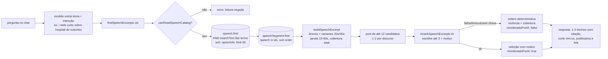

# Impl: Sollinha: sugerir trechos de falas do acervo para vídeos

Status: rascunho — revisão pós-gate (2026-09-14): reranking por LLM incorporado a pedido do produto; aguarda confirmação do plano revisado
Atualizado em: 2026-09-14
Issue: #982
Intenção: docs/plans/sollinha-acervo-falas-trechos.md (decisão do gate de 2026-09-14: reranking por LLM incorporado)
Appetite restante: **ajustado com corte explícito** — herdado ~1 dia + ~0,25–0,5 dia do reranker (aceito pelo humano no gate de 2026-09-14); nada mais entra.

## Leitura da intenção (outcome, não negociar, reavaliar)

- **Outcome:** uma tool read-only nova do chat responde pergunta de tema ("qual uma boa fala para um reels sobre o hospital do subúrbio?") com **1–3 trechos contínuos** do acervo (`speech`/`speechSegment`), cada um com **citação aproximada do ASR + minutagem início/fim + link para o acervo no ponto do trecho** (`?t=`), onde já há assistir/baixar/abrir fonte. **Decisão do gate (2026-09-14):** o Sollinha **reflete** sobre qual trecho serve melhor à intenção declarada (tema, uso, tom, duração) e de que ponto a que ponto — a escolha entre candidatos é **rerankeada por LLM dentro da tool**, com justificativa curta apresentada na resposta; a busca segue textual (sem embeddings).
- **O que NÃO negociar:**
  - Sem trecho → dizer que não achou; **nunca inventar fala nem minutagem**; a citação vem do ASR e pode ter ruído — vale como localizador, a referência é o vídeo.
  - Cada sugestão é **um trecho contínuo, curto o bastante para virar peça** — nada de transcrição inteira nem de trecho montado pulando segmentos.
  - Quem não lê o acervo recebe **negativa clara, fail-closed, antes de qualquer query** — nunca dado parcial nem erro técnico.
  - **Sem migration/collection/Consent; sem UI nova.** O acervo segue interno a `/campanha`; o chat não entrega arquivo nem edita.
- **O que reavaliar (hipóteses da exploração):**
  - "Busca por termos com `speechSegment.searchText like %termo%` e agrupar por speech": a direção (AND de termos) está certa, mas a **query primária no `speech`** (`speech.searchText`, índice `speech_search_text_trgm_idx`) permite ordenar por recência (`-speechAt`) **antes** de cortar candidatos; a precisão de segmento é validada em memória pela janela. Ver D1.
  - "A frase precisa aparecer contígua para casar" (nota da exploração sobre `speechListFilters`): verificado no adapter (`@payloadcms/drizzle/queries/parseParams.js:184`: `like` faz split por espaço e AND de `%palavra%`), então `like` já é "termos em qualquer ordem"; o que falta não é a query, e sim **a janela + citação + link + reflexão**.
  - "Gate pelo `canUseCampaignAssistant`": reavaliado para `canReadSpeechCatalog` (D3) — C159 reabre o chat para o communicator e a tool precisa nascer herdável.
  - Destino `acervo` no `buildCampaignLinks` (opção B do link): rejeitado; a tool devolve a URL completa de cada trecho (D5).
  - "Reranking é rabbit hole cortado" (intent original): **revisado pelo gate de 2026-09-14** — reranking por LLM sobre os candidatos recuperados foi incorporado a pedido do produto; embeddings/índice vetorial continuam fora (D9).
- **Sem reescrita do outcome:** a entrega é a ponte pergunta→trecho com reflexão sobre adequação e corte; edição de vídeo e transcrição no chat continuam fora (rabbit holes).

## Abordagem recomendada



**Opções consideradas:**

- **A — Tool nova `findSpeechExcerpts`** com busca textual por termos (AND), janela contígua pura em duas variantes de duração e **reranking por LLM** dos candidatos conforme a intenção declarada; registrada em `buildAITools`, gate `canReadSpeechCatalog`, retorno pt-BR no shape dos tools B185/B186.
- **B — Reusar `buildSpeechListWhere` (C154) dentro da tool** e adaptar o resultado.
- **C — Estender `searchEntities`/`buildCampaignLinks`** ou criar busca semântica/embeddings.
- **D — Sem reranker:** só ordenação determinística (o modelo externo escolhe na apresentação).

**Recomendação: A** — a tool é a dona do novo concern (pergunta→trecho com janela, corte e reflexão sobre adequação); o gate tem que ser o do acervo (não o de staff/chat) para C159 herdar; o retorno precisa carregar candidatos com corte, escolha justificada e URL — nada disso existe nos tools atuais. Nome `findSpeechExcerpts`. **Rejeitadas:** B (mistura facetas e `keywords contains` sem âncora/minutagem), C (embeddings/sinônimos são anti-goal e infra nova; `buildCampaignLinks` não conhece `?t=&q=`), D (decisão do gate de 2026-09-14: o produto quer que o Sollinha reflita e justifique com IA — ver D9).

### Componentes / mudanças

- **`src/lib/speechExcerpt.ts`** (novo, puro/client-safe):
  - `speechExcerptTerms(query)` — `normalizeForSearch` → split `[^a-z0-9]+` → dedupe → descarta `< 3` (`MIN_TERM_LENGTH`) → cap 6 (`MAX_TERMS`).
  - `buildSpeechExcerpt(segments, terms, { targetSeconds })` → `SpeechExcerpt | null` — âncora de maior cobertura + expansão contígua (D2) numa variante de alvo.
  - Constantes: `EXCERPT_MIN_SECONDS = 15`, `EXCERPT_DEFAULT_TARGET_SECONDS = 30`, `EXCERPT_MAX_SECONDS = 60`, `EXCERPT_MAX_GAP_SECONDS = 5`, `EXCERPT_MAX_ANCHORS = 5`, `EXCERPT_VARIANT_TARGETS = [20, 45]`.
- **`src/utilities/ai/rerankSpeechExcerpts.ts`** (novo, `server-only`): `rerankSpeechExcerpts({ intencao, tema, candidates, limit })` → `{ choices: Array<{ index: number; reason: string }> } | null` (D9). Espelha `deriveDemandTitle` (B195): chama `deepSeek('deepseek-flash')` server-side, **nunca lança**, timeout curto, valida a saída com zod (índices no range, sem repetição, ≤ limit, reason não vazia ≤140 chars); lista vazia do modelo é decisão válida (`{ choices: [] }` — "nenhum serve"); saída só com índices inválidos/motivos vazios, erro ou timeout → `null` (o caller dono do fallback).
- **`src/utilities/ai/tools/findSpeechExcerpts.ts`** (novo): factory `(ctx: AIToolContext) => tool({ description, inputSchema, execute })`; gate fail-closed; queries `overrideAccess: false, user: ctx.user`; pool determinístico; reranker IA com fallback; dedup final; URL via `buildWatchHref`. Contrato de retorno:

  ```ts
  {
    consulta: { tema: string; termos: string[]; intencao: string | null },
    criterio: string,          // cobertura dos termos no trecho + variante curta/longa
    totalDiscursos: number,    // candidatos analisados
    reordenadoPorIA: boolean,  // true = reranker IA escolheu/ordenou; false = fallback determinístico
    trechos: Array<{
      discursoId: number
      data: string            // formatSpeechAt(speech.speechAt)
      tipo: string | null
      inicioSegundos: number  // floor(startSeconds)
      fimSegundos: number     // ceil(endSeconds)
      inicioLabel: string     // formatSpeechClock(início)
      fimLabel: string        // formatSpeechClock(fim)
      duracaoSegundos: number
      citacao: string         // texto ASR cru da janela
      termosCasados: string[]
      motivo?: string         // 1 linha: por que serve à intenção (só com reranker IA)
      url: string             // /campanha/comunicacao/acervo/<id>?t=<s>&q=<termos>
    }>,
    truncado: boolean,
    dica?: string,
  }
  ```

  - Schema de entrada: `tema: string` (palavras de conteúdo), `intencao?: string` (o que o usuário quer com a peça, nas palavras dele — uso/tom/duração/plataforma), `limit?: number` (1–5, default 3).

- **`src/utilities/ai/tools/index.ts`** (editar o dono): registrar `findSpeechExcerpts: findSpeechExcerpts(ctx)`.
- **`src/utilities/speech/speechViewModels.ts`** (editar o dono): **exportar** `buildWatchHref`, `formatSpeechAt` e `formatSpeechClock` (hoje privados) para reuso pela tool — sem mudança de comportamento. Rejeitada: duplicar formatador de link/relógio na tool (twin).
- **`src/utilities/ai/systemPrompt.ts`** (editar): seção "Trechos de fala do acervo para vídeos" (D7).
- **Migration:** **sem migration** — `speech.searchText`, `speechSegment.searchText` e os índices trgm (`speech_search_text_trgm_idx`, `speech_segment_search_text_trgm_idx`) já estão em produção (C153/C154).
- **Access / Consent:** sem mudança de access e **sem Consent novo**. O gate é `canReadSpeechCatalog(ctx.user.role)` (`src/lib/campaignRoles.ts:25`: communicator | coordinator | candidate); as leituras caem no access existente `canReadSpeech` das collections, sempre com `overrideAccess: false` + `user`. O reranker envia citações do acervo ao DeepSeek — o mesmo provedor do próprio chat (nenhum processor novo; dado segue interno).
- **UI:** **Impeccable A — N/A** (resposta em markdown no chat existente; superfície nova = nenhuma).
- **Testes:** `tests/unit/speechExcerpt.unit.spec.ts` (puro), `tests/unit/rerankSpeechExcerpts.unit.spec.ts` (validação/fallback do reranker), `tests/unit/speechExcerptsTool.unit.spec.ts` (gate + shape + fallback + seleção IA mockada), `tests/int/speechExcerpts.int.spec.ts` (fluxo com Payload real, reranker mockado). Sem e2e (D8).
- **Changelog:** `docs/changelog/2026-09-14-c158.md`.

### Dados → forma (a resposta é a superfície)

- **Forma escolhida:** lista curta (1–3) de sugestões no chat; cada uma = **citação aproximada** (texto ASR cru da janela, sem markup), **intervalo** `inicioLabel–fimLabel` (mm:ss), **uma linha de justificativa** (por que aquele trecho serve à intenção, vinda do `motivo`) e **link markdown** para o acervo no trecho (`[abrir no acervo no trecho](/campanha/comunicacao/acervo/<id>?t=<s>&q=<termos>)`). A tool devolve dados estruturados + seleção refletida; o modelo redige a resposta.
- **Rejeitadas:** transcrição inteira/trecho longo no chat (anti-goal; contexto estoura e a citação perde foco); cartões/JSON cru na resposta (o modelo é a camada de apresentação, como nos demais tools); apresentar só o link, sem citação (o usuário pediu "fala", não navegação); highlight/`parts` no texto retornado (a UI do acervo já destaca com `?q=`; aqui o valor é a citação exata); lista sem justificativa (a decisão do gate pede reflexão explícita).

## Decisões de engenharia

> D1–D8 são as decisões de desenho herdadas da revisão pré-gate; **D9 é a decisão nova do gate de 2026-09-14** (reranking por LLM). Faseamento e riscos vivem nas seções próprias.

### D1 — Estratégia de busca: tema → termos → candidatos por discurso + validação por segmento

- **Opções:** A) o modelo extrai um **tema** (palavras de conteúdo) no schema; a tool sanitiza em termos e busca **candidatos no `speech`** (`and` de `searchText: { like: termo }`), ordena `-speechAt`, limita 30, busca os segmentos desses discursos e valida a janela em memória | B) buscar direto em `speechSegment` com AND de termos e agrupar por discurso | C) 1 query por termo (OR) e ranquear por cobertura | D) `buildSpeechListWhere` + pós-processamento.
- **Recomendação: A.**
  - Schema: `tema: string` (o modelo extrai da pergunta; ex.: "qual uma boa fala para um reels sobre o hospital do subúrbio?" → `tema: "hospital do subúrbio"`; nunca a pergunta inteira, nunca palavra que o usuário não disse).
  - `speechExcerptTerms` = `normalizeForSearch` → `split(/[^a-z0-9]+/)` → dedupe → descarta `< 3` (`MIN_TERM_LENGTH`) → cap `6` (`MAX_TERMS`). O split mata `%`/`_`/pontuação (sem curinga acidental) e evita termos que o índice trgm não cobre.
  - Query de candidatos no `speech` (concatenação normalizada dos segmentos, índice GIN trgm já em prod): `where: { and: terms.map((term) => ({ searchText: { like: term } })) }`, `sort: '-speechAt'`, `limit: SPEECH_CANDIDATE_LIMIT` (30), `select: { speechAt, type }`, `overrideAccess: false, user`. O `and` explícito é a forma testável (o adapter já splita por espaço e ANDa substrings).
  - Segunda query: segmentos dos candidatos — `where: { speech: { in: ids } }`, `sort: 'order'`, `pagination: false`, `select: { speech, startSeconds, endSeconds, text }`, `user`.
  - **Fallback com 0 resultados (AND):** **nenhum**. Sem candidato, devolve `trechos: []` + `criterio` + `totalDiscursos: 0`, e o modelo diz que não achou. **Rejeitadas:** (a) refazer com OR ou com o termo mais raro — amplia recall sem controle e pode devolver fala fora do tema ("inventar por aproximação"); (b) relaxar o AND para "qualquer termo" e ranquear por cobertura — ranking de similaridade sem sinal de qualidade; (c) fallback por `keywords` — keyword oficial não tem segmento/âncora; o refinamento do tema é explícito e auditável.
  - **Rejeitada B (query primária em segmento):** segmento não tem `speechAt`, então não há como ordenar por recência antes do corte — o limite escolheria discursos por ordem de inserção, não por relevância; a query no `speech` usa o mesmo idioma de busca e o mesmo índice, e a precisão de segmento continua garantida pela janela (D2). **Rejeitadas C/D:** OR/cobertura perde o fail-closed do "não achei" e puxa muitos candidatos; D mistura facetas de lista e OR de keyword (ver Abordagem).
  - **Semântica do vazio:** `totalDiscursos` pode ser > 0 com `trechos: []` — significa que os termos aparecem nos discursos, mas não juntos num trecho contínuo curto (D2); o critério e o prompt tornam isso explícito. Nunca é erro técnico.

### D2 — Janela de trecho contínuo: âncora por cobertura + expansão com teto (duas variantes)

- **Opções:** A) função pura nova `buildSpeechExcerpt(segments, terms, { targetSeconds })` em `src/lib/speechExcerpt.ts` (âncora + expansão contígua, invocada em **duas variantes de alvo** para o reranker escolher o corte que serve à intenção) | B) juntar strings por pontuação/corte de frase | C) janela de N segmentos fixos | D) devolver o segmento âncora isolado (sem expansão) | E) uma única variante de alvo (30s).
- **Recomendação: A**, com os números e a justificativa:
  - `EXCERPT_VARIANT_TARGETS = [20, 45]` — **duas variantes por discurso**: curta (~20s, punchy para reels/story) e longa (~45s, argumento completo). É o que dá ao reranker (D9) o que refletir sobre "de que ponto a que ponto": mesmo trecho-âncora, cortes diferentes.
  - `EXCERPT_MIN_SECONDS = 15` — piso de contexto: abaixo disso a fala perde sentido; é piso de expansão, não corte (discurso curto devolve o que existe).
  - `EXCERPT_DEFAULT_TARGET_SECONDS = 30` — alvo default da função pura (fallback e testes); as variantes passam 20/45.
  - `EXCERPT_MAX_SECONDS = 60` — teto duro: acima disso vira transcrição longa e deixa de ser peça. Se um único segmento ASR já exceder 60s, ele é devolvido inteiro (não se corta segmento no meio).
  - `EXCERPT_MAX_GAP_SECONDS = 5` — pausa máxima entre segmentos consecutivos: ASR é frasal e contíguo; gap maior = silêncio/troca de trecho, não se concatena por cima.
  - `EXCERPT_MAX_ANCHORS = 5` — tenta até 5 âncoras (ordenadas por cobertura) para achar uma janela que cubra todos os termos; se nenhuma cobrir, o discurso não rende trecho (`null`).
  - Algoritmo: normaliza cada `text` uma vez; score = quantos termos aparecem; candidatas ordenadas por `(score desc, startSeconds asc)`; para cada âncora: expande **para frente** enquanto `duração < target`, `gap ≤ 5s` e `fim − início ≤ 60s`; depois **para trás** se ainda `< 15s`, com os mesmos limites; confere a cobertura no texto concatenado; retorna `{ startSeconds, endSeconds, text, matchedTerms }` (citação = `text` cru, `matchedTerms` = todos).
  - **Rejeitadas:** B (heurística de pontuação sem lastro no ASR), C (segmentos têm duração variável; N fixo não controla segundos), D (âncora isolada de 2–3s não é peça utilizável), E (uma variante tira do reranker a decisão sobre o corte — decisão do gate de 2026-09-14). **Nota:** a cobertura é verificada na **janela** (não só na âncora): termos podem estar em segmentos consecutivos e o usuário lê o recorte inteiro — que é exatamente o que a peça vai usar.

### D3 — Gate: `canReadSpeechCatalog` fail-closed, antes de qualquer query

- **Opções:** A) `if (!canReadSpeechCatalog(ctx.user.role)) return { error: 'Leitura do acervo de falas negada.' }` no topo do `execute` | B) `isStaffCampaignRole` | C) `canUseCampaignAssistant` | D) sem gate na tool, só o access da collection.
- **Recomendação: A** — é **o mesmo predicado do access** `canReadSpeech` (C153) e o recorte exato do acervo: communicator + coordinator + candidate; advisor (staff, mas negado no acervo) e leader negados. Nasce herdável por C159 e não depende de onde a tool é chamada. Early-return **antes** de resolver termos, de qualquer `payload.find` **e do reranker**, no shape do chat (B180): `{ error }`, jamais throw.
- **Rejeitadas:** B (deixaria o advisor passar e negaria o communicator — quebra o gate de produto de 2026-09-14 e o C159), C (é gate de superfície do chat, não do dado; C159 muda a superfície e a tool ficaria presa), D (a resposta poderia virar erro técnico em vez da negativa clara; o access continua como segunda linha, com todas as queries em `overrideAccess: false`).

### D4 — Citação: texto exato da janela (ASR cru) + termos

- **Opções:** A) `citacao` = segmentos concatenados por espaço, texto cru do ASR, sem highlight; `consulta.termos` no topo (todos casam por construção) | B) devolver `parts` com highlight (como a UI) | C) devolver só o texto normalizado (sem acento) | D) resumir/normalizar a fala.
- **Recomendação: A** — a intenção manda citação aproximada e admite ruído; cru é fiel ao acervo e o modelo deixa claro que é ASR. O highlight é apresentação da UI (o `?q=` do link destaca no detalhe); `parts` no chat viraria markup sem função. Normalizar/summarizar seria reescrever a fala (risco de "inventar"). `termosCasados` por trecho dá a confiança explícita (cobertura é total por D2); o topo leva `consulta: { tema, termos, intencao }`.
- **Rejeitadas:** B, C e D — acima.

### D5 — Link: URL completa do trecho devolvida pela tool (opção A do gate)

- **Opções:** A) cada trecho traz `url = buildWatchHref(speechId, janela, termos.join(' '))` → `/campanha/comunicacao/acervo/<id>?t=<floor(início)>&q=<termos>`; o prompt ensina o modelo a formatar `[abrir no acervo no trecho](url)` | B) adicionar destino `acervo` ao `buildCampaignLinks`/`campaignNavigationUrls` com gate `canReadSpeechCatalog`.
- **Recomendação: A** — a tool conhece o id e o offset no momento em que monta o trecho; devolver a URL pronta garante que `t` e `q` nasçam juntos e corretos (sem o modelo recompor query string), reusa o builder canônico do acervo (`buildWatchHref`, exportado do dono) e não mexe no contrato de navegação. O detalhe do acervo já lê `?t` (seek do player) e `?q` (destaque da transcrição).
- **Rejeitadas:** B — expandiria o contrato de navegação e a discriminated union do `buildCampaignLinks` por um único link, exigiria suportar `?t=&q=` no destino (não previsto), e o gate de destinations é por staff (`STAFF_DESTINATIONS` exclui communicator — precisaria de uma terceira classe de destino). `buildCampaignLinks` continua existindo para os demais links.

### D6 — Limites, pool e ranking

- **Opções:** A) pool = até **6 discursos × 2 variantes = 12 candidatos** (recência + cobertura), reranker escolhe até 3, 1 trecho final por discurso | B) paginação de candidatos com offset/retry | C) ranquear por cobertura/ocorrência de termos | D) devolver todos os trechos do discurso.
- **Recomendação: A**, com os números:
  - `SPEECH_CANDIDATE_LIMIT = 30` — discursos analisados (query no `speech`), margem para a validação da janela derrubar candidatos sem zerar.
  - `EXCERPT_POOL_SPEECHES = 6` — discursos que viram candidatos de trecho (os 6 mais recentes com janela válida); cada um rende até 2 variantes (D2) → pool ≤ 12. Tamanho que cabe no prompt do reranker (~≤10k chars) e dá escolha real.
  - **Dedup final por discurso** (1 trecho por discurso): a peça vai usar UM trecho; duas sugestões do mesmo discurso seriam quase-duplicatas e roubariam a vaga de uma fala diferente — aplicado **depois** do reranker (se ele escolher as duas variantes do mesmo discurso, fica a primeira e a vaga vai para o próximo da ordem).
  - `limit` default **3**, min 1, max **5**: a intenção fixa 1–3 conforme o pedido; o max 5 cobre "me dá mais opções" sem virar lista de transcrições. O prompt manda apresentar 1–3 (4–5 só se o usuário pedir explicitamente).
  - **Ordem determinística (fallback do reranker):** recência (`-speechAt`) e, dentro do discurso, a variante longa (~45s, mais contexto de argumento); com reranker IA, a ordem é a dele.
  - `truncado = totalDocs > SPEECH_CANDIDATE_LIMIT`; `dica` quando truncado (shape B185/B186): `'Há mais discursos candidatos além dos analisados; refine o tema para chegar em outros.'`
- **Rejeitadas:** B (chat não tem paginação; refinar o tema é o caminho), C (ocorrência de termo não mede adequação à intenção — é justamente o que o reranker faz), D (transcrição inteira é anti-goal).

### D7 — System prompt: seção nova ensinando quando usar, intenção, formato e limites

- **Opções:** A) seção própria no `AI_SYSTEM_PROMPT` (como "Lideranças pendentes"/"Prioridades do momento") | B) só a `description` da tool | C) prompt dedicado separado.
- **Recomendação: A** — a `description` ensina o modelo a _chamar_; o formato da resposta (1–3, citação, minutagem, justificativa, link, negativa) é comportamento de resposta e precisa de seção; o padrão do repo é esse. Conteúdo:
  - **Quando usar:** "boa fala/trecho/citação do deputado para uma peça sobre X", "o que ele falou sobre X", "qual trecho serve para um reels sobre X".
  - **Como preencher:** `tema` = só palavras de conteúdo (ex.: `hospital do subúrbio`); `intencao` = o que o usuário quer com a peça, nas palavras dele (ex.: "reels curto, tom emocionante"; "trecho de até 30 segundos para story"; "argumento completo para o debate") — nunca inventar intenção que o usuário não expressou (sem intenção, repita o tema).
  - **Como responder:** 1–3 sugestões (default 3), cada uma com a citação entre aspas, "de `inicioLabel` a `fimLabel`", **a justificativa (`motivo`) em uma linha** e o link `[abrir no acervo no trecho](url)`; deixar explícito que a citação é da transcrição automática (ASR), aproximada e sujeita a ruído, e que a referência é o vídeo; não colar a fala/transcrição inteira (a íntegra fica no acervo).
  - **Guardrails:** nunca inventar fala, minutagem, motivo ou link; `trechos: []` → dizer que não achou e sugerir refinar as palavras; quando `reordenadoPorIA: true` e `totalDiscursos > 0`, dizer que nenhum candidato atendeu bem à intenção e sugerir reformular; `error` → repassar o motivo (acesso negado / tema sem termos); se `totalDiscursos > 0` e `trechos: []` sem IA, explicar em uma linha que os termos aparecem em discursos, mas não juntos num trecho contínuo; se `reordenadoPorIA: false`, não mencionar IA (degradação silenciosa).
  - **Acesso:** a ferramenta é restrita a quem lê o acervo; se negar, dizer que o acervo é restrito à comunicação e à coordenação/candidatura.
- **Rejeitadas:** B (description é para tool-calling; formato de resposta não cabe) e C (o prompt é único no repo; a seção é o dono).

### D8 — Testes previstos

- **Opções:** A) unit do puro + unit do reranker + unit da tool (gate/shape/fallback com `stub`/`untouchablePayload`, padrão `pendingLeadershipsTool.unit.spec.ts`) + int do fluxo com Payload real (reranker mockado; `speechAcervo.int.spec.ts` como molde, `upsertSpeechBundle` + `speechBundleFixture` + `campaignFixtures`) | B) só int | C) unit + int + e2e novo.
- **Recomendação: A** — o puro, o fail-closed e o fallback do reranker são baratos e determinísticos em unit; o int prova o fluxo real (busca normalizada, acesso dos 5 papéis, janela com offsets, dedup). **Sem e2e:** não há UI nova e o e2e de chat exercita o modelo (não determinístico); o comportamento está coberto no int. Discrição registrada.
  - `tests/unit/speechExcerpt.unit.spec.ts`: `speechExcerptTerms` (acento/pontuação/`%`/`_`, <3 descartado, cap 6) e `buildSpeechExcerpt` (âncora + expansão, gap, teto 60, piso 15, variantes 20/45, discurso curto, sem cobertura → null, contiguidade).
  - `tests/unit/rerankSpeechExcerpts.unit.spec.ts`: mocka `ai` (`generateObject`) e/ou `@ai-sdk/deepseek`; casos: saída válida → escolhidos com motivo; índice fora do range/duplicado/motivo vazio → `null`; throw → `null`; sem `DEEPSEEK_API_KEY` → `null` (curto-circuito, model nunca chamado).
  - `tests/unit/speechExcerptsTool.unit.spec.ts`: gate com `untouchablePayload` para **leader E advisor** (`find` **e o reranker** nunca chamados) e passes para **coordinator/candidate/communicator** (o `AIToolContext` aceita o role; communicator prova a herança do C159 independente de `canUseCampaignAssistant`); sem chave/reranker `null` → ordem determinística + `reordenadoPorIA: false`; reranker mockado com sucesso → ordem/motivos + `reordenadoPorIA: true`, dedup pós-reranker (2 variantes do mesmo discurso → 1 + próxima vaga), `where` do `speech` (AND por termo, `sort -speechAt`, `limit 30`, `overrideAccess: false`); shape vazio (`trechos: []`, `criterio`, `totalDiscursos`); `{ error }` de tema sem termos.
  - `tests/int/speechExcerpts.int.spec.ts`: com `vi.mock` do reranker (determinístico, sem rede); semeia 2–3 discursos com marcador único (`randomUUID`) via `upsertSpeechBundle`; coordinator e communicator leem; advisor e leader recebem `{ error: 'Leitura do acervo de falas negada.' }`; tema sem acento acha segmento com acento; janela cobre segmentos consecutivos (início/fim e citação com os dois textos) e URL `?t=<floor>&q=`; um trecho por discurso; ordenação por recência; tema inexistente → `trechos: []` (não erro); spy prova que o reranker recebe `intencao` e os candidatos do pool.
  - Sem mexer em `codebaseConventions.unit.spec.ts`: a tool não filtra municípios (allowlist P3-D intocada).

### D9 — Reflexão: reranking por LLM dentro da tool (decisão do gate 2026-09-14)

- **Opções:** A) `rerankSpeechExcerpts` (`server-only`) chamado dentro do `execute` da tool: recebe a intenção + o pool de candidatos com citação/corte e devolve até 3 escolhas ordenadas com motivo (`generateObject` + zod, saída validada); qualquer falha → **fallback determinístico** (ordem por recência/cobertura, `reordenadoPorIA: false`) | B) `generateText` + parse manual de JSON (precedente `campaignDemandTitle`) | C) devolver o pool inteiro e deixar o modelo externo escolher na resposta (sem chamada aninhada) | D) reranker heurístico no servidor (sem LLM).
- **Recomendação: A.**
  - **Entrada:** `intencao` (palavras do usuário; fallback = tema), `tema`, `candidates` (índice, data, duração, `citacao` truncada em ~700 chars para caber no prompt), `limit`.
  - **Saída:** `{ choices: [{ index, reason }] }`; validação zod: índices inteiros, sem repetição, dentro do pool, `1..limit`; reason trim não vazia ≤140 chars. Lista vazia do modelo = decisão ("nenhum serve"); só índices inválidos/motivos vazios → `null`.
  - **Prompt do reranker (pt-BR):** "Você ajuda a escolher trechos de falas do deputado para peças de vídeo. Dada a intenção do usuário e os trechos candidatos (citação do ASR + corte proposto), escolha até N que melhor sirvam à intenção — adequação ao tema, completude do argumento, tom e duração — e justifique cada escolha em uma linha. Responda apenas com o JSON do schema." Instruído a **não inventar** e a **não escolher** trecho que não serve (pode devolver menos que N).
  - **Determinismo/robustez:** nunca lança (padrão `deriveDemandTitle`): sem `DEEPSEEK_API_KEY`, timeout (`EXCERPT_RERANK_TIMEOUT_MS = 6000`), erro do provider ou saída inválida → `null` e a tool segue no fallback. A tool **nunca** depende do LLM aninhado para responder; a minutagem/citação continuam vindo só do ASR.
  - **Modelo:** `deepSeek('deepseek-flash')` (mesmo do chat). O provider tem `supportsStructuredOutputs=false`; o tracer valida `generateObject` com `deepseek-flash` (modo auto/tool) e, se flaky, **contingência barata** é B (`generateText` + extração/validação do mesmo zod) — decisão de implementação, mesmo contrato.
  - **Dedup pós-reranker:** 1 trecho final por discurso (D6), aplicado depois da escolha.
- **Rejeitadas:** B (parse manual é mais frágil que o `generateObject` validado; só como contingência), C (deixa a reflexão para o modelo externo sem visão estruturada dos candidatos e sem contrato testável — foi a opção D da pergunta do gate), D (heurística não lê a intenção; era o plano pré-gate).

## Fases verificáveis

> Faseamento: **Opções:** A) tracer determinístico (tool sem IA + fallback) → reranker IA → int → prompt/gates | B) tudo num passo | C) começar pelo prompt. **Recomendação: A** — o risco está na janela/termos/gate (determinísticos) e depois no provider do reranker; o tracer entrega a tool funcionando com fallback antes de ligar a IA. **Rejeitadas:** B (mistura risco e acabamento num único gate) e C (prompt sem tool testada não tem o que ensinar).

1. **Tracer determinístico (~0,5 dia):** exports em `speechViewModels.ts` + `src/lib/speechExcerpt.ts` + `findSpeechExcerpts.ts` (com fallback determinístico quando o reranker devolve `null`) + registro em `tools/index.ts` + `tests/unit/speechExcerpt.unit.spec.ts` e `tests/unit/speechExcerptsTool.unit.spec.ts`. Prova: `pnpm test:unit` verde (janela/variantes, termos, gate fail-closed com leader e advisor, passes de coordinator/candidate/communicator, where/shape, fallback).
2. **Reranker IA (~0,25 dia):** `src/utilities/ai/rerankSpeechExcerpts.ts` + `tests/unit/rerankSpeechExcerpts.unit.spec.ts` + ligação no `execute` (ordem/motivos/dedup) + smoke manual com `deepseek-flash` (fora do CI) para confirmar o structured output. Prova: unit do reranker verde; smoke com 1 chamada real devolvendo escolhas válidas (ou contingência B registrada). **Execução (2026-09-14):** o smoke real não rodou — não há `DEEPSEEK_API_KEY` no ambiente local de desenvolvimento; o contrato ficou pinado por mock (unit) e a falha é fail-safe (fallback determinístico). Validar no primeiro uso em staging/produção e registrar no changelog se a contingência B for necessária.
3. **Int (~0,25 dia):** `tests/int/speechExcerpts.int.spec.ts` com reranker mockado, no molde do C154 (fixtures + bundle). Prova: spec novo verde (Payload real, 5 papéis, janela/URL/dedup/recência/vazio) e nenhum outro int quebrado.
4. **Prompt + gates (~0,25 dia):** seção no `systemPrompt.ts`; `pnpm gate:fast`; `pnpm test:int` (ou o spec novo por filtro durante a iteração); `pnpm knip`; `pnpm push`; changelog `docs/changelog/2026-09-14-c158.md`. Sem migration (`migrate:status` intocado).

**Quota total:** ~1,25–1,5 dia (herdado ~1 dia + 0,25–0,5 do reranker, aceito no gate de 2026-09-14); mudanças de "contrato" são exportar 3 helpers puros do dono e uma chamada LLM aninhada na tool.

## Rabbit holes / Não escopo (engenharia)

- **Busca semântica/embeddings, índice vetorial, sinônimos, stemming, `tsvector`/`unaccent`.** Corte: `like` sobre `searchText` normalizado + janela + reranker sobre os recuperados; sem resultado, "não achei".
- **Reranker além do pool (segunda busca, query reescrita pela IA, iterative retrieval).** Corte: uma chamada, sobre até 12 candidatos, com fallback.
- **Reranker como dependência dura** (bloquear/errar a resposta se a IA falhar). Corte: fallback determinístico sempre.
- **Página de candidatos/offset, busca paginada no chat.** Corte: 30 discursos analisados + pool 12 + refinar o tema.
- **Transcrição inteira / trechos longos / múltiplos trechos por discurso no chat.** Corte: 15–60s, 1 por discurso, variantes 20/45.
- **Editar/cortar/gerar/baixar vídeo pelo chat; playlists/favoritos de trechos.** Corte: link para o acervo, onde já há assistir/baixar/abrir fonte.
- **Destino `acervo` no `buildCampaignLinks` / mudança de `campaignNavigationUrls` / nav.** Corte: URL pronta na tool (D5).
- **Expor o acervo fora de `/campanha`, Consent novo, migration/collection/field.** Corte: gate + access existentes.
- **Stopword list/stemming de português, lista de sinônimos, re-segmentação ASR.** Corte: termos ≥3 chars; refinamento é do usuário/modelo.
- **E2E de chat com o modelo real.** Corte: unit + int (reranker mockado); sem UI nova.

## Riscos e mitigação

- **Latência do reranker:** +1 chamada LLM (~1–4s) por pergunta que usa a tool — aceito no gate (peça em produção); timeout 6s → fallback determinístico; a tool nunca pendura a resposta no reranker.
- **Custo:** pool ≤12 citações truncadas (~≤10k chars in) + saída curta por chamada; mesma ordem do chat, com rate limit já existente na rota; sem loop (uma chamada por execução da tool).
- **Provider/structured output:** `@ai-sdk/deepseek` tem `supportsStructuredOutputs=false`; `generateObject` usa o modo auto (tool/JSON). Contingência B (`generateText` + JSON validado) se o smoke falhar; qualquer saída inválida → `null`/fallback.
- **Reranker "inventar" índice/motivo:** índices validados contra o pool (fora do range/duplicado → descartado), motivo só textual sobre candidato real; a citação/minutagem nunca vêm do reranker — vêm da janela ASR (D2). Motivo não pode contradizer o trecho? Validação é estrutural; o prompt proíbe inventar e o modelo externo lê a citação — risco residual aceito e pinado em teste de shape.
- **Termo curto (<3) e índice trgm:** `%term%` de 1–2 chars não usa índice e casa quase tudo — mitigado descartando <3 chars; tema só com palavras curtas devolve `{ error: 'Tema sem termos de busca: informe palavras com 3 letras ou mais.' }` e o prompt pede para refinar (nunca "não achei" falso).
- **Wildcards `%`/`_` no `like`:** o sanitizador quebra em `[a-z0-9]+`, então caracteres de curinga não chegam ao SQL; unit test pina (`tema: "100% saúde_pública"` → `['100','saude','publica']`).
- **Falso negativo por termos espalhados no discurso:** o candidato passa na query do `speech`, mas nenhum trecho contínuo cobre todos os termos → `trechos: []` com `totalDiscursos > 0`; critério e prompt explicitam. **Gatilho de revisão:** se a taxa de "candidato sem trecho" em uso real for alta, avaliar relaxar a cobertura para os termos casados dentro da janela (`termosCasados` parcial) — mudança de produto, não silenciosa.
- **Ruído do ASR:** a citação pode sair truncada/trocada; o prompt declara que é aproximada e que o vídeo é a referência; `url`/`?t=` localiza no ponto exato.
- **Modelo passar a pergunta inteira:** cap de 6 termos + descarte <3 + prompt; o pior caso é um AND mais estreito → vazio (fail-closed), nunca dado inventado.
- **`DEEPSEEK_API_KEY` ausente em algum ambiente:** reranker curto-circuita (`null`), tool responde com a ordem determinística; comportamento documentado e testado (`reordenadoPorIA: false`).
- **Performance:** `speech_search_text_trgm_idx` já existe; 30 discursos analisados + pool 12 + segmentos por `speech in`; `sort -speechAt` indexado. **Gatilho:** catálogo > ~5.000 discursos, p95 > 300ms ou termos de 3 chars dominando o plano → reavaliar (limite de candidatos/`tsvector`).
- **Drift do `speech.searchText`:** só `upsertSpeechBundle` escreve speech e segmentos na mesma transação (C153/C154); a tool usa o campo só para recall de candidato e valida a janela nos segmentos — escrito fora do bundle é caminho não suportado (mesmo contrato do C154).
- **Discurso sem segmentos ASR (`searchText: ''`):** nunca casa `like`; fica fora naturalmente, sem caso especial nem erro.
- **Divergência gate vs access:** ambos usam `canReadSpeechCatalog`; a tool nega antes da query (e antes do reranker) e as leituras ainda passam pelo access da collection (`overrideAccess: false`), então não há caminho de dado parcial.
- **Vazamento por erro/mensagem:** a negativa é genérica ("Leitura do acervo de falas negada.") e não revela existência; `trechos: []` não distingue "sem dado" de "sem acesso" (o gate nega antes). Citações enviadas ao reranker são do mesmo acervo interno e do mesmo provedor do chat.
- **Dados nos testes:** int cria `speech`/`speechSegment` com `sourceKey`/marcadores únicos e limpa no `afterAll` (molde `speechAcervo.int.spec.ts`); usuários via `campaignFixtures` com ownership; reranker sempre mockado (sem rede).
- **Pins que mudariam:** nenhum esperado (sem UI/nav/tool list pinada); se algum unit pinar o conjunto de tools, atualizar no tracer.

## Aceite de engenharia

- [ ] Aceite de produto da intenção coberto: pergunta de tema devolve 1–3 trechos contínuos com citação aproximada do ASR + minutagem início/fim + link para o acervo no ponto (`?t=`); **cada sugestão com justificativa curta de adequação à intenção** (reranking por IA); sem resultado → "não achou"; quem não lê o acervo recebe negativa clara (fail-closed); sem inventar fala/minutagem/motivo; sem migration/collection/Consent; sem UI nova; busca textual (sem embeddings).
- [ ] Invariantes AGENTS/engineering-standards: `overrideAccess: false` + `user` em toda leitura; gate `canReadSpeechCatalog` (nunca `isStaffCampaignRole`/`canUseCampaignAssistant`); `leader` lockdown e advisor negado; reranker nunca lança e nunca é dependência dura; identificadores em inglês, chaves/copy em pt-BR; tool em `src/utilities/ai/tools/` (sem top-level novo); puro em `src/lib/`; sem migration/Consent; sem e2e.
- [ ] Testes previstos: unit `speechExcerpt` + `rerankSpeechExcerpts` (validação/fallback/sem chave) + `speechExcerptsTool` (gate fail-closed com payload intocado e reranker não chamado, termos, janela/variantes, where/shape, fallback, seleção IA mockada, dedup, link) e int `speechExcerpts` (Payload real: 5 papéis, acento, janela, URL, dedup, vazio, spy do reranker); `pnpm gate:fast` e `pnpm knip` verdes; `pnpm push` na entrega.

Self-score decision-quality: 5/5 — todas as decisões caras (busca, janela/variantes, gate, citação, link, limites, prompt, testes e **reranker**) têm opções e rejeitadas explícitas, o desenho reusa C153/C154 sem migration/UI, a decisão de produto do gate de 2026-09-14 (reflexão via reranking) está incorporada com fallback fail-safe e o outcome da intenção permanece intocado.

- Decisões caras com rejeitadas: 5/5 — D1 (busca/fallback), D2 (janela/variantes), D3 (gate), D4 (citação), D5 (link), D6 (limites/pool/ranking), D7 (prompt), D8 (testes) e D9 (reranking) no formato Opções|Recomendação|Rejeitadas; as baratas (nomes/keys) ficam registradas em uma linha.
- Cabe no appetite? 4/5 — ~1,25–1,5 dia (0,25–0,5 acima do herdado, aceito explicitamente no gate de 2026-09-14); sem migration, sem UI, sem dependência nova, com corte explícito de qualquer reranker além de uma chamada sobre o pool.
- Rabbit holes nomeados? 5/5 — embeddings, reranker iterativo/segunda busca, dependência dura do reranker, paginação, transcrição no chat, edição, destino de nav, Consent/migration, stopwords/re-segmentação e e2e de chat.
- Depth check reusa? 5/5 — `searchText` + índices trgm (C153/C154), `normalizeForSearch`, `buildWatchHref`/`formatSpeechAt`/`formatSpeechClock` (exportados do dono), factory `tool()`/`AIToolContext`, shape `criterio`/`truncado`/`dica`, **precedente `deriveDemandTitle` (B195) para a chamada LLM server-side com fallback**, `upsertSpeechBundle`/`speechBundleFixture`/`campaignFixtures`; nenhuma query layer nem view model paralelo.
- Intenção permanece satisfeita? 5/5 — o outcome não foi reescrito: a ponte pergunta→trecho nasce com o gate do acervo (herdável pelo C159), o link aponta para o acervo interno no trecho (opção A), a faixa 1–3 é comportamento de resposta (opção B) e a reflexão pedida no gate foi incorporada como reranking na tool (D9), sem virar busca semântica.
