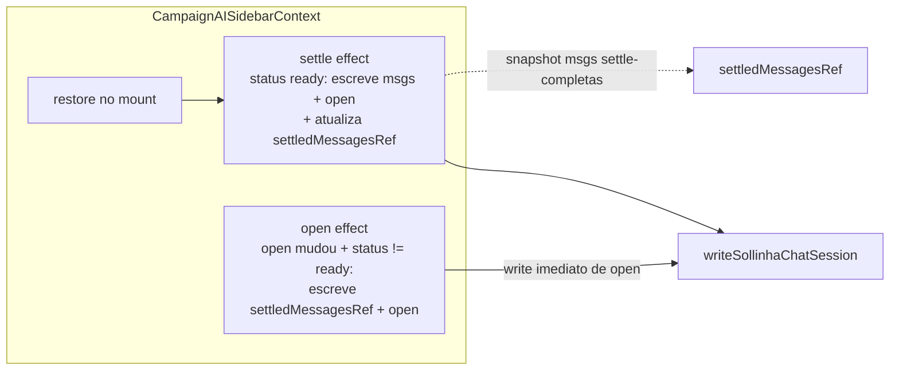

# Impl: Sollinha: fechar o drawer durante streaming pode reabri-lo num reload (race de persistência)

Status: aprovado
Atualizado em: 2026-08-11
Issue: #672
Intenção: docs/plans/sollinha-close-mid-stream-persist.md
Appetite restante: herdado (~0,5 dia eng; um ajuste no persist effect do provider)

## Leitura da intenção

- **Outcome:** fechar o drawer em qualquer fase do turno (inclusive mid-stream) persiste `open: false` de imediato — um reload antes do settle não ressuscita o drawer; a conversa em andamento continua persistindo no settle normal.
- **O que NÃO negociar:** o mecanismo de restore/`openBy` (OPS22/B188) fica intacto — o fix é só no write de fechamento; mensagens mid-stream nunca são persistidas (reload mid-stream perde só o turno em voo, corte documentado de B188); nada de migration/servidor/Consent.
- **O que reavaliar:** a hipótese da intenção ("efeito separado só para `open`, sem gate de status, reusando `writeSollinhaChatSession` com as mensagens do último commit") está correta; o refinamento é o `status === 'ready'` skip no efeito novo para não duplicar o write que o efeito de settle já faz (ver D1).

## Abordagem recomendada

**Opções consideradas:** A) efeito separado só para `open`, sem gate de status, gravando com o snapshot de mensagens do último settle | B) persistir tudo sem gate de status num efeito único | C) efeito separado só para fechamento (`open === false`)
**Recomendação:** **A** com um refinamento — o efeito novo pula quando `status === 'ready'`, porque o efeito de settle já escreve tudo (mensagens + `open`) nesse estado; sem o skip, um `open` mudado em repouso dispararia dois writes no mesmo commit (um com snapshot velho, um com live — correto por "último write vence", mas redundante e dependente da ordem dos efeitos). O resultado cobre o aceite: fechar mid-stream escreve `open: false` com o snapshot de mensagens settle-completas (nunca um stream pela metade).
**Rejeitadas:** **B** porque gravaria mensagens mid-stream no storage (o rabbit hole que a intenção nomeia — reload perderia a cauda do turno persistida); **C** porque abre mid-stream continuaria com `open` velho no storage (reload após abrir-durante-streaming devolveria o drawer fechado apesar da intenção do usuário) e a regra fica assimétrica sem ganho — o write em ambas as direções honra a regra OPS22 existente (open de origem `user` restaura em qualquer viewport; origem `settle` nunca restaura o drawer mobile) e o settle do desktop roda sempre em `ready`, então nenhum write mid-stream nasce da origem `settle`.

### Componentes / mudanças

- **`CampaignAISidebarContext.tsx`** (`src/components/campaign/shell/ai/`):
  - Novo `settledMessagesRef = useRef<UIMessage[]>([])` — o snapshot das mensagens do último write settle-completo; único conteúdo que um write mid-stream pode gravar.
  - O persist effect atual (linhas 116-121) fica como está (gate `sessionRestored && status === 'ready'`, escreve `messages + open + openBy`) e ganha `settledMessagesRef.current = messages` no corpo, após o gate.
  - Novo efeito de `open`: gate `sessionRestored && status !== 'ready'` (skips em repouso), deps `[sessionRestored, status, open]`; escreve `writeSollinhaChatSession(settledMessagesRef.current, open, openBy)`.
  - `openBy` extraído para um closure local `openByForWrite()` compartilhado pelos dois efeitos (mesma regra B188: `userToggledOpenRef || restoredOpenBy === 'user'` → `'user'`, senão `'settle'`).
  - Comentário do bloco B188 atualizado: mensagens só no settle; `open` é persistido imediatamente (com snapshot), nunca mensagens mid-stream.
- **`tests/e2e/campaignSollinhaContext.e2e.spec.ts`**: novo describe `B199` com um teste determinístico (ver Fases).
- **Migration:** sem migration. **Access / Consent:** N/A. **UI:** Impeccable B — comportamento existente, sem superfície nova.

## Fases verificáveis

1. **Provider** — refatoração do persist effect (snapshot ref + efeito de `open`). `pnpm exec tsc --noEmit` + `pnpm lint`.
2. **E2E** — novo teste no `campaignSollinhaContext.e2e.spec.ts`; rodar só o arquivo.
   - Helper `gatedMockAiChat(page)` ao lado de `mockAiChat` (mesmo wire format SSE): a **primeira** requisição responde imediato; as seguintes ficam em espera até o teste chamar `release()` (contador `requests >= 1` + promise deferida). Registrado no corpo do teste — LIFO sobre o `beforeEach` (mesmo precedente do teste de link externo do B198).
   - Fluxo do teste (mobile 500px): abre o drawer → manda msg 1 → settle → poll `storedSession.open === true` (o `open: true` velho que o bug deixaria órfão) → manda msg 2 (resposta gated; chat fica busy — testemunha `status !== 'ready'` via mic desabilitado) → clica `Fechar` → drawer some → **poll `storedSession.open === false` ainda com a resposta em voo** (testemunha determinística do fix; sem o fix este poll estoura timeout) → `release()` → poll `storedSession.messages.length === 4` (o settle cobre a conversa toda, com `open: false` — nada foi descartado) → reload → drawer continua fechado → reabre pelo FAB → conversa restaurada visível (msg 1).
3. **Gates** — `pnpm gate:fast`; entrega via `pnpm push` (pipeline de execução).

## Rabbit holes / Não escopo (engenharia)

- Persistir mensagens mid-stream (o rabbit hole da intenção): proibido pelo corte B188 — o snapshot ref é o único caminho.
- Mexer no restore/`openBy` para "consertar" isto: anti-goal explícito — troca um bug raro por outro.
- `storage` events / sincronização entre abas, rascunho do input, largura (B166), superfície (B167): regras próprias, intactas.
- Unit tests do provider (fiação de efeitos): B188 já estabeleceu o precedente de cobrir o provider via e2e; a lib `sollinhaChatSession.ts` não muda.

## Riscos e mitigação

| Risco                                                 | Mitigação                                                                                                                                                                                     |
| ----------------------------------------------------- | --------------------------------------------------------------------------------------------------------------------------------------------------------------------------------------------- |
| Write mid-stream grava mensagem pela metade           | O efeito novo grava só `settledMessagesRef` (último settle); o write do settle continua o único a persistir mensagens live.                                                                   |
| Ordem dos efeitos cria write velho-sobre-novo         | Skip `status === 'ready'` no efeito novo: em repouso só o efeito de settle escreve; mid-stream só o efeito novo escreve (settle effect early-returna antes de tocar o ref). Sem sobreposição. |
| OPS22: open de origem `settle` restaura drawer mobile | Impossível mid-stream: o settle roda no mount (status `ready`); todo write mid-stream nasce de `requestOpen`/`toggle` (origem `user`). Regra de restore intacta.                              |
| Drawer fecha com animação; `toHaveCount(0)` flaky     | Precedente do B198 no mesmo arquivo usa `toHaveCount(0)`; assert posterior do storage torna o teste independente da animação.                                                                 |
| O teste depende de timing do stream                   | Não: a resposta da 2ª troca fica gated (fetch pendente) — o close acontece com o chat comprovadamente busy (mic desabilitado), sem corrida.                                                   |
| StrictMode (dev) duplica efeitos                      | Writes idempotentes; restore já é ref-guarded (B188); e2e roda com StrictMode real e cobre o conjunto.                                                                                        |

## Aceite de engenharia

- [ ] Aceite de produto da intenção ainda coberto (close mid-stream persiste `open: false`; conversa persiste no settle; restore/`openBy` intocados)
- [ ] Invariantes AGENTS/engineering-standards (sem migration/access/Consent; identificadores em inglês; pt-BR só em strings de UI)
- [ ] Testes de domínio previstos: e2e determinístico de fechamento mid-stream + settle cobrindo a conversa (sem unit — lib intocada)

## Decisões de engenharia (self-score)

| Decisão                                        | Recomendação                                                                                             | Rejeitadas                                                                                                                                   |
| ---------------------------------------------- | -------------------------------------------------------------------------------------------------------- | -------------------------------------------------------------------------------------------------------------------------------------------- |
| Onde persistir o close mid-stream              | Efeito novo de `open` no provider (gate `sessionRestored`, skip `ready`), gravando snapshot de mensagens | Escrever tudo sem gate de status (persiste stream pela metade); fechar no handler do X (lógica no componente, fora do ciclo React do estado) |
| Qual conteúdo de mensagens no write mid-stream | `settledMessagesRef` — último snapshot settle-completo                                                   | `messages` live (stream em voo); omitir mensagens (quebraria o shape/sessão e um reload perderia tudo)                                       |
| Quando o efeito novo escreve                   | Qualquer mudança de `open` fora de `ready` (abrir e fechar)                                              | Só fechamento (assimétrico; abrir mid-stream deixaria storage velho)                                                                         |
| Teste                                          | E2E com resposta gated (fetch pendente) + poll do storage como testemunha                                | Delay fixo no stream (flaky); simular estado via storage manual (não cobre o provider)                                                       |

**Self-score decision-quality: 5/5** — aceite inviolado (close mid-stream persiste imediato; conversa intacta no settle; restore intocado); rabbit hole nomeado e cortado pelo snapshot ref; reusa os donos existentes (mesmo efeito de persist, mesma lib, mesmo wire format de mock); a divergência da hipótese da intenção é defensiva e documentada (skip `ready` evita write duplicado sem mudar comportamento).
