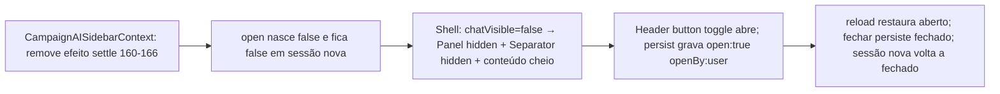

# Impl: B203 — Sollinha começa fechado no desktop

Status: aprovado (--auto)
Atualizado em: 2026-09-16
Issue: #1107
Intenção: docs/plans/sollinha-fechado-por-padrao-no-desktop.md
Appetite restante: ~0,25–0,5 dia eng (mantido; sem migration)

## Leitura da intenção

- **Outcome:** sessão nova no desktop abre `/campanha` com o Sollinha fechado e o conteúdo em largura cheia; FAB/botão do header abrem como hoje; a escolha (aberto/fechado) segue lembrada na sessão; mobile intocado; fechado = fechado, sem largura residual.
- **O que NÃO negociar:** a convenção de largura do painel aberto (B166/B167 — `CHAT_DEFAULT_PCT='25'`, `min(25%, 360px)`, resize livre, largura lembrada) e a persistência de sessão (B199 — `open` + `openBy`, restore, mid-stream) permanecem; a mudança é **só o default de sessão nova**, nunca o estado restaurado. Mobile (drawer fechado por padrão, só abre sob comando) intocado. Nenhum estado "meio aberto".
- **O que reavaliar:** a "Direção no codebase" apontava settle (`CampaignAISidebarContext.tsx`), shell (`CampaignAISidebarShell.tsx`), sessão (`sollinhaChatSession.ts`) e os e2es que pinam desktop-open — **confirmado como dono, com um corte importante**: `sollinhaChatSession.ts` **não precisa de mudança** (leitura fail-closed por role e escrita com `openBy` seguem corretas; ausência de sessão continua sendo o único sinal de sessão nova). O fix é a remoção do efeito de settle; o resto é ajuste de teste. `CampaignAISidebarShell.tsx` **não precisa de mudança funcional** (o `chatVisible` já trata o fechado; o zero-residual `b167-ai-chat-hidden` já existe) — ver decisão 2 sobre o frame pré-measured.

## Abordagem recomendada

**Decisão 1 — como fazer o default fechado.**

- **Opções:** A) remover o efeito de settle (`settledRef` + `useEffect` 160–166, o `setOpen(true)`); B) inverter o settle para colapsar o painel no desktop (`panel.collapse()` / nascer colapsado); C) manter o settle mas condicioná-lo a "só se houver sessão restaurada".
- **Recomendação:** **A — remover o efeito de settle.** É o fix barato e exato: `useState(false)` (linha 54) já é o estado inicial correto; o restore (88–103) já cobre sessão existente; o `chatVisible` do shell (linha 89) já cobre o fechado; o `b167-ai-chat-hidden` (`display:none !important`) já zera o residual. Remover ~8 linhas + o `settledRef`, sem tocar em restore/persist/`openByForWrite`.
- **Rejeitadas:**
  - **B — nascer colapsado / tornar o Panel `collapsible`:** o shell documenta explicitamente (linhas 52–68) que o painel **não** é `collapsible` de propósito — o auto-collapse do RRP sobre painel `display:none` deixava o painel travado colapsado no cruzamento de breakpoint, sem `expand` confiável. Reintroduzir collapsible é regredir B167 para trocar um mecanismo que já funciona (CSS hide) por um que já falhou.
  - **C — settle condicional ("só restaura"):** o restore 88–103 já faz exatamente isso; manter um settle que nunca abre é código morto com leitor (o próximo engenheiro relê o comentário B167 e conclui que o desktop abre sozinho). Corte: remover, e atualizar o comentário das linhas 149–158 para o novo default.
- **Caro vs barato:** A custa uma remoção + atualização de comentário; B custaria revalidar todo o cruzamento mobile↔desktop do B167 (testes de resize, foco, largura) — caro e sem ganho.

**Decisão 2 — o frame pré-measured (`chatVisible = measured ? … : true`).**

- **Opções:** A) manter `true` pré-measured (hidratação renderiza como desktop-com-chat, shell 85–89); B) virar para `false` pré-measured (primeiro paint já fechado).
- **Recomendação:** **A — manter.** O `true` pré-measured é anti-flash: com o default fechado, o pior caso é um flash de um frame com o painel visível antes do settle fechar via CSS — o mesmo flash que já existe hoje no caminho inverso, e o comentário do shell explica o porquê. Virar para `false` trocaria um flash de 1 frame (chat visível→escondido) por **outro** flash (conteúdo 100%→25%→100% se houver sessão restaurada aberta), quebrando o caso restore-aberto que a intenção manda preservar.
- **Rejeitadas:** B — vide acima; o aceite ("sessão restaurada aberta continua abrindo") pesa mais que 1 frame de painel em sessão nova.

**Decisão 3 — `openBy: 'settle'` e os efeitos de persist (127–132, 143–147).**

- **Opções:** A) não mexer; B) remover o valor `'settle'` do tipo e tratar tudo como `'user'`.
- **Recomendação:** **A — não mexer.** Com o settle removido, escritas `settle`-originadas simplesmente param de acontecer em sessão nova (o primeiro `open: true` persistido passa a vir do toggle do usuário → `openBy: 'user'`, que restaura em qualquer viewport — correto). Sessões antigas gravadas com `openBy: 'settle'` ainda podem existir no `sessionStorage` de abas abertas durante o deploy; o restore (`openBy==='user' || !isMobile`) continua tratando-as corretamente. Remover o valor quebraria a leitura dessas sessões (fail-closed → chat "perde" conversa no upgrade).
- **Rejeitadas:** B — migração de formato de `sessionStorage` sem ganho; o tipo documenta história real (OPS22), não intenção futura.

**Decisão 4 — e2es que pinam o desktop-open.**

- **Opções:** A) em cada spec afetado, abrir explicitamente pelo botão do header (`Sollinha — Assistente virtual`, `md:inline-flex`) antes de interagir com o chat; B) centralizar um helper "openSollinhaDesktop" e reescrever os specs; C) só relaxar asserções para "aberto ou fechado".
- **Recomendação:** **A — clique explícito no botão do header por spec.** Barato, local, e cada spec continua lendo como cenário real (usuário abre → interage). C deixa os specs sem dente; B é refatoração sem dor que a justifique (os specs já usam `mockSollinhaChat` + `waitForRouterSettled` compartilhados; só falta o clique).
- **Rejeitadas:** B (custo sem ganho — meia dúzia de cliques não pedem abstração) e C (aceite pede "abrir pelo botão funciona como hoje" — o e2e deve provar exatamente isso).

### Componentes / mudanças

- **`src/components/campaign/shell/ai/CampaignAISidebarContext.tsx`** (editar — dono do fix):
  - Remover o bloco de settle (linhas 159–166: `settledRef` + `useEffect` com `setOpen(true)`).
  - Reescrever o comentário das linhas 149–158: o default de sessão nova passa a ser **fechado em todos os viewports**; `open` só sai de `false` via restore de sessão (88–103) ou ação do usuário (`requestOpen`/`toggle`). Manter a explicação de que as duas superfícies derivam do mesmo `open`.
  - **Não mexer:** `useState(false)` (54), restore (88–103), `requestOpen`/`toggle` (110–116, 168–171), `openByForWrite` (125–126), persist effects (127–132, 143–147).
- **`src/components/campaign/shell/ai/CampaignAISidebarShell.tsx`** (sem mudança funcional esperada; só comentário se citar "abre sozinho"):
  - `chatVisible` (89), classe `b167-ai-chat-hidden` (113–115), Separator (161–166), Panel sempre montado + `{chatVisible ? <CampaignAISidebar/> : null}` (172–180) já implementam o fechado corretamente. O efeito de largura B166 (97–108) roda também com o painel escondido — `resize()` sobre painel `display:none` é inerte e as guardas (`hasUserSizedRef`, `isCollapsed()`) seguem válidas; nenhuma mudança.
  - Revisar o comentário 85–89 ("treated as desktop-with-chat-open … settle reconciles"): continua verdadeiro para o frame pré-measured (decisão 2); ajustar a última oração se mencionar reconciliação que não existe mais.
- **`src/lib/sollinhaChatSession.ts`** (não mexer — decisão 3).
- **`CampaignAIFab.tsx` / `CampaignAIHeaderButton.tsx`** (não mexer): FAB `md:hidden` (mobile) + header button `hidden md:inline-flex` (desktop) já dividem as superfícies; `setOpen(true)`/`toggle()` já marcam `userToggledOpenRef` → persist `openBy: 'user'`. Verificar no tracer que o header button segue visível/descobrível com o chat fechado (guardrail da intenção).
- **Migration:** sem migration (zero schema — estado é `useState` + `sessionStorage`).
- **Access / Consent:** nenhum (client-only; sem chave nova, sem coleção).
- **UI:** Design UI N/A (intenção) — sem superfície nova; o estado fechado é o que já existe quando o usuário fecha (reuso, não criação).

### Dados → forma (se aplicável)

- N/A — nenhum número novo na tela (intenção §Dados: "Não").

## Fases verificáveis

1. **Tracer — remove o settle e prova o outcome em dev (`pnpm dev`):** remover o efeito 160–166 + reescrever o comentário; rodar `pnpm dev` e verificar numa aba anônima/sessão nova em viewport desktop: (a) `/campanha` abre com conteúdo em largura cheia e `#ai-chat-panel` com `b167-ai-chat-hidden`; (b) clique no botão do header (`Sollinha — Assistente virtual`) abre o painel (~25%/cap 360px, convenção B166 intacta) com a conversa; (c) reload restaura aberto; (d) fechar pelo X persiste fechado após reload; (e) aba nova (sessão nova) volta a fechado; (f) mobile (devtools ou viewport estreito) intocado — drawer fechado, FAB abre. Unit `tests/unit/sollinhaChatSession.unit.spec.ts` deve seguir verde sem mudança (lib intocada).
2. **E2E — atualizar os specs que pinam o auto-open:** em cada spec abaixo, inserir abertura explícita pelo botão do header antes da primeira interação com o chat (mantendo `mockSollinhaChat` + `waitForRouterSettled` existentes):
   - `tests/e2e/campaignAiChatResize.e2e.spec.ts` (~linhas 44, 54 — o desktop "abre sozinho"; o teste OPS22 de não-vazamento para mobile continua válido mas o setup "login desktop abre o chat" passa a exigir o clique);
   - `tests/e2e/campaignSollinhaContext.e2e.spec.ts` (~linhas 55, 96–112 — `Olá! Eu sou o Sollinha` visível sem comando; o teste OPS22 linha ~192 "o settle do desktop abre" vira "abertura pelo usuário persiste `openBy: 'user'`");
   - `tests/e2e/campaignSollinhaWidth.e2e.spec.ts` (linhas 40–56 — largura padrão presume painel aberto no load);
   - `tests/e2e/campaignActivity.e2e.spec.ts` (~linhas 222, 481 — comentário "chat que abriu sozinho" + interação);
   - `tests/e2e/campaignMunicipalityResponsiveColumns.e2e.spec.ts` (linha ~157–195 — "sidebar and Sollinha change the column stage" presume chat aberto; abrir via header antes de medir colunas).
     Rodar os specs afetados isolados + `campaignAiChatFollowUps`/`campaignAiChatOpeningChips`/`campaignAiTranscribe` (consomem o chat aberto; avaliar se precisam do mesmo clique).
3. **Gates — `pnpm gate:fast` na iteração; `pnpm push` na entrega.** Sem changelog commitado aqui (o executor registra `docs/changelog/` conforme AGENTS.md se o fluxo da issue exigir).

## Rabbit holes / Não escopo (engenharia)

- Tornar o Panel `collapsible` ou desmontá-lo por breakpoint (remontar painel no cruzamento força navegação full-page — B167; rejeitado na decisão 1).
- Tocar em `openBy`/restore/persist (decisão 3) ou em `sollinhaChatSession.ts` (unit intocado).
- Trocar `chatVisible: true` pré-measured (decisão 2 — anti-flash do restore-aberto).
- Aplicar largura B166 "só se visível" — o `resize()` inerte sobre painel escondido é comportamento validado, não bug.
- Redesenho do painel, hint/onboarding de primeira vez, FAB/header novos (intenção: anti-goals; o botão existente é o convite).
- Persistir largura no estado fechado / "meio aberto" com largura residual (corte da intenção: fechado é fechado).
- Mexer na skill/agente Sollinha, no mobile drawer, ou na largura padrão quando aberto (fora de escopo da intenção).
- **Débito consciente (S3, simplify):** o bloco de abertura desktop nos specs (`waitForRouterSettled` + clique no header) está em ~8 call sites com helpers locais gêmeos (`openDesktopChat` em Resize/Context). Gatilho de extração para helper compartilhado de fixtures: ≥10 call sites **ou** 3ª mudança no bloco — até lá, a decisão 4 (clique explícito por spec) prevalece.

## Riscos e mitigação

- **Specs que assumem auto-open quebram em cadeia:** o grep mostra ~6 specs tocando o chat aberto no desktop. Mitigação: fase 2 lista cada um; o padrão de correção é mecânico (um clique no header button); rodar os afetados isolados antes do gate.
- **Teste OPS22 ("settle não vaza para mobile") perde o setup:** ele loga no desktop e conta com o settle para gravar `open: true` (settle-originated). Mitigação: reescrever o setup com abertura explícita pelo header (vira `openBy: 'user'` — e o caso mobile-first "sessão nova mobile não abre" continua coberto pelo default `false`); o invariante real (mobile nunca abre sozinho) fica **mais** forte, não mais fraco.
- **Flash de 1 frame com painel visível em sessão nova (decisão 2):** aceito e documentado; mitigação é não tentar "otimizar" sem evidência (mesmo padrão do B166: one-shot, revisit só com relato real).
- **`#ai-chat-panel` escondido mas com `CampaignAISidebar` desmontado (`chatVisible ? … : null`):** conversa vive no contexto (`useChat` no provider), não no componente montado — fechar nunca perde conversa (guardrail da intenção já garantido pela arquitetura).
- **Sessões `openBy: 'settle'` legadas em abas abertas no deploy:** continuam lidas pelo restore com a regra desktop-only (decisão 3); nenhum usuário perde conversa nem ganha drawer fantasma.

## Aceite de engenharia

- [ ] Aceite de produto da intenção ainda coberto (sessão nova desktop fechada + largura cheia; botão/FAB abrem; escolha lembrada na sessão; mobile intocado; sem residual; B166/B167 + B199 preservados)
- [ ] Invariantes AGENTS/engineering-standards (sem Local API/overrideAccess; client-only; identificadores em inglês; sem migration; sem commit de `importMap.js`)
- [ ] Testes de domínio (unit de sessão verde sem mudança; e2es afetados atualizados para abertura explícita e verdes; nenhum `skip`/`fixme` novo)

## Self-score (decision-quality)

4/5 — (1) quatro decisões não-triviais em forma Opções + Recomendação + Rejeitadas (fix, pré-measured, openBy, e2e); (2) caro-vs-barato explícito na decisão 1; (3) appetite ~0,25–0,5 dia respeitado (remoção + cliques de teste, sem migration); (4) depth check: reusa `useState(false)`, `chatVisible`, `b167-ai-chat-hidden`, restore/persist existentes — zero mecanismo novo; (−1) tracer ainda precisa confirmar em dev que o header button segue descobrível com o chat fechado e que nenhum comentário B167 restante mente sobre "abre sozinho".
