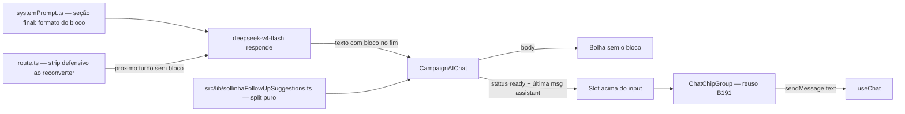

# Impl: Sollinha: follow-ups sugeridos após cada resposta (instruídos no prompt, extraídos pela UI)

Status: aprovado
Atualizado em: 2026-08-10
Issue: #533
Intenção: docs/plans/sollinha-follow-ups-respostas.md
Appetite restante: herdado (~1 dia eng) — cabe folgado

## Leitura da intenção

- **Outcome:** a cada resposta final do Sollinha que inclua o bloco, o slot de chips acima do input mostra 2–3 follow-ups relacionados ao conteúdo; a resposta exibida não contém o bloco; conversa vazia → chips de abertura (B191), após a primeira resposta → follow-ups no mesmo slot; fail-closed (sem bloco/malformado → sem chips, resposta normal); tocar num chip envia a pergunta como mensagem do usuário; geração não consome cota nem adiciona latência (mesmo stream).
- **O que NÃO negociar:** uma única chamada ao modelo (sem segunda chamada/endpoint novo); mesmo slot do B191 acima do input; fail-closed absoluto — nenhum caminho em que a extração estrague a mensagem; só a resposta **final** do turno alimenta o slot; o bloco nunca aparece como prosa na conversa; follow-ups respeitam papel (leader sem sugestão eleitoral — lockdown B180); 2–3 por resposta.
- **O que reavaliar:** a hipótese "extração no cliente antes do render do markdown" (mantém — é o único render de parts do chat, verificado: só `CampaignAIChat.tsx` renderiza `message.parts`); a questão em aberto do formato (A: rótulo estável + lista markdown) é assumida com **marcador exato** decidido aqui; a questão "limpar o bloco do texto reenviado" ganha resposta concreta: **sim, strip defensivo no servidor** (custo 3 linhas, reusa a mesma função pura); "sempre incluir ou só quando útil" — instrução de sempre incluir em respostas factuais (rec. A da intenção), com exclusão explícita de saudações/esclarecimentos/erros.

## Abordagem recomendada

**Opções consideradas:**

- A — Instrução no prompt + bloco no fim da resposta + extração pura no cliente (`split` body/suggestions), render do body sem o bloco, chips no slot do B191; strip do bloco também ao reconverter as mensagens para o modelo no próximo turno (`route.ts`).
- B — Segunda chamada de IA (modelo menor) para gerar sugestões após a resposta.
- C — Extração client-side por heurística sobre o conteúdo da resposta (sem instrução no prompt), ex.: extrair perguntas "?" do texto.
- D — Mutação do histórico no settle (stripar o bloco via `setMessages` quando `status` fica `ready`), guardando os chips em estado derivado.

**Recomendação: A** — é a única que honra a decisão de mecanismo do gate da intenção (o bloco vem na própria resposta, uma chamada, zero latência extra) e mantém o fail-closed como propriedade natural de uma função pura: sem bloco → body = texto integral, chips vazios. O bloco **fica** na mensagem persistida (B188) e a extração é derivada — chips renascem numa restauração de sessão de graça, e respostas antigas com bloco seguem mascaradas na exibição. O strip no servidor (parte da opção A) garante que o modelo nunca veja o bloco no turno seguinte (o prompt também instrui, mas o strip é determinístico e corta o eco).
**Rejeitadas:** B porque viola a decisão de gate (custo, latência, cota) e a intenção a descarta explicitamente; C porque não tem contrato estável — o modelo não sabe que deve fechar com o bloco e a heurística pegaria ruído ("posso te ajudar com algo?"); D porque destrói a re-derivação após reload (B188 restaura a mensagem **sem** o bloco → chips perdidos), adiciona máquina de estado (efeito + estado de chips) e o strip no momento errado (durante streaming a mensagem ainda muda).

### Componentes / mudanças

- **`src/lib/sollinhaFollowUpSuggestions.ts`** (novo, puro, client-safe): `SOLLINHA_FOLLOW_UP_MARKER` (fonte única do contrato — o prompt interpola a constante, nunca duplica) + `splitSollinhaFollowUpBlock(text): { body, suggestions }`:
  - `body` = texto antes da **última** ocorrência do marcador, com whitespace final aparado; sem marcador → body = texto integral.
  - `suggestions` = itens de lista (linhas `- ` / `* ` / `N. `) extraídos do bloco (tudo após o marcador), trimados, vazios descartados, teto 3.
  - **Fail-closed do contrato:** menos de 2 itens parseáveis → `suggestions: []` (o contrato de produto é "2–3"; um chip solto parece quebrado; resposta segue normal).
- **`src/utilities/ai/systemPrompt.ts`**: nova seção final `## Sugestões de continuação (formato para a interface)` interpolando `SOLLINHA_FOLLOW_UP_MARKER`:
  - Em respostas factuais (dados, explicações, links), encerrar com o marcador + 2–3 perguntas curtas de follow-up, como lista markdown.
  - Só perguntas que o Sollinha responde com as próprias ferramentas ("nunca algo que responderia 'ainda não tenho acesso'").
  - Respeitar o papel: leader não recebe sugestão eleitoral/staff.
  - O bloco é instrução de formato para a interface, não conteúdo: nunca citar em prosa, nunca repetir no corpo, nunca no meio da resposta, nada depois do bloco.
  - Sem bloco em saudações, perguntas de esclarecimento ou respostas de erro.
- **`src/components/campaign/shell/ai/CampaignAIChat.tsx`**:
  - Render: cada text part de mensagem assistant passa por `splitSollinhaFollowUpBlock` → renderiza `body` no markdown (strip vale para todas as mensagens assistant, inclusive streaming — o bloco nunca pisca como prosa; a extração roda antes do markdown, antes de qualquer transformação de link/markdown, sem duplicar pós-processamento).
  - Slot: mesmo lugar do B191 (acima do `<form>`). Prioridade: `messages.length === 0 && status === 'ready'` → chips de abertura (inalterado); senão, `status === 'ready'` + última mensagem assistant com `suggestions` não-vazias → follow-ups; durante `busy` → nada (rec. A da intenção: chips somem durante a geração). Cap por viewport: 3 desktop / 2 mobile (`FOLLOW_UP_MOBILE_LIMIT = 2`).
  - `onPick` → `sendMessage({ text })` (mesmo mecanismo do B191).
  - Derivação: última mensagem `role === 'assistant'` → último text part → `suggestions`. Só a resposta final do turno alimenta o slot.
- **`src/app/(campaign)/campanha/api/ai-chat/route.ts`**: após `convertToModelMessages(messages)`, mapear mensagens assistant (content string ou array de parts) com `splitSollinhaFollowUpBlock(...).body` — strip idempotente, o modelo nunca recebe o bloco de volta no contexto.
- **Tipo compartilhado (polish pequeno):** renomear `SollinhaOpeningQuestion` → `SollinhaChatChip` (o slot é compartilhado; o nome atual mentiria com 2 consumidores) — toca `sollinhaOpeningQuestions.ts`, `ChatChipGroup.tsx`, `CampaignAIChat.tsx` (sem mudança de comportamento). A extração retorna `string[]` e o call-site mapeia `{ text }` — decisão tomada junto da rename para o contrato do `ChatChipGroup` ser a única "forma" de chip.
- **Migration:** sem migration (nenhuma mudança de schema/collection).
- **Access / Consent:** nenhum — a regra de papel vive no prompt (herda o lockdown B180 pelo lado da **sugestão**; o enforcement das tools não muda).
- **UI:** Impeccable B — encaixe na superfície existente. Shape vem do B191 (pills no mesmo slot); craft: reuso integral do `ChatChipGroup` (tokens do tema, claro/escuro nativos, foco visível), zero CSS/motion novo; critique/polish só no que o gate B apontar.

### Dados → forma (se aplicável)

- N/A: chips são textos derivados da resposta; nenhuma métrica/KPI/série nova. O "dado" é o contrato do marcador, que é fonte única em `src/lib/` e interpolado no prompt (sem drift cliente/prompt).

## Fases verificáveis

1. **Módulo puro + testes unit (quota ~35%)** — `sollinhaFollowUpSuggestions.ts` + `tests/unit/campaignSollinhaFollowUpSuggestions.unit.spec.ts`: sem marcador (body integral, chips vazios); marcador + 2–3 bullets (body sem bloco, chips certos); 4 bullets → teto 3; 1 bullet → fail-closed `[]`; lista numerada aceita; marcador repetido → última ocorrência vence; texto depois da lista (sign-off) → fail-closed; idempotência (split de body já limpo); itens vazios descartados; marcador sem lista.
2. **Prompt + route strip** — seção no `systemPrompt.ts` (interpolação da constante) + strip no `route.ts`; sem teste próprio (coberto por tsc/gates + teste do módulo puro).
3. **UI** — `CampaignAIChat`: strip no render + slot de follow-ups (reuso `ChatChipGroup`, cap mobile 2/desktop 3, some durante busy) + rename do tipo `SollinhaChatChip`.
4. **E2E** — `tests/e2e/campaignAiChatFollowUps.e2e.spec.ts` (mock do `/campanha/api/ai-chat`, padrão do `campaignAiChatOpeningChips.e2e.spec.ts`): resposta com bloco → bolha **sem** o marcador/lista, chips aparecem acima do input; tocar num chip envia a pergunta e a conversa continua; resposta **sem** bloco → sem chips, resposta íntegra (fail-closed); cap mobile (2 chips no drawer).
5. **Gates** — `pnpm gate:fast` na iteração; entrega com `pnpm push`.

## Rabbit holes / Não escopo (engenharia)

- Não criar segundo componente de chip nem abstração nova — o slot é um só, alimentado por duas fontes (catálogo B191 / extração B192).
- Não guardar chips em estado próprio nem persistir (B188 cobre a conversa; chips são derivados).
- Não limpar o bloco da sessão persistida (B188): o strip é derivado na exibição — mexer no armazenamento quebraria a re-derivação pós-reload e duplicaria a lógica.
- Não tocar tools, `electionDataGate`, Consent, schema. Não adicionar chamada/endpoint/modelo novo.
- Não inventar marcador alternativo tolerante (ex.: aceitar "Sugestões:" sem o bold): o contrato é um só, fail-closed cobre desvios.

## Riscos e mitigação

- **Aderência probabilística do modelo** (esquece o bloco ou formata errado em respostas longas com tools): fail-closed no cliente (sem chips, resposta normal); instrução curta no fim do prompt; marcador explícito e curto; risco residual aceito pela intenção (menor que mecanismo determinístico rígido).
- **Bloco no meio da resposta / texto após o bloco**: tudo a partir da última ocorrência do marcador é tratado como bloco — legítima body pode ser cortada num desvio do modelo; aceito (contrato instrui "bloco é a última coisa"); o leak nunca é prosa quebrada, e o fail-closed da contagem de itens limita o dano.
- **Bloco contamina o histórico do modelo**: strip no `route.ts` (determinístico) + instrução no prompt; dupla proteção.
- **Conflito de render com B187/B188/B191** (mesmo `CampaignAIChat.tsx`): todos já merged em main (B191 #554, B187 #559, B188) — sem conflito de branch; o strip roda antes do markdown/links (ordem documentada na intenção).
- **Chips somem durante streaming e voltam na chegada**: comportamento deliberado (rec. A da intenção) — input travado durante `busy`, chips mortos confundiriam.
- **`status` não-`ready` com conversa restaurada (B188)**: chips só renderizam com `ready` — sem estado morto.

## Aceite de engenharia

- [ ] Aceite de produto da intenção ainda coberto (mesmo slot, 2–3 chips, fail-closed, tocar envia, resposta sem bloco, papel respeitado)
- [ ] Invariantes AGENTS/engineering-standards (identificadores em inglês, copy pt-BR, sem schema, sem Consent novo, client boundary — módulo puro client-safe, sem imports server)
- [ ] Testes de domínio previstos: unit do split + e2e do fluxo (com bloco / sem bloco, cap mobile, envio)
- [ ] Sem efeitos de streaming na extração (função pura por render, idempotente) e sem estado de chips novo
