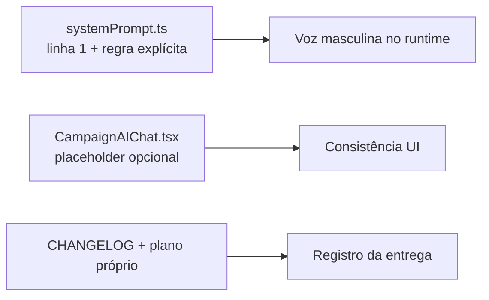

# Impl: Sollinha: persona no gênero masculino (prompt + referências .md)

Status: aprovado
Atualizado em: 2026-08-09
Issue: #462
Intenção: docs/plans/sollinha-genero-masculino.md
Appetite restante: ~0,25 dia (édito de texto; herdado)

## Leitura da intenção

- **Outcome:** o Sollinha se apresenta e se refere a si **no masculino** ("sou o Sollinha", "estou à disposição"), sem renomear o produto nem mudar tom/formalidade.
- **O que NÃO negociar:** sem guarda automatizada (só édito de texto); não reescrever planos entregues/frozen; nome "Sollinha" permanece; nenhuma mudança em tools/RBAC/rate limit/fluxo.
- **O que reavaliar:** a hipótese de "referências .md editáveis" da intenção (ex.: `sollinha-tool-urls-navegacao.md`, `sollinha-cidades-mais-votado.md`) está **desatualizada**: B162 (#383) e B177 (#460) já estão `done/in-prod` → planos entregues → **frozen**. O surface de docs editáveis é efetivamente vazio — a entrega é runtime-first.

## Abordagem recomendada

**Opções consideradas:** A (só prompt) | B (prompt + placeholder UI) | C (prompt + placeholder + docs não-frozen)
**Recomendação:** **B** — o prompt é o núcleo (aceite); o placeholder `Pergunte para a Sollinha...` usa artigo feminino no texto visível ao usuário e é a única outra superfície runtime de gênero; custo zero e consistente com o welcome já masculino ("Olá! Eu sou o Sollinha").
**Rejeitadas:**

- **C** — verificado no repo: os únicos docs da família com "a Sollinha" são **entregues/frozen** (B162, B166, B167, B173, B174, B177 + seus `-impl.md`) ou de Issue **in-progress** de outro agente (`salvador-pagina-detalhe-cidade.md`, B178 — proibido tocar). O único plano não-frozen da família (`sollinha-tools-eleitorais-leader-lockdown.md`, B180) já usa "no Sollinha" (masculino). Regra do repo: entregue = imutável; nada a editar.
- **Guarda automatizada / teste de convenção** — decisão explícita do gate da intenção ("sem guarda automatizada").
- **Renomear produto / mudar tom** — anti-goal da intenção.

### Componentes / mudanças

- **`AI_SYSTEM_PROMPT`** (`src/utilities/ai/systemPrompt.ts`): linha 1 `Você é a Sollinha` → `Você é o Sollinha`; adicionar regra explícita na seção "Quem você é" (flexões masculinas de primeira pessoa; nunca adjetivos/particípio no feminino sobre si — ex.: "obrigado", não "obrigada").
- **`CampaignAIChat.tsx`** (placeholder): `Pergunte para a Sollinha...` → `Pergunte para o Sollinha...` (único caso com artigo feminino na UI; welcome já é masculino).
- **E2E existentes** (manutenção de seletor, não guarda nova): 3 referências ao placeholder nos specs `campaignAiChatResize.e2e.spec.ts:23` e `campaignAiTranscribe.e2e.spec.ts:84,128` acompanham o texto.
- **Docs:** sem edição de planos entregues (frozen). Edita-se apenas o plano desta entrega (`sollinha-genero-masculino.md` — status no fim, quote da referência corrigida pós-fix) e a entrada curta em `docs/CHANGELOG-AGENTS.md` (redigida já no masculino).
- **Migration:** sem migration. **Access / Consent:** nenhum (sem schema, sem RBAC, sem PII). **UI:** Impeccable A — N/A (só string literal).

## Fases verificáveis

1. **Runtime** — editar `systemPrompt.ts` (linha 1 + regra). (quota: 0,1 dia)
2. **UI + specs** — placeholder `CampaignAIChat.tsx` + 3 seletores e2e. (quota: 0,05 dia)
3. **Docs/registro** — entrada `docs/CHANGELOG-AGENTS.md` + atualizar plano da entrega. (quota: 0,05 dia)
4. **Gates** — `pnpm gate:fast`; e2e dos 2 specs tocados; `pnpm push` entrega.

## Rabbit holes / Não escopo (engenharia)

- Caçar "a Sollinha"/"da Sollinha" em planos entregues ou no `CHANGELOG-AGENTS.md` (histórico congelado — fica como referência de época).
- Editar `salvador-pagina-detalhe-cidade.md` (B178, in-progress de outro agente) — mesmo tendo "da Sollinha".
- Teste de convenção / guarda automatizada de gênero (decisão do gate).
- Ajustar modelo/empresa de LLM (voz vem do prompt; reavaliação só com exemplo gravado, registro no plano sem projeto).

## Riscos e mitigação

- **Deriva do modelo apesar do prompt** (regra explícita não elimina 100%): risco conhecido e aceito pela intenção — reavaliar com exemplo gravado se recorrer; sem projeto agora.
- **E2E quebrado pelo seletor novo**: mitigado — os specs tocam o placeholder exatamente 3 vezes; rodar os 2 arquivos antes do push.
- **Divergência da hipótese da intenção (docs "editáveis")**: mitigado por este plano — o aceite (prompt define "o Sollinha" + regra explícita) permanece integralmente coberto; o surface .md não exige edição.

## Aceite de engenharia

- [x] Aceite de produto da intenção ainda coberto (prompt define "Você é o Sollinha" + regra explícita; docs novos/no futuro usam "o Sollinha")
- [x] Invariantes AGENTS/engineering-standards (sem migration, sem access, sem Consent; nada de histórico frozen tocado)
- [x] Sem testes de domínio novos — decisão de produto: édito de texto sem guarda automatizada; só manutenção de seletores e2e existentes
