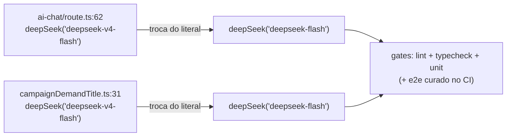

# Impl: Sollinha no nome canônico `deepseek-flash` (DeepSeek V4.1 Flash)

Status: aprovado (gate humano 2026-09-12)
Atualizado em: 2026-09-12
Issue: #945
Intenção: docs/plans/sollinha-modelo-canonico-deepseek-flash.md
Appetite restante: herdado — ~0,5 dia eng (troca de literal + verificação)

## Leitura da intenção

- **Outcome:** o chat do Sollinha e o gerador automático de título de demanda passam a chamar o nome canônico `deepSeek('deepseek-flash')`; comportamento visível idêntico e nenhuma capacidade nova exposta.
- **O que NÃO negociar:** gate de papel (leader lockdown), tools, prompt, rate limit e sessão do chat intocados; visão do V4.1 continua desligada; provider segue `api.deepseek.com`; SDK fica em `@ai-sdk/deepseek` 3.0.19; docs históricos congelados (`docs/plans/*`, `docs/changelog/*`, `docs/CHANGELOG-AGENTS-HISTORY.md`) não são editados; default de modelo do worktree (OPS101/#944) fora de escopo.
- **O que reavaliar:** a hipótese "nenhum teste pina o literal" foi verificada (só pins de worktree/opencode em `tests/`; e2e mockam a rota) — se algum teste quebrar por pin da string, é achado novo, não ajuste do plano. "Sem migration" confirmado: nenhum schema Payload tocado.

## Abordagem recomendada

**Opções consideradas:** A) trocar o literal direto nos 2 call sites | B) centralizar constante de modelo compartilhada | C) ler o modelo de env.
**Recomendação:** A — porque são 2 call sites de módulos independentes, o literal vive no call site por convenção do repo, o SDK recebe a string direto e a troca é reversível numa linha por arquivo.
**Rejeitadas:** B (abstração para 2 call sites de módulos independentes — DRY < 3; criaria acoplamento artificial entre chat e título, e o repo historicamente mantém o literal no call site; dono é o call site + SDK); C (capacidade nova não pedida — mudaria deploy/env sem ganho algum).

**Decisões acessórias (baratas — registradas, não deliberadas):** não criar teste novo pinando a string (teste de implementação sem comportamento; gatilho de revisitação: se o modelo virar configurável); não tocar worktree default nem docs históricos.

### Componentes / mudanças

- **`src/app/(campaign)/campanha/api/ai-chat/route.ts:62`** — única ocorrência no arquivo: `model: deepSeek('deepseek-v4-flash')` → `deepSeek('deepseek-flash')`. Nada mais no arquivo muda; import `deepSeek` de `@ai-sdk/deepseek` já existe.
- **`src/utilities/ai/campaignDemandTitle.ts:31`** — mesma troca; `deriveDemandTitle` com fallback `null` sem `DEEPSEEK_API_KEY` e timeout de 4s intocados.
- **Migration:** sem migration (nenhum schema Payload tocado).
- **Access / Consent:** nenhum helper novo; gate de papel do chat e Consent intocados — sem fail-closed novo porque não há write path novo.
- **UI:** Impeccable A — N/A sem UI.

## Fases verificáveis

1. **Tracer / server** — trocar os 2 literais (único entregável de código). Verificação: `grep -rn "deepSeek('deepseek" src/` retorna exatamente 2 matches, ambos `deepseek-flash`. Quota: ~15 min.
2. **UI** — N/A (Impeccable A).
3. **Gates** — `pnpm gate:fast` (lint + typecheck + unit); push via `pnpm push`. No CI, o e2e curado roda conforme `ci-scope.mjs`; a rota é mockada e não há mudança de contrato — se o diff cair em área de risco sem mapping, o gate falha fechado (`unmapped-risk`) e o curado roda mesmo assim.

## Rabbit holes / Não escopo (engenharia)

- Habilitar imagem/visão do V4.1 no chat — feature nova, outro item.
- Mexer em prompt, tools, rate limit ou sessão do Sollinha.
- Bump da SDK `@ai-sdk/deepseek` (fica 3.0.19) ou troca de provider.
- Default de modelo do worktree (OPS101/#944).
- Centralizar constante de modelo ou ler de env — sem terceiro call site, sem necessidade.
- Editar planos/changelogs históricos que citam o literal legado.
- Criar teste de string do modelo — não há comportamento a proteger.

## Riscos e mitigação

- **Nome canônico rejeitado pela API/SDK:** a SDK repassa a string direto; mitigação é smoke manual do chat e do título no dev (`pnpm dev`); rollback é reverter o literal (1 linha por arquivo).
- **Comportamento diferente entre V4.1 e o alias legado:** a intenção registra que o legado já é servido pelo V4.1-Flash ao preço Flash — a troca não muda comportamento; preço inalterado.
- **Algum consumidor/teste pina o literal:** verificado — nenhum em `src/` além dos 2 call sites; `tests/` só tem pins de worktree/opencode; e2e mockam a rota.
- **Falso ganho de escopo (visão/prompt/tools):** cortado explicitamente nos rabbit holes e no "Fora de escopo".

## Aceite de engenharia

- [ ] Aceite de produto da intenção ainda coberto (2 call sites no nome canônico; comportamento visível idêntico; nenhuma capacidade nova)
- [ ] Invariantes AGENTS/engineering-standards (sem migration, sem access/Consent, sem twinning, literais PT/URLs intocados)
- [ ] Testes de domínio previstos (unit/int) onde access/write paths mudam — N/A: sem access/write path; a suíte existente roda em `pnpm gate:fast` e no e2e curado do CI

Self-score decision-quality: 5/5 — decisão cara (A vs B vs C) com rejeitadas explícitas; cabe no appetite de ~0,5 dia; rabbit holes nomeados; depth check feito (não criar abstração/constante para 2 call sites); outcome da intenção satisfeito sem tocar lockdowns nem docs históricos.
