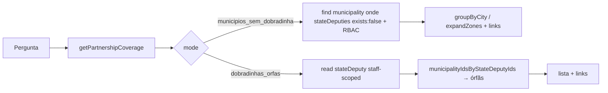

# Impl: Sollinha: municípios sem dobradinha + dobradinhas órfãs (cobertura de parcerias)

Status: aprovado
Atualizado em: 2026-08-10
Issue: #527
Intenção: docs/plans/sollinha-municipios-sem-dobradinha.md
Appetite restante: ~0,5–1 dia eng (herdado)

## Leitura da intenção

- **Outcome:** o Sollinha responde, em linguagem natural, (1) quais municípios do escopo do usuário não têm nenhuma dobradinha vinculada — com contagem e itens por município — e (2) quais dobradinhas estão órfãs (sem nenhum município vinculado), com contagem e links. Salvador agrupada por cidade por padrão, com opção de detalhar por ZE. Assessor vê só o próprio escopo; leader recebe acesso negado.
- **O que NÃO negociar:** fail-closed para leader (sem dados); leitura relativa ao escopo (assessor = municípios que administra); sem ranking/qualificação de dobradinhas; sem sugestão de deputados-alvo; sem tocar dados eleitorais (lockdown B180); resposta declara que a leitura é sobre o cadastro atual.
- **O que reavaliar:** a hipótese de "nova tool registrada no index" está certa; o diabo está em como computar "órfã" respeitando escopo e nos links para agir (a intenção diz "precedente B162").

## Abordagem recomendada

**Opções consideradas:** A (uma tool, dois modos — recomendada) | B (duas tools) | C (sem link de lista filtrada)  
**Recomendação:** A — a intenção fixou "mesma tool, dois modos de saída" e B185 (irmão, mesmo ciclo) segue o mesmo formato; um registro no `index.ts`, uma descrição de domínio.  
**Rejeitadas:** B porque o modelo escolheria entre duas tools com o mesmo domínio "cobertura de parcerias" sem ganho de clareza, e a família (B185) já consolidou modos numa tool só; C porque "abrir a lista já filtrada" é o link para agir do coordenador — a URL já suporta `stateDeputy=sem_dobradinha` (B176), só falta expô-la na tool de links.

### Componentes / mudanças

- **`getPartnershipCoverage`** (`src/utilities/ai/tools/getPartnershipCoverage.ts`): factory de tool read-only com `mode: 'municipios_sem_dobradinha' | 'dobradinhas_orfas'` e filtros opcionais `region` (território, tolerante a acento) e `city`. Gate fail-closed inline (`isCampaignStaff`), registrada no `index.ts`.
- **`src/lib/partnershipCoverage.ts`** (novo, puro): tipagem das linhas, agrupamento por cidade (`groupByCity`), resolução tolerante de região (`normalizeSearchPhrase` × `bahiaIdentityTerritories`), ordenação região→cidade (pt-BR). Unit-testável sem payload.
- **Modo municípios:** `payload.find` em `municipality` com `where: { stateDeputies: { exists: false } }`, `overrideAccess: false`, `user: ctx.user` (RBAC já entrega o escopo do assessor e vaza zero para leader), select `name/slug/kind/city/region`. Agrupado por cidade por padrão (Salvador = um item "Salvador" com `unidadesSemDobradinha: X` + lista `zonas`), ou por ZE com `expandZones: true`. Ordena região→cidade. Slug do item: `salvador` (cidade virtual, B178) quando agrupado em Salvador; slug do município caso contrário.
- **Modo órfãs:** lê todos os `stateDeputy` (read é staff-wide não-escopado), depois reusa **`municipalityIdsByStateDeputyIds`** (`src/utilities/stateDeputyData.ts`) para obter o mapa deputado→municípios no registro inteiro — órfãs = deputados fora do mapa. O cálculo de órfão é fato de registro, não relativo a escopo: um deputado vinculado a município fora do escopo do assessor NÃO é órfão. O helper já usa o bypass agregado-only (precedente B34, select só `stateDeputies` — vaza apenas IDs que o staff já pode ler).
- **Links (B162 + extensão mínima):** per-item via destinos existentes (`municipality` slug, `dobradinha` slug; `salvador` já aceito como city slug). **Novo:** `municipalityList` ganha `stateDeputies?: Array<number | 'sem_dobradinha'>` em `campaignNavigationUrls.ts` + schema de `buildCampaignLinks.ts` → `/campanha/municipios?stateDeputy=sem_dobradinha` (parâmetro já suportado pela URL layer, B176; sem mudar contrato existente).
- **Migration:** nenhuma. **Access/Consent:** nenhum novo; gate por papel inline na tool (fail-closed). **UI:** Impeccable A — resposta em texto no chat existente.

### Dados → forma

- Lista exaustiva com contagem (cobertura, não top N), critério sempre declarado na resposta ("Sem nenhuma dobradinha vinculada no cadastro atual"); Salvador agregada com drill-down por ZE opcional. Forma em texto/objetos da tool, como a família (`getLeaderships`/`getDobradinhas`); sem % estadual.

## Fases verificáveis

1. **Schema+server** — `src/lib/partnershipCoverage.ts` puro + `getPartnershipCoverage.ts` + registro no `index.ts`; unit tests do puro (agrupamento, região tolerante, órfãs) e lockdown de leader (padrão `electionToolsLockdown.unit.spec.ts`).
2. **Links** — extensão `municipalityList.stateDeputies` em `campaignNavigationUrls.ts` + `buildCampaignLinks.ts` + testes em `campaignNavigationUrls.unit.spec.ts`.
3. **Gates** — `pnpm gate:fast` na iteração; entrega com `pnpm push` (PR `--base main`, `Closes #527`, auto-merge).

## Rabbit holes / Não escopo (engenharia)

- SQL custom para órfãs (drizzle/left join) — o helper existente `municipalityIdsByStateDeputyIds` já entrega o mapa com o bypass agregado-only; N+1 evitado.
- Novo `campaignDataGate.ts` compartilhado — B185 está em paralelo e pode criar; gate inline na tool não colide e vira adoção trivial no /simplify se B185 pousar um.
- Paginação/`limit` na resposta — cobertura é exaustiva; a tool devolve total + itens ordenados, o modelo resume.
- Qualquer leitura eleitoral, ranking ou sugestão de deputado-alvo (anti-goal da intenção; lockdown B180 intacto).

## Riscos e mitigação

- **Órfã com escopo errado (vazamento/inverdade):** computar órfãs dentro do escopo do assessor mostraria deputados vinculados fora do escopo como órfãos. Mitigação: mapa completo via `municipalityIdsByStateDeputyIds` (bypass agregado-only, precedente B34); assertar no teste de lockdown que leader nunca alcança esse read.
- **Região tolerante a acento falha:** "Vale do Jiquiriça" vs "Vale do Jiquiriçá". Mitigação: `normalizeSearchPhrase` dos dois lados contra o catálogo canônico; região não resolvida → `error` com mensagem clara (o modelo re-pergunta).
- **Colisão com B185 (paralelo):** B185 não tem commits à frente de main hoje; mantive a tool auto-contida (sem novo arquivo compartilhado). Se B185 pousar `campaignDataGate`, o /simplify adota.
- **Extensão do link não passar no schema zod:** `z.union` de inteiro + sentinela `'sem_dobradinha'` precisa de `.optional()` e filtro no builder (positivos + sentinela), espelhando o padrão `coverage`.

## Aceite de engenharia

- [x] Aceite de produto da intenção ainda coberto (dois modos, contagem, Salvador agrupada/drill-down, links, escopo por papel, leader fail-closed)
- [x] Invariantes AGENTS/engineering-standards (identificadores em inglês, pt-BR só em strings de saída; sem migration/Consent; `overrideAccess: false` com user; bypass só no helper B34)
- [x] Testes de domínio: unit do puro (agrupamento/órfãs/região) + lockdown leader + teste de link filtrado
- [x] `pnpm gate:fast` verde; PR em main com `Closes #527`

## Triage do /simplify (2026-08-10)

**Já resolvido no cleanup (não reabrir):** `modo` removido da resposta (eco de `mode` podia falhar schema — `criterio` identifica a leitura); teste de sort com cidade decisiva (Camaçari × Salvador ZE na mesma região); asserts de URL literal em vez de espelhados (`/campanha/municipios?stateDeputy=7&stateDeputy=sem_dobradinha`); stubs de payload com docs populados (agrupado, expandZones, órfãs, região inválida); cast redundante de `zoneNumber`.

**Explicitamente fora:** `total` conta unidades operacionais, não rows agrupados (aceite pede contagem de municípios; `unidades` por row); schemas zod das tools não têm teste direto (família inteira igual — exercitados em E2E/build); guards micro (whitespace, tie-break de nome); filtros `region`/`city`/`expandZones` ignorados no modo órfã (descrições do schema cobrem; refine seria over-engineering).

**Adiado com gatilho:** lookup de nomes de contato duplicado entre `getDobradinhas` e `getPartnershipCoverage` (ids → find → Map, ~15 linhas). **Gatilho:** 3º call site (provável B185/B189) → extrair `loadContactNamesByIds(payload, user, ids)` server-side em `src/utilities/` e adotar nas três tools.
