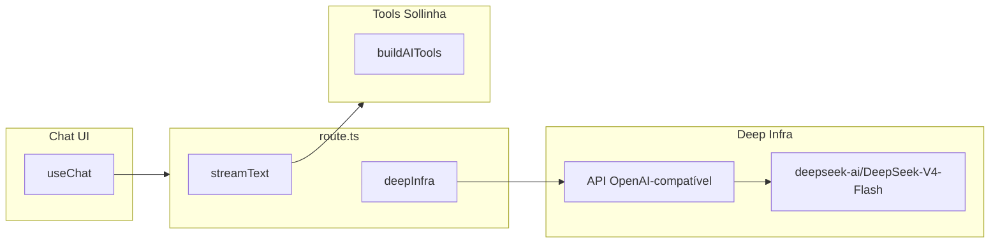

# Impl: B174 — Sollinha no Deep Infra (LLM) — mesma API e chave dos agentes

Status: aprovado
Atualizado em: 2026-08-08
Issue: #449
Intenção: docs/plans/sollinha-no-deepinfra.md
Appetite restante: ~0,5 dia (herdado)
Impeccable: A — sem UI

## Leitura da intenção

- **Outcome:** A Sollinha (endpoint `/campanha/api/ai-chat`) passa a ser servida pela **Deep Infra** no caminho OpenAI-compatível, usando o **mesmo modelo** (DeepSeek-V4-Flash), as **mesmas tools** e a **mesma chave** que os agentes do time já usam — um provedor, uma chave, uma fatura. Sem mudança visível para o assessor.
- **O que NÃO negociar:** modelo permanece `deepseek-v4-flash` (equivalente Deep Infra `deepseek-ai/DeepSeek-V4-Flash`); tools/sistema da Sollinha intactos; nenhuma UI; rollback barato e documentado (reverter baseURL/chave volta ao estado atual); env/e2e com endpoint mockado continua sem chave real no CI.
- **O que reavaliar:** a hipótese de "área provável = `route.ts` + env `DEEPINFRA_API_KEY`" está correta; o desenho exato do provider (pacote oficial `@ai-sdk/deepinfra` vs. baseURL OpenAI-compatível crua) é a decisão de engenharia aqui.

## Abordagem recomendada

**Opções consideradas:**
- **A — `@ai-sdk/deepinfra`** (provider oficial do AI SDK p/ Deep Infra; versão **3.0.20** que está na mesma "ferroviária" que o `ai@7.0.47` instalado — `@ai-sdk/provider@4.0.4` + `@ai-sdk/provider-utils@5.0.18`). Troca de 2 linhas: `deepSeek('deepseek-v4-flash')` → `deepInfra('deepseek-ai/DeepSeek-V4-Flash')`. O provider **lê `DEEPINFRA_API_KEY` do env sozinho** (source confirma `environmentVariableName: "DEEPINFRA_API_KEY"`). Seu default baseURL é `https://api.deepinfra.com/v1` + `/openai/...` = exatamente o endpoint OpenAI-compatível que a documentação da Deep Infra prescreve.
- **B — `@ai-sdk/openai-compatible` cru** com `baseURL: 'https://api.deepinfra.com/v1/openai'` manual + `loadApiKey` próprio. Funciona, mas reimplementa à mão o que o pacote A já encapsula (nome do provider, env var, headers/user-agent, schema de erro).
- **C — continuar com `@ai-sdk/deepseek` e só sobrescrever `baseURL`** p/ a Deep Infra. Hacky: provider com nome/contrato "DeepSeek oficial" apontando para outra API; model naming e tratamento de reasoning divergem.

**Recomendação: A** — porque é o provider first-party do AI SDK para Deep Infra (mesma linha de código que o `deepSeek` já usa), é a menor superfície de diff (2 linhas no `route.ts` + env), e a Deep Infra serve V4-Flash no schema OpenAI-compatível que esse provider já serializa. C só funcionaria "por acaso"; B é parafuso de ouro onde A resolve com um martelinho.

**Rejeitadas:** B (encapsulado por A, sem ganho); C (mal-nomeado, fragilidade de contrato desnecessária).

### Componentes / mudanças

- **`src/app/(campaign)/campanha/api/ai-chat/route.ts`**: `import { deepSeek } from '@ai-sdk/deepseek'` → `import { deepInfra } from '@ai-sdk/deepinfra'`; `model: deepSeek('deepseek-v4-flash')` → `model: deepInfra('deepseek-ai/DeepSeek-V4-Flash')`. Nada mais muda: `system`, `messages`, `tools: buildAITools`, `stopWhen: stepCountIs(10)`, rate limit, auth, streaming ficam idênticos.
- **`package.json`**: remove `@ai-sdk/deepseek`; adiciona `@ai-sdk/deepinfra@3.0.20` (pino explícito — `^3.0.20` flutuaria para 3.0.27 que puxa `@ai-sdk/provider@4.0.7`/`provider-utils@5.0.25`, criando uma SEGUNDA cópia de provider ao lado do `ai@7.0.47` que permanece em 4.0.4/5.0.18; pinar na mesma ferroviária evita isso — conferir com `pnpm why @ai-sdk/provider` após instalar).
  - `@ai-sdk/deepseek` vira dependência morta → knip (CI-blocking) exige a remoção; rollback é `git revert` do commit + re-set `DEEPSEEK_API_KEY`, documentado abaixo.
- **`.env.example`**: substitui o bloco `DEEPSEEK_API_KEY` pelo bloco `DEEPINFRA_API_KEY` (com URL de geração da chave na Deep Infra). Nome `DEEPINFRA_API_KEY` é o que o provider A lê automaticamente E o mesmo que B173 (STT/Whisper na Deep Infra) reusa.
- **Migration:** sem migration (nenhum schema/collection).
- **Access / Consent:** intocados (auth/session do chat e RBAC das tools já existem; provider não muda async no RBAC).
- **UI:** Impeccable A — nenhuma mudança.
- **Docs:** atalho no `docs/plans/sollinha-no-deepinfra-impl.md` (este) + registro curto no `docs/CHANGELOG-AGENTS.md`.

### Dados → forma

N/A — sem apresentação de dados nova. (O "smoke das tools" abaixo é uma checagem de runtime, não uma forma de dados.)

## Fases verificáveis

1. **Dependência** — `pnpm add -E @ai-sdk/deepinfra@3.0.20` + `pnpm remove @ai-sdk/deepseek`; conferir `pnpm why @ai-sdk/provider` (uma cópia 4.0.4, sem 4.0.7 duplicado).
2. **Code** — swap de 2 linhas no `route.ts`.
3. **Env** — `.env.example` troca `DEEPSEEK_API_KEY` → `DEEPINFRA_API_KEY`.
4. **Gates** — `pnpm gate:fast` (lint + typecheck + unit) na iteração; entrega via `pnpm push` (inclui `gate:ci`: format:check + knip + madge).

## Smoke (deploy-time; passo de runbook no merge, não no CI)

Sollinha já está em produção e o routing de tools é o músculo dela. Antes/logo após o flip:

1. Garantir `DEEPINFRA_API_KEY` na env de produção da Vercel (mesma chave usada pelos agentes; remover/ignorar a `DEEPSEEK_API_KEY` antiga — deixá-la definida não quebra, mas o objetivo é uma chave só).
2. Pós-deploy, disparar pelo chat real 2–3 perguntas que forcem **tool calling de dados** ("Quantos votos tivemos em Ilhéus em 2022?", "Quem é o deputado mais votado em Feira?", "Quais dobradinhas temos em Salvador?") e conferir resposta com dados reais (não alucinação margem).
3. Se qualquer tool falhar → **rollback**: `git revert` o commit do provider (restaura `@ai-sdk/deepseek` + `baseURL` oficial) OU simplesmente re-apontar a baseURL/chave antiga; redeploy. A documentação acima é o "rollback barato e documentado" do aceite.

## Rabbit holes / Não escopo (engenharia)

- **"Aproveita e sobe o `ai`/providers para as últimas versões"** — explodiria o diff e o risco de compatibilidade com `ai@7.0.47`/`react` em uso; 3.0.20 alinha a ferroviária atual. Reavaliar provider bump isoladamente se/quando o `ai` subir.
- **Teste unitário do provider** — sem ganho para um chore de infra: o endpoint (route) não tem unit test hoje, e o e2e mocka o SSE. O guard de regressão real é o e2e mockado (não requer chave) + o smoke de deploy.
- **Guard de código** ("model id fixo") — over-engineering para um chore; o diff de 2 linhas é o próprio contrato.

## Riscos e mitigação

- **Tool calling se comporta diferente via Deep Infra (V4-Flash no schema OpenAI-compatível)** → é exatamente o que o smoke cobre; se falhar, rollback de 1 commit. A Deep Infra documenta tool calling no endpoint OpenAI-compatível; o `streamText` do AI SDK abstrai as SSE.
- **Versão de provider duplicada** (3.0.27 puxando provider 4.0.7) → mitigado pinando `@ai-sdk/deepinfra@3.0.20` exact; verificar com `pnpm why`.
- **Chave errada/ausente em prod** → provider falha com 401 no request (não no boot); o e2e mockado e a UI continuam funcionando (erro aparece por stream como hoje). Smoke pega isso na primeira pergunta.

## Aceite de engenharia

- [x] Aceite de produto da intenção ainda coberto (mesmo modelo, mesmas tools, sem UI, rollback documentado, e2e mockado sem chave no CI)
- [x] Invariantes AGENTS/engineering-standards (dead code morre: `@ai-sdk/deepseek` removido; knip verde)
- [ ] Testes de domínio previstos (unit/int) onde access/write paths mudam — **nenhum path de access/write muda** (chore de provider); e2e existente (`campaignAiChatResize`, `campaignSollinhaWidth`) segue passando sem chave real, cobrindo o contrato.

Self-score decision-quality: 5/5 — decisões caras (escolha de provider) têm rejeitadas; cabe no appetite; rabbit holes nomeados; depth check (não cria módulo novo além do swap; reusa o existing route); aceite de produto intacto.
