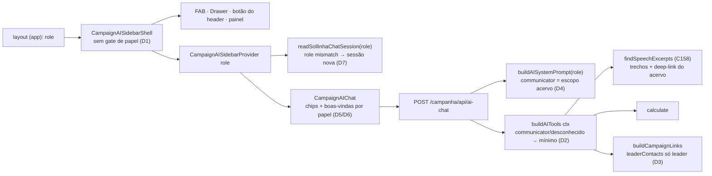

# Impl: Sollinha na assessoria de comunicação (chat escopado ao acervo)

Status: aprovado
Atualizado em: 2026-09-14
Issue: #983
Intenção: docs/plans/sollinha-para-comunicacao.md
Appetite restante: herdado (~0,5–1 dia eng)

## Leitura da intenção

- **Outcome:** o `communicator` vê e abre o Sollinha na vertical `/campanha/comunicacao` (FAB, drawer e botão do header); uma pergunta de acervo responde com trechos de falas do C158 e caminho para o Acervo; pergunta fora do escopo recebe negativa clara e educada — nunca erro técnico, nunca dado de campanha, eleitoral ou de município; os chips de abertura dele são perguntas de acervo; leader lockdown, `advisor`, nav do communicator, rate limit e limites de conversa ficam intocados. Sem migration, collection, Consent ou UI nova.
- **O que NÃO negociar:** leader lockdown absoluto (B180) e `advisor` sem acervo/sem mudança no chat (C153/C154); nav do communicator intacta (só Comunicação); zero dado de campanha/eleitoral/município ao communicator; negativa sempre em linguagem de produto (nunca `Forbidden`/stack); o gate do dado segue sendo `canReadSpeechCatalog` (`src/lib/campaignRoles.ts:25`); sem Consent novo; `maxDuration = 60` e rate limit 50/15 min inalterados; `pnpm push` como caminho canônico de entrega.
- **O que reavaliar (hipóteses da exploração):**
  - "as demais tools negam com mensagem clara, com ajuste pontual nos donos": com escopo por construção (D2) o communicator não vê as tools de campanha — a negativa clara passa a ser do prompt (D4) e a ausência de tool fecha a classe inteira de falhas; tocar 7 donos sem gate vira trabalho morto. O ajuste pontual fica no único dono que o escopo mínimo alcança de fato: os links (D3).
  - `canUseCampaignAssistant` (`campaignRoles.ts:34`): o predicado virou `true` para todos; redefini-lo ou manter um branch do communicator é abstração morta (D1 — morre no dono, junto dos comentários C154).
  - A sessão do chat (`src/lib/sollinhaChatSession.ts`) não guarda papel e nada a limpa no login — em dispositivo compartilhado (mesma tab), a conversa de staff pode reaparecer para o communicator, vazando exatamente o que o guardrail proíbe (D7 — entra no escopo, fix mínimo fail-closed).
  - O fallback de chips para papel desconhecido (hoje leader-safe) precisa de decisão explícita ao nascer o branch do communicator (D5).
  - O gap do `leaderContacts` no `buildCampaignLinks` (`campaignNavigationUrls.ts:291-296`): passa para qualquer não-leader, mas `/campanha/meus-contatos` redireciona quem não é leader — link quebrado e resposta mentirosa (D3).

## Abordagem recomendada



**Opções consideradas:**

- **A — Reabrir a superfície removendo o gate morto (D1) e escopar as tools por construção no registry (D2):** o communicator recebe só `{ calculate, buildCampaignLinks, findSpeechExcerpts }`; coordinator/advisor/candidate/leader seguem com as 15. Prompt variante (D4), chips e boas-vindas por papel (D5/D6), sessão carimbada com o papel (D7) e correção pontual do `leaderContacts` no dono (D3). A negativa de escopo vem do prompt + ausência de tool; a tool do acervo mantém o `{ error }` do C158 para não-leitores.
- **B — Expor as 15 tools a todos e gatear cada tool sem gate com negativa clara** (`getLeaderships`, `getOrganizations`, `searchEntities`, `getMunicipalityOverview`, `getDobradinhas`...): ajuste nos donos de cada uma, mantendo o access como está.
- **C — Gatear na rota** (`route.ts`): montar `system` e `tools` condicionais por papel no handler.

**Recomendação: A** — o escopo por construção elimina a classe inteira de falhas (o `Forbidden` que o access lança em `payload.find` — precedente `tests/int/speechCatalog.int.spec.ts:144-154` — e o vazio enganoso dos filtros `{ id: { in: [] } }`) e o vazamento por chamada inesperada: o modelo não vê o que não pode chamar, então não há alucinação de tool nem erro técnico a converter. Reusa os donos existentes (registry, prompt, chips, sessão, `assertDestinationAccess`) e mantém o gate do dado onde já vive (`canReadSpeechCatalog`, C153/C158).

**Rejeitadas:** **B** — sete donos para gatear, cada um uma cópia da política, e a lista é aberta por omissão: qualquer tool nova nasce exposta e a classe de falha volta; a decisão do gate ("negativa clara em linguagem de produto") é honrada sem essa fiação porque o communicator não tem as tools e a negativa é do prompt. **C** — esconde a política na camada de transporte, não é testável isoladamente (o contrato real é registry+prompt) e duplicaria a decisão de papel em dois pontos da mesma rota.

### Decisões de engenharia

### D1 — Superfície: remover `canUseCampaignAssistant` (editar o dono)

- **Opções:** A) apagar o predicado em `src/lib/campaignRoles.ts:28-34` e destravar os 2 consumidores (`CampaignAISidebarShell.tsx:42-45` e `CampaignDesktopHeader.tsx:9,29`) | B) redefinir o predicado para `() => true` | C) manter o predicado e adicionar um branch para communicator.
- **Recomendação: A** — o predicado virou "todos", tem só esses 2 consumidores (não há outro no repo) e nenhum teste pina o nome; os detalhes de superfície (FAB, drawer, provider, botão do header, painel) já derivam do shell sem gate próprio, então remover o early-return habilita as três superfícies de uma vez. O `role` continua descendo ao provider (chips/boas-vindas/chat) — só o portão morre. Atualizar os comentários C154 em `campaignRoles.ts` e em `CampaignAISidebarShell.tsx:42-45` (comentário C159 no lugar; C154 deixa de ser verdade).
- **Rejeitadas:** B — abstração morta que convida um próximo agente a "consertar" a decisão de volta; C — gêmeo do gate antigo, exatamente o "edit the owner, don't twin".

### D2 — Escopo de tools por papel: allowlist no registry

- **Opções:** A) `buildAITools(ctx)` (`src/utilities/ai/tools/index.ts`, dono) filtra internamente: papel de escopo mínimo recebe `{ calculate, buildCampaignLinks, findSpeechExcerpts }`; os demais, as 15 | B) expor todas e gatear cada tool sem gate no próprio dono | C) filtrar na rota.
- **Recomendação: A**, com estes contornos:
  - **Predicado local** no registry: `isFullAssistantRole(role) = isStaffCampaignRole(role) || role === 'leader'` (reusa `campaignRoles.ts`; não cria predicado novo exportado — 1 call site + testes). Qualquer coisa fora disso, **incluindo role desconhecido em runtime, cai no escopo mínimo (fail-closed)**: um papel inesperado não tem garantia de staff/leitura e o mínimo não vaza nem lança.
  - **Composição tipada:** montar `speechTools` e, quando full, `{ ...speechTools, ...campaignTools }` — sem `pick` genérico, sem perder a literalidade das chaves (o teste lê `Object.keys`).
  - **Guard compartilhado: não** — o concern "quais tools cada papel vê" é do registry; prompt e chips têm concerns próprios (D4/D5) e não compartilham a decisão.
  - **Negativa clara:** o prompt (D4) responde pedidos fora do escopo em linguagem de produto com a orientação para o acervo; o modelo não pode chamar tool que não está no schema. O `{ error: 'Leitura do acervo de falas negada.' }` do C158 permanece para leader/advisor (que continuam com todas as tools e são negados pelo gate da tool).
  - **Nota de escopo:** a dívida pré-existente de `Forbidden`/vazio em tools sem gate para outros papéis (ex.: leader chamando `getDobradinhas`) **não** entra aqui — o B180 cobre o lock eleitoral e o C159 é sobre o communicator.
- **Rejeitadas:** B — sete donos para editar, cada cópia é um twin da política, e uma tool futura nasce exposta (lista aberta); C — o registry é o dono do contrato `tools` e é testável sem subir a rota.

### D3 — `buildCampaignLinks`/`leaderContacts`: corrigir no dono

- **Opções:** A) em `assertDestinationAccess` (`src/utilities/ai/campaignNavigationUrls.ts:242-275`), `leaderContacts` só passa para leader; demais recebem negativa clara | B) deixar como está (o prompt do communicator desaconselha) | C) adicionar um destino `acervo` ao catálogo de links.
- **Recomendação: A** — `leaderContacts` é destino exclusivo da liderança (a página `/campanha/meus-contatos` redireciona não-leader para `/campanha`), então hoje o link é quebrado para communicator **e** staff; uma mensagem própria fecha o gap: `{ error: 'A área Meus contatos é exclusiva da liderança.', alternatives: [CAMPAIGN_HOME, CAMPAIGN_PROFILE_HOME] }`, inserida depois do bloco do leader. `home` e `perfil` continuam passando para todos (legítimos: `/campanha` redireciona o communicator para a vertical via `roleHome` em `campaignPageActor.ts:65-69`; `/campanha/perfil` não tem gate). Nenhum destino novo é criado.
- **Rejeitadas:** B — link quebrado e resposta mentirosa no chat, contra o aceite "nunca erro técnico"; C — já rejeitada no C158 (D5): o deep-link `?t=&q=` é contrato da tool do acervo (`buildWatchHref`) e o catálogo de navegação não suporta query string; duplicaria o concern.

### D4 — Prompt por papel: `buildAISystemPrompt(role)` no dono

- **Opções:** A) função no dono `src/utilities/ai/systemPrompt.ts`, com o corpo único e duas peças variáveis (seção de conhecimento e bloco de escopo), chamada pela rota (`route.ts:63`) | B) manter a constante e anexar/substituir um bloco na rota | C) prompt dedicado em arquivo separado.
- **Recomendação: A** — a base hoje afirma acesso a dados eleitorais, municípios, dobradinhas, lideranças, organizações e metas (`systemPrompt.ts:13-16`), tudo falso para o communicator; um bloco anexado criaria contradição (o modelo alucina com a afirmação antiga). A composição mínima é: **constante do corpo** + `knowledgeSection` por papel + `scopeRules` por papel; para todos os papéis menos communicator a saída é o texto atual (as peças variáveis são interpoladas com o texto existente — sem regressão de tom). `AI_SYSTEM_PROMPT` deixa de ser export (só a rota consome; knip limpo) e a rota passa `system: buildAISystemPrompt(user.role)`.
  - **Conhecimento do communicator** (substitui as linhas 13-16 atuais):

    ```text
    - Você tem acesso ao acervo interno de falas do deputado na Câmara para sugerir trechos de vídeo.
    - Você conhece o funcionamento do acervo: cada fala tem data, duração, transcrição automática e um vídeo de referência que abre no trecho.
    ```

  - **Bloco de escopo do communicator** (logo após "O que você sabe"):

    ```text
    ## Escopo do seu acesso
    - Você atende a assessoria de comunicação: seu trabalho é ajudar a encontrar trechos de falas do deputado no acervo para vídeos e reels.
    - Você NÃO tem acesso a dados eleitorais, de municípios, de campanha, de lideranças, de organizações, de dobradinhas ou de apoiadores. Se pedirem, diga com educação que esses dados não fazem parte do seu acesso e ofereça buscar um trecho no acervo de falas.
    - A busca do Acervo (Comunicação → Acervo) continua sendo a superfície principal para garimpar falas; seus links levam direto ao ponto do trecho.
    - Nunca repita, resuma ou comente dados de campanha que apareçam em mensagens anteriores da conversa: se o assunto não for o acervo, negue com naturalidade e retome o que você faz.
    ```

  - **Follow-up** (linha 91 do bloco atual ganha a irmã): `- Respeite o papel do usuário: para liderança (role leader), nada de sugestões sobre dados eleitorais ou áreas staff — apenas o que a liderança pode perguntar. Para a assessoria de comunicação (role communicator), só sugestões sobre o acervo de falas.`
  - Leader/advisor/coordinator/candidate: texto idêntico ao atual (pinado por unit).

- **Rejeitadas:** B (contradição na seção de conhecimento + política fora do dono), C (duplicaria ~90 linhas e criaria drift entre prompts no repo, que é único).

### D5 — Chips de abertura: catálogo próprio do communicator

- **Opções:** A) `COMMUNICATOR_OPENING_QUESTIONS` (3, todas respondíveis por `findSpeechExcerpts`) + branch explícito em `getSollinhaOpeningQuestions` | B) reusar o conjunto do leader | C) criar um conjunto genérico "não-staff".
- **Recomendação: A** (decisão do gate 2026-09-14), com o texto exato:

  ```ts
  /** Communicator: 3 chips, all answerable by findSpeechExcerpts. */
  const COMMUNICATOR_OPENING_QUESTIONS: readonly SollinhaChatChip[] = [
    { text: 'O que o Solla já falou sobre Farmácia Popular?' },
    { text: 'Me dá uma fala do deputado para um reels sobre saúde.' },
    { text: 'Qual um trecho bom sobre o hospital do subúrbio?' },
  ]
  ```

  Branch: `role === 'communicator'` → catálogo próprio; `isStaffCampaignRole(role)` → staff; senão leader. `MOBILE_LIMIT = 3` permanece (o catálogo do communicator já tem 3 — desktop e mobile iguais). **Fallback de papel desconhecido: leader-safe (mantido)** — os chips de acervo pressupõem leitura garantida do acervo (um papel desconhecido pode receber `{ error }` da tool); os chips do leader são meta/links pessoais e não expõem dado interno. Gatilho registrado: quando um valor novo entrar no enum de role, adicionar branch explícito + unit.

- **Rejeitadas:** B (não respondem o job de acervo; com D3, "Meus contatos" ainda viraria negativa), C (nenhum conjunto genérico é respondível por todos os papéis).

### D6 — Boas-vindas do chat: variante por papel

- **Opções:** A) condicional inline em `CampaignAIChat.tsx:151-154` (1 call site, sem módulo) | B) módulo `sollinhaWelcome.ts` | C) texto único mais genérico para todos.
- **Recomendação: A**, com a copy exata:
  - communicator: `Olá! Eu sou o Sollinha. Posso buscar no acervo de falas do deputado trechos para suas peças — é só dizer o tema.`
  - demais papéis: texto atual inalterado (`Olá! Eu sou o Sollinha, assistente virtual da campanha. Pergunte sobre votações, municípios, dobradinhas, lideranças e muito mais.`).
    O prefixo "Olá! Eu sou o Sollinha" é comum — os e2e existentes (`campaignSollinhaContext`, `campaignAiLinks`, `campaignAiChatOpeningChips`) seguem válidos sem mudança.
- **Rejeitadas:** B (abstração para 1 call site), C (o texto atual cita votações/municípios/dobradinhas — falso para o communicator; não resolve).

### D7 — Sessão do chat: carimbar o papel e descartar mismatch (guardrail)

- **Opções:** A) `role` no payload persistido + mismatch → sessão descartada/fresh, fail-closed, no dono `src/lib/sollinhaChatSession.ts` | B) limpar a sessão no login/logout do campaignUser | C) registrar débito em Issue separada.
- **Recomendação: A** — o vazamento é direto ao guardrail "nunca dado de campanha para o communicator" e o fix é barato e local, sem bump de versão:
  - `SollinhaChatSession` ganha `role: CampaignRole` (type-only de `campaignRoles.ts`; `lib` não importa `utilities`, ok).
  - `isSollinhaChatSession` exige `role` num set com os 5 valores — sessões legadas (sem role) → `null`/fresh (fail-closed; a lista local é espelho do enum e um valor novo cai em descarte, comportamento aceitável).
  - `readSollinhaChatSession(role)` devolve `null` quando `session.role !== role` (mismatch nunca restaura mensagens nem `open`).
  - `writeSollinhaChatSession(messages, open, openBy, role)` grava o papel; `CampaignAISidebarProvider` passa `role` no read e nos dois writes (`CampaignAISidebarContext.tsx:91,131,146`).
  - Impacto: `tests/unit/sollinhaChatSession.unit.spec.ts` estendido; `campaignSollinhaContext.e2e.spec.ts` lê só `messages/open` e restaura no mesmo papel — permanece verde. Sessões antigas (sem role) são descartadas uma vez no deploy — perda de conversa efêmera, sem dado persistente; registrar no changelog.
  - Risco residual nomeado: dois usuários **da mesma role** no mesmo tab continuam restaurando a conversa — é o mesmo modelo de confiança do login (quem loga vê o que o papel vê); o crossing que o guardrail proíbe (staff → communicator) é exatamente o que o mismatch fecha.
- **Rejeitadas:** B (não há ponto único de limpeza no fluxo de auth do campaignUser; acoplaria auth a uma preocupação de chat, fora do appetite), C (barato demais para virar débito com risco de vazamento).

### D8 — E2E e manifest: estender o acervo, não crescer a suíte

- **Opções:** A) estender `tests/e2e/campaignSpeechAcervo.e2e.spec.ts` (teste do communicator) + corrigir o prefixo do manifest | B) criar spec e2e novo do chat do communicator | C) não mexer em e2e (só unit).
- **Recomendação: A** — o teste atual (`:87-89`) assere ativamente `not.toContain('campaign-ai-shell')`/`not.toContain('Sollinha')`; deixá-lo sem atualização faz a suíte **mentir e quebrar**. Inverter para provar: `toContain('campaign-ai-shell')`, `toContain('Olá! Eu sou o Sollinha')`, presença dos 3 chips do communicator, ausência dos chips de staff (ex.: `Quem foi o deputado mais votado em Feira de Santana?`), mantendo os asserts de nav (sem `href="/campanha/apoiadores"`/`/municipios`). O HTML SSR já carrega os chips (o e2e de chips depende disso), e o clique nos chips é o mesmo componente já coberto para staff — sem browser novo. No manifest (`scripts/lib/e2e-affected-manifest.mjs:194-207`), adicionar `src/lib/sollinhaOpeningQuestions` ao prefixo da entrada "Sollinha AI surfaces": hoje um diff só nesse arquivo acorda apenas o smoke de home (fallback) e não o spec dos chips — a entrada passa a refletir o dono da curadoria (`src/lib/campaignRoles` já está mapeado para `campaignSpeechAcervo` pela entrada C154).
- **Rejeitadas:** B (a UI é a mesma; o custo de browser não paga — HTML + unit já provam), C (o pin de ausência do C154 quebra e a suíte não cobriria a nova superfície).

### D9 — Testes: unit-first, sem int novo

- **Opções:** A) units por dono + e2e estendido (D8) | B) int da rota com `streamText` mockado | C) e2e de chat com o communicator (modelo mockado).
- **Recomendação: A** — nenhum access, write path, query ou schema muda; as fronteiras Payload/DB do C159 não existem (a tool do C158, que as tem, já é coberta pelo int dela). Mapa por decisão:
  - `tests/unit/campaignSollinhaOpeningQuestions.unit.spec.ts` (estender): communicator → os 3 textos (desktop e mobile); staff/leader intactos; fallback desconhecido → leader.
  - `tests/unit/aiToolsScope.unit.spec.ts` (novo): `buildAITools` para communicator e role desconhecido → exatamente `['calculate', 'buildCampaignLinks', 'findSpeechExcerpts']`; coordinator/candidate/advisor/leader → 15 chaves; o mínimo não contém tools de campanha (prova por chaves, sem executar query).
  - `tests/unit/campaignNavigationUrls.unit.spec.ts` (estender): `leaderContacts` negado para communicator/coordinator/advisor/candidate com a mensagem clara; leader segue ok (`:117-127`); `home`/`perfil` ok para communicator.
  - `tests/unit/sollinhaChatSession.unit.spec.ts` (estender): write grava role; read com role igual restaura; role diferente → `null`; sessão sem role → `null`; role inválido → `null`.
  - `tests/unit/aiSystemPrompt.unit.spec.ts` (novo): `buildAISystemPrompt('communicator')` contém o bloco de escopo e a regra de follow-up do acervo e **não** contém "dados eleitorais da Bahia" na seção de conhecimento; `buildAISystemPrompt('coordinator')`/`('leader')` mantêm a seção completa.
  - **Sem int novo** e sem mudança nos ints existentes (`speechExcerpts.int.spec.ts:135-154` já prova a herança do communicator na tool). `codebaseConventions`/`campaignNav`/`campaignPageActorGate` seguem sem mudança (nav e gate de página intocados).
- **Rejeitadas:** B (a rota é fina; mockar streaming é infra nova para pouco sinal), C (o comportamento determinístico está no registry/prompt/sessão; e2e de chat já cobre o componente para staff/leader).

### Componentes / mudanças

- **`src/lib/campaignRoles.ts`** (editar): remover `canUseCampaignAssistant` (e o comentário C154); nenhum outro predicado muda.
- **`src/components/campaign/shell/ai/CampaignAISidebarShell.tsx`** (editar): remover import/early-return (`:42-45`); `role` continua indo ao provider; comentário C159 no lugar do C154.
- **`src/components/campaign/shell/CampaignDesktopHeader.tsx`** (editar): `<CampaignAIHeaderButton />` sempre renderizado (`:29`); remover import do predicado (`:9`).
- **`src/utilities/ai/tools/index.ts`** (editar): `buildAITools` escopa por papel (D2) reusando `isStaffCampaignRole`; `speechTools`/`campaignTools` com tipagem literal.
- **`src/utilities/ai/systemPrompt.ts`** (editar): `buildAISystemPrompt(role)` (D4); remove export de `AI_SYSTEM_PROMPT`.
- **`src/app/(campaign)/campanha/api/ai-chat/route.ts`** (editar): `system: buildAISystemPrompt(user.role)` (`:63`); auth, rate limit, `buildAITools` e `maxDuration` intactos.
- **`src/utilities/ai/campaignNavigationUrls.ts`** (editar): negativa clara de `leaderContacts` para não-leaders em `assertDestinationAccess` (D3).
- **`src/lib/sollinhaOpeningQuestions.ts`** (editar): catálogo e branch do communicator; docstring atualizada (D5).
- **`src/components/campaign/shell/ai/CampaignAIChat.tsx`** (editar): boas-vindas por papel (D6).
- **`src/lib/sollinhaChatSession.ts`** (editar) e **`src/components/campaign/shell/ai/CampaignAISidebarContext.tsx`** (editar): papel persistido + mismatch fail-closed (D7).
- **`scripts/lib/e2e-affected-manifest.mjs`** (editar): prefixo `src/lib/sollinhaOpeningQuestions` (D8).
- **`tests/e2e/campaignSpeechAcervo.e2e.spec.ts`** (editar) + units de D9.
- **`docs/changelog/2026-09-14-c159.md`** (novo): entrada curta da entrega.
- **Migration:** sem migration (nenhum schema/collection/field; `pnpm migrate:status` intocado).
- **Access / Consent:** sem mudança de access e **sem Consent novo**. O gate do dado permanece `canReadSpeechCatalog` (access C153 + gate da tool C158); nenhuma query nova; `overrideAccess: false` + `user` intocados. O papel no `sessionStorage` é estado do cliente, não dado de servidor.
- **UI:** Impeccable D — sem design novo (superfícies existentes habilitadas por papel); copy exata: chips (D5) e boas-vindas (D6).

### Dados → forma (se aplicável)

N/A — nenhuma apresentação de dados nova (quem apresenta os trechos é a tool do C158, dentro do chat que já existe). Nenhum formato, tabela, threshold ou env novo.

## Fases verificáveis

1. **Tracer / server (~0,45 dia):** D2 (registry) + D4 (prompt + rota) + D3 (links) + D7 (sessão) com seus units (`aiToolsScope`, `aiSystemPrompt`, `campaignNavigationUrls`, `sollinhaChatSession`). Prova: `pnpm test:unit` verde; o communicator, mesmo antes da superfície, já tem escopo mínimo se chamado por API.
2. **Superfície/UI e e2e (~0,35 dia):** D1 (shell/header) + D5 (chips) + D6 (boas-vindas) + D8 (e2e do acervo + manifest) + unit dos chips estendido. Prova: spec do acervo atualizado verde (shell + chips + ausência dos chips de staff), unit dos chips verde, comentários C154 corrigidos.
3. **Gates e entrega (~0,2 dia):** `pnpm gate:fast` na iteração; rodar os e2e afetados (spec do acervo/`pnpm test:e2e:affected`, discricionário) antes do push; `pnpm push` (gate:ci local); changelog `docs/changelog/2026-09-14-c159.md`; `pnpm knip` limpo (o predicado removido não deixa export órfão). Sem migration.

**Quota total:** ~0,5–1 dia eng (herdado), dentro do appetite.

## Rabbit holes / Não escopo (engenharia)

- **Gatear as 15 tools individualmente** (opção B de D2) — 7 donos, cópias da política e lista aberta a tools futuras. Corte: allowlist no registry.
- **"Melhorar" as negativas de access das collections** para o chat — access é dado, não superfície; o gate é o do C158. Corte: nenhuma mudança de access.
- **Abrir o acervo/chat pleno para advisor/leader** — decisão C153 mantida; corte explícito.
- **Novas tools** (pauta, agenda, demandas, clipping) e destino `acervo` no `buildCampaignLinks` — corte: deep-links da tool do C158; catálogo de navegação intocado.
- **Redesign do drawer/persona ou reescrita global do prompt** — corte: 2 trechos variáveis + bloco de escopo.
- **Consent/migration/collection** — fora; o item é acesso/superfície/prompt/testes.
- **Mexer em rate limit (`rateLimit.ts`) ou limites da sessão (`SOLLINHA_CHAT_MAX_*`)** — valem iguais.
- **Sanitizar o histórico no servidor** — o estado vive no `sessionStorage`; o fix é no dono da sessão (D7).
- **"Consertar" o hit hardcoded de `searchEntities` (`searchEntities.ts:36-43`)** — não exposto ao communicator por D2; pré-existente, fora.
- **Int da rota com streaming mockado / e2e novo de chat** — cobertura determinística está no unit + HTML (D9).
- **Regressão a procurar:** leader lockdown (B180) e o deny de advisor no acervo (C153/C154) não são tocados — só ganham prova nos units/e2e existentes.

## Riscos e mitigação

- **Regressão do leader lockdown via D3:** `assertDestinationAccess` mexe na allowlist do leader — mitigado por unit (`:117-127` segue pinando leader ok; staff destinations negadas) e pelo e2e de links.
- **Sessões antigas descartadas no deploy (D7):** conversa em `sessionStorage` sem role vira fresh — efêmera, sem dado persistente; documentado no changelog. Comportamento é o desejado (fail-closed).
- **Prompt do communicator alucinar acesso:** a seção de conhecimento é reduzida e o bloco de escopo é explícito; não há tool de campanha no schema para materializar vazamento — o pior caso é uma resposta genérica de "não tenho acesso", que é o aceite 3.
- **E2E do acervo era o pin da ausência (C154):** atualizado no mesmo PR (D8); deixá-lo para depois garantiria CI vermelho.
- **`knip`/dead code:** remoção de `canUseCampaignAssistant` e do export `AI_SYSTEM_PROMPT` são os pontos a verificar no `pnpm gate:fast`/`pnpm knip`; nenhum arquivo/comentário C154 fica em pé descrevendo comportamento que morreu.
- **Seleção de e2e em PRs futuros:** o prefixo novo do manifest amplia corretamente o gatilho de `sollinhaOpeningQuestions` (não cresce a suíte, corrige o mapa OPS86).
- **Fallback de chips/links para role desconhecido:** leader-safe + escopo mínimo de tools + sessão descartada — três camadas fail-closed, todas pinadas em unit.
- **`campaignAiChatOpeningChips` (browser):** não muda (staff/leader intactos; o communicator é provado no HTML do acervo) — se o assert de boas-vindas `Olá! Eu sou o Sollinha` quebrar por causa da copy, ajustar apenas o texto do communicator (prefixo comum preservado).

## Aceite de engenharia

- [ ] Aceite de produto da intenção coberto: communicator vê/abre o Sollinha na vertical (FAB/drawer/header); pergunta de acervo responde com trechos + link; fora do escopo → negativa clara; chips de acervo próprios; leader/advisor/nav/rate limit/limites intocados.
- [ ] Invariantes AGENTS/engineering-standards: sem migration/collection/Consent; access e `canReadSpeechCatalog` intocados; nenhuma query nova (e as existentes seguem `overrideAccess: false` + `user`); copy pt-BR e identificadores em inglês; sem abstração nova (<3 call sites); "edit the owner, don't twin" (registry/prompt/chips/sessão/links editados no dono); comentários C154 corrigidos onde ficaram falsos; `pnpm knip` limpo.
- [ ] Testes de domínio previstos (unit/int) onde access/write paths mudam: **nenhuma mudança de access/write path**; units de D9 cobrem os donos editados; e2e `campaignSpeechAcervo` atualizado; int do C158 segue verde; `pnpm gate:fast` e `pnpm push` verdes (e2e afetados rodados antes do push).

## Self-score decision-quality

- Decisões caras com rejeitadas: 5/5 — D1–D9 no formato Opções/Recomendação/Rejeitadas (superfície, escopo de tools, links, prompt, chips, boas-vindas, sessão, e2e/manifest, testes); as baratas (mensagem do `leaderContacts`, nome/set da sessão, prefixo do manifest) ficam registradas em uma linha.
- Cabe no appetite? 5/5 — ~0,5–1 dia herdado; nenhum schema/migration/Consent/UI nova/dependência; a única superfície de risco novo (sessão) é um fix local de ~30 linhas com unit.
- Rabbit holes nomeados? 5/5 — gatear 15 tools, mudar access das collections, abrir acervo para advisor/leader, novas tools/destino de acervo, reescrever prompt/persona, Consent/migration, rate limit, sanitização server-side, e2e/route novos.
- Depth check reusa? 5/5 — `canReadSpeechCatalog`/`isStaffCampaignRole` (C153/C154), shape `{ error }` (B180/B185), `assertDestinationAccess` (B162+), `findSpeechExcerpts`/`buildWatchHref` (C158), padrão de chips (B191) e de sessão (B188/OPS22); nenhum predicado, tool, gate ou store paralelo nasce.
- Intenção permanece satisfeita? 5/5 — os 5 aceites e os guardrails estão cobertos pelas decisões, sem ampliar escopo (nada de tools novas, nada de acervo para advisor/leader, leader lockdown intocado) e com a negativa clara vinda do prompt + ausência de tool em vez de 7 ajustes de dono.
