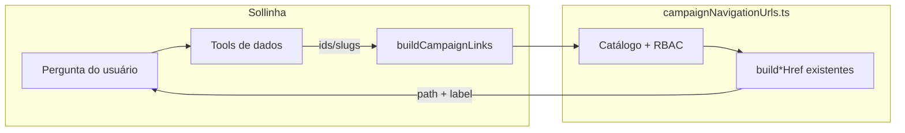

# Impl: B162 — Sollinha: tool de URLs para navegar a vistas de interesse

Status: em execução
Atualizado em: 2026-08-06
Issue: #383
Intenção: docs/plans/sollinha-tool-urls-navegacao.md
Appetite restante: ~0,5–1 dia (herdado)

## Leitura da intenção

- **Outcome:** A Sollinha monta paths `/campanha/…` canônicos (detalhe ou lista filtrada) e os oferece como links markdown clicáveis na resposta, para o staff abrir a vista certa em um clique — sem substituir a navegação do app nem inventar filtros inexistentes.
- **O que NÃO negociar:** catálogo fechado (sem path genérico); reuso dos builders de URL existentes; leader lockdown; ids/slugs já resolvidos (nunca chute); links relativos; sem auto-navegação; sem migration/Consent/collection; não inventar `?advisor=` em dobradinhas.
- **O que reavaliar:** A hipótese de “um arquivo em `tools/` + registro” permanece correta, mas a lógica de montagem deve viver num módulo **puro** (`campaignNavigationUrls.ts`) separado da factory `tool()`, para testes unitários sem mock de Payload e para não inflar o handler da tool.

## Abordagem recomendada

**Opções consideradas:** A) módulo puro + tool fina | B) tool com paths hardcoded inline | C) estender `searchEntities` para devolver todos os hrefs  
**Recomendação:** **A** — catálogo tipado + delegação aos `build*Href`/`campaignConceptHref` já canônicos; tool só valida input Zod, chama o módulo com `ctx.user.role`, devolve `{ links: [{ path, label }] }`.  
**Rejeitadas:** **B** porque driftaria dos contratos B18+ e duplicaria query params; **C** porque não cobre listas filtradas, mistura busca com navegação e não centraliza RBAC de destino.

### Componentes / mudanças

- **`campaignNavigationUrls.ts`** (`src/utilities/ai/campaignNavigationUrls.ts`): núcleo puro. Tipos discriminados por `destination`, mapa de destinos → função builder, guardas de papel (`isStaffCampaignRole`, `isUnrestrictedCampaignRole`, `canAccessSupporterArea`), retorno `{ ok: { path, label } } | { error, alternatives? }`. Sem Payload, sem I/O.
- **`buildCampaignLinks.ts`** (`src/utilities/ai/tools/buildCampaignLinks.ts`): factory `buildCampaignLinks(ctx)` com Zod `discriminatedUnion('destination', …)` espelhando o catálogo v1; aceita `links: [...]` (batch até ~5) para cenários “ficha + lista filtrada”; `execute` chama o módulo puro.
- **`index.ts`**: registrar `buildCampaignLinks: buildCampaignLinks(ctx)`.
- **`systemPrompt.ts`**: seção “Navegação” — quando usar (híbrido C da intenção: proativo em entidade singular + sempre sob pedido explícito); fluxo `searchEntities`/tool de domínio → `buildCampaignLinks`; exemplos do catálogo E (dobradinhas do assessor → ficha + detalhes, não lista filtrada inventada).
- **Migration:** sem migration
- **Access / Consent:** RBAC na tool via papel + invariante “só ids/slugs fornecidos pelo modelo após tools de dados”; páginas continuam fail-closed no servidor
- **UI:** N/A (markdown GFM já renderiza links no `CampaignAIChat`)

### Catálogo v1 (implementação)

| Grupo     | `destination`                                                                                                                                             | Builder / path                                                |
| --------- | --------------------------------------------------------------------------------------------------------------------------------------------------------- | ------------------------------------------------------------- |
| A         | `home`, `quadro`, `perfil`, `conceitos`, `giros`                                                                                                          | literais + `campaignConceptHref(id)`                          |
| B detalhe | `municipality`, `leadership`, `dobradinha`, `advisor`, `organization`, `activity`, `demand`, `supporter`                                                  | `/campanha/{area}/[slug\|id]`                                 |
| C lista   | `municipalityList`, `leadershipList`, `dobradinhaList`, `advisorList`, `organizationList`, `activityList`, `demandList`, `supporterList`, `territoryList` | `build*ListHref` com subset de filtros do catálogo de produto |
| Leader    | `leaderContacts`                                                                                                                                          | `LEADER_CONTACTS_HOME`                                        |

Filtros de lista expostos no schema Zod (alto valor operacional, espelhando intenção):

- **municipalityList:** `q`, `slug[]`, `region[]`, `advisor[]`, `coverage`, `priority`, `trend[]`, `class[]`, `level[]`
- **leadershipList:** `q`, `status[]`, `municipality[]`, `organization[]`, `stateDeputy[]`, `access`
- **dobradinhaList:** `q`, `party[]` (sem advisor)
- **advisorList:** `q`, `municipality[]` (gate `unrestricted`)
- **organizationList:** `q`, `kind`
- **activityList:** `tab`, `q`, `kind`, `status`, `municipality`
- **demandList:** `q`, `status`, `kind`, `activity`
- **supporterList:** `q`, `voteIntention`, `source`, `municipality`, `city`
- **territoryList:** `q`, `region[]`, `coverage`, `sort`, `dir`

Destinos **bloqueados para `leader`:** tudo exceto `home`, `perfil`, `leaderContacts`.  
Destinos **bloqueados para `advisor`:** `advisor`, `advisorList`, `assessores` paths, `quadro`, `giros`, `conceitos` (staff-only nav).

### Dados → forma

- Forma: links markdown relativos (`[label](/campanha/…)`). O modelo recebe `{ path, label }` e formata na resposta.
- Rejeitadas: URLs absolutas (desnecessárias no mesmo origin); chips/botões “Abrir” (fora do appetite).

## Fases verificáveis

1. **Tracer / schema+server** — `campaignNavigationUrls.ts` com destinos A+B+C mínimos (home, municipality detail, municipalityList com `advisor`/`coverage`/`priority`); `buildCampaignLinks` tool; registro; testes unitários de canonicalização + leader lockdown + recusa de filtro inexistente em dobradinhas.
2. **Cobertura catálogo + prompt** — completar destinos restantes; atualizar `systemPrompt.ts`; testes para cada builder delegado (snapshot de href contra `build*Href` existentes).
3. **Gates** — `pnpm gate:fast`; push via `pnpm push`

## Rabbit holes / Não escopo (engenharia)

- Tool genérica `path: string` — rejeitada na intenção
- Resolver nome→slug dentro da URL tool — usar `searchEntities` / tools de domínio antes
- Cobrir 100% dos query params de sort/página de todas as listas
- Fechar sheet ao clicar link
- Auto `router.push`
- Rotas `…/nova` e município v2
- Alterar `searchEntities` para retornar href em todas as entidades (fora do escopo; pode ser débito barato)

## Riscos e mitigação

| Risco                            | Mitigação                                                                                          |
| -------------------------------- | -------------------------------------------------------------------------------------------------- |
| Drift entre tool e contratos B18 | Delegar 100% aos `build*Href` / `parse*Params` existentes; testes que comparam output              |
| Modelo inventa slug              | Schema exige identificadores explícitos; prompt reforça “resolver antes”; tool não faz fuzzy match |
| Leader recebe link staff         | Guard centralizado por `destination` + testes por papel                                            |
| Schema Zod enorme                | Discriminated union por destino; só params do catálogo v1                                          |

## Divergência da hipótese de direção (intenção)

- **Módulo puro separado** (`campaignNavigationUrls.ts`) em vez de colocar toda a lógica dentro de `tools/buildCampaignLinks.ts` — melhora testabilidade sem mudar o outcome.
- **Batch `links[]`** na mesma chamada — não estava explícito na intenção, mas suporta o caso “ficha do assessor + N dobradinhas” (catálogo E) sem N invocações.

## Aceite de engenharia

- [ ] Aceite de produto da intenção ainda coberto
- [ ] Invariantes AGENTS/engineering-standards
- [ ] Testes de domínio previstos (unit em `campaignNavigationUrls`; sem int DB — tool não escreve)

## Decisões de engenharia (self-score)

| Decisão            | Recomendação                                   | Rejeitadas                              |
| ------------------ | ---------------------------------------------- | --------------------------------------- |
| Onde vive a lógica | `campaignNavigationUrls.ts` puro + tool fina   | Inline na tool; estender searchEntities |
| Formato de path    | Relativo `/campanha/…`                         | Absoluto com host                       |
| API da tool        | `links[]` batch com `destination` discriminado | Uma URL por chamada; path livre         |
| RBAC               | Guard por destino no módulo puro               | Confiar só no fail-closed das páginas   |
| Testes             | Unit puro + comparação com builders existentes | E2E do chat neste item                  |

**Self-score decision-quality: 4/5** — decisões caras documentadas; appetite respeitado; rabbit holes nomeados; reusa shells/helpers; outcome intacto.
