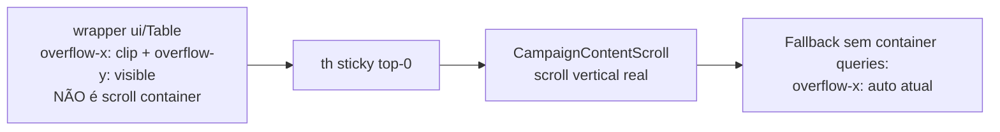

# Impl: D7 — Sticky dos headers da tabela desktop quebrado (headers não grudam ao rolar)

Status: aprovado
Atualizado em: 2026-08-10
Issue: #543
Intenção: docs/plans/sticky-tabela-desktop-quebrado.md
Appetite restante: herdado (P3, correção localizada — sem migration, sem dados, sem access)

## Leitura da intenção

- **Outcome:** em desktop, os headers das tabelas (`th`) grudam ao rolar a página — a feature
  declarada pelo B41 (hoje CSS morto) volta a funcionar em `/campanha/municipios` e
  `/campanha/territorios` (as listas com `headerClassName` sticky declarado).
- **O que NÃO negociar:** fora de escopo mudar o padrão de scroll da página
  (`CampaignContentScroll`); não reescrever o layout das listas para "inner scroll"; manter o
  scroll horizontal onde ele é necessário (as demais listas estouram e NÃO têm sticky declarado).
- **O que reavaliar:** a hipótese "A/B/C" da intenção. Medido no browser (prod build local +
  dev server do worktree), a opção viável em CSS puro é a variante de A que a intenção não
  considerou: `overflow-x: clip` combinado com `overflow-y: visible` **não cria scroll
  container** (regra da spec: `clip` pode coexistir com `visible`, diferente de `auto`/`hidden`),
  então o `th` sticky resolve contra o scrollport da shell e engaja — sem perder o scroll
  horizontal nas tabelas que cabem (medido: nenhuma das 2 listas estoura).

## Abordagem recomendada

**Opções consideradas:** A (clip puro) | A′ (clip + fallback container-queries) | B (inner
scroll) | C (remover classes mortas) | D (espelho/JS pinning)

**Recomendação: A′** — trocar `containerClassName` nas 2 listas que declaram sticky:
`overflow-x-auto supports-[container-type:inline-size]:overflow-x-hidden` →
`overflow-x-auto supports-[container-type:inline-size]:overflow-x-clip`. Browsers com container
queries (todos os modernos) ganham `overflow-x: clip` — a regra da spec permite `clip` ao lado
de `overflow-y: visible` (que permanece `visible` sem classe explícita, pois `clip` não promove
`visible→auto`, diferente de `auto`/`hidden`), e o container deixa de ser scroll container: o
`[&_th]:sticky [&_th]:top-0` já declarado engaja contra o `CampaignContentScroll` (validado
empiricamente nos 3 engines: top do th 174 → 69 ao rolar 500px — 69 = topo do content box do
scrollport, com o padding `p-6` da shell acima do header; o omnibox mobile do B184 cola no
mesmo ponto). Browsers sem container queries mantêm o `overflow-x-auto` atual (fallback
intocado — mesma política do `a36b0b26`).

**Rejeitadas:**

- **A (clip em todas as larguras, sem fallback):** browsers sem container queries perderiam o
  scroll horizontal que o fallback atual garante.
- **B (inner scroll — `max-h` + `overflow-y-auto` no wrapper):** muda a UX de scroll da página
  (a tabela vira data-grid com scroll próprio) — o rabbit hole que a intenção mandou parar e
  propor antes; não é o aceite ("gruda ao rolar a página").
- **C (remover as classes mortas):** honesto, mas não entrega o aceite de produto.
- **D (header espelho / JS pinning):** alto custo e frágil com o sistema atual de headers
  interativos (`MunicipalitySortableHead`, filtros, tooltips — islands client duplicadas
  significariam popovers/aria-sort duplicados); o próprio plano B161 deliberou contra.

### Componentes / mudanças

- **`MunicipalityList.tsx:737`** (`containerClassName`): `overflow-x-auto
supports-[container-type:inline-size]:overflow-x-hidden` →
  `overflow-x-auto supports-[container-type:inline-size]:overflow-x-clip`.
- **`TerritoryList.tsx:79`** (idem).
- **`headerClassName`**: nenhuma mudança — `[&_th]:sticky [&_th]:top-0 [&_th]:z-10
[&_th]:bg-background [&_th]:shadow-[inset_0_-1px_0_var(--border)] …` já está correto (o
  `z-10` do `[&_th]:` vence o `z-20` do th do nome por especificidade e cobre as células
  sticky-left `z-[5]`).
- **`CampaignTable` / `ui/Table` / shell**: zero mudanças — outras listas dependem do default
  `overflow-x-auto` (medido: estouram em 1440px — lideranças +588px, dobradinhas +244px,
  demandas +145px, apoiadores +57px — e NÃO declaram sticky; clip nelas cortaria colunas).
- **Migration / Access / Consent:** nenhum.
- **UI:** Impeccable A (fix de CSS localizado; sem shape/craft novos).

### Evidência medida (worktree `teqo_wt7`, dev server local, coordinator)

| Lista                                      | 1440px                   | 1280px                 | 1024px                | Sticky declarado |
| ------------------------------------------ | ------------------------ | ---------------------- | --------------------- | ---------------- |
| municipios                                 | sem overflow (1134=1134) | sem overflow (974=974) | tabela oculta (cards) | sim              |
| territorios                                | sem overflow             | sem overflow           | sem overflow          | sim              |
| liderancas/demandas/dobradinhas/apoiadores | **estouram**             | —                      | —                     | não              |

Protótipo aplicado via devtools (`overflow-x: clip` + `overflow-y: visible`): th engaja —
top 174 → 69 (topo do content box do scrollport, padding da shell acima) — validado em
Chromium 1208/1217, Firefox 1511 e WebKit 2272 (Playwright 1.58.2; o E2E do repo roda só
Chromium). O stick-left da coluna Município não muda (resolve contra o scrollport, que não rola
horizontalmente — já era assim). O scroll de verificação do protótipo foi 500px; o E2E usa um
alvo computado (`topBefore − pinnedTop + 200`) para não depender da altura da página.

## Fases verificáveis

1. **Mudança de CSS** — 2 linhas (`MunicipalityList` + `TerritoryList`) + JSDoc de
   `containerClassName` em `ui/Table` (documenta o padrão clip como o caminho sticky).
2. **Testes** — `tests/e2e/campaignTableStickyHeader.e2e.spec.ts` (Chromium, padrão do projeto
   `campaign`): guarda de `overflow-x: clip` computado + engajamento bilateral (o th fica entre
   o topo do scrollport e a borda do content box ao rolar, e volta ao fluxo ao zerar o scroll);
   `tests/unit/campaignComponents.unit.spec.ts` atualizado para pinar a string
   `supports-[container-type:inline-size]:overflow-x-clip`.
3. **Gates** — `pnpm gate:fast` na iteração; entrega com `pnpm push` (CI roda unit + int + e2e +
   lint + typecheck + knip + cycles + prettier + migration-lock).

## Rabbit holes / Não escopo (engenharia)

- Estender sticky às outras 4 listas: **fora de escopo** — elas estouram em 1440 e precisariam
  de colunas responsivas no padrão B158 (esconder) antes de trocar para clip. Gatilho registrado:
  se o produto pedir sticky nelas, é uma Issue própria com essa pré-condição.
- Adotar/mergear a branch `agent/B161-listas-scroll-infinito` (virtualização + sticky com
  `--campaign-list-controls-height`): escopo diferente (5 listas, scroll infinito); a D7 é o fix
  cirúrgico no main. O B161 reutiliza a mesma primitiva CSS (`overflow-x-clip`), sem conflito.
- `ui/Table` default: não muda (o JSDoc de `containerClassName` já documenta o caso sticky).
- Verificação WebKit/Firefox em CI: o E2E do repo roda só Chromium; a validação FF/WebKit foi
  feita manualmente nesta sessão (evidência no impl plan) — não cria infra nova.

## Riscos e mitigação

- **Browsers sem container queries** mantêm o comportamento atual (sticky inerte + scroll
  horizontal) — degradação aceita, mesmo padrão do `a36b0b26`.
- **Clip cortar conteúdo em algum tamanho não medido** (ex. viewport 1440 com Sollinha aberta
  encolhendo o conteúdo): mitiga-se re-medindo em execução; se alguma largura estourar, esconder
  colunas por container query no padrão B158 (nunca reintroduzir scroller — decisão do B161).
- **Sticky visual sobre linhas hover** (`hover:bg-muted/50`): o th tem `bg-background` sólido +
  `z-10` — cobertura já declarada no `headerClassName`.

## Aceite de engenharia

- [x] Aceite de produto da intenção ainda coberto (sticky engaja nas 2 listas; scroll da página
      preservado; nada de inner scroll)
- [x] Invariantes AGENTS/engineering-standards (sem migration, sem access, sem Consent; código
      pt-BR nas strings já existentes)
- [x] Testes previstos: E2E de engajamento do sticky (novo spec, Chromium); suíte existente de
      colunas responsivas (`campaignMunicipalityResponsiveColumns`) continua cobrindo
      `expectNoHorizontalOverflow`
