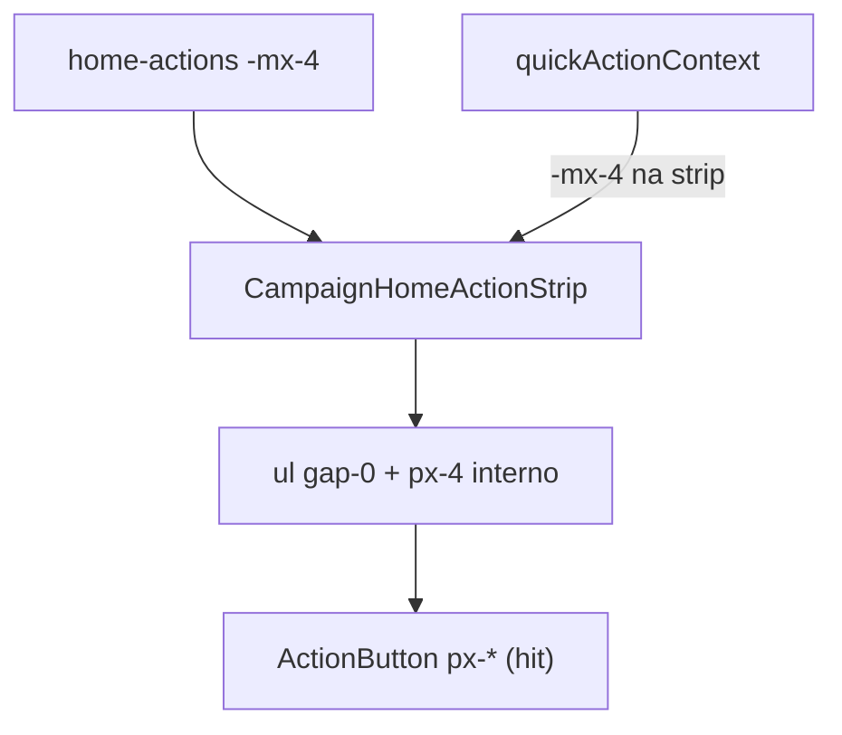

# Strip de ações — bleed sem faixa branca + hit area via padding

Status: registrado
Atualizado em: 2026-08-01
Issue: #128
Priority: P1
Model: composer-2.5
Impeccable: B — `CampaignHomeActionStrip` / `CampaignHomeActionButton` (Início + drawer)
Appetite: ~0,5d eng; CSS + pin de classes; sem migration
Responsável: —

## Design (Impeccable)

Âncoras: `PRODUCT.md` / `DESIGN.md` · B44/B67/B99 strip · tema `campaign`.

Na implementação (`work-issue`): craft compacto → critique → polish (iPhone estreito; Início **e** drawer).

Brief:

- **Persona / contexto:** assessor/CG no mobile; polegar na strip.
- **Job principal:** strip visualmente edge-to-edge (sem “trilho” branco lateral), primeiro botão **não** colado na borda, espaçamento entre ações apertado com área clicável generosa.
- **Estratégia de cor:** Restrained.
- **Edit where you see:** não — launchers.
- **Anti-goals:** encolher hit &lt;44 px; quebrar pan B67; `p-0` global na página; segundo componente de strip.

### Wireframe (texto)

```text
┌─ viewport ─────────────────────────────────────┐
│████ strip full-bleed (bg até a borda) ████████│
│  ┌ px interno ┐  ○  ○  ○  ○  →→               │
│  │            │  labels                       │
│  └────────────┘  (gap ul = 0; espaço = padding │
│                   horizontal do botão)         │
└────────────────────────────────────────────────┘
  Mesmo contrato no Início e no drawer (B105).
```

## Dados → decisão → apresentação

Dados: N/A — chrome de launcher.

## Contexto

**B99 ✓** (#107) entregou `-mx-4` no slot `home-actions` + `gap-2` no `<ul>`. Feedback 2026-08-01: ainda há faixa branca lateral (pai `p-4` / `px-4` do drawer); primeiro botão cortado ou mal nascido; gap ainda folgado. Pedido explícito: **tirar o gap**; se o botão tiver margin, virar **padding** — a faixa transparente continua clicável (hit area maior). O fix é **geral** (Início + `CampaignQuickActionsDrawer`).

## Objetivos

- Strip full-bleed no mobile: sem gutter branco entre borda da tela e o scroller; **padding-inline interno** no scroller/`ul` para o primeiro/último botão não colar na curved edge.
- `gap-2` → **`gap-0`**; espaçamento horizontal só via `padding-inline` (ou `px-*`) no `CampaignHomeActionButton` / `li` — hit target cresce sem afastar os círculos visualmente demais.
- Manter: pan touch + drag fine (B67), scrollbar oculta, `line-clamp-2`, largura do círculo B58.
- Drawer: remover/`compensar` o `px-4` do `#quickActionContext` **só em torno da strip** (busca pode manter gutter) — ou bleed da strip com `-mx-4` + `px-4` interno, espelhando o Início.
- Guardrails: sem migration / Consent / action; pin unit das classes se já houver spec de layout.
- Tracer: screenshot/e2e leve Início + drawer — strip cola na borda; primeiro botão tem inset &gt;0.

## Decisões travadas

- **Item novo (B101), não reabrir B99.** Continuação do aperto + hit area. **Rejeitado:** editar só o as-built B99 sem Issue.
- **Espaço entre ações = padding do controle, não `gap`/`margin` no `ul`.** Fonte: produto 2026-08-01. **Rejeitado:** só baixar `gap-2`→`gap-1` (não resolve hit area transparente); margin no `li` (mata a área morta clicável).
- **Bleed da strip, não `p-0` no scroll da página / drawer inteiro.** Busca e conteúdo mantêm gutter. **Rejeitado:** zerar padding do `#quickActionContext` inteiro.
- **i18n:** ids `CampaignHomeActionStrip` / `actionControlClassName`; copy intacta.

## Questões em aberto

- **Quanto de `padding-inline` no botão?** **Opções:** A) `px-1.5` (~6 px) | B) `px-2` (8 px) | C) só `pl/pr` no primeiro/último via pseudo. **Recomendação:** **B** no craft; critique se os círculos parecerem colados. _(assumido)_

## Abordagem proposta



Componentes:

- **`CampaignHomeActionStrip.tsx`**: `gap-2` → `gap-0`; padding horizontal no scroller ou `ul` (compensar bleed).
- **`CampaignHomeActionButton.tsx`**: acrescentar `px-*` em `actionControlClassName` (não margin).
- **`CampaignHomeLayout` / drawer**: garantir bleed + inset interno nos dois call sites; drawer deixa de “prender” a strip com `px-4` sem bleed.
- **Unit:** atualizar pin de classes se existir; caso contrário assert mínimo no strip spec.
- **Migration:** Sem migration.

## Dependências

- Soft: B99 ✓, B67 ✓. Soft com **B105** (altura do dock / 2ª linha do label — geometria do drawer, não spacing).
- Nenhuma dura.

## Não escopo

- Ritual scroll/handle/placeholder do drawer → **B105**.
- Copy “Pular” → **B104**.
- Crash da busca → **B102**.
- Remover título “Sugestões” → **B103**.

## Rabbit holes

- **Reescrever strip com CSS scroll-padding / snap complexos.** Mitigação: só gap/padding/bleed.
- **Componente `DrawerActionStrip` paralelo.** Mitigação: um strip, dois call sites.

## Adiado com gatilho

- Fade edges nas pontas do pan. Revisitar se critique mostrar que o bleed “corta” o último círculo sem affordance de overflow.

## Referências

- GitHub Issue #128 (B101) · #107 (B99 ✓) · `CampaignHomeActionStrip.tsx` · `CampaignHomeActionButton.tsx` · `CampaignHomeLayout.tsx` · `CampaignQuickActionsDrawer.tsx`
- `PRODUCT.md` / `DESIGN.md` — thumb zone / Clarity under pressure
