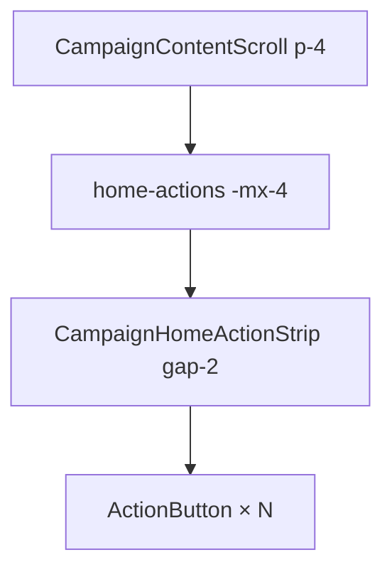

# Strip de ações do Início — edge-to-edge no mobile + gap menor

Status: rascunho
Atualizado em: 2026-08-01
Issue: —
Priority: P1
Model: composer-2.5
Impeccable: B — layout `CampaignHomeActionStrip` / dock do Início
Appetite: ~0,25–0,5d eng; CSS; sem migration
Responsável: —

## Design (Impeccable)

Âncoras: `PRODUCT.md` / `DESIGN.md` · B44/B46/B67/B72/B74 strip · tema `campaign`.

Na implementação: craft compacto → critique → polish (iPhone estreito + pan).

Brief:

- **Persona:** assessor/CG no Início mobile; polegar na thumb zone.
- **Job principal:** ações **nascem na borda** da tela (sem “trilho” de padding); mais botões visíveis com gap menor.
- **Anti-goals:** encolher hit target &lt;44 px; quebrar pan B67; mexer no desktop sem necessidade.

### Wireframe (texto)

```text
┌─ viewport mobile ──────────────────────────────┐
│[ações… →→→                                 ]  │  ← strip cola nas bordas L/R
│ ▲ sem padding lateral do content scroll        │
│ gap entre botões apertado (gap-2)              │
│                                                │
│  ┌─ busca (continua com padding da página) ─┐  │
└────────────────────────────────────────────────┘
```

## Dados → decisão → apresentação

Dados: N/A — chrome de launcher.

## Contexto

O conteúdo de `/campanha` rola dentro de `CampaignContentScroll` com **`p-4 md:p-6`**. A strip (`CampaignHomeActionStrip`) herda esse padding — no mobile sobra faixa vazia entre a borda do aparelho e a primeira/última ação. O gap horizontal já foi `gap-6` → `gap-4` (B72) → `gap-3` (B74); produto (2026-08-01) ainda acha **grande** e pede **sem padding lateral** na strip.

## Objetivos

- No mobile, a strip de ações é **edge-to-edge** horizontal (conteúdo da lista pode ter `padding-inline` só o necessário para o **primeiro** snap não colar sob a safe-area / ou bleed com `-mx-4` + `px-0` no scroller, com peek das ações na borda).
- Reduzir gap entre botões: `gap-3` → **`gap-2`** (8 px); critique para em `gap-1.5` se ainda folgado.
- Manter: pan touch + drag fine (B67), scrollbar oculta, largura do botão / círculo (B58), ordem thumb-zone (B46).
- `md+`: pode manter padding da página (edge-to-edge é pedido mobile).

## Decisões travadas

- **Bleed só da strip / dock de ações, não remover `p-4` de toda a página.** Busca e resumo continuam com gutter. **Rejeitado:** `p-0` global no Início (esmaga busca/resumo).
- **Técnica: negative margin no slot `home-actions` (`-mx-4` compensando o padding do scroll) + scroller full-bleed; opcional `pl-4` só se o primeiro ícone precisar de safe inset — preferir ações na borda como pedido.** **Rejeitado:** duplicar layout fora do `CampaignContentScroll`.
- **Item novo (B99), não reabrir B74.** Continuação do aperto. **Rejeitado:** editar só o as-built antigo.
- **i18n:** classes; ids `home-actions` intactos.

## Questões em aberto

- **Primeira ação sob a curved edge / safe-area?** **Opções:** A colar na borda (`px-0`) | B `padding-inline: max(0px, env(safe-area-inset-left))` mínimo. **Recomendação:** **A** no craft (pedido explícito “sem padding”); B se device com notch lateral reclamar. _(assumido)_

## Abordagem proposta



Componentes:

- **`CampaignHomeLayout.tsx`** (slot `home-actions`) e/ou **`CampaignHomeActions`**: classes de bleed mobile (`-mx-4 w-[calc(100%+2rem)]` ou equivalente testado).
- **`CampaignHomeActionStrip.tsx`**: `gap-3` → `gap-2`.
- **Unit:** pin de classes se o spec de layout já existe (`campaignHomeLayout`).
- **Migration:** Sem migration.

## Dependências

- Soft: B74 ✓ / B67 ✓ / B46 ✓. Nenhuma dura.

## Não escopo

- Catálogo de ações / labels.
- Wizard chrome / busca do wizard.
- Remover padding vertical da thumb zone.

## Rabbit holes

- **Encolher `w-[4.75rem]` “para caber 6 sem pan”.** **Mitigação:** só gap + bleed; novo pedido se ainda faltar.
- **Sticky overlay full-bleed fora do scroll.** **Mitigação:** fica no fluxo B46.

## Adiado com gatilho

- **Edge-to-edge também no `md` com sidebar.** Revisitar se tablet reclamar de gutter.

## Referências

- `src/components/campaign/dashboard/CampaignHomeActionStrip.tsx`
- `src/components/campaign/dashboard/CampaignHomeLayout.tsx`
- `src/components/campaign/shell/CampaignQuickActionsHost.tsx` (`CampaignContentScroll` padding)
- [espacamento-strip-acoes-inicio-v2.md](espacamento-strip-acoes-inicio-v2.md) (B74) · [posicao-botoes-acao-inicio-thumb-zone.md](posicao-botoes-acao-inicio-thumb-zone.md) (B46)
- `PRODUCT.md` / `DESIGN.md`

Qualidade de decisão: 5/5
