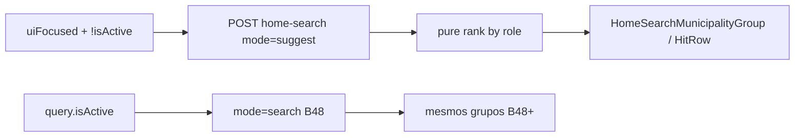

# Sugestões na busca aberta (empty state por papel)

Status: entregue (2026-07-29)
Atualizado em: 2026-07-29 — as-built: `POST /campanha/home-search` com body discriminado `mode: 'search' | 'suggest'`; `loadHomeSearchSuggestions` + `rankHomeSearchSuggestMunicipalities` (assessor = carteira fria; CG/candidato = `priority === 'alta'` por déficit central + frescor); `homeSearchUiFocused` + fetch suggest quando `uiFocused && !query.isActive`; seção **Sugestões** reutilizando `HomeSearchHitRow` / grupo B48; `resultKind` na resposta; sem migration. **Overlap B66:** predicado `uiFocused` e chrome oculto no focus — animação de retração continua no plano B66.
Item do roadmap: [docs/roadmap.md](../roadmap.md) (Trilha B, item **B68** — UX-1 busca Início)
Impeccable: B — região de resultados do Início (`HomeSearchResultsShell` / grupos B48) quando focus + query inativa
Appetite: ~1–1,25 dia eng; loader de sugestões por role + UI reusando linhas B48; v1 só Municípios (lógica simples); sem migration
Responsável: —

## Design (Impeccable)

Âncoras: `PRODUCT.md` (Clarity under pressure; ação→local) / `DESIGN.md` · chrome B47/B66 · hits B48 · tema `data-theme='campaign'`.

Na implementação (`implement-roadmap-item`): craft compacto → critique → polish.

Brief compacto:

- **Persona / contexto:** assessor ou CG foca a busca no Início ainda sem digitar — a tela limpa (**B66**) não deve ser um deserto; deve “adivinhar” o próximo destino útil.
- **Job principal:** ao abrir a busca, já ver atalhos ranqueados por papel (carteira / esquecidos) e seguir com um toque — digitar continua refinando via B48+.
- **Estratégia de cor:** Restrained — mesmos hits da busca; título de seção discreto (“Sugestões” / “Seus municípios”), sem card.
- **Edit where you see:** não — descoberta/navegação.
- **Anti-goals:** command palette ⌘K; feed de motor E11 no Início; dashboard de KPIs no empty; fetch de word-start com 0 chars (isso **B66** rejeitou — aqui é **curadoria**, não search).

## Dados → decisão → apresentação

- **Vou apresentar dados?** Sim — lista curta de municípios (e, depois, outras entidades) como atalhos; readout A11 opcional se a linha B48 já o trouxer sem custo.
- **Decisões desbloqueadas:**
  - Assessor: “abrir um município da minha carteira agora” sem digitar o nome.
  - CG/candidato: “abrir um prioritário frio / com déficit” sem montar filtro na lista.
- **Forma escolhida:** lista ranqueada (mesmo degrau dos hits B48) — **por quê** decide “qual abrir”. **Rejeitado:** mapa no empty; `CampaignMetricStrip` de vaidade; chart.
- **Profile:** até ~8 itens (paridade `DASHBOARD_PRIORITY_SAMPLE_LIMIT`); scoped ao access; absoluto local (nome + opcional “2022”), sem % estadual.
- **Anti-goals de dado:** sem inventar métrica nova; reusar E9 frescor / B20 prioridade / escopo do assessor.

## Contexto

**B47 ✓** + **B48 ✓** entregam input e hits por query (≥2 chars). **B66** (rascunho) limpa o chrome **no focus**, deixando a região de resultados **vazia** até digitar — espaço morto no gesto mais comum.

**Pedido de produto (2026-07-29):** empty state da busca aberta com o que “provavelmente importa” por role — assessor: municípios que administra, pedidos que registrou, atividades em que participa, lideranças dos seus municípios; CG: prioritários há muito sem atualização, etc. Começar **simples**; sofisticar depois. O vazio deve tentar achar o que o usuário procura.

Distinção com B66: B66 rejeitou “focus ⇒ fetch de **search** com 0 chars”. Este item é um **modo sugestão** (payload curado por papel), não word-start vazio.

## Objetivos

- Quando `uiFocused` (B66) **ou**, se B66 ainda não landar, equivalente “busca aberta” **e** `!query.isActive`: mostrar **sugestões**, não o empty mudo nem “Nenhum resultado.”.
- **v1 (appetite):** só grupo **Municípios**, reusando `HomeSearchHitRow` / shape de [`HomeSearchMunicipalityGroup`](../../src/components/campaign/dashboard/HomeSearchMunicipalityGroup.tsx).
  - **`advisor`:** municípios do escopo (`loadMunicipalityScope`), ordem estável útil — preferir frescor frio (`lastSignalAt` / E9) depois nome; cap ~8.
  - **`coordinator` / `candidate`:** prioritários `priority === 'alta'` ordenados por frio (dias sem sinal) e/ou déficit `central` — reusar espírito de [`pickDashboardPriorityMunicipalities`](../../src/utilities/dashboardPriorityMunicipalities.ts) + frescor; **não** inventar segunda meta.
- Access: `overrideAccess: false`; assessor nunca vê fora da carteira.
- Digitar (≥ limiar B47) **substitui** sugestões pelos hits B48+ (mesmo shell; não misturar os dois modos na mesma lista).
- Blur com query vazia (B66) desmonta sugestões com o chrome.
- Soft: se **B49–B53** já existirem na árvore, **não** obrigar a plugar neste slice — ver Adiado.
- Sem migration / Consent / mudança do contrato de **search** por query (extensão tipada: `mode: 'suggest' | 'search'` ou rota irmã — ver decisões).

## Decisões travadas

- **Sugestão ≠ search com q="".** Endpoint/modo dedicado de curadoria; predicados por `role`. **Rejeitado:** chamar `searchHomeMunicipalities('')` (ruído + contradiz B66); client-only catálogo sem access.
- **v1 = só Municípios.** Demais entidades (demandas, atividades, lideranças) ficam no Adiado com gatilho dos grupos B49–B53. **Rejeitado:** montar 4 loaders neste appetite.
- **CG = prioritários frios / déficit; assessor = carteira (fria primeiro).** Lógica **simples** e pinável em unit; “mais inteligente” = Adiado. **Rejeitado:** motor E11 no empty do Início (triagem já tem superfície no Quadro/detalhe).
- **Mesmo visual de hit B48** (sem card; flag de prioridade se alta). **Rejeitado:** cards “recomendados”; hero de KPI acima da lista.
- **i18n:** `homeSearchSuggest`, `loadHomeSearchSuggestions`; título pt-BR curto (“Sugestões” ou “Para você” — craft; preferir “Sugestões”).

## Questões em aberto

- **Transporte: estender `POST /campanha/home-search` com `mode` vs rota `/campanha/home-search/suggest`?** **Opções:** A mesmo path + discriminated body | B path irmão. **Recomendação:** **A** — um wrapper `campaignJsonMutationRoute`, um cliente `postCampaignJson`, schema zod discriminado; `safeMessages` únicos. _(assumido)_
- **Título da seção?** **Opções:** A “Sugestões” | B “Seus municípios” (assessor) / “Prioritários” (CG) dinâmico. **Recomendação:** **A** estável + subtítulo opcional depois. _(assumido — craft)_
- **Incluir Visitados recentes (`recentVisits`) no topo?** **Opções:** A sim (client merge) | B não na v1. **Recomendação:** **B** — PII/localStorage já tem card no Quadro; misturar client+server no empty complica hidratação. Gatilho: se sessão pedir “o que eu abri ontem”. _(assumido)_

## Abordagem proposta

Componentes:

- **`src/lib/homeSearchSuggest.ts`** (puro, client-safe se só rankear view models): política por `CampaignRole` + inputs numéricos/datas já no scope — unit-pinned.
- **`src/utilities/.../homeSearchSuggestData.ts`** (`server-only`): monta payload com `loadMunicipalityScope` + agregados já usados em B20/E9 (`lastSignalAt` / coverage); `overrideAccess: false`.
- **Rota** `home-search`: estender body schema (`mode` + `q` opcional no suggest); handler ramifica suggest vs search.
- **Client:** `HomeSearchResultsContext` (ou irmão fino) busca suggest quando focado e inativo; cancela ao digitar; `HomeSearchResultsShell` renderiza sugestões **ou** hits **ou** “Nenhum resultado.” (só no modo search vazio).
- **Reuse:** `HomeSearchHitRow`, `MunicipalityPriorityIndicator`, readout A11 se já no shape.
- **Migration:** Sem migration, sem collection, sem Consent.

## Dependências

- Dura: **B47 ✓**, **B48 ✓** (shell + linhas + rota).
- Soft: **B66** (focus abre o vazio a preencher — se B66 atrasar, dá para gatilhar suggest no focus do input mesmo com strip visível; visual pior).
- Soft: E9 ✓ / B20 ✓ (frescor + prioridade).
- Soft: **B49–B53** (grupos extras — Adiado).

## Não escopo

- Layout grid/cap → **B54**.
- Ações WA/share na linha → **B55**.
- Resumo numérico do Início → **B56**.
- Motor de sugestões E11 / `allocationDecision` no empty.
- Leader omnibox (continua lockdown).

## Rabbit holes

- **Personalização ML / “o que você costuma buscar”.** **Mitigação:** regras explícitas por role; Adiado sem evidência.
- **Duplicar `pickDashboardPriorityMunicipalities` com sort diferente.** **Mitigação:** extrair comparator compartilhado ou passar `sort` — depth check antes de 3ª cópia.
- **Prefetch suggest no mount do Início (antes do focus).** **Mitigação:** fetch só ao entrar em `uiFocused` (custo + não competir com mapa do Quadro).

## Adiado com gatilho

- **Grupos Lideranças / Demandas / Atividades / Assessores no empty.** Revisitar quando **B49–B53** landarem **e** o empty de municípios já estiver em uso (evidência de “falta X”).
- **Visitados recentes no topo do suggest.** Revisitar se sessão observada pedir continuidade de sessão no Início (não só no Quadro).
- **Ranking “mais inteligente”** (déficit × classe E10 × nível E14). Revisitar após 2 semanas de uso real do v1 simples.
- **Soft deadline UX-1 03/08:** se folga apertar, este item é cortável depois de B66 (busca ainda funciona digitando).

## Referências

- `docs/roadmap.md` (UX-1 B47–B55 / B66)
- [`HomeSearchResultsShell.tsx`](../../src/components/campaign/dashboard/HomeSearchResultsShell.tsx)
- [`HomeSearchResultsContext.tsx`](../../src/components/campaign/dashboard/HomeSearchResultsContext.tsx)
- [`HomeSearchMunicipalityGroup.tsx`](../../src/components/campaign/dashboard/HomeSearchMunicipalityGroup.tsx)
- [`dashboardPriorityMunicipalities.ts`](../../src/utilities/dashboardPriorityMunicipalities.ts)
- [modo-focado-busca-no-focus.md](modo-focado-busca-no-focus.md) (B66 — focus ≠ search fetch)
- [busca-global-resultados-municipios.md](busca-global-resultados-municipios.md) (B48)
- `PRODUCT.md` / `DESIGN.md` — register product; Clarity under pressure
