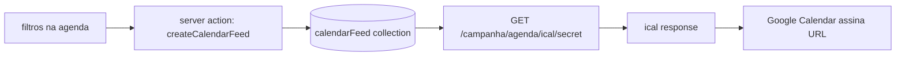

# Impl: Sync por filtro + link de import (Google Calendar)

Status: aprovado
Atualizado em: 2026-08-08
Issue: #392
Intenção: docs/plans/sync-teqo-google-calendar.md
Appetite restante: ~1,5–2 dias eng (herdado)

## Leitura da intenção

- **Outcome:** Com um filtro ativo na agenda, o usuário obtém um link de import e o Google Calendar passa a refletir esse recorte. Teqo permanece SoT.
- **O que NÃO negociar:** Leader lockdown (sem acesso); fail-closed no access do feed (não vaza municípios fora do escopo do criador); link com credencial revogável; sem sync bidirecional; sem PII desnecessária no feed.
- **O que reavaliar:** A hipótese de "token/HMAC" da intenção — para revogação real, collection é mais simples que stateless+blocklist.

## Abordagem recomendada

**Opções consideradas:**

- **A) Token HMAC stateless** (como supporterImportToken): codifica filtro+actorID no token. Problema: sem revogação real sem blocklist (= collection disfarçada).
- **B) Collection `calendarFeed`** com secret slug: feed URL usa o slug como credencial. Revogação = delete/soft-revoke do documento. Listing natural ("meus feeds").
- **C) Híbrido HMAC + collection:** over-engineered para o escopo.

**Recomendação: B** — collection `calendarFeed`. Revogação nativa, listing, access scoping no create e no read. O secret slug é a credencial (como um invite token, mas para leitura de feed).

**Rejeitadas:** A porque revogação exige estado de qualquer forma; C porque adiciona complexidade sem ganho.

### Decisões de engenharia

#### 1. Collection `calendarFeed` vs stateless

**Opções:** A) stateless HMAC | B) collection Payload
**Recomendação: B** — porque revogação é requisito de produto ("credencial revogável"), e uma collection dá listing, auditoria (`createdBy`), e access scoping nativo via Payload hooks.
**Rejeitadas: A** porque sem revogação real; blocklist seria uma collection disfarçada.

#### 2. Formato iCal: hand-roll vs library

**Opções:** A) `ical-generator` (npm) | B) hand-roll RFC 5545
**Recomendação: B** — o formato VCALENDAR/VEVENT é texto simples; os campos da Activity mapeiam diretamente (title→SUMMARY, startAt→DTSTART, etc.). Zero dependências novas, zero risk de supply-chain. Escaping de texto iCal é trivial (newline→`\n`, comma→`\,`, semicolon→`\;`).
**Rejeitadas: A** porque adiciona dependência para ~80 linhas de código.

#### 3. Feed endpoint: dentro ou fora de `(app)`

**Opções:** A) dentro de `(app)` (exige cookie campaign-token) | B) fora de `(app)`, sem auth cookie
**Recomendação: B** — Google Calendar não envia cookies. O secret slug É a credencial. O endpoint fica em `src/app/(campaign)/campanha/agenda/ical/[secret]/route.ts` (fora do `(app)` group, assim como os routes WebAuthn).
**Rejeitadas: A** porque Google Calendar "From URL" é um GET anônimo.

#### 4. Access scoping no feed read

**Opções:** A) snapshot no create (feed congela o escopo) | B) re-avaliar escopo do criador a cada read
**Recomendação: B** — se o advisor perde acesso a um município, o feed para de incluir atividades daquele município. Fail-closed: se o criador for desativado/deletado, o feed para de servir.
**Rejeitadas: A** porque violaria o invariante "não vaza municípios fora do ator".

#### 5. Atividades canceladas no feed

**Opções:** A) excluídas | B) incluídas com STATUS:CANCELLED
**Recomendação: A** — alinhado com a recomendação da intenção ("some do calendário importado").
**Rejeitadas: B** porque polui o calendário do consumidor sem valor.

#### 6. Janela temporal do feed

**Opções:** A) todas as atividades (passado + futuro) | B) janela deslizante (ex: 6 meses passado + 12 meses futuro)
**Recomendação: B** — janela de 90 dias passados + 365 dias futuros. Feed muito grande degrada a sync do Google Calendar. A janela é generosa para o uso real.
**Rejeitadas: A** porque histórico completo cresce indefinidamente.

### Componentes / mudanças

- **`calendarFeed` collection** (`src/collections/CalendarFeed.ts`): secretSlug (unique, indexed, auto-generated), label, filterMunicipality (optional rel→municipality), filterDeputyPresent (checkbox), filterTag (optional text), createdBy (rel→campaignUser), revokedAt (optional date). Admin group `Campanha`. Access: staff create/read own; coordinator/candidate read all; leader none.
- **Migration:** `add_calendar_feed` — cria a tabela `calendar_feeds`.
- **`src/utilities/calendarFeed.ts`**: `buildCalendarFeedWhere(state, rangeStart, rangeEnd)` (reusa `buildActivityAgendaWhere` com janela fixa), `generateICalFeed(events, feedLabel)` (hand-roll RFC 5545), `resolveFeedSecret(secret)` (lookup + access check).
- **`src/app/(campaign)/campanha/actions/calendarFeed.ts`**: server action `createCalendarFeedLink(state)` — valida filtro, gera secretSlug (randomUUID), salva no DB, retorna URL completa.
- **`src/app/(campaign)/campanha/agenda/ical/[secret]/route.ts`**: GET route (fora `(app)`). Lookup feed → access check do criador → query activities → generate iCal → response `text/calendar; charset=utf-8`.
- **UI: `CalendarFeedButton`** (`src/components/campaign/activity/CalendarFeedButton.tsx`): botão na barra de filtros da agenda. Habilitado quando há filtros ativos. Ao clicar: chama server action → dialog com URL + copy-to-clipboard + instruções Google Calendar.
- **UI: `CalendarFeedList`** (`src/components/campaign/activity/CalendarFeedList.tsx`): seção na página da agenda (ou modal) listando feeds ativos do usuário com opção de revogar.

### Access / Consent

- **Sem Consent** — feed não captura PII novo; é leitura de dados existentes com access já controlado.
- **Access no create:** `isCampaignStaff` (coordinator, advisor, candidate). Advisor só pode criar feed com filtros dentro do próprio escopo de municípios.
- **Access no read (feed endpoint):** re-carrega o criador, re-avalia escopo de municípios, aplica restrição ao where. Se criador inativo/deletado → 404.
- **Leader lockdown:** sem acesso a create/read/list.

## Fases verificáveis

1. **Schema + server** (~50% do appetite)
   - Collection `calendarFeed` + migration
   - Utility `generateICalFeed` + `resolveFeedSecret`
   - GET route `/campanha/agenda/ical/[secret]`
   - Server action `createCalendarFeedLink`
   - Unit tests: iCal generation, access scoping, feed resolution
   - Gate: `pnpm gate:fast`

2. **UI** (~30% do appetite)
   - `CalendarFeedButton` na barra de filtros da agenda
   - Dialog com URL + copy + instruções
   - `CalendarFeedList` (meus feeds + revogar)
   - Server action `revokeCalendarFeed`

3. **Gates** (~20% do appetite)
   - `pnpm gate:fast` (tsc + lint + format + test)
   - `pnpm build` (com DB local)
   - `pnpm test` (unit + int)

## Rabbit holes / Não escopo (engenharia)

- **Webhook/push para Google:** fora. O Google puxa (poll) o feed periodicamente.
- **OAuth push:** fora. Link de import cobre o job.
- **Feed público sem segredo:** fora. Fail-closed.
- **Múltiplos formatos (CalDAV, etc.):** fora. Só iCal (RFC 5545).
- **Rate limiting no feed endpoint:** fora de v1. O slug é imprevisível (UUID) e o endpoint é read-only.
- **Cache HTTP no feed:** fora de v1. Google Calendar respeita `Cache-Control` mas a sync já é periódica (~12-24h). Podemos adicionar `max-age` depois.

## Riscos e mitigação

- **Secret slug vazado = leitura do recorte.** Mitigação: UUID (imprevisível), revogação disponível, access re-avaliado a cada read.
- **Feed endpoint sem auth cookie = surface nova.** Mitigação: slug é a credencial; fail-closed se slug inválido/revogado/criador inativo; sem PII sensível no output (só título + município + datas).
- **iCal mal-formado rejeitado pelo Google.** Mitigação: seguir RFC 5545 estritamente; testar com validador iCal; unit tests cobrindo escaping e edge cases.

## Aceite de engenharia

- [ ] Aceite de produto da intenção ainda coberto
- [ ] Invariantes AGENTS/engineering-standards
- [ ] Testes de domínio previstos (unit/int) onde access/write paths mudam
- [ ] Leader lockdown preservado
- [ ] Feed fail-closed (slug inválido → 404; criador inativo → 404)
