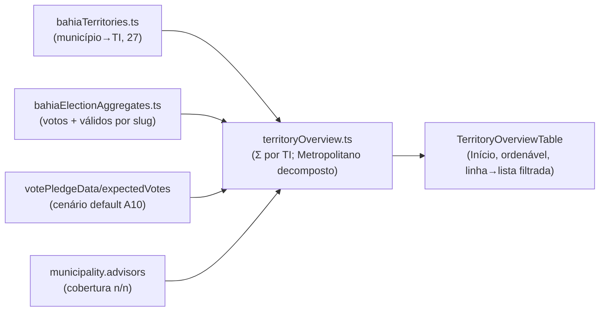

# E17 — Tabela comparativa dos Territórios de Identidade no Início

Status: entregue em código (2026-07-24)
Atualizado em: 2026-07-24
Item do roadmap: [docs/roadmap.md](../roadmap.md) (Demais itens abertos, E17; primeira fatia da camada TI — E12 estende)
Impeccable: B — painel novo no dashboard staff existente (`/campanha`), sem rota nova
Appetite: ~1 dia eng; sem migration, sem collection
Responsável: —

### Revisão 2026-07-24 (auditoria → implementação)

- **A11 ausente confirmado:** `municipalityVoteRank.ts` não existe no repo → `% da própria votação` calculado localmente em `computeTerritoryRollup` (Σ TI ÷ Σ estadual 2022). A11 unifica o helper de share quando entrar.
- **Access:** loader `loadTerritoryOverview` usa `overrideAccess: true` (a `canReadMunicipality` do advisor escopa por `advisors contains user.id`) — exposição é agregado TI-level (somas/contagens), nunca PII por município; advisor vê a tabela completa (leitura regional é contexto). Confirmado contra o plano.
- **Split client/server:** o rollup puro ficou em `territoryOverview.ts` (client-safe, sem `server-only`) para a tabela client importar `sortTerritoryRows`/tipos; o loader server-only foi para `loadTerritoryOverview.ts`.
- **Entrega:** `territoryOverview.unit.spec.ts` (10 testes), tsc/lint/knip/unit 266/int 345/build verde, Aikido 0 findings.

## Design (Impeccable)

Âncoras: `PRODUCT.md` (princípios 2 e 6) / `DESIGN.md` (register `product`; "Priority lift" para painéis de overview) · dashboard staff existente (`MunicipalityMapPanel`, `CampaignMetricStrip`).

Na implementação: craft compacto → critique → polish.

- **Persona / contexto:** o candidato e o CG lendo o estado por região — a língua regional que o campo já fala é o TI (PGP "nos territórios"; Lula venceu nos 27, Jerônimo em 22/27). Pedido explícito do deputado (2026-07-24).
- **Job principal:** comparar de relance os 27 TIs — onde está minha votação, onde há estimativa 2026, onde falta responsável — e clicar para a lista filtrada.
- **Estratégia de cor:** Restrained; tabela densa e sóbria (Field Desk), sem heatmap; badge âmbar discreta para "sem responsável".
- **Anti-goals:** média regional que decide alocação municipal (MAUP); heat/ranking gamificado; segundo mapa.

## Contexto

O relatório de discovery (§6.5) fixou o TI como **default operacional das decisões regionais** (carteiras de assessor, giros, dobradinha regional, diálogo com o estado) com regra de bolso "gente e logística regional → TI; voto e mediação → município", e listou as análises que só estabilizam nesse nível (balanço de portfólio, gap regional, leitura da majoritária). O produto ainda não tem **nenhuma** superfície regional. Este item entrega a primeira: tabela comparativa dos 27 TIs no Início, ao lado do mapa (que segue municipal). A camada TI completa — benchmark intra-TI (T4), mediana/amplitude/município crítico, padrões T no motor — é **E12**, que estende esta tabela; aqui entram apenas agregados que não mentem (somas e razões de agregados).

## Objetivos

- **Painel "Territórios de Identidade"** no dashboard staff (`/campanha`, junto ao mapa): uma linha por TI com colunas v1 — municípios (n) · votos 2022 (com série 2014/2018 em tooltip/disclosure) · **% da própria votação** (Σ votos do TI ÷ Σ estadual) · válidos 2022 (peso) · Σ estimativa 2026 (cenário default `central` via A10) · municípios com assessor (n/n, badge quando 0).
- **Ordenação default: % da própria votação desc** (a lente da mesa — CUSTOMER.md); cabeçalhos clicáveis para ordenar pelas demais colunas (client-side, 27 linhas).
- **Metropolitano sempre decomposto** (salvaguarda do relatório): a linha "Metropolitano de Salvador" abre em duas sub-linhas — Salvador (19 zonas agregadas) × demais municípios da RMS.
- **Linha → lista filtrada:** cada TI linka `/campanha/municipios?region=<TI>` (filtro `region` já existe em `MunicipalityFilters`).
- Access: painel staff (coordinator/advisor/candidate); advisor vê a tabela completa (leitura regional é contexto, não gestão); leader segue em lockdown.

## Decisões travadas

- **Só somas e razões de agregados; nenhuma média de razões.** Captura/LQ regional, mediana, amplitude e município crítico ficam para E12 (salvaguardas MAUP são requisito de aceite lá). A tabela v1 não induz decisão municipal — nota fixa no rodapé: "leitura regional; alocação decide-se por município". **Rejeitado:** coluna "captura média" (média que mente — anti-goal 9 do relatório).
- **Malha = `bahiaTerritories.ts` congelada no ciclo** (27 TIs; município→TI estático). **Rejeitado:** Regiões Imediatas (G10 — adiado com gatilho); malha administrável (limites mudam por PPA, não por CRUD).
- **Metropolitano decomposto na própria tabela** (sub-linhas), não em página à parte. É a exceção permanente do relatório (24,4% do eleitorado). **Rejeitado:** tratar Metropolitano como uma linha (esconde Salvador).
- **Σ estimativa via agregação A10 existente** (`aggregatePledgesByMunicipality`/`municipality.expectedVotes`, cenário default `central`) — mesma regra `estimated ?? declared` de `votePledgeData.ts`; sem seletor de cenário na v1 (o mapa já tem o dele).
- **i18n e naming:** `territoryOverview.ts`, `computeTerritoryRollup`, `TerritoryOverviewTable`; labels pt-BR ("Territórios de Identidade", "% da votação", "Com assessor").

## Questões em aberto

- **Posição no Início: acima ou abaixo do mapa?** **Recomendação:** abaixo do mapa em desktop (mapa segue o hero espacial; a tabela é a leitura comparativa), colapsável em mobile. Validar com o candidato na primeira demo.
- **Coluna de tendência (série 2014→2022 por TI)?** **Recomendação:** v1 tooltip/disclosure com a série; seta de tendência só se a mesa pedir (evitar poluir 27×7 células).

## Abordagem proposta

Componentes: `src/utilities/territoryOverview.ts` (novo, puro sobre o bundle do dashboard + artefato; unit tests com fixture dos 27 TIs), `src/components/campaign/TerritoryOverviewTable.tsx` (novo; tabela shadcn densa, sub-linhas do Metropolitano), encaixe em `campaignDashboardData.ts`/página do Início ao lado de `MunicipalityMapPanel`. Reusa `municipalityVoteRank.ts` (A11) para shares quando existir.

## Dependências

- Nenhuma dura: `bahiaTerritories.ts` (B2), `bahiaElectionAggregates.ts` (hardening), A10 ✓ (cenários), filtro `region` da lista. Suaves: **A11** (helper de share — se A11 ainda não tiver entrado, o rollup calcula o share localmente e A11 depois unifica); **E4R** (estimativas/prioridade reais deixam a coluna Σ estimativa viva); **E8** (quando existir, E12 adiciona cobertura de meta por TI — não nesta v1).
- **E12 estende** esta tabela (benchmark intra-TI, mediana/amplitude/município crítico, gap regional de captura, padrões T no motor) — mesma superfície, mais colunas/salvaguardas.

## Não escopo

- Captura/LQ/cobertura de meta por TI (E12, pós-E8); mapa por TI (o mapa segue municipal — polígonos dos TIs existem em B2 mas trocar a malha do mapa é decisão de E12/B13); padrões T1–T5 (E11 fase 2); seletor de cenário próprio.

## Rabbit holes

- **"Só mais uma coluna" até virar planilha regional.** 6–7 colunas é o teto da v1; qualquer métrica derivada nova (captura, gap, LQ) espera E12 com as salvaguardas.
- **Sub-linhas viram drill-down infinito** (TI → município → zona). A tabela para nas duas sub-linhas do Metropolitano; drill é a lista filtrada (link).
- **Rollup no client sobre o bundle inteiro.** 435 municípios × 27 TIs é trivial no server; computar em `territoryOverview.ts` no RSC e mandar as 27 linhas prontas.

## Adiado com gatilho

- **Cobertura de meta por TI (Σ metas × participação histórica).** Gatilho: E8 entregue (o sanity check por TI de E8 já nasce lá; a coluna na tabela vem com E12).
- **Leitura da majoritária por TI** (os 5 TIs onde o campo perdeu o governador). Gatilho: E12 (precisa de agregado do majoritário por TI — hoje só existe por município nas collections).

## Referências

- `docs/roadmap.md` (E17) · [camada-territorios-identidade.md](camada-territorios-identidade.md) (E12 — estende) · [inteligencia-campanha.md](inteligencia-campanha.md) (plano-mestre)
- `docs/research/relatorio-entrevista-persona-campanha.md` §6.5 (três camadas, salvaguardas MAUP, Metropolitano decomposto)
- `docs/research/literatura-campanha-deputado-federal-ba.md` §8.3 (TI, IBGE 2017, MAUP)
- `src/lib/bahiaTerritories.ts`, `src/lib/bahiaElectionAggregates.ts`, `src/utilities/votePledgeData.ts`, `src/utilities/campaignDashboardData.ts`, `src/components/campaign/MunicipalityMapPanel.tsx`, `src/components/campaign/MunicipalityFilters.tsx` (filtro `region`)
- `PRODUCT.md`/`DESIGN.md` — painel de overview (priority lift), anti-goals de dashboard SaaS
- AGENTS.md — access por papel, naming
