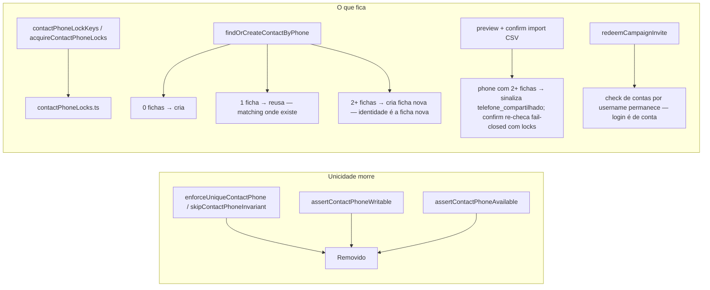

# Impl: Telefone não único — duas pessoas podem compartilhar o mesmo celular

Status: aprovado
Atualizado em: 2026-08-10
Issue: #625
Intenção: docs/plans/telefone-nao-unico.md
Appetite restante: herdado (~0,5–1 dia eng) — a mudança é de comportamento de escrita, sem schema e sem UI nova.

## Leitura da intenção

- **Outcome:** o telefone deixa de ser único em enforcement; qualquer fluxo de escrita de pessoa (liderança, apoiador, dobradinha, assessor/conta, pessoa) salva com número já usado por outra ficha; fluxos automáticos (import CSV, convite/login por telefone) nunca "chutam" qual pessoa — falham fechado com mensagem clara ou usam a chave não ambígua (a conta/username).
- **O que NÃO negociar:** os 5 fluxos salvam sem erro; import/convite não casam por chute em ambiguidade; busca por telefone continua achando todas as fichas; nenhum outro campo de `Contact` muda; mensagens de conflito ("Já existe outro contato com este celular.") somem dos fluxos de gestão; nada de reconciliação de fichas (anti-goal).
- **O que reavaliar:**
  - O inventário provou que a unicidade é **enforcement-only** (hook `enforceUniqueContactPhone` + `assertContactPhone*`; `contact_phone_idx` é índice comum, não UNIQUE — migration `20260718_010733_consolidate_campaign_schema.ts:407`). Consequência: **SEM MIGRATION**, sem schema.
  - A hipótese da intenção ("falha fechada onde o número é ambíguo") vale para o **import**; para a **criação de pessoa**, 2+ fichas com o mesmo phone deixa de ser estado excepcional (vira o normal do produto) → o find-or-create **cria ficha nova** em vez de lançar AMBIGUOUS — a identidade da pessoa em criação é a ficha recém-criada (não é chute; o staff digitou o nome).

## Abordagem recomendada

**Opções consideradas:** A (remover enforcement, find-or-create cria ficha nova em 2+) | B (remover enforcement, manter AMBIGUOUS no find-or-create) | C (manter unicidade e só "avisar" no cliente).
**Recomendação:** **A** — satisfaz o aceite literal ("salva sem erro em qualquer um dos 5 fluxos"): com phone compartilhado virando estado normal, o caso 2+ no find-or-create precisa salvar, e reusar uma das 2+ fichas seria o chute que a intenção proíbe; a ficha nova é a identidade da pessoa que o staff acabou de digitar. No import, o casamento por phone (1 ficha) permanece e a ambiguidade sinaliza (recomendação A da própria intenção).
**Rejeitadas:** B — 2+ fichas com o mesmo phone é o caso-núcleo do C111 (duas pessoas compartilhando); manter AMBIGUOUS bloquearia o cadastro da terceira pessoa e reproduziria o problema que a entrega resolve. C — mascarar o erro no cliente mantém a base inconsistente com o produto (o estado compartilhado é desejado) e não desbloqueia os fluxos server-side.

### Componentes / mudanças

- **`src/utilities/contactPhoneInvariant.ts` → `src/utilities/contactPhoneLocks.ts`** (rename, "edit the owner"): ficam `contactPhoneLockKeys` + `acquireContactPhoneLocks` (+ import de `POSTGRES_DEDUP_LOCK_MESSAGE`); saem `assertContactPhoneAvailable`, `assertContactPhoneWritable`, `CONTACT_PHONE_CONFLICT_MESSAGE` (sem usos restantes) e `CONTACT_PHONE_AMBIGUOUS_MESSAGE` (o find-or-create não lança mais; o import ganha mensagem própria). O lock `contact-phone:<phone>` passa a significar **serialização de leitura-escrita por phone** (find-or-create, import, tombstone, convite) — não mais unicidade. Rename é mecânico: ~5 imports de runtime + testes + allowlist `codebaseConventions.unit.spec.ts:434`.
- **`src/collections/Contact.ts`**: remove o hook `enforceUniqueContactPhone` do `beforeChange` (fica `enforceStateDeputyName`). `beforeValidate` de phone intocado.
- **`src/utilities/contactIdentity.ts`** (`findOrCreateContactByPhone`): 0 fichas → cria (mantém); 1 → reusa (mantém, dedupe C6/C99); **2+ → cria ficha nova** com o phone (a ficha nova é a identidade da pessoa em criação; o phone compartilhado é permitido). Remove o `context.skipContactPhoneInvariant` (o contrato morre junto do hook; o create via Local API roda sem hook de unicidade). Locks permanecem.
- **`src/app/(campaign)/campanha/actions/leadership.ts`** (`:266`, `:335`) e **`stateDeputy.ts`** (`:187`): removem `assertContactPhoneWritable` — o update de phone simplesmente passa pelo `payload.update` da ficha (sem hook de unicidade) e compartilha.
- **`src/utilities/campaignInviteRedemption.ts`** (`:132`, `:210`): removem `assertContactPhoneAvailable` (autofill e login) — a ficha do convite é conhecida (via `leadership.contact`); o número digitado pode coincidir com outra ficha. **Permanece** o check de contas por `username` (`:217-232`, `limit: 2` + INVALID se o username é de outra conta) — `campaignUser.username` é UNIQUE no banco (DB-level, intocado) e é a chave do login: quem não tem número exclusivo usa e-mail (recomendação A da intenção).
- **`src/collections/CampaignUser.ts`** (`ensureCampaignUserContactIdentity`): **sem mudança de código** — o sync conta→ficha agora passa porque o hook da ficha não rejeita mais; o phone compartilhado é o estado desejado.
- **Import CSV**:
  - **`src/app/(campaign)/campanha/actions/supporterImport.ts`** — preview (`:224-264`): o `Map<phone,id>` para de sobrescrever silenciosamente; quando um phone do CSV resolve **2+ fichas**, todas as linhas com esse phone viram status novo `telefone_compartilhado` (resolução manual). Confirm (`:331-346`): após `acquireContactPhoneLocks`, **re-checa** os phones ok contra a base e aborta com mensagem clara se algum ficou ambíguo (a base pode ter mudado desde o preview).
  - **`src/utilities/supporter/supporterImportBulk.ts`** (`:169-183`): o `SELECT … WHERE phone IN` passa a detectar phone com 2+ ids → **aborta** com a mesma mensagem (fail-closed defensivo; em produção o re-check do confirm já pega).
  - **`src/utilities/supporter/supporterImport.ts`** (types): status `telefone_compartilhado`; `isPreviewErrorRow` segue falso para ele (entra em `counts.duplicate`, "resolução manual" como o duplicado).
  - **`src/components/campaign/supporter/SupporterImportWizard.tsx`** (`:38-45`): rótulo novo `telefone_compartilhado: 'Telefone compartilhado (resolver)'`. Impeccable A — nenhuma superfície nova, só um status/label no wizard existente.
- **formActions safeMessages** (7 arquivos: `wizardLeadershipFormActions`, `assessores`, `liderancas`, `liderancas/nova`, `dobradinhas`, `apoiadores/novo`, `leaderSupporter.ts`): removem entradas órfãs de `CONTACT_PHONE_CONFLICT_MESSAGE`/`CONTACT_PHONE_AMBIGUOUS_MESSAGE` (nada mais lança essas mensagens). `apoiadores/novo` e `liderancas/nova` perdem o import inteiro da constante.
- **`src/utilities/people/personDelete.ts`** (`:149`) e **`supporter.ts`** (`:22,270`): **sem mudança** — tombstone `999<id>` continua único por id e os locks permanecem (serialização).
- **Migration:** nenhuma (unicidade enforcement-only, confirmado no inventário).
- **Access / Consent:** nenhuma mudança — nada de novo escrito por Local API com ator não verificado; os `overrideAccess` existentes mantêm suas justificativas (o hook de unicidade que os exigia some).

## Fases verificáveis

1. **Tracer — morre a unicidade:** rename do módulo + remoção do hook/asserts/mensagens + find-or-create 2+ → cria; atualizar os testes que pinam CONFLICT/AMBIGUOUS (`campaignContactIdentity`, `campaignLeadership`, `campaignMunicipalityStateDeputyCreate`, `postgresTransactionLocks`, `campaignInviteArchitecture`, `codebaseConventions`). Gates: `pnpm gate:fast`.
2. **Import + convite:** status `telefone_compartilhado` no preview (com re-check fail-closed no confirm e no bulk); remoção dos asserts do convite mantendo o check de contas; novas coberturas int: liderança com phone de outra ficha (create/update) salva; apoiador com phone compartilhado; import com phone ambíguo na base sinaliza e confirm aborta; invite autofill com phone de outra ficha passa.
3. **Gates:** `pnpm gate:fast` bare; `pnpm build` local; review de diff de testes/rename.

## Rabbit holes / Não escopo (engenharia)

- **Tornar `username` não-único para "duas contas no mesmo número logarem"** — login é de conta (recomendação A da intenção); a 2ª pessoa usa e-mail. `username` UNIQUE é DB-level e fica.
- **Adicionar coluna/índice novo em `Contact`** — nada necessário; `phone` já tem índice.
- **Reconciliar as fichas duplicadas** que a mudança passa a permitir — anti-goal explícito; fica pós-eleição.
- **Migrar o dedupe do seed-minimal / scripts** (`seed-minimal.mjs` upsert por phone) — scripts operam em DBs controlados; sem mudança.
- **Mudar `CONTACT_PHONE_AMBIGUOUS_MESSAGE` de lugar para o import** — a mensagem nova do import é específica (fala de linha/CSV); a constante antiga morre junto do módulo.
- **Achado de execução — drift C6 `supporter_import_batch.actor_id` NOT NULL + FK `ON DELETE set null`:** deletar o `campaignUser` dono de um batch não consumido (janela de 10 min, sem sweep) falha com 23502 e aborta a transação (25P02 em cascata). O teste novo de import com batch órfão expôs. Corrigido em escopo: `CampaignUser.beforeDelete` ganha `deleteCampaignUserImportBatches` (mesmo padrão de passkeys/notifications; o `deletePersonRecord` já tratava manualmente) + o fixture cleanup descobre/deleta batches dos accounts owned. Sem migration (correção via hook; a coluna NOT NULL continua sendo a guarda de dados).

## Riscos e mitigação

- **Regressão do dedupe (reuso de 1 ficha):** o find-or-create mantém 0→cria / 1→reusa; apenas o caso 2+ muda (de falha para ficha nova). Testes de reuso existentes (`campaignLeadership.int.spec.ts:159-177`, `:285-310`) devem continuar passando — o único teste que muda nessa área é o de create direto de Contact duplicado (hook removido).
- **Import com base ambígua muda de "Map sobrescreve" (silencioso) para sinalizado/abort:** é o comportamento desejado (fail-closed), mas muda counts do preview em bases já duplicadas — coberto por teste novo; a mensagem é clara e a linha vai ao relatório/resolução manual.
- **Sync conta→ficha (C99) passa a compartilhar phone:** o teste `campaignContactIdentity.int.spec.ts:184-210` que pina o rollback do CONFLICT vira teste do novo comportamento (phone compartilhado sincroniza). A ficha do convite/account continua sendo a âncora — sem chute.
- **Lock de phone agora serializa pessoas distintas** (duas pessoas compartilhando o número): granularidade grossa, mas os locks só cobrem janelas de escrita curtas (find-or-create, import); sem impacto funcional.

## Aceite de engenharia

- [x] Aceite de produto da intenção ainda coberto: 5 fluxos salvam com phone compartilhado; import/convite falham fechado (ou chave não ambígua); busca por phone intacta; zero mudança em outros campos de `Contact`
- [x] Invariantes AGENTS/engineering-standards: sem migration destrutiva; sem nova coleção; overrideAccess existentes com justificativa mantida; pt-BR nas mensagens; identificadores em inglês
- [x] Testes de domínio previstos (unit/int) onde write paths mudam: atualizados (`campaignContactIdentity`, `campaignLeadership`, `campaignMunicipalityStateDeputyCreate`, `postgresTransactionLocks`, `campaignInviteArchitecture`, `codebaseConventions`) + novos (compartilhamento em leadership/supporter/import/invite; batch órfão no delete de conta)
