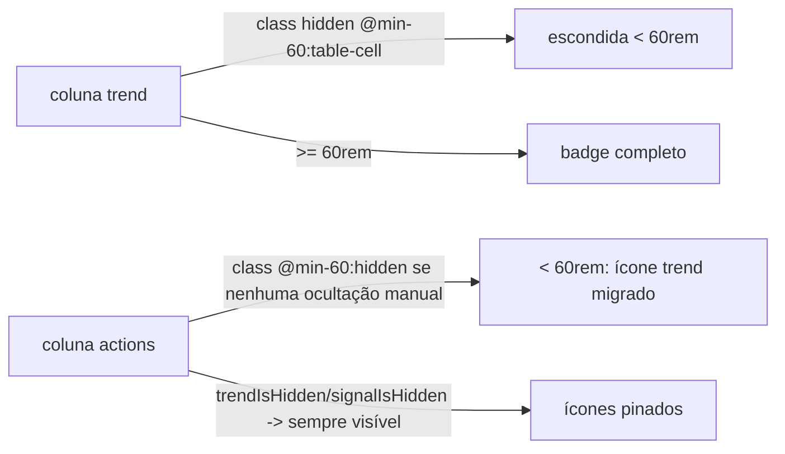

# Impl: B172 — Lista de municípios: ao colapsar, coluna de Tendência desaparece e o ícone vai para Ações

Status: aprovado
Atualizado em: 2026-08-08
Issue: #446
Intenção: docs/plans/tendencia-icone-coluna-acoes.md
Appetite restante: ~0,5–1 dia eng (herdado); uma superfície tocada (`MunicipalityList.tsx` + testes)

## Leitura da intenção

- **Outcome:** abaixo de 60rem (ponto em que o badge de Tendência colapsaria), a coluna `Tendência` não é renderizada e o editor de tendência aparece como ícone compacto na coluna `Ações`, ao lado do ícone de atualização. Acima, a coluna mostra o badge completo e `Ações` não ganha cópia. Uma instância visível do editor por linha em qualquer largura. Preferência do picker B17 preservada.
- **O que NÃO negociar:** um editor por linha por faixa de largura (sem double autosave/popover); ocultação manual do B17 continua valendo quando há espaço; sem JS de resize — container queries como B158; `Atualização` fora de escopo (questão 1 resolvida como **opção A** — só `Tendência` migra; a coluna `Sinal` continua adaptativa no próprio lugar).
- **O que reavaliar:** a hipótese da intenção apontava seam `triggerPresentation` no controle. A inspeção mostra que isso não basta: o trigger não pode ser **movido entre `<td>`s** com CSS — display só alterna no lugar. A migração exige uma segunda instância do controle (CSS-gated), o que muda a leitura de "uma instância" (vira uma por faixa, não uma no DOM).

## Abordagem recomendada

**Opções consideradas:** A) dual-render do controle + gating por container query na coluna; B) drop da coluna `trend` e trigger só em `Ações`; C) mover o controle único via JS/portal.
**Recomendação: A** — é a única que mantém o aceite completo (badge na coluna em largura + ícone em `Ações` em estreito) com CSS puro, zero JS de resize, coerente com a mecânica B158.
**Rejeitadas:** B porque em tela larga o usuário perde o readout de tendência na linha (aceite exige badge na coluna); C porque relocar uma instância única entre células de tabela exige `ResizeObserver`/mutation das `<td>` — o anti-goal da intenção (sem JS de resize) e a arquitetura "server decide, CSS aparenta" do B158.

### Componentes / mudanças

- **`municipalityListColumns`** (`src/components/campaign/municipality/MunicipalityList.tsx`):
  - `responsiveColumnClassName` ganha `trend: 'hidden @min-[60rem]/municipality-list:table-cell'`; aplicado no `head` (via `MunicipalitySortableHead className`) e `cellClassName` da coluna `trend`. O renderer da célula mantém `renderTrendControl(municipality, 'adaptive')` **inalterado**: acima de 60rem o adaptive mostra o badge completo; a coluna some abaixo — zero mudança na fiação do controle.
  - Coluna `actions`: deixa de ser condicionada a `trendIsHidden || signalIsHidden` e passa a **sempre** ser montada para staff (tem de ser — ela é a casa do fallback de largura mesmo com `Tendência` visível). `const actionsPinned = trendIsHidden || signalIsHidden`; `head`/`cellClassName` recebem `actionsPinned ? undefined : '@min-[60rem]/municipality-list:hidden'` (visível só abaixo de 60rem quando nada está oculto manualmente).
  - Célula de `actions`: trecho de tendência vira
    `trendIsHidden ? renderTrendControl(m, 'compact') : {renderTrendControl(m, 'compact')}`
    (ícone pinado quando oculto; gated por container quando visível). Trecho de sinal **inalterado** (`signalIsHidden ? … : null`, opção A).
  - A união local `MunicipalityTableColumnId` já inclui `'actions'` — nada a mudar.
- **`MunicipalityListTrendControl.tsx`:** sem mudança. O seam `'compact'`/`'adaptive'` já existe (51963c... — usados hoje para `actions` e coluna).
- **Migration:** nenhuma. **Access/Consent:** nenhum. **UI:** Impeccable B — encaixe em tela existente, sem shape/craft além da movimentação do trigger; validação visual no browser (Playwright + snapshot perceptual do contrato abaixo/em/acima).

### Matriz de largura × visibilidade (contrato do e2e)

| Container  | trends visível no picker                                                                  | trend oculto                           |
| ---------- | ----------------------------------------------------------------------------------------- | -------------------------------------- |
| `< 60rem`  | coluna `Tendência` some · `Ações` visível com ícone trend (+ sinal se oculto manualmente) | `Ações` visível com ícone trend pinado |
| `>= 60rem` | coluna `Tendência` com badge completo · `Ações` `display:none` (não-frame)                | `Ações` visível com ícone trend pinado |

Quando `Sinal` está oculto manualmente, `Ações` é sempre visível (pinado) e o ícone de tendência, se a coluna estiver visível, fica gated por `@min-[60rem]:hidden` dentro dela.

> **Side effect assumido (documentado no gate de review):** abaixo de 60rem o `<th>` da coluna `Tendência` sai de cena (`display:none`), então o **sort por Tendência e o filtro de tendência via header** ficam inacessíveis nessa faixa (pre-B172 eles existiam como ícone no próprio lugar). O sort/filtro continua disponível pelo omnibox (mesmas seeds de `municipalityOmnibox.ts`); o trade-off é o objetivo do item (coluna sumir em vez de colapsar). Não é regressão: se a coluna não existe, suas affordances de header não existem.

## Fases verificáveis

1. **Server/render** — editar `MunicipalityList.tsx` (classes da coluna `trend` + lógica de `actions`); `pnpm gate:fast` (lint + typecheck + unit).
2. **Testes** — atualizar `tests/unit/campaignComponents.unit.spec.ts` (matriz `hasActions` e contagem de labels) e `tests/e2e/campaignMunicipalityResponsiveColumns.e2e.spec.ts` (`expectedHeadersAt`); rodar unit.
3. **Browser/E2E** — `pnpm test:unit`; e2e dirigido `tests/e2e/campaignMunicipalityResponsiveColumns.e2e.spec.ts` (dev server 3272 + `teqo_wt172_test`); `pnpm test:int` (sem impacto esperado, confirma verde); `pnpm check:cycles`, `knip`, `format:check`.

## Rabbit holes / Não escopo (engenharia)

- Reorganizar `Ações`/picker/outros controles (corte do item e da intenção).
- Aplicar a mesma regra a `Sinal`/`Atualização` (opção B da intenção — item sucessor).
- Mudar o breakpoint 60rem (contrato comportamental de B158 C2; calibrar só com evidência `scrollWidth`, como B158 explicitava).
- `CampaignTable`/shell genérico: não criar seam compartilhado — 1 call site, `cellClassName` local basta (depth check).

## Riscos e mitigação

- **Duas instâncias montadas por linha (coluna + `Ações`), uma visível por faixa:** custo de memória/estado de autosave 2× por linha em todas as larguras. Mitigação: tabela paginada e excluída a linha quando `trend` está oculto (a instância da coluna nem existe); aceita-se como o preço de CSS puro — e é a mesma dualidade que o adaptive (compact/full spans) B158 já monta. O teste bloqueia que as duas apareçam na mesma faixa (e2e de headers + primeiro trigger visível).
- **Regressão de contagem de labels nos unit:** os testes de "uma instância" precisam reapontar o contrato de `hidden: []` e `hidden: ['lastSignal']` (agora 2 labels de tendência no markup). Atualização explícita na fase 2.
- **e2e B158 `expectedHeadersAt`:** agora `Tendência` só acima de 60rem e `Ações` só abaixo — atualizar a tabela de expects. O teste de sidebar/Sollinha usa só o `.length` (sem nomes), e a aritmética de contagem atravessa 60rem com saldo 0 em ambos os cenários (antes: `Tendência` sempre; agora troca `Ações`↔`Tendência`), então não muda o comportamento monotônico dele.
- **GRID `Ações` vazia:** nunca há `Ações` vazia visível — toda configuração que a mostra tem ao menos um ícone (trend fallback ou pinado, ou sinal pinado).

## Aceite de engenharia

- [x] Aceite de produto da intenção ainda coberto (única instância visível por faixa, B17 preservado, `Atualização` fora).
- [x] Invariantes AGENTS/engineering-standards (sem migration/Consent/URL; CSS-only; sem `window`/`ResizeObserver`).
- [x] Testes de domínio previstos: unit de markup (classes simétricas e contagem de triggers) + e2e de faixas de container (`expectedHeadersAt`), sem testar preset de viewport.

## Bug de produção encontrado e corrigido (React 19.2.4 flight)

O `className` novo na coluna `Tendência` (`MunicipalitySortableHead`) destravou um bug do **React 19.2.4** no serializer do RSC flight, que o e2e `campaignColumnPicker` pegou (3/3 vermelho em prod, verde em dev):

- **Sintoma:** `Minified React error #130 — Element type is invalid: ... got: undefined`, derrubando o painel inteiro no SSR quando uma coluna era ocultada pelo picker B17 (o repro mínimo: cookie `municipios:votos` + load direto).
- **Causa-raiz:** o flight serializer emite um elemento passado como `children` de um Client Component como referência lazy (`$L<id>`) quando a tarefa servidor cruza o orçamento `MAX_ROW_SIZE = 3200` de `serializedSize`. Com `votos` visível, a presença da coluna forçava a divisão do thead em tarefas por coluna (o span de `Dobradinha` serializava inline na tarefa própria); com `votos` oculta, o thead virou UMA tarefa de ~4,7 KB e o span de `Dobradinha` (cabeçalho `CampaignTableHead` com `description`) caiu exatamente na fronteira → deferido para chunk posterior → no SSR o `CampaignHoverTooltip` recebia o placeholder não-resolvido como `children` → `cloneElement(undefined)` → #130. O `className` de B172 foi o bytes-extra que moveu a fronteira para cima do span.
- **Correção (2 arquivos, sem mudança visual):** `CampaignTableHead` passa o rótulo do cabeçalho como prop de dados (`explanationLabel`) em vez de elemento `children` — string/ReactNode nunca é deferida pelo flight; o `CampaignHoverTooltip` reconstrói o trigger (``) a partir do label. Todos os outros call sites do tooltip (células, cards, sortable heads) seguem no caminho `children` original, inalterado. O e2e `campaignColumnPicker` passou a ser verde 3/3 e o `campaignMunicipalityResponsiveColumns` 4/4 em produção; a coluna `Dobradinha` continua exibindo o cabeçalho após a correção (verificado no DOM).
