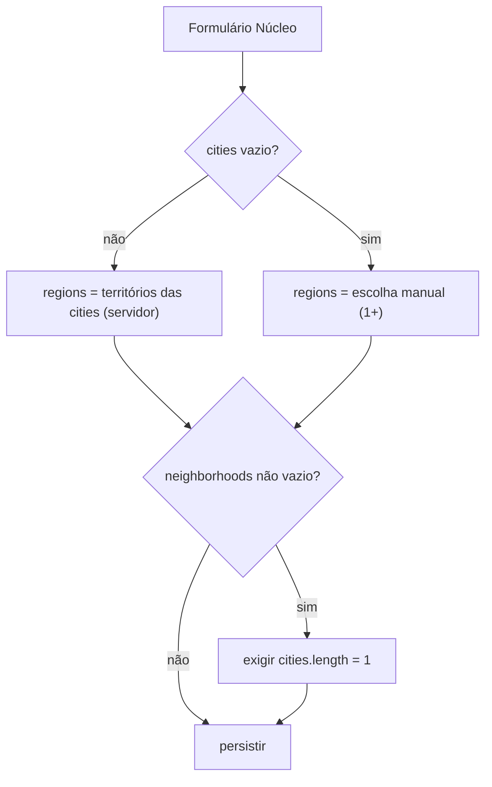

# Território multi-município e multi-bairro

Status: rascunho
Atualizado em: 2026-07-17
Item do roadmap: [docs/roadmap.md](../roadmap.md) (seção "Campanha → Próximos ciclos")
Responsável: —

## Referência visual (UX Pilot)

Design: [`Formulario-Territorio.png`](../design-refs/latest/Formulario-Territorio.png) · [`Formulario-Territorio.html`](../design-refs/latest/Formulario-Territorio.html) — **compartilhado com [zonas-por-municipio.md](zonas-por-municipio.md)** (a mesma tela cobre os dois planos).

Como usar (parte deste plano — bloco Território):

- **Adotar a estrutura:** "Municípios" como combobox multi-seleção com chips removíveis + contagem "2 municípios selecionados"; "Territórios de Identidade" como chips derivados somente leitura com cadeado e legenda "Derivados dos municípios selecionados · não é possível editar" (materializa a regra 3 — `regions` rederivado no servidor); "Bairros" desabilitado com placeholder "Selecione municípios primeiro" e o aviso "Bairros exigem um único município selecionado" (regra 5).
- **Divergência a resolver na implementação:** no design o campo de bairros aparece desabilitado com 2 municípios e o aviso âmbar simultaneamente; a regra é: habilitar bairros somente com exatamente 1 município e limpar bairros ao passar para >1 (mostrar o aviso como helper text, não como erro).
- **Fora deste plano:** a seção "Zonas Eleitorais (TSE)" com chips "sugerida" pertence a [zonas-por-municipio.md](zonas-por-municipio.md).
- **Ajustar cores:** paleta antiga no HTML/PNG. Implementar com `StrictCombobox`/`NucleusTerritoryFields` existentes e os tokens do tema `campaign` (chips neutros claros; chips de município selecionado não precisam ser navy).

## Contexto

Hoje o território do Núcleo Eleitoral é modelado com campos **single-valued** em `src/collections/ElectoralNucleus.ts`:

- `region` (Território de Identidade, `text`, único, indexado);
- `city` (Município, `text`, único, indexado);
- `neighborhood` (Bairro, `text`, único);
- `locality` (Localidade, `text`, livre);
- `territoryNotes` (`textarea`).

As regras atuais (em `validateNucleusTerritoryAndZones` no collection e em `validateGeographyAndZones` no Zod `src/lib/schemas/nucleus.ts`, com parsing em `parseSharedNucleusFormData` em `src/utilities/nucleusUi.ts`) são:

- `region` deve ser território válido da Bahia; `city` deve ser município válido da Bahia;
- se `region` + `city`, então `city` deve pertencer a `region` (`territoryForCity(city) === region`);
- `neighborhood` exige `city`;
- pelo menos um de `region`/`city`/`locality`.

Isso não cobre dois casos reais da operação: um núcleo que abrange **mais de um município** (sem ser um Território de Identidade inteiro) e um núcleo que abrange **mais de um bairro** (sem ser um município inteiro). Decisão de produto (2026-07-17): `Município` e `Bairro` passam a aceitar múltiplas entradas, e um núcleo pode **cruzar Territórios de Identidade** quando abrange municípios de territórios distintos.

## Decisão de modelagem (Modelo A + cross-territory)

Escolhido o **Modelo A** (arrays planos) em vez de array estruturado por município, porque o caso combinado "vários municípios **com** bairros em cada" não é realista para a operação — bairros só fazem sentido escopados a um único município.

- `region` → **`regions`** (`text[]`): array de Territórios de Identidade. **Derivado no servidor** a partir dos municípios selecionados quando `cities` não vazio; definível manualmente só quando `cities` vazio (caso "núcleo = território inteiro").
- `city` → **`cities`** (`text[]`): múltiplos municípios, podem pertencer a territórios distintos (cross-territory).
- `neighborhood` → **`neighborhoods`** (`text[]`): múltiplos bairros (texto livre, como hoje).
- `locality` e `territoryNotes`: inalterados.

### Regras de validação (substituem as atuais)

1. Pelo menos um de: `regions`, `cities`, `locality`.
2. Cada `city` deve ser município válido da Bahia; cada `region` deve ser território válido.
3. Se `cities` não vazio → `regions` é **exatamente** o conjunto (deduplicado) dos territórios desses municípios. O servidor **ignora** o valor de `regions` enviado e rederiva (mesmo padrão de `setCanonicalNucleusSlug`).
4. Se `cities` vazio → `regions` é o que o usuário escolher (1+ territórios inteiros).
5. Se `neighborhoods` não vazio → `cities` deve ter **exatamente 1** elemento. Bairros só fazem sentido num único município.
6. Bairros: trim, dedup, não vazios.

### Diagrama

## Objetivos

- Schema do `electoralNucleus` com `regions`/`cities`/`neighborhoods` como arrays, com migration que preserva dados existentes.
- Validação server-side autoritativa (hook `beforeValidate` + Zod) com as 6 regras acima; o cliente apenas reflete o estado derivado.
- Formulário de criar/editar núcleo (`NucleusTerritoryFields`) com município multi-seleção (chips), bairro como tag input habilitado só com 1 município, e território como exibição derivada + seleção manual quando sem municípios.
- Filtros da lista de núcleos (`NucleusFilters`) continuam single-select por território e por município; a consulta muda de `equals` para `contains` (núcleo aparece quando toca aquele território/município).
- View models e DTOs discriminados por papel atualizados para arrays; renderização em lista/detalhe apresenta arrays como badges ou lista separada por vírgula.
- Testes int cobrindo: multi-município, cross-territory, multi-bairro, regra do município único, derivação de `regions`, e filtro `contains`.

## Decisões travadas

- **Modelo A (arrays planos).** Sem array estruturado por município; sem tabela aninhada. Bairros exigem município único (regra 5).
- **Cross-territory permitido.** Múltiplos municípios podem pertencer a territórios distintos; `regions` reflete o conjunto exato.
- **`regions` derivado no servidor quando há `cities`.** O cliente envia `cities` (e opcionalmente `regions` só para o caso sem municípios); o hook rederiva `regions` a partir de `cities` e ignora o valor enviado quando `cities` não vazio. Mesmo princípio do `slug` canônico.
- **Renomear campos para o plural** (`region`→`regions`, `city`→`cities`, `neighborhood`→`neighborhoods`) para clareza semântica e consistência com identificadores em inglês (AGENTS.md).
- **Migration in-place com backfill.** Dados existentes já cumprem `city ∈ region` (validação atual), então `regions = ARRAY[region]`, `cities = ARRAY[city]`, `neighborhoods = ARRAY[neighborhood]` é correto. Down migration recria colunas single a partir do primeiro elemento e `RAISE EXCEPTION` se algum array tiver >1 elemento (proteção contra perda).
- **Índices GIN em `regions` e `cities`** para o operador `contains` dos filtros.
- **Filtros continuam single-select.** `NucleusFilters` não vira multi-select; só a consulta (`buildNucleusListWhere`) muda de `equals` para `contains`. O estado da URL (`NucleusListState`) mantém `region`/`city` single.
- **Sem `Consent`, sem server action nova, sem collection nova.** Só schema + UI + validação + migration.
- **i18n e naming** seguem AGENTS.md: identificadores em inglês, strings visíveis em pt-BR.
- **Executar cedo, antes do volume de dados reais e antes de Eventos/Demandas** (decisão de sequenciamento 2026-07-17). Três razões: (1) a migration in-place com backfill é trivial e de risco mínimo enquanto há poucos núcleos — cada semana de dados reais aumenta o custo de validação; (2) [`zonas-por-municipio.md`](zonas-por-municipio.md) nasce contra `cities[]` e depende desta ordem; (3) as collections `actionPlan` ([eventos-agenda-mobilizacao.md](eventos-agenda-mobilizacao.md)) e `campaignDemand` ([demandas-campanha.md](demandas-campanha.md)) copiam o bloco de território do núcleo — se nascerem antes desta mudança, herdam o modelo single e criam dívida imediata de migração dupla.

## Questões em aberto

- **Tipo do campo Payload.** Para `cities`/`neighborhoods` (texto livre repetido), usar `array` de subcampo `text` (cria tabela `electoral_nucleus_cities`/`electoral_nucleus_neighborhoods`) ou `select` com `hasMany`? `select` não serve para bairros (lista não é fixa). Recomendação: `array` de `text` para `cities` e `neighborhoods`; para `regions` (lista fixa de 27), `select` com `hasMany` ou `array` de `text` com validação — decidir na implementação pelo equilíbrio entre UX no admin Payload e complexidade da migration.
- **Admin Payload UI.** O formulário da campanha é custom React; o admin Payload também edita núcleos. Para `array` de `text`, o admin mostra repeatable text inputs (sem combobox). Aceitável para staff; o combobox bonito fica só no `/campanha`. Confirmar com produto se é suficiente.
- **Detecção de "tseZones alterado" em update** (interação com o plano [Zonas TSE por município](zonas-por-municipio.md)): com múltiplos municípios, o auto-preenchimento de zonas passa a ser a **união** das zonas dos municípios selecionados. Esse plano atualiza a premissa do outro.
- **Limite máximo de municípios/bairros.** Definir um teto razoável (ex.: 27 municípios, 30 bairros) para evitar abuso e limitar o tamanho do array no form/URL. A definir na implementação.
- **Núcleo cross-territory no filtro por território.** Confirmar com produto que um núcleo com municípios em 2 territórios deve aparecer ao filtrar por **qualquer um** dos dois (comportamento esperado do `contains`).

## Abordagem proposta

Arquivos:

- **`src/collections/ElectoralNucleus.ts`**: renomear campos para `regions`/`cities`/`neighborhoods` como arrays; reescrever `validateNucleusTerritoryAndZones` com as 6 regras (incluindo derivação de `regions` a partir de `cities`); atualizar `defaultColumns` para `regions`/`cities`.
- **`src/lib/schemas/nucleus.ts`**: Zod com `regions`/`cities`/`neighborhoods` como arrays (`z.array(z.string())`); `superRefine` com as 6 regras, espelhando o hook.
- **`src/lib/bahiaTerritories.ts`**: adicionar `territoriesForCities(cities: string[]): BahiaIdentityTerritory[]` (conjunto único e ordenado dos territórios dos municípios), reusando `territoryForCity`.
- **`src/utilities/nucleusUi.ts`**: `parseSharedNucleusFormData` lê `cities`/`neighborhoods` repetidos do FormData e deriva `regions` (quando `cities` não vazio); `buildNucleusListWhere` passa a `regions: { contains: state.region }` e `cities: { contains: state.city }`; `NucleusListState` mantém `region`/`city` single (filtro).
- **`src/utilities/nucleusViewModels.ts`**: todos os view models (`NucleusListViewModel`, `NucleusFormViewModel`, `Staff/LeadershipNucleusTabsViewModel`, `NucleusDetailBaseViewModel`) passam a `regions: string[]`, `cities: string[]`, `neighborhoods: string[]`; atualizar mappers (`toNucleusListViewModel`, `toNucleusFormViewModel`, `toNucleusDetailBaseViewModel`, `toStaffNucleusTabsViewModel`, `toLeadershipNucleusTabsViewModel`) e os `select` (`nucleusFormSelect`, `nucleusListSelect`, `nucleusStaffDetailSelect`, `nucleusLeadershipDetailSelect`, `nucleusContextSelect`).
- **`src/utilities/nucleusPageData.ts`**: atualizar `nucleusContextSelect` e os selects por tab para os novos nomes.
- **`src/components/campaign/NucleusTerritoryFields.tsx`**: município → combobox multi-seleção (chips); bairro → tag input habilitado só quando `cities.length === 1` (limpar bairros ao passar para >1); território → exibição derivada (badges dos territórios das cities) + seleção manual só quando sem municípios; hidden inputs emitem `regions`/`cities`/`neighborhoods` repetidos.
- **`src/components/campaign/NucleusFilters.tsx`**: sem mudança de UI; só consome o novo `buildNucleusListWhere`.
- **Componentes de renderização** (`NucleusCard`, `NucleusList`, detalhe overview/territory tab): apresentar `regions`/`cities`/`neighborhoods` como badges ou lista separada por vírgula.
- **`src/payload-types.ts`**: regenerar com `pnpm generate:types`.
- **Migration** `src/migrations/<ts>_territorio_multi_municipio_bairro.ts` (+ `.json` + `index.ts`): ver seção Migration.

## Migration

`pnpm migrate:create territorio_multi_municipio_bairro` e editar à mão (skill `payload-migrations` permite data migration):

- adicionar colunas `regions text[]`, `cities text[]`, `neighborhoods text[]` em `electoral_nucleus`;
- backfill:
  - `regions = CASE WHEN region IS NOT NULL THEN ARRAY[region] ELSE ARRAY[]::text[] END`;
  - `cities = CASE WHEN city IS NOT NULL THEN ARRAY[city] ELSE ARRAY[]::text[] END`;
  - `neighborhoods = CASE WHEN neighborhood IS NOT NULL THEN ARRAY[neighborhood] ELSE ARRAY[]::text[] END`;
  - (dados existentes já cumprem `city ∈ region`, então `regions = ARRAY[region]` está correto);
- drop colunas antigas `region`/`city`/`neighborhood`;
- drop índices antigos `electoral_nucleus_region_idx` e criar GIN em `regions` e `cities` para o operador `contains`;
- **down**: recriar colunas single `region`/`city`/`neighborhood` a partir do primeiro elemento de cada array, recriar índice btree, e `RAISE EXCEPTION` se algum array tiver `cardinality > 1` (proteção contra perda de dados multi-município/bairro).

## Dependências

- Reusa `territoryForCity`/`citiesForTerritory`/`bahiaMunicipalities` (`src/lib/bahiaTerritories.ts`), `CitiesByState.BA` (`src/lib/cities`), `StrictCombobox` (`src/components/campaign/StrictCombobox`), `municipalityComboboxOptions`/`territoryComboboxOptions` (`src/utilities/territoryComboboxOptions`).
- **Interage com o plano [Zonas TSE por município](zonas-por-municipio.md)**: o auto-preenchimento de zonas passa a ser a união das zonas dos municípios selecionados (em vez de "a zona do município"). Atualizar a premissa daquele plano quando ambos forem implementados.

## Não escopo

- Array estruturado por município (`areas: [{ city, neighborhoods }]`) — caso combinado "vários municípios com bairros em cada" fica fora.
- Mapa / PostGIS / polígonos GeoJSON (roadmap "Mapa / PostGIS").
- Polígonos de zonas TSE — só o cadastro tabular (ver plano [Zonas TSE por município](zonas-por-municipio.md)).
- Multi-tenant / white-label.
- Alterar `Contact.city` (que virou opcional para representar território sem município) — escopo de `Contact`, não do núcleo.

## Referências

- `docs/roadmap.md` (item novo; seção "Campanha → Próximos ciclos")
- `.cursor/rules/projects/nucleos-eleitorais.mdc` (decisão a registrar)
- `src/collections/ElectoralNucleus.ts` — campos e `validateNucleusTerritoryAndZones`
- `src/lib/schemas/nucleus.ts` — `validateGeographyAndZones`
- `src/utilities/nucleusUi.ts` — `parseSharedNucleusFormData`, `buildNucleusListWhere`
- `src/utilities/nucleusViewModels.ts` — view models e selects
- `src/components/campaign/NucleusTerritoryFields.tsx`, `NucleusFilters.tsx` — UI
- `src/lib/bahiaTerritories.ts` — `territoryForCity`, `citiesForTerritory`
- `docs/plans/zonas-por-municipio.md` — premissa de auto-preenchimento de zonas a atualizar
- AGENTS.md — naming conventions, padrão de migration, "Bahia implícita no Núcleo"
