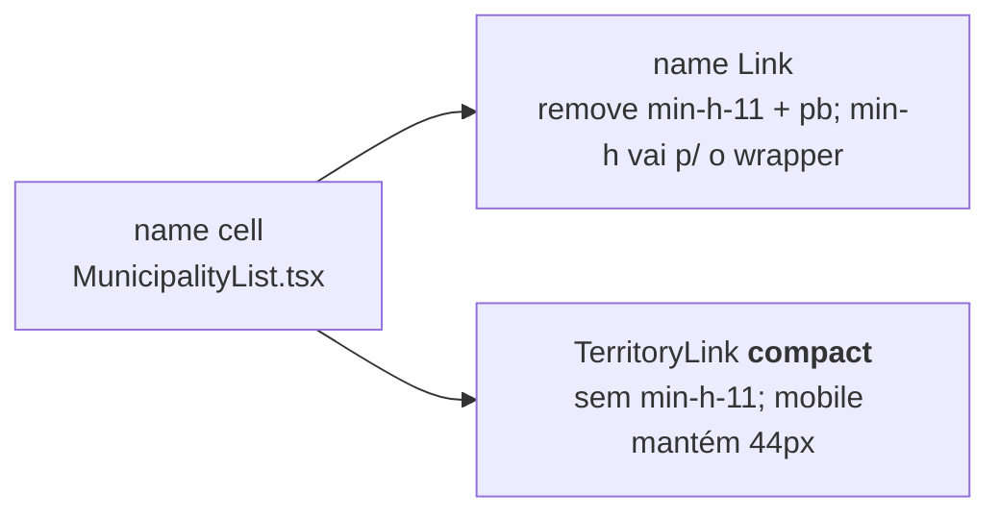

# Impl: Território mais perto do nome na lista de municípios

Status: aprovado
Atualizado em: 2026-08-08
Issue: #412
Intenção: docs/plans/territorio-perto-nome-lista-municipios.md
Appetite restante: ~0,25–0,5 dia — mantém; ajuste de célula, sem migration.

## Leitura da intenção

- **Outcome:** na célula de nome da tabela desktop de `/campanha/municipios`, o território fica colado ao nome (~2–4 px entre os dois textos), com nome em 1 ou 2 linhas, sem sobrepor, sem mudar nenhuma navegação e sem desalinhar os controles das outras colunas.
- **O que NÃO negociar:** navegação (nome → município, território → âncora da página de territórios, B25); altura mínima da linha preservada; mobile cards fora de escopo; nada de densificar a lista inteira.
- **O que reavaliar:** a hipótese "a culpa é do vão `gap-0.5`" está **errada** — o `gap` já é 2 px. O vão real vem de duas caixas que engordam a célula por baixo: o `min-h-11` do link do território (`items-center` centraliza o texto xs em 44 px) e o `min-h-11` + `py-2` do link do nome (texto alinhado ao topo de 44 px → ~24 px vazios abaixo quando o nome tem 1 linha). Resultado hoje: ~40 px de vão texto→texto em nome de 1 linha.

## Abordagem recomendada

**Opções consideradas:** A | B | C
**Recomendação:** A — célula compacta sem perder a altura mínima de linha, com variante `compact` nova só para a tabela desktop.
**Rejeitadas:**

- **B (mexer no `TerritoryLink` em globo, sem variante):** encolhe o alvo de toque no card mobile (touch), que está fora de escopo e hoje usa os mesmos 44 px de forma legítima.
- **C (componente paralelo para a célula desktop):** gêmeo do dono — viola "edit the owner, don't twin"; o `TerritoryLink` compartilhado tem 2 call sites, uma variante cabe.
- **Mover o vão para 0 px (`gap-0`/colado de verdade):** aproxima descidas/ascendentes de fontes diferentes (nome base vs território xs); a intenção já fixou 2–4 px.

### Componentes / mudanças

- **`TerritoryLink`** (`src/components/campaign/municipality/TerritoryLink.tsx`): ganha prop opcional `compact` (default `false`). Em `compact`, remove `min-h-11` (mantém `inline-flex items-center ...`). Assinatura inglesa; comportamento atual intacto por omissão — mobile não muda.
- **Célula `name`** (`src/components/campaign/municipality/MunicipalityList.tsx`, ~linhas 278–297):
  - wrapper externo `flex flex-col gap-0.5` → ganha `min-h-11` (a altura mínima da linha muda do link do nome para a célula).
  - link do nome: remove `min-h-11` e o `py-2`; mantém `line-clamp-2 min-w-0 flex-1`, com `pt-1` (respiro de 4 px acima do texto; sem padding inferior → gap texto→texto = `gap-0.5` = 2 px).
  - indicador de prioridade: ajuste fino de `mt-2` → `mt-1` (alinha o ícone `size-4` com a 1ª linha do nome após a perda do `py-2`).
  - território: `TerritoryLink` com `compact`.
- **Migration:** não há.
- **Access / Consent:** não toca.
- **UI:** Impeccable A — encaixe de 2 arquivos, sem shape novo. Verificação visual no browser (dev server do worktree, porta 3265) com nomes de 1 e 2 linhas.

### Dados → forma (se aplicável)

- N/A — ajuste de espaçamento em célula existente, sem número novo (intenção, "Dados" = Não).

## Fases verificáveis

1. **Schema+server → N/A** (sem schema). Direto para a célula: ajustar `MunicipalityList.tsx` + variante `TerritoryLink`.
2. **UI/verificação** — `pnpm dev` na porta 3265; login staff; `/campanha/municipios`; checar nome 1 linha, nome 2 linhas (e nome + território longo truncado): vão ~2–4 px, sem sobreposição, links OK (nome → município; território → âncora `#ti-…` em `/campanha/territorios`), controles das outras colunas alinhados em linha de nome curto.
3. **Gates** — `pnpm exec tsc --noEmit`, `pnpm lint`, `pnpm format:check`, `gate:fast` (não depende de DB para este diff; rodar igual para o invariante). `pnpm push` na entrega. Sem testes de domínio novos (não há mudança de lógica/access/write).

## Rabbit holes / Não escopo (engenharia)

- **"Já que vou mexer, densifico a lista toda"** — cortado na intenção: só o vão nome↔território da célula `name`.
- **"Aproveito e ajusto o card mobile"** — fora de escopo (intenção), e a variante evita tocá-lo.
- **Tune de `px` por guess** — o exato pode variar (ex. `pt-1` vs `pt-0`, `mt-1` vs `mt-2`); resolver no browser, não por tentativa às cegas.
- Nada de helper/util nova: contato com nada de `utilities`/`lib`.

## Riscos e mitigação

- **Sobreposição em caso extremo** — impossível por construção: `line-clamp-2` fixa o nome em máx. 2 linhas e o território entra 2 px abaixo da última linha; os dois textos nunca dividem a mesma caixa.
- **Nome com descida (ç, g, p) encostando no território** — 2 px de `gap` + descida natural da fonte mantêm separação; confirmar no browser com "Camaçari" (uma linha) e um nome de 2 linhas.
- **Alvo de toque do território menor na tabela** — aceite da intenção (hit-zone menor em troca da leitura colada; registrar se virar reclamação). O nome segue sendo a navegação primária da célula com alvo maior.

## Aceite de engenharia

- [x] Aceite de produto da intenção ainda coberto (2–4 px, sem sobrepor, links intactos, altura mínima preservada)
- [x] Invariantes AGENTS/engineering-standards (naming inglês; copy pt-BR mantida; sem migration/round; sem tocar access)
- [x] Testes de domínio previstos (unit/int) onde access/write paths mudam — N/A, sem mudança de lógica; verificação visual + gates
