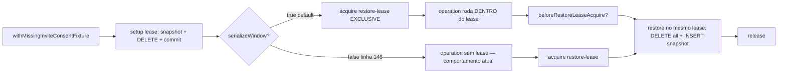

# Impl: Flake do consent restore do `testDatabaseLease` sob carga (race de fixtures paralelas)

Status: aprovado
Atualizado em: 2026-08-10
Issue: #596
Intenção: docs/plans/test-database-lease-consent-flake.md
Appetite restante: herdado (fix focado em testes; zero mudança em `src/`)

## Leitura da intenção

- **Outcome:** `pnpm test:int` estável sob carga; o teste "restores the exact configured consent after deletion and recreation" passa N execuções consecutivas com os arquivos suspeitos rodando em paralelo.
- **O que NÃO negociar:** nenhuma mudança em `src/` (código de produto); mecanismo de lease (advisory lock) intacto; outras fixtures/leads não entram no escopo.
- **O que reavaliar:** a hipótese "leituras `LIMIT 1` sem `ORDER BY` escolhem a linha errada quando existe duplicata" — a caracterização mostrou que **duplicata persistente é impossível** (`consent_key_idx` é UNIQUE, verificado no banco); a hipótese "algum escritor NÃO toma o lease" é parcialmente verdadeira: o único estado não serializado é a **janela de operação** de `withMissingInviteConsentFixture` (deliberadamente sem lease para o fail-closed ver a key ausente).

## Caracterização (fase 1, reproduzida)

Reprodução local: suíte int completa (81 arquivos, `maxWorkers = min(8, cores)`), 3 falhas em 8 runs — o teste exato da intenção:

```
AssertionError: expected { id: 552, …(4) } to match object { id: 527, …(2) }
  ❯ tests/int/testDatabaseLease.int.spec.ts:217:19
```

`before.id = 527`, `after.id = 552` (key/text idênticos; ids diferentes por run; banco self-heal — 1 linha por key ao final).

**Mecanismo:** o `after` (e `before`, no sentido oposto) é um `withInviteConsent` cujo loop faz `ensureLeasedConsent` (find→create sob lease **exclusivo**) e depois uma leitura sob lease **shared**. A janela de `withMissingInviteConsentFixture` (setup commita o DELETE → `operation()` **sem lease** → restore) deixa a key commitada-ausente por ms; nessa janela, escritores de outros arquivos (fixtures `withMutableConsentFixture` com snapshot `undefined`, `ensureInviteConsent` de specs paralelos) rodam legitimamente — criam uma linha efêmera, que o restore do fixture deleta e substitui pelo snapshot. Um `withInviteConsent` que caiu na janela retorna a linha efêmera (ex.: 552) e o assertion compara com o snapshot restaurado (527) → flake. O `ORDER BY` sozinho **não** corrige: no momento da leitura existe uma linha só.

**Fix mínimo que mata o mecanismo:** serializar a janela com o lease existente (precedente exato do `onda0Provision`, comentário "without the shared leases this test races that window"). Com a janela sob lease exclusivo, nenhum escritor/leitor de outra spec observa o estado ausente → nenhuma linha efêmera → o `after` lê sempre o snapshot restaurado.

**Conflito identificado:** o teste "creates a missing configured consent only once under concurrent ensures" (linha 146) **deliberadamente** roda 3× `ensureInviteConsent` DENTRO da janela (elas próprias adquirem o lease exclusivo → deadlock com uma janela leaseada). Resolvido em duas camadas: (1) o teste migra para **key/lease privada** (`ensure-race-<random>`), então sua janela (que permanece `serializeWindow: false`) não expõe mais a key estável a specs paralelas; (2) documenta-se o opt-out.

**Evidência da contraprova (2ª iteração):** após o fix inicial, 8 runs da suíte completa: o teste-alvo D9 passou em todos, mas 2 testes irmãos flakearam em 1 run com dois mecanismos adicionais:

- **`rolls back a failed missing-consent setup…` (703→712):** o mesmo mecanismo id, via a janela ainda sem lease da linha 146 — fixtures de outros arquivos (snapshot `undefined`) rodavam nela e seu cleanup `DELETE … OR key = X` matava a linha 703 criada pelo `before` de outra spec. Fechado pela key privada acima (a key estável nunca mais fica ausente na suíte).
- **`restores the configured consent and releases after a callback assertion failure` (text mismatch):** o `provisionOnda0ConsentAndPrivacy` (spec paralela, shared lease) atualiza legitimamente o texto da linha entre o `before`-read e o snapshot do fixture — o restore reproduz fielmente o snapshot, mas a asserção comparava com a leitura volátil. Corrigido: as asserções dos 3 testes de restore passam a referenciar o **snapshot capturado no callback do fixture** (o contrato real do restore), não leituras `before` separadas; o teste de rollback (sem restore) asserta id+key (texto não é contrato dele).

**Raiz definitiva (3ª iteração — reproduzida com só 2 arquivos: `testDatabaseLease` + `onda0Provision`):** o `removeOnda0ConsentAndPrivacyDb` (teste 2 da spec Onda0, **`DELETE WHERE key IN (4 keys estáveis)`**) rodava sob leases **shared** — shared não bloqueia os reads shared de outras specs, então a remoção deletava a linha canônica **no meio** do teste D9 (entre o restore do fixture e o `after`-read): o id restaurado sumia irreversivelmente e o `after`-ensure recriava com id novo. Nem o lease exclusivo resolve esse gap (a remoção é um escritor legítimo). Fix: (a) a spec Onda0 passou para **leases exclusivos** (`withTestDatabaseLease` exportado do helper) — provision e remoção serializam contra todos os usuários de consent; (b) o teste de down **restaura as linhas com os ids originais** dentro da mesma janela exclusiva (invisível para as outras specs) — a key estável nunca fica ausente e nunca troca de id no meio da suíte; o SQL do down continua exercitado (DELETE + count-0 dentro da janela). `ensureInviteConsent` ficou órfão e foi removido (knip).

## Abordagem recomendada



**Opções consideradas:** A (serializar a janela sob lease exclusivo + opt-out) | B (remover o create de `withLeasedConsent`) | C (só `ORDER BY`/invariante de unicidade)
**Recomendação:** A — mata o mecanismo na raiz; preserva todos os testes; segue o precedente `onda0Provision` citado na intenção.
**Rejeitadas:** B porque o bootstrapping da linha em DB fresco/ausência pós-fault depende do create no loop (removê-lo faria `withInviteConsent` rodar quente até timeout quando a key fica ausente pelo fault-test da linha 295); C porque a duplicata é impossível (UNIQUE `consent_key_idx` verificado) e o `ORDER BY` não muda leitura de linha única.

**Descoberta da contraprova (4ª iteração — deadlock):** com a spec Onda0 sob leases **exclusivos**, a suíte passou a cascatear ~50% das vezes (43–45 timeouts de 15s) sob 6 workers — capturado por poller de `pg_locks`: um detentor **shared** `idle in transaction` por minutos + fila de exclusivos. É um **ABBA**: o ONDA0-exclusivo (novo holder) entra no ciclo `ONDA0(exclusivo) → campaignInviteUi(shared + write de invite dentro do lease) → campaignInvite(row-lock de invite + espera do exclusivo) → ONDA0`. O lease exclusivo não era o fix necessário — o **restore-com-ids** era — e o exclusivo alargou a superfície de deadlock. **Revertido para shared** (como pré-fix; o restore-com-ids + as janelas leaseadas + as asserções por snapshot fecham o flake sem adicionar holders exclusivos). Pós-revert: 6 arquivos ×13/14 verdes (1 falha transitória pré-existente de supporter-conflict, auto-curável, fora do escopo) e **suíte completa ×5/5 verdes**. A cascata de timeouts por carga extrema + o conflito de supporter ficam registrados como débitos (o orçamento de 15s é conhecido da vitest.config.mts).

### Componentes / mudanças (só testes — nenhum `src/`)

- **`MissingInviteConsentFixtureFaults`** (`tests/helpers/testDatabaseLease.ts`): novo campo `serializeWindow?: boolean` (default `true`).
- **`withMissingInviteConsentFixture`** (`tests/helpers/testDatabaseLease.ts`): quando `serializeWindow`, o restore-lease (exclusivo) é adquirido **antes** da `operation()` e o restore roda no mesmo lease — sem janela sem-lease observável; `beforeRestoreLeaseAcquire` continua entre operation e restore (se lançar, rollback do lease sem restore — mesmo outcome observável de hoje); fault hooks do setup intactos. Quando `false`, comportamento atual (janela sem lease).
- **Leituras determinísticas** (`ORDER BY "id"` nos dois snapshot SELECTs; `sort: 'id'` nos `payload.find` de `ensureLeasedConsent`/`withLeasedConsent`) — defesa em profundidade, barata, alinhada à hipótese (b) da intenção.
- **Migration:** nenhuma (só código de teste).
- **Access / Consent:** nenhuma (testes).

### Testes

- **Novo teste** em `testDatabaseLease.int.spec.ts`: "blocks other consent users while the missing-consent operation window is open" — dentro da `operation()` (janela leaseada), inicia `startTestDatabaseLeaseAcquisition(payload, CAMPAIGN_INVITE_CONSENT_LEASE_KEY)` e asserta via `waitForAdvisoryLockWaiter` + `expectExactWaiter` que o escritor concorrente fica bloqueado (ExclusiveLock) até a janela fechar; então libera (try/finally). Usa só ferramentas existentes do arquivo.
- **Linha 146** ("creates a missing configured consent only once…"): passa `serializeWindow: false` com comentário explicando o opt-out deliberado (spec do ensure-durante-janela; mesma spec não pode ser afetada — arquivo sequencial).
- Fault tests (299–399): devem passar sem mudança — hooks preservados.

## Fases verificáveis

1. **Tracer/helpers** — restructure do fixture + opt-out linha 146 (key privada) + novo teste de serialização; `pnpm test:int` verde.
2. **ORDERS BYs + ONDA0** — leituras determinísticas; spec Onda0 sob leases exclusivos + restore de ids no down; `pnpm gate:fast` + knip limpo.
3. **Contraprova sob carga** — suíte int completa ×5 consecutivas sem falha; par mínimo (2 arquivos) ×8 verde; 6 arquivos da key ×13/14 verde (runs com restart externo do Postgres descartados por uptime do container; 1 falha transitória de supporter-conflict pré-existente).

## Rabbit holes / Não escopo (engenharia)

- Audit de todos os escritores não-leaseados (`submitWhatsapp` whatsapp-key, `campaignSupporter` vote-intention delete): mesmas keys só no próprio arquivo — sem race cross-file — ficam para follow-up se surgirem (não poluir o escopo).
- Invariante de unicidade no restore (hipótese c da intenção): impossível de disparar com `consent_key_idx` UNIQUE — não implementar, documentar por quê.
- Mudanças no mecanismo de lease, `src/`, ou outras fixtures.

## Riscos e mitigação

- **Deadlock janela × operation auto-leaseada:** mitigado pelo opt-out `serializeWindow: false` na linha 146 (única operation que adquire o lease sozinha).
- **Bloqueio extra durante janelas:** as janelas são checks fail-closed curtos (ações de ms); o precedente `onda0Provision` já bloqueia o mesmo período — sem orçamento de 15s em risco.
- **Semântica dos fault hooks alterada:** hooks preservados; os testes de fault (295–399) validam o contrato — rodar junto na fase 1.

## Aceite de engenharia

- [x] Aceite de produto da intenção ainda coberto (suíte estável sob carga; teste-alvo passa em execuções consecutivas)
- [x] Invariantes AGENTS/engineering-standards (só teste; sem DB de prod; sem migration)
- [x] Testes de domínio previstos: novo teste de serialização + suíte int completa + contraprova sob carga
- [x] Nenhuma mudança em `src/` (fora de escopo da intenção respeitado)

Self-score decision-quality: 5/5 (decisões caras com rejeitadas; appetite respeitado; rabbit holes nomeados; depth check — reusa `beginTestDatabaseLease`/`waitForAdvisoryLockWaiter`; aceite de produto mantido).
