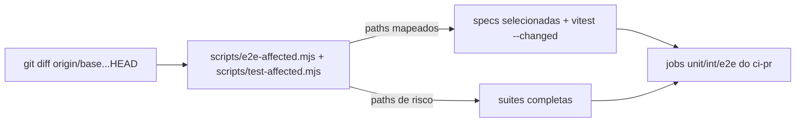

# Testes afetados pelo diff no PR — vitest --changed + manifesto path→spec e2e

Status: entregue (2026-07-30 — executado em sessão única, fora do fluxo agent:register, a pedido do humano)
Atualizado em: 2026-07-30
Issue: —
Priority: P1
Model: composer-2.5
Impeccable: A — N/A (sem superfície UI)
Appetite: ~1–2 dias eng; script de seleção + manifesto + wiring nos jobs do OPS4 + pins
Responsável: —

## Dados → decisão → apresentação

Dados: N/A — infra de CI.

## Contexto

Com o ci-pr paralelizado (OPS4), o próximo corte é rodar **só o que o diff toca** em PRs de feature branch: hoje um PR de copy roda 523 testes int + 522 unit + build. Vitest suporta `--changed` contra uma base git; Playwright `--only-changed` **não** cobre mudanças em `src/` (specs e2e não importam o app), então a seleção e2e precisa de um **manifesto path → spec** curado no repo. Push em `stage`/`main` sempre roda suíte completa (decisão OPS4).

Decisão de produto (2026-07-30, brief do lote CI): fallback para suíte completa quando o diff tocar paths de alto risco — migrations, lockfile, configs de teste, seed manifest, collections/globals.

## Objetivos

- Job `unit`/`int` no ci-pr roda `vitest --changed origin/$GITHUB_BASE_REF` (fallback full nos paths de risco).
- Job `e2e` no ci-pr roda specs mapeadas pelo manifesto; fallback full idem.
- `scripts/e2e-affected.mjs` (ou equivalente) imprime a lista de specs e o motivo (decisão auditável no log do CI).
- Pins: unit test do manifesto (path→spec existe, spec existe no disco) + comportamento de fallback.

## Decisões travadas

- **Manifesto e2e = dados no repo, não inferência por import.** e2e não importa `src/`; a única fonte de verdade é uma tabela curada. **Rejeitado:** heurística por nome de spec (frágil — `campaignZoneMap` ≠ pasta `map/`); trace estático Playwright→app (não existe aresta de import).
- **Fallback full em paths de alto risco** (lista congelada no script): `src/migrations/`, `src/payload-types.ts`, `pnpm-lock.yaml`, `package.json`, `vitest*.config.*`, `playwright.config.ts`, `scripts/lib/seed-minimal-manifest.mjs`, `scripts/seed-minimal.mjs`, `src/collections/`, `src/globals/`, `src/payload.config.ts`, `tests/helpers/`, `tests/e2e/fixtures/`, `.env*`. **Rejeitado:** fallback por "mais de N arquivos" (tamanho ≠ risco); lista aberta por glob no workflow (regra fora de teste unitário).
- **Seleção só no ci-pr; `ci.yml`/`ci-stage.yml` sempre full.** Rede de segurança por alvo (decisão OPS4). **Rejeitado:** affected também no main (derrota o propósito do gate pós-merge).
- **`--changed` com fallback para full quando vitest retorna conjunto vazio mas o diff toca `src/`** (ex.: arquivo novo sem spec importando). **Rejeitado:** aceitar conjunto vazio como "nada a rodar" (falso verde em código novo sem teste ligado).

## Questões em aberto

- **e2e bloqueante no PR desde o dia 1?** **Decidido no gate (humano, 2026-07-30): bloqueante já.** A alternativa de 2 semanas em `continue-on-error` para calibrar o manifesto foi rejeitada pelo humano ("já resolve logo nessa sessão"). O manifesto fica visível nos logs (`unmapped`) para calibração contínua.

## Abordagem proposta

Componentes:

- **`scripts/test-affected.mjs`** — computa diff vs `GITHUB_BASE_REF` (default `origin/stage`), aplica a lista de risco, emite `{ mode: 'full' | 'changed' }` + args vitest. Consumido pelos jobs `unit` e `int`.
- **`scripts/e2e-affected.mjs` + `scripts/lib/e2e-affected-manifest.mjs`** — tabela prefixo→specs. Esboço inicial (17 specs em `tests/e2e/`):
  - `src/app/(campaign)/campanha/(app)/municipios`, `src/components/campaign/municipality`, `src/utilities/municipality/` → `campaignMunicipalities`, `campaignZoneMap`, `campaignNearestMunicipality`, `campaignSavedFilters`, `campaignColumnPicker`
  - `…/atividades`, `components/campaign/activity` → `campaignActivity`
  - `…/liderancas`, `components/campaign/leadership` → `campaignLeaderships`
  - `…/territorios`, `components/campaign/territory` → `campaignTerritories`
  - `campanha/login`, `utilities/campaignAuth`, `utilities/webauthn/` → `campaignAuth`, `campaignWebAuthn`
  - `…/conceitos` → `campaignConcepts`; dashboard/home → `campaignHomeActions`
  - `components/campaign/shell`, PWA → `campaign-pwa`, `campaignWizardChrome`
  - `src/app/(payload)` → `admin`; `src/app/(frontend)` → `frontend`
  - qualquer outro `src/` não mapeado → log explícito "sem spec mapeada" (modo e2e: nenhuma; o gap fica visível no log para o humano julgar — decisão: não falhar, e2e é camada fina sobre int).
- **`.github/workflows/ci-pr.yml`** — jobs `unit`/`int`/`e2e` (do OPS4) consomem os scripts; step de diff com `fetch-depth: 0` no checkout.
- **Tests** — `tests/unit/testAffected.unit.spec.ts` + `tests/unit/e2eAffectedManifest.unit.spec.ts` (manifesto aponta para specs existentes; paths de risco disparam full).

Sem migration, sem código de app.

## Dependências

- **OPS4** (jobs paralelos existem para receber a seleção) — dura.
- Reusa: padrão `scripts/lib/` (B5 F2), `tests/helpers/assertTestDatabase.ts` não é tocado.

## Não escopo

- Seleção de unit por manifesto (vitest `--changed` resolve por import graph real).
- Cache de resultados de teste entre runs (Turborepo-style) — sem evidência de necessidade.
- Nightly full e2e → OPS4 (adiado lá).

## Rabbit holes

- **Manifesto vira segundo grafo de dependências.** Se alguém "só completar" granularidade por arquivo, vira manutenção morta. **Mitigação:** granularidade de prefixo de domínio; pin de unit test só na existência, não na completude.
- **`vitest --changed` com worktrees/forks sem base fetchada.** `fetch-depth: 0` no checkout; fallback full se o merge-base não resolver (log + exit code do script).

## Adiado com gatilho

- **Completude do manifesto enforced (falhar CI quando `src/` novo não mapeia).** Revisitar quando: 3º fallback full causado por prefixo ausente.

## Referências

- `tests/e2e/` (17 specs + fixtures), `playwright.config.ts`, `vitest.unit.config.mts`, `vitest.config.mts`
- `.github/workflows/ci-pr.yml` (jobs do OPS4)
- `docs/AGENT-OPS.md` — linha E2E da tabela "CI por alvo" (atualizar neste item)
- Vitest `--changed`: https://vitest.dev/guide/cli.html#changed
