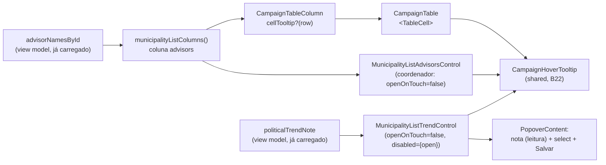

# Tooltip de conteúdo nas células das listas

Status: entregue
Atualizado em: 2026-07-26
Item do roadmap: [docs/roadmap.md](../roadmap.md) (Trilha B, item **B23**)
Impeccable: B — encaixe nas células "Assessores" e "Tendência" já existentes de `/campanha/municipios`, com a capacidade promovida para o sistema de listas compartilhado (`CampaignTable`)
Appetite: ~0,4 dia eng (revisado 2026-07-26 — a capacidade genérica de `cellTooltip`/`CampaignHoverTooltip` já tinha sido entregue de graça pelo **E10**, ver nota abaixo; o que restava era só os dois consumidores + `openOnTouch`/`disabled`); orçamento original ~0,75d
Responsável: —

> **Nota de fechamento (2026-07-26):** quando este item foi implementado, `cellTooltip` em `CampaignTableColumn`, `CampaignCellTooltip` e a promoção de `MunicipalityHoverTooltip` → `shared/CampaignHoverTooltip` **já existiam no código**, entregues como efeito colateral do **E10** (2026-07-25, coluna "Classe"). O texto abaixo ("Contexto", parte de "Decisões travadas") foi escrito antes disso e ainda descreve essa promoção como trabalho deste item — histórico, não corrigido retroativamente. O que este item de fato implementou: `openOnTouch`/`disabled` em `CampaignHoverTooltip`, `formatAdvisorNamesTooltip`, e os dois consumidores (célula "Assessores" nos dois papéis + célula "Tendência" com a nota lida no Popover).

## Design (Impeccable)

Âncoras: `PRODUCT.md` (princípio 2 — clareza sob pressão; princípio 3 — edit where you see; anti-goal spreadsheet/data-grid) / `DESIGN.md` (register `product`, Field Desk) · tema `data-theme='campaign'` · shells existentes: `CampaignTable` (`src/components/campaign/shared/CampaignTable.tsx`), `MunicipalityHoverTooltip` → `CampaignHoverTooltip` (**B22**), `MunicipalityAdvisorAvatarStack`, `MunicipalityListAdvisorsControl`.

Na implementação (`implement-roadmap-item`): craft compacto → critique → polish. `harden`/`optimize` só sob gatilho do Passo 8 (não há dado novo, escrita, PII nem query nova neste item).

Brief compacto:

- **Persona / contexto:** Alex (Coordenador Geral) e o assessor varrendo a tabela de 435 municípios no desktop. A coluna "Assessores" mostra hoje até 3 avatares com **iniciais** (`campaignUserInitials`) — dois assessores com as mesmas iniciais são indistinguíveis, e a partir do 4º nem avatar existe. O nome completo só aparece para leitor de tela (`sr-only`) ou abrindo o Popover de edição (só coordenador). Na coluna "Tendência", o mesmo varredor lê "AUMENTO"/"QUEDA" e não sabe **por quê**: a justificativa existe (`politicalTrend.note`, semeada em massa pelo E4R) e já está carregada na célula, mas só trafega como `<input type="hidden">`.
- **Job principal:** saber **quem** responde por este município — e **por que** a tendência dele é essa — sem tirar os olhos da linha nem abrir nada.
- **Estratégia de cor:** Restrained — a tooltip não introduz cor nova; usa o `TooltipContent` do tema.
- **Edit where you see:** preservado — no papel coordenador a célula continua sendo o gatilho do Popover de edição (B9/B19); a tooltip é uma camada de **leitura** que não pode roubar o clique nem competir com ele.
- **Anti-goals:** tooltip que atrasa/rouba o clique do Popover de assessores; tooltip em toda célula "por garantia" (ruído em 9 colunas × 435 linhas); cartão rico dentro da tooltip (mini-perfil, foto, métricas) — isso é o detalhe do município/assessor; novos tab stops no corpo da tabela.

## Dados → decisão → apresentação

- **Vou apresentar dados?** Não como métrica: `Dados: N/A` — a tooltip mostra **conteúdo já carregado** no view model (nomes em `advisorNamesById`, justificativa em `politicalTrendNote`), sem número, série, agregado ou query nova.
- **Decisões desbloqueadas:** Coordenador: "quem cobro por este município?" e "esta linha prioritária está com o assessor certo — reatribuo?" (hoje resolvido só abrindo o Popover linha a linha). Coordenador/assessor, na tendência: "esta QUEDA é boato de bastidor ou perda concreta de vereador — vale abrir demanda/marcar visita, ou seguir a fila?" (hoje exige abrir o detalhe do município).
- **Forma escolhida:** texto curto (nomes, um por linha; ou a nota crua) na tooltip de hover/foco da própria célula — o degrau mais pobre que resolve. **Rejeitado:** coluna de nomes por extenso ou coluna "Justificativa" (estouram a largura de uma tabela já com 9 colunas, e texto livre longo destrói a densidade de 435 linhas); expandir o stack para todos os avatares (iniciais continuam ambíguas); linha expansível (segundo modelo de interação numa lista que já tem Popover); abrir o Popover só para ler (custa clique e mistura leitura com escrita); resumir/derivar a nota (inventar semântica sobre texto livre da mesa).
- **Anti-goals de dado:** nada de KPI, sparkline ou contagem derivada dentro de tooltip — se um número precisar de explicação, o lugar é a célula (E8/E9) ou o header (**B22**).

## Contexto

O Pass 2 W1 transformou as listas de `/campanha` num sistema: colunas são dado (`CampaignTableColumn` com `id`/`head`/`cell`/`cellClassName` + seams `mandatory`/`defaultVisible`), a tabela é server component e a interatividade vive em ilhas referenciadas pelas definições. Oito superfícies usam esse shell.

O primitivo de tooltip existe e é bom: `MunicipalityHoverTooltip` (`src/components/campaign/municipality/MunicipalityHoverTooltip.tsx`) resolve hover, foco de teclado **e** tap em touch (Radix ignora pointer de toque no `TooltipTrigger`), com dismiss por `pointerdown` que trata o próprio conteúdo como "dentro" — comportamento conquistado no critique do E18. Ele está preso ao domínio `municipality` e só é usado em **headers** (`MunicipalitySortableHead`) e em dois cards. **B22** promove esse primitivo para `src/components/campaign/shared/CampaignHoverTooltip.tsx` e dá explicação a cada header.

Falta o lado das **células**: `CampaignTable` renderiza `column.cell(row)` cru dentro do `<TableCell>` e não oferece nenhuma forma declarativa de explicar o conteúdo da célula. O caso que motivou o pedido é a coluna "Assessores" de `/campanha/municipios` (`MunicipalityList.tsx` ~290–320): papel assessor vê `MunicipalityAdvisorAvatarStack` (até 3 avatares de iniciais + `sr-only` com todos os nomes); papel coordenador vê o mesmo stack dentro do gatilho do `MunicipalityListAdvisorsControl` (Popover de edição). Em nenhum dos dois o nome é legível a olho.

O segundo caso, pedido no mesmo dia, é a coluna **"Tendência"** (staff-only, `MunicipalityList.tsx` ~321–337 + card mobile ~456–467). `municipality.politicalTrend` é um group com `status` (`desfavoravel | neutra | favoravel`), `note` (texto livre) e a auditoria `recordedBy`/`recordedAt` derivada em `beforeChange` (`src/collections/Municipality.ts`). O **E4R ✓** preencheu esse group em massa: SITUAÇÃO da planilha virou `status` e a `note` carrega a justificativa da mesa mais a nota de proveniência. A célula renderiza `MunicipalityListTrendControl` — um `PopoverTrigger` com o Badge do status que abre o select de edição rápida (B9) — e **já recebe a nota** (`trendNote`), apenas para reemiti-la num `<input type="hidden">` e não perdê-la ao salvar o status. O dado está na célula, invisível; para lê-lo é preciso abrir `/campanha/municipios/<slug>`, onde `MunicipalityStrategyCard` o mostra no bloco "Tendência política".

Pedidos de produto (2026-07-25): (a) tooltip no hover dos assessores mostrando os nomes, **implementado como capacidade genérica da célula no componente de listas**, reutilizável em outros campos e páginas; (b) tooltip no hover da coluna "Tendência" com a justificativa como conteúdo, **sem tooltip quando não houver justificativa**.

## Objetivos

- Passar o mouse (ou focar, ou tocar) na célula de assessores de `/campanha/municipios` revela os nomes completos de **todos** os assessores do município — inclusive os que não couberam nos 3 avatares.
- A capacidade é do **sistema de listas**: qualquer coluna de qualquer superfície que use `CampaignTable` declara `cellTooltip` e ganha o mesmo comportamento, sem componente novo por página.
- Passar o mouse (ou focar) na célula de tendência revela a justificativa registrada; sem justificativa, nada muda em relação a hoje (nenhuma tooltip vazia, nenhum "—").
- Nas células que já são gatilho de edição (assessores no papel coordenador, tendência para todo staff) a tooltip **não** interfere no Popover: o clique/tap continua abrindo a edição na primeira interação, e a informação continua alcançável por lá em touch.
- Zero tab stops novos no corpo da tabela; a informação continua disponível a leitores de tela pelo texto já presente na célula.
- Sem migration, sem collection, sem server action, sem query nova (os nomes já vêm em `advisorNamesById`) e sem mudança de contrato de URL. Nada muda para o papel `leader`.

## Decisões travadas

- **A tooltip de célula é campo de `CampaignTableColumn` (`cellTooltip?: (row) => ReactNode`), renderizado pela `CampaignTable`.** Diferente do header — que **B22** decidiu manter como prop dos componentes de head, porque `head` é um `ReactNode` opaco (ilha cliente que possui `aria-sort` e o Popover de filtro) —, a célula **já** é uma função `(row) => ReactNode` que a tabela renderiza dentro de um `<TableCell>` que ela mesma controla. É o ponto natural da capacidade, e sobrevive ao **B17** (uma coluna escondida leva sua tooltip junto). **Rejeitado:** repetir o padrão do header e pedir que cada célula se envolva sozinha (a capacidade não seria do sistema — foi exatamente o pedido do produto); `cloneElement` sobre o retorno de `cell` (frágil com fragmentos e múltiplos filhos).
- **Um único primitivo compartilhado: `CampaignHoverTooltip` (o `MunicipalityHoverTooltip` promovido pelo B22).** Se o **B22** ainda não tiver sido implementado quando este item começar, **este item faz a promoção** (mover + atualizar os 3 call sites + comentário de cabeçalho, knip em zero) e o B22 passa a só consumir. **Rejeitado:** segundo componente de tooltip para células (duas implementações de touch divergindo — o dismiss por `pointerdown` já custou um critique); `title=` nativo (sem touch, sem estilo, atraso do SO).
- **Sem novos tab stops no corpo da tabela: a tooltip é afford­ance redundante, nunca a única fonte da informação.** O wrapper da célula não recebe `tabIndex`; quem já tem controle focável dentro (o gatilho do Popover de assessores) segue focável e ganha a tooltip por foco de graça. A regra do contrato: só declara `cellTooltip` a coluna cujo conteúdo já é acessível por texto na célula (visível ou `sr-only`, como o stack de avatares faz). **Rejeitado:** `tabIndex={0}` no wrapper (435 linhas × N colunas de tab stops mortos, e a leitura de tela passaria a ouvir o nome duas vezes); virar `role="grid"` com roving tabindex (redesenho de acessibilidade fora do appetite — ver Rabbit holes).
- **Na célula editável (assessores do coordenador, tendência), a tooltip é hover/foco apenas — o toque é do Popover.** `CampaignHoverTooltip` ganha `openOnTouch` (default `true`, o comportamento de hoje) e a supressão explícita `disabled` (ligada ao `open` do Popover, para a tooltip não ficar viva por trás do `PopoverContent`). Essas células passam `openOnTouch={false}`, porque um tap ali deve abrir a edição. **Rejeitado:** deixar o tap alternar os dois (o mesmo gesto abrindo tooltip e Popover é o defeito clássico de composição Radix); long-press para a tooltip (gesto não descoberto, conflita com a seleção de texto do SO); não pôr tooltip nenhuma nas células editáveis (é justamente onde Alex, a persona que mais varre a lista, está).
- **Em touch, o conteúdo escondido aparece dentro do próprio Popover.** O de assessores já lista todos os nomes com checkbox; o de tendência passa a exibir a justificativa como **leitura** acima do select (o `<input type="hidden" name="trendNote">` continua intacto — é ele que preserva a nota no save do status). Assim a informação deixa de ser inalcançável em metade do uso de campo. **Rejeitado:** aceitar que o mobile não veja a justificativa; transformar a nota em textarea no Popover (ver Não escopo).
- **Sem conteúdo, sem tooltip.** `cellTooltip` que retorna vazio/`null` para a linha não gera wrapper algum — vale para município sem assessor (a célula já diz "sem responsável" por extenso) e para tendência sem nota, que é a maioria das linhas. Pedido explícito de produto (2026-07-25). **Rejeitado:** tooltip com placeholder ("Sem justificativa"); CTA "adicionar justificativa" no hover (a escrita da nota mora no form de estratégia).
- **A nota de tendência entra crua, sem truncar no servidor.** É texto curto da mesa; a contenção é visual (`max-w-xs` já no `TooltipContent` + `whitespace-pre-wrap`). **Rejeitado:** cortar em N caracteres com "…" (esconde justamente a parte que decide, e a lista não tem "ver mais"); separar justificativa de nota de proveniência (parser de planilha dentro da UI — ver Rabbit holes).
- **i18n e naming** seguem o AGENTS.md: identificadores em inglês (`cellTooltip`, `CampaignHoverTooltip`, `openOnTouch`, `disabled`, `formatAdvisorNamesTooltip`), strings visíveis em pt-BR.

## Questões em aberto

- **A tooltip de assessores mostra só nomes ou nome + papel/e-mail?** **Opções:** A) só os nomes, um por linha | B) nomes + e-mail | C) nomes + nº de municípios da carteira. **Recomendação:** **A** — e-mail é leitura privilegiada que hoje só o `advisorData` do B19 faz atrás do gate de rota, e carteira exigiria agregado novo; a tooltip serve a "quem cobro?", não a um mini-perfil. Quem precisa de mais tem `/campanha/assessores`. _(assumido)_
- **Existe afford­ance visual de que a célula tem tooltip?** **Opções:** A) nenhuma (descoberta por hover; o cursor já muda no gatilho do Popover) | B) sublinhado pontilhado como o do header no B22 | C) `cursor-help`. **Recomendação:** **A** nas duas células desta entrega — avatares e Badge já leem como interativos, e sublinhado pontilhado sob eles introduziria um segundo vocabulário tipográfico. Reavaliar junto com o **B22** (que decide o pontilhado dos headers) e no critique do **R6**, quando uma coluna de **texto puro** adotar a capacidade. _(assumido)_
- **A tooltip de tendência mostra só a nota, ou nota + "Registrada por X em DD/MM"?** **Opções:** A) só a nota | B) nota + autoria/data | C) nota + data. **Recomendação:** **A** — `recordedBy`/`recordedAt` não estão no view model da lista (só no de estratégia); trazê-los pediria mudança de loader/`select` por um dado que não muda a decisão de campo. Autoria continua no detalhe. _(assumido)_
- **Quais colunas entram neste item?** **Opções:** A) só Assessores | B) Assessores + Tendência | C) também Território (texto truncável) | D) varrer as 8 listas. **Recomendação:** **B** — as duas foram pedidas por produto no mesmo dia (2026-07-25) e exercitam os dois modos do contrato (célula de leitura e célula que é gatilho de Popover), o que valida a capacidade antes de espalhá-la. As demais entram quando alguém não conseguir ler a célula, com a capacidade já pronta (ver Adiado com gatilho). B21 (territórios) nasce podendo usar.

## Abordagem proposta

Componentes:

- **`CampaignTableColumn`** (`src/components/campaign/shared/CampaignTable.tsx`): novo campo opcional `cellTooltip?: (row: Row) => ReactNode`. Quando a função existe **e** retorna conteúdo não vazio para aquela linha, a `CampaignTable` envolve `column.cell(row)` num `CampaignHoverTooltip` cujo gatilho é um `` (sem `tabIndex`, sem `role`); caso contrário o render é byte a byte o de hoje. Documentar no JSDoc do tipo a regra de acessibilidade (conteúdo redundante) ao lado dos seams do B17.
- **`CampaignHoverTooltip`** (`src/components/campaign/shared/…`, promovido no B22 ou aqui): duas props novas, opcionais e sem efeito nos call sites atuais — `openOnTouch?: boolean` (default `true`) que desliga o toggle por `pointerType === 'touch'` e o listener de `pointerdown`, e `disabled?: boolean` que força `open = false` e ignora reaberturas enquanto verdadeiro (usado por quem também abre um Popover). Hover e foco ficam intactos; o comentário de cabeçalho — que documenta o controle manual de `open`, herdado do critique do E18 — ganha o caso "gatilho que também abre Popover".
- **`MunicipalityList.tsx`** (~290–320): a coluna `advisors` passa `cellTooltip: (municipality) => formatAdvisorNamesTooltip(advisorEntries(municipality, advisorNamesById))`, que retorna `null` quando não há assessor (a célula já diz "Sem responsável"/"Sem assessor" por extenso — tooltip ali seria eco).
- **`MunicipalityListAdvisorsControl`** (`src/components/campaign/municipality/…`): envolve o próprio `PopoverTrigger` no `CampaignHoverTooltip` com `openOnTouch={false}`; a coluna não aplica a tooltip genérica nesse papel (senão haveria duas). A composição fica local porque só ela precisa conviver com um Popover.
- **`formatAdvisorNamesTooltip`** (helper pequeno junto de `MunicipalityAdvisorAvatarStack.tsx`, onde as entradas de avatar já vivem): recebe `MunicipalityAdvisorAvatarEntry[]` e devolve a lista em pt-BR (um nome por linha) ou `null`.
- **`MunicipalityListTrendControl`** (`src/components/campaign/municipality/…`): extrai o botão-gatilho atual para uma variável e o envolve no `CampaignHoverTooltip` **apenas** quando `trendNote?.trim()` for não vazio (`disabled={open}`, `openOnTouch={false}`, `side="bottom"`, `align="start"`) — a coluna não declara `cellTooltip` para tendência, pela mesma razão da célula de assessores do coordenador (senão haveria duas). Dentro do `PopoverContent`, acima do `Field`, um `
` com a nota quando existir; o `<input type="hidden" name="trendNote">` permanece como está.
- **Testes**: unit do helper de nomes (vazio → `null`; 1, 3 e 5 nomes) + unit do contrato da tabela garantindo que uma coluna sem `cellTooltip` renderiza a célula sem wrapper (protege o `overflow-x-visible`/sticky header da lista de municípios contra regressão de layout) + unit em `tests/unit/campaignComponents.unit.spec.ts` (família já pinada) de que o gatilho de tendência ganha a nota como descrição quando ela existe e nenhuma tooltip quando não existe.
- **Sem migration, sem collection, sem server action.**

## Dependências

- **Suave: B22** (promoção de `MunicipalityHoverTooltip` → `shared/CampaignHoverTooltip`). Quem chegar primeiro faz a promoção; nenhum dos dois bloqueia o outro. Ordem preferida: B22 antes (mesmo appetite, e deixa o primitivo já no lugar).
- Suaves já entregues: **Pass 2 W1** (colunas como dado em `CampaignTable`), **B19 ✓** (o Popover de assessores e a carteira que dá sentido aos nomes), **E9 ✓** (badge "sem responsável" que a tooltip não deve duplicar), **B9** (edição rápida na célula — é o gatilho que as duas células compartilham), **E4R ✓** (quem populou as notas de tendência em massa; sem ele o hover da tendência explicaria pouco).
- Reusa sem alterar: `MunicipalityListViewModel.politicalTrendNote` (`src/utilities/municipalityViewModels.ts`) e `advisorNamesById` — nenhuma mudança de loader, `select` ou query.
- **B17** (seletor de colunas) e **B21** (territórios) são consumidores futuros, não dependências.

## Não escopo

- Copy/tooltip de **header** por coluna — é o **B22**; este item cuida do conteúdo da célula. Em particular, explicar **o que a coluna "Tendência" mede** é B22; aqui só aparece a justificativa daquela linha.
- Tooltip nas outras colunas de municípios e nas outras 7 listas — capacidade pronta, adoção sob demanda (ver Adiado com gatilho).
- **Editar a justificativa pela lista** — continua no form de estratégia (`MunicipalityStrategyForm` / `/campanha/municipios/<slug>/editar`); a Popover da lista é single-field por decisão do B9, e um textarea ali a transformaria em formulário.
- Autoria/data da tendência na lista (ver Questões em aberto) e qualquer mudança em `recordedBy`/`recordedAt`.
- Cards mobile de `/campanha/municipios`: já mostram os nomes de assessores por extenso (`names.join(', ')`); a justificativa da tendência chega pelo mesmo Popover do card — nada específico a fazer.
- Mini-perfil do assessor (e-mail, carteira, contato) — é `/campanha/assessores` (**B19 ✓**).
- Truncamento inteligente de texto com "…" + tooltip automática por overflow — ver Rabbit holes.

## Rabbit holes

- **Detectar overflow para "só mostrar tooltip quando truncar".** Se alguém "só completar": `ResizeObserver`/medição por célula em 435 linhas × N colunas, re-render em resize, e a tabela deixa de ser server component barata. **Mitigação neste item:** a tooltip é declarada pela coluna, nunca inferida do layout.
- **Transformar a tooltip em cartão rico (HoverCard) com foto, e-mail e carteira.** Explode em leitura privilegiada de e-mail fora do gate do B19, novo loader e decisão de access. **Mitigação:** decisão travada "só nomes"; caminho de aprofundamento é `/campanha/assessores`.
- **Tornar as células focáveis "por acessibilidade".** Puxa `role="grid"` + roving tabindex + revisão das 8 listas. **Mitigação:** contrato de que a tooltip é redundante; o texto acessível continua na célula.
- **Composição Tooltip + Popover no mesmo gatilho.** Se tratada de passagem, dá tap duplo, foco preso ao fechar o Popover e tooltip presa aberta. **Mitigação:** `openOnTouch={false}` + `disabled={open}` nas células editáveis e verificação explícita no critique (abrir/fechar o Popover por teclado sem tooltip órfã).
- **Sanitizar/normalizar a nota do E4R** (separar a justificativa da nota de proveniência, parsear a célula crua da planilha). Vira parser de planilha dentro da UI. **Mitigação:** exibir cru; qualquer normalização é decisão do seed (E4R), não da lista.
- **"Já que a nota está no hover, deixa editar por ali."** Vira textarea no Popover, validação de tamanho, conflito com o hidden input e um segundo caminho de escrita para o mesmo campo. **Mitigação:** leitura apenas (Não escopo acima).

## Adiado com gatilho

- **Adotar `cellTooltip` em outras colunas/listas** (Território truncado, dobradinhas por município). Revisitar quando: alguém do time relatar em sessão/R6 não conseguir ler uma célula, ou quando uma coluna nova nascer com conteúdo abreviado.
- **Justificativa em tooltip nas outras superfícies de tendência** (`MunicipalityStrategyCard`, dossiê). Revisitar quando: alguma delas passar a esconder a nota por densidade — hoje ambas a exibem por extenso.
- **Afford­ance visual (sublinhado pontilhado) na célula.** Revisitar quando: a primeira coluna de **texto** adotar a capacidade, ou o critique do R6 registrar falha de descoberta.
- **Paridade de leitor de tela para a nota de tendência.** A célula de assessores expõe todos os nomes em `sr-only` independente de hover (`MunicipalityAdvisorAvatarStack`); a de tendência não tem equivalente — `trendNote` só existe dentro do `CampaignHoverTooltip`/`PopoverContent`, ambos lazy-mount (contrato pinado em `campaignComponents.unit.spec.ts`: `not.toContain(trendNote)` na renderização estática). Achado do `/simplify` pós-rebase (2026-07-26), não corrigido nesta entrega porque adicionar um `sr-only` ali quebraria esse contrato de propósito e pede decisão explícita se a paridade vale o "duplo anúncio" para leitor de tela. Revisitar quando: um relato de acessibilidade real aparecer, ou o critique do R6 flagar hover-only content de novo.
- **Wrapper compartilhado `Popover` + `CampaignHoverTooltip`.** `MunicipalityListAdvisorsControl` e `MunicipalityListTrendControl` repetem a mesma composição (`openOnTouch={false}`, `disabled={open}`, `align="start"`) — 2º call site, abaixo do piso de 3 para extrair (achado do `/simplify` pós-rebase, 2026-07-26). Revisitar quando: uma 3ª célula precisar da mesma combinação Popover+tooltip (checado nesta sessão: `MunicipalityListSignalControl`/B26 não precisa — o `aria-label` do gatilho já carrega o texto por extenso).

## Referências

- `docs/roadmap.md` (Trilha B — "Demais itens abertos", grafo, Janela 1–2, Cortes seguros)
- `src/components/campaign/shared/CampaignTable.tsx` — `CampaignTableColumn`, render de `<TableCell>`, seams do B17
- `src/components/campaign/municipality/MunicipalityList.tsx` (~186–337, 450–500) — colunas `advisors` e `trend`, `advisorEntries`, card mobile
- `src/components/campaign/municipality/MunicipalityAdvisorAvatarStack.tsx` — stack de iniciais + `sr-only` (base da regra de redundância) e `MissingAdvisorBadge`
- `src/components/campaign/municipality/MunicipalityListAdvisorsControl.tsx` — Popover de edição que a tooltip não pode atrapalhar
- `src/components/campaign/municipality/MunicipalityListTrendControl.tsx` — gatilho da tendência, Popover de edição rápida e o `trendNote` hoje só em hidden input
- `src/utilities/municipalityViewModels.ts` — `politicalTrendNote` já no view model da lista (nenhuma mudança necessária)
- `src/collections/Municipality.ts` — group `politicalTrend` (status/note/auditoria derivada)
- `src/components/campaign/municipality/MunicipalityStrategyCard.tsx` — onde a nota aparece hoje (referência de copy)
- `docs/plans/import-planilha-projecao.md` (**E4R ✓**) — origem das notas de tendência (SITUAÇÃO + nota de proveniência)
- `src/components/campaign/municipality/MunicipalityHoverTooltip.tsx` — primitivo (hover/foco/tap + dismiss por `pointerdown`) a compartilhar
- `docs/plans/explicacao-colunas-header-listas.md` (**B22**) — decisão irmã no header e a promoção para `shared/`
- `docs/plans/gerenciar-assessores.md` (**B19**) — carteira de assessores e leitura privilegiada de e-mail (por que ela fica fora da tooltip)
- AGENTS.md — naming (identificadores em inglês / copy pt-BR), client boundary (`'use client'` só nas ilhas), knip zero após o move
- `PRODUCT.md` / `DESIGN.md` — Field Desk, clareza sob pressão, edit where you see, anti-goal data-grid
