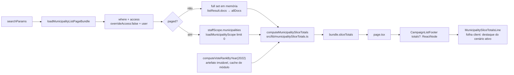

# Impl: Totais do recorte na lista de municípios (votos 2022 + expectativas 2026)

Status: aprovado (gate humano 2026-09-15)
Atualizado em: 2026-09-15
Issue: #1005
Intenção: docs/plans/totais-recorte-lista-municipios.md
Appetite restante: herdado — ~0,5–1 dia eng, sem corte (a abordagem não adiciona consulta nova)

## Leitura da intenção

- **Outcome:** no rodapé de `/campanha/municipios`, uma linha compacta soma o recorte filtrado **inteiro** (não a página visível): votos Solla 2022 + expectativa 2026 nos três cenários, mais "N de M com expectativa" — com o mesmo escopo de acesso das linhas e sem reabrir o bloco de overview que o B129 removeu.
- **O que NÃO negociar:** somas de todas as páginas; mesma fonte por linha (`computeVoteRankByYear`); Salvador conta uma vez (cidade **ou** 19 ZE); expectativas somam as ZE e a cidade nunca entra; assessor soma só o que enxerga; Liderança segue bloqueada; sem pledges, médias, percentuais ou cobertura; sem linha dentro da tabela (tfoot) nem bloco nos cards; rodapé compartilhado idêntico nas outras listas; recorte vazio não inventa totais e "nenhuma expectativa" não vira "0".
- **O que reavaliar (hipóteses da intenção):**
  - _"sem consulta nova se os dados do recorte já estiverem carregados"_ — confirmado: para **todo** o staff (inclui assessor — `isCampaignStaff`), o conjunto filtrado completo já está em memória: `staffScope.municipalities` (`municipalityPageData.ts:529-541`, `limit: 0`) na trilha paginada e `listResult.docs`/`allDocs` na trilha load-all. Zero consultas novas.
  - _"o cenário ativo hoje é estado local do cliente"_ — a linha mostra os três sempre, mas o destaque do cenário ativo exige uma folha client (decisão em Componentes).
  - _"o assessor nunca vê total maior que a carteira"_ — o B178 já expõe a linha da cidade (agregado das 19 ZE) ao assessor que busca "salvador" (`municipalityPageData.ts:481`); o total apenas espelha as linhas visíveis. É semântica de linha herdada, não canal novo (registrado em Riscos).

## Abordagem recomendada

**Opções consideradas:** A | B | C
**Recomendação:** **A** — somar no loader sobre o conjunto filtrado completo já carregado (fonte: `staffScope.municipalities` na trilha paginada; `allDocs` na load-all), com a matemática pura num módulo novo de `src/lib` (`municipalitySliceTotals.ts`). Porque não adiciona consulta alguma, usa exatamente o mesmo `where`+`user` que produziu as linhas (escopo e soma são o mesmo objeto), reusa o artefato memoizado que já alimenta `votePosition2022` por linha e cabe no appetite.
**Rejeitadas:**

- **B — agregado SQL/drizzle espelhando `supporterListOverviewAggregate`:** a soma de 2022 não existe no banco (fonte é o artefato commitado por slug), então o SQL ainda precisaria da lista completa de slugs; duplicaria `where`+access em SQL cru; cobre só 3 das 4 somas; e o recorte tem ≤436 linhas — o custo não se paga.
- **C — reusar `loadTerritoryOverview`/`territoryOverview`:** roda com `overrideAccess: true`, mistura pledges (`expected[S] ?? declared`), fixa um único cenário e carrega cobertura/metas/lideranças que a v1 não usa — viola a decisão "sem pledges" e o escopo de access.
- Também rejeitado: qualquer cache cross-request (`unstable_cache`/`cache()` novo) — o total é user-scoped.

### Componentes / mudanças

- **`computeMunicipalitySliceTotals`** (`src/lib/municipalitySliceTotals.ts`, novo, puro/client-safe): recebe linhas `{ slug, expectedVotes? }` e devolve `MunicipalitySliceTotals | null` (o ano é fixo em `DEFAULT_VOTE_RANK_YEAR` — a coluna e a linha são 2022, um parâmetro de ano sem call site seria abstração especulativa). Nome em inglês (`slice`) por AGENTS: o rascunho aprovado escrevia `recorte` nos identificadores; o termo fica só na copy pt-BR ("Total do recorte") e no `cityInRecorte` pré-existente (B178, fora do escopo):
  - `votes2022`: soma `computeVoteRankByYear(ano).get(slug)?.votes ?? 0`; se a linha da cidade está no conjunto, as 19 slugs de `salvadorCity.zoneSlugs` são puladas e o fold das MESMAS células entra **uma vez** (nunca `ranks.get('salvador')`, que não existe no artefato; nunca cidade + zonas). Sem a cidade, as ZE somam normalmente — e como a cidade não tem entrada no artefato, o total é idêntico nos dois arranjos (cidade **ou** zonas).
  - `expectedByScenario`: soma por cenário via `toVoteEstimateScenarioViewModel` + valores não nulos, **linha a linha inclusive quando a cidade está no recorte** (a cidade não carrega expectativa; as 19 ZE são a única fonte — só os VOTOS têm a escolha cidade-ou-zonas). Cenário que ninguém preencheu fica `null` (a UI mostra "—", nunca "0"); valores explícitos (inclusive 0) somam.
  - `withEstimateCount`: nº de linhas com ≥1 cenário preenchido (`hasAnyVoteEstimate`); `rowCount` = nº de linhas do recorte (denominador do "N de M", igual ao `totalDocs` exibido; inclui a linha virtual quando presente).
  - Conjunto vazio → `null` (o rodapé não renderiza a linha).
- **`loadMunicipalityListPageBundle`** (`src/utilities/municipality/municipalityPageData.ts:446-673`): novo campo `sliceTotals: MunicipalitySliceTotals | null` no `MunicipalityListPageBundle`; o early-return do líder (`:456-464`) ganha `sliceTotals: null`; cálculo no fim do loader a partir de `staffScope.municipalities` (trilha paginada) ou `allDocs` (load-all) — os mesmos docs que produzem `totalDocs`. **Sem consulta nova.**
- **`CampaignListFooter`** (`src/components/campaign/shared/CampaignListFooter.tsx:8-31`): novo prop opcional `totals?: ReactNode` renderizado entre a contagem e a paginação. Nenhuma outra mudança; as ~12 listas que não passam o prop ficam byte-idênticas.
- **`MunicipalitySliceTotalsLine`** (`src/components/campaign/municipality/MunicipalitySliceTotalsLine.tsx`, novo, `'use client'`): linha compacta com `data-slot="municipality-slice-totals"`; formata com `formatElectionNumber`; destaca o cenário ativo via `useMunicipalityEstimateScenarioOptional()` com fallback `DEFAULT_VOTE_ESTIMATE_SCENARIO` (mesmo padrão de `MunicipalityListExpectedVotesControl.tsx:73-74`); rótulos completos no `title` e um `sr-only` com `formatVoteEstimateScenarioAriaLabel` ("não informado") + a contagem — `aria-label` em `
` é ignorado por AT (achado do simplify). Sem estado próprio.
- **`MunicipalitiesPage`** (`src/app/(campaign)/campanha/(app)/municipios/page.tsx:79-86,199-206`): desestrutura `sliceTotals` e passa `totals={sliceTotals ? <MunicipalitySliceTotalsLine totals={sliceTotals} /> : undefined}`.
- **Migration:** sem migration (nenhuma collection/global/field novo).
- **Access / Consent:** nenhum helper novo; a soma lê só os docs já carregados com `user` + `overrideAccess: false`, então o escopo do total é literalmente o da query das linhas (não re-derivar com `getAdvisorMunicipalityIds`, que divergiria de `canReadMunicipality` no caso `visibility: 'tudo'`, `access/municipalities.ts:201`). Sem Consent/LGPD; sem PII (slug + expectedVotes). Gate `noLeader` da página e early-return do loader intactos.
- **UI:** Impeccable B — shape do rascunho aprovado → craft com os tokens da casa (`text-muted-foreground`, `border`, `bg-card`; o zinc do rascunho é mock), `tabular-nums`, wrap mobile → critique contra o anti-goal B129 e o rodapé compartilhado → polish dos estados vazio/sem expectativa.

### Dados → forma

- **Uma linha compacta no rodapé compartilhado** (decisão do gate): `Total do recorte: 2022 … · Pess. … · Média … · Otim. … · N de M com expectativa`, com o cenário ativo em destaque e os três sempre legíveis. Rótulos abreviados como no rascunho (com o rótulo completo em `title`/`aria`), ano "2022" igual ao da coluna.
- Rejeitadas: `tfoot`/linha na tabela (quebraria o header sticky e não cobre os cards mobile); bloco dedicado nos cards (duas superfícies para manter); overview acima da lista (anti-goal B129); tooltip-only (esconderia o número, que é o ponto do item).
- Sem médias, percentuais, cobertura, pledges ou seletor novo; números em pt-BR via `formatElectionNumber`; "—" para cenário sem nenhum preenchimento; frase secundária omitida quando `withEstimateCount === 0`.

## Fases verificáveis

1. **Tracer / server + testes** (~60% do appetite): módulo puro + campo no bundle + testes unit/int. Verificação: `pnpm test:unit` e `pnpm exec vitest run --config ./vitest.config.mts tests/int/municipalityPageData.int.spec.ts`.
2. **UI** (~30%): slot opcional no rodapé + folha client + fio na página; shape→craft→critique→polish (Impeccable B), conferindo desktop, mobile, recorte vazio e recorte sem expectativa contra `docs/plans/totais-recorte-lista-municipios-ui-draft.html`.
3. **Gates** (~10%): `pnpm gate:fast` (lint + typecheck + unit); int alvo; `node scripts/e2e-affected.mjs` (esperado: `campaignMunicipalities` selecionado pelos paths `src/utilities/municipality` e `src/components/campaign/municipality`); `pnpm test:e2e:affected`; `pnpm format:check`; push via `pnpm push`.

### Testes previstos

- **Unit `tests/unit/municipalitySliceTotals.unit.spec.ts`**: soma 2022 por slug contra `computeVoteRankByYear`; catálogo inteiro (sem cidade) = `getStatewideFederalTotals(2022)`; Salvador cidade+zonas e só zonas (ambos = fold da cidade, nunca 2×); **cidade presente ainda soma as expectativas das ZE** (o fold é só dos votos — regressão pega na conferência visual); conjunto vazio → `null`; sem expectativa → cenários `null` e contagem 0; soma parcial por cenário + contagem de linhas (não de cenários). (Unit roda com `DATABASE_URL` inválida — o módulo é puro.)
- **Int `tests/int/municipalityPageData.int.spec.ts` (estende)**: default do coordenador → `sliceTotals.rowCount === totalDocs === 436` e `votes2022 === getStatewideFederalTotals(2022).ownVotes`; trilha paginada (região sem a cidade + `sort: 'name'`) → 25 linhas visíveis mas `rowCount === totalDocs > 25` e soma independente por região; expectativas somadas por cenário e `withEstimateCount` (com uma linha toda `null`); `q: 'salvador'` → 20 linhas e 2022 = `cityFederalBaseline().votesByYear['2022']` (não cidade+zonas); `slug: ['salvador']` → 1 linha e 2022 = fold da cidade; assessor com carteira → total = carteira; assessor `visibility: 'tudo'` → espelha o catálogo (435); líder → `sliceTotals === null` (estende o pin `:445-461`); recorte vazio → `null`. A regra "cidade folda votos mas não expectativas" fica no unit: mutar `salvador-ze-1` por slug fixo violaria a disciplina do alocador (`testMunicipalityAllocatorConventions`).
- **E2E `tests/e2e/campaignMunicipalities.e2e.spec.ts`**: dois fluxos novos no describe B202 — recorte de 1 município (com `expectedVotes` do fixture) confere `2022` formatado + os três cenários no texto visível/sr-only e **nenhum** `table [data-slot="municipality-slice-totals"]` (guardrail B129); lista sem filtro soma o catálogo inteiro (contagem derivada do catálogo, não literal) até o `ownVotes` estadual (a string de settle `'436 municípios encontrados'` segue intocada).

## Rabbit holes / Não escopo (engenharia)

- Reusar `rollupMunicipalityStaffVotes` (`votePledgeViews.ts:118-153`): cai para pledges (`estimated[S] ?? declared`) — proibido na v1.
- Reusar `loadTerritoryOverview` (`territory/loadTerritoryOverview.ts:97-216`): `overrideAccess: true`, cenário único, pledges.
- Agregado SQL novo, cache cross-request, `cache()` novo: o total é user-scoped e os dados já estão em memória.
- Linha dentro da tabela (tfoot), bloco nos cards, overview acima da lista (B129), médias/percentuais/cobertura, pledges, seletor de cenário na URL, exportação.
- Mexer em `computeVoteRankByYear`/artefato, criar rank da cidade por slug, ou alterar células/ordenação existentes (a linha é aditiva).
- Reabrir a exposição B178 da linha da cidade ao assessor com `q` — o total apenas espelha as linhas; mudança de access é outro item.
- Tocar no rodapé das outras listas ou no contrato de URL congelado (B18).
- **Débito deferido (simplify, gatilho):** `municipalitySliceTotals` reimplementa o fold "cidade = 19 células das ZE" em cima do rank map, enquanto `salvadorCityAggregates.foldCityFederalBaseline` é o dono do mesmo princípio sobre o baseline rico. Unificar quando houver um **3º consumidor do fold** ou quando as duas fontes (rank map × baseline) forem unificadas; hoje a igualdade está pinada no unit.

## Riscos e mitigação

- **Dupla contagem de Salvador:** regra estrutural no módulo puro (presença da cidade ⇒ pulo das ZE nos VOTOS, com o fold entrando uma vez; expectativas somadas linha a linha) + pins unit/int (`q:'salvador'` = baseline da cidade, não 2×). O primeiro corte pulava o corpo inteiro da linha das ZE e derrubava também as expectativas — pego na conferência visual (a linha mostrava "—" com a ZE 1 preenchida) e pinado no unit antes do push.
- **Total divergir das linhas/do escopo:** soma sobre os MESMOS docs da query (`staffScope`/`allDocs`), nunca re-derivando access; int cobre trilha paginada (25 visíveis × total do recorte), carteira do assessor e `visibility: 'tudo'`.
- **`staffScope` ausente:** o cálculo só ocorre sob `staffScope` (staff); líder retorna cedo com `null`; a página não renderiza a linha sem `sliceTotals`.
- **Rodapé compartilhado quebrar outras listas:** prop opcional (`totals?: ReactNode`); sem prop, nenhum nó novo; revisão do `git diff` + e2e das listas já existentes.
- **Frase secundária/zeros enganosos:** cenário sem preenchimento → `null` → "—"; `withEstimateCount === 0` → frase omitida; pins unit + int.
- **B129:** nada acima da lista; a linha vive no rodapé; e2e falha se aparecer dentro de `table`.
- **Performance:** soma O(recorte) ≤436 sobre artefato memoizado, sem consulta/IO; nenhuma mudança no stream (a string de settle dos e2e segue igual).
- **Assessor + cidade via `q`:** o total pode exceder a carteira porque a linha da cidade (B178) já excede — comportamento herdado das linhas, registrado; se a mesa rejeitar, a mudança é na exposição da linha (outro item), não no total.

## Aceite de engenharia

- [x] Aceite de produto da intenção ainda coberto: 4 somas do recorte inteiro + contagem "N de M com expectativa", Salvador uma vez, escopo de access das linhas, lockdown da Liderança, vazio/sem-expectativa honestos, sem reabrir B129.
- [x] Invariantes AGENTS/engineering-standards: Local API com `overrideAccess: false` + `user`; sem collection/Consent/migration; identificadores em inglês e copy pt-BR; sem pledges; sem cache cross-request; rodapé compartilhado intacto para as demais listas.
- [x] Testes de domínio previstos (unit/int) onde access/write paths mudam: suíte unit do módulo puro, int do loader (coordenador/assessor/`visibility:'tudo'`/líder/Salvador/vazio/paginado) e e2e do slot.

## Self-score (decision-quality)

1. **Decisões caras têm rejeitadas?** 1/1 — A/B/C com porquês; forma do prop no rodapé; folha client vs destaque estático; localização do módulo (`lib` puro).
2. **Cabe no appetite da intenção?** 1/1 — zero consulta nova, um arquivo puro, um prop opcional, um componente pequeno, sem migration.
3. **Rabbit holes nomeados?** 1/1 — pledges, territory overview, SQL, cache, tfoot/B129, exposição B178.
4. **Depth check (reusa shells/helpers)?** 1/1 — `CampaignListFooter`, `computeVoteRankByYear`, `salvadorCity.zoneSlugs`, `hasAnyVoteEstimate`, contexto de cenário; nada de twin.
5. **Intenção permanece satisfeita?** 1/1 — todos os pontos do aceite mapeados em decisão/teste; a engenharia não reescreveu o outcome.

**Total: 5/5.**
