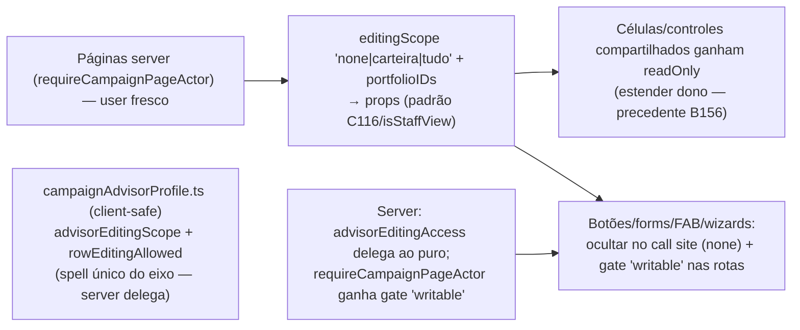

# Impl: Interface respeita o perfil de permissão (somente-leitura sem controles de edição; visão Tudo no escopo completo)

Status: aprovado
Atualizado em: 2026-08-21
Issue: #770 (C142)
Intenção: docs/plans/ui-respeita-perfil-permissao.md
Appetite restante: herdado (~1–2 dias eng) — passada mecânica sobre superfícies existentes; cortes no "Rabbit holes / Não escopo"

## Leitura da intenção

- **Outcome:** as superfícies staff do `/campanha` refletem o perfil C141 do ator: assessor `somente_leitura` não encontra NENHUM controle de escrita (células autosave, chips, "Registrar atualização", FAB/ações rápidas, wizards, sheets, status de demandas); assessor `tudo` navega listas/detalhes/mapa no escopo completo com contagens coerentes; `carteira · edita carteira` = comportamento de hoje; nada muda para coordinator/candidate/leader.
- **O que NÃO negociar:**
  - Presença/ausência dos controles é a única linguagem — sem banner de "modo leitura", sem cinza-fantasma/disabled em massa (decisões do gate B/A).
  - O enforcement do servidor (C141) não é relaxado nem substituído — a apresentação acompanha, nunca antecede.
  - Sem redesenho de layout; sem mudança de modelo/permissão (fora de escopo do item irmão).
  - `editing === 'tudo'` não libera controles de coordenação (contas, `advisors`, nível E14, escaladas) — já role-gated; a passada não os abre.
- **O que reavaliar:** a hipótese da intenção dizia "predicados client-safe de perfil em `src/lib/campaignRoles.ts` (ou o helper do item irmão)". A realidade pós-C141: `campaignRoles.ts` é só papel (role); o helper do item irmão (`advisorEditingAccess`) é **server-only** (`access/shared.ts`); **nenhum componente conhece o perfil do próprio ator** (zero ocorrências de `editing`/`visibility` no front além da gestão de assessores). O front só recebe `role` + dados já escopados pelos loaders. Precisamos de um canal de apresentação do perfil — decisão D1 abaixo. Confirmou-se o precedente C116 (props `readOnly` derivadas na página server) como padrão a generalizar; confirmou-se que `tudo` já flui por dados (access-driven) — o mapa/contagens não precisam de mudança de dados, só de um texto de readout honesto.

## Abordagem recomendada

**Opções consideradas:**

- **D1 — canal do perfil ao front:** A (páginas server calculam `editingScope` + `portfolioIDs` e passam como props — padrão C116/`isStaffView`) | B (contexto/provider client serializando o perfil no layout) | C (boolean por controle, ex. `canEditVotes`/`canEditTrend`).
- **D2 — semântica do eixo no cliente:** A (funções puras client-safe em `campaignAdvisorProfile.ts`; `advisorEditingAccess` server delega para elas no ramo advisor) | B (duplicar a regra no front) | C (expor `visibility`/`editing` crus e cada call site interpretar).
- **D3 — células sem `readOnly`:** A (estender o dono com prop `readOnly`, precedente `RelationChipCell` B156) | B (não montar o controle e renderizar célula de leitura no call site) | C (wrapper novo).
- **D4 — gates de destino de escrita:** A (novo `gate: 'writable'` em `requireCampaignPageActor` + filtro dos municípios do wizard pelo writable scope) | B (gate inline por rota) | C (só esconder botões, rota continua acessível).

**Recomendação:**

- **D1 → A.** Páginas já têm o user fresco (`requireCampaignPageActor`) e o padrão de props de permissão é o do repo (C116, `municipios/page.tsx`). B cria abstração nova (provider+serialização) onde o canal props já chega a cada call site; C explode em N×M.
- **D2 → A.** O vocabulário do perfil já vive em `campaignAdvisorProfile.ts` (client-safe, C141). As funções puras `advisorEditingScope(v, e)` e `rowEditingAllowed(scope, portfolio, rowIds)` são o spell único; o server `advisorEditingAccess` delega (DRY de conhecimento, invariante P3-D — o fragmento de escopo continua vivendo uma vez).
- **D3 → A.** A célula sabe a apresentação de leitura dela; `readOnly` no dono é o precedente exato (B156/C116). Botões/forms (que não têm "célula") são ocultados no call site.
- **D4 → A.** O prologue centralizado (P3-I) ganha o gate; o wizard filtra os municípios oferecidos pelo `getWritableMunicipalityIds` (sem ele, um assessor `tudo · edita carteira` escolheria município fora da carteira → 403 — exatamente o anti-goal "nenhum caminho leva a 403").

**Rejeitadas:** D1-B (nova abstração de permissão no cliente onde o padrão props já domina; a convenção P3-D prefere o fragmento server-side com flags de página); D1-C (booleans por controle); D2-B (duplicação de regra com risco de deriva fail-open); D2-C (interpretação crua em N call sites); D3-B (célula duplicada por call site); D3-C (wrapper inútil); D4-B (gate inline reabre o espalhamento que o P3-I consolidou); D4-C (rota viva = caminho de escrita visível, viola a decisão A do gate).

### Componentes / mudanças

**Núcleo — `src/lib/campaignAdvisorProfile.ts`** (estender o dono do perfil)

- `advisorEditingScope(visibility: AdvisorVisibility | null | undefined, editing: AdvisorEditing | null | undefined): 'none' | 'carteira' | 'tudo'` — client-safe, espelha o ramo advisor do server `advisorEditingAccess` (undefined → `'carteira'`).
- `rowEditingAllowed(editingScope, portfolioIDs: readonly number[] | null, rowMunicipalityIDs: readonly number[] | null): boolean` — a regra por linha: `none` → false; `tudo` → true; `carteira` → interseção linha∩carteira (portfolio `null` = tudo editável). Usada por listas com visão ampla + edição de carteira (municípios, lideranças, pessoas, dobradinhas).
- **`src/utilities/access/shared.ts`**: `advisorEditingAccess` delega ao puro no ramo advisor (comportamento idêntico, teste pina).

**Prologues — `src/utilities/campaignPageActor.ts`**

- `CampaignPageGate` ganha `'writable'`: `advisorEditingAccess(user) === 'none'` → `redirect('/campanha')` (o mesmo denyRedirect default do P3-I). Aplicado em: `acoes/[slug]/page.tsx` (5 slugs — hoje 4 deles nem têm gate de staff), `municipios/[slug]/editar`, `liderancas/nova`, `demandas/nova`, `dobradinhas/nova`, `organizacoes/nova`, `atividades/giros`. (Register-demand mantém o gate `staff` existente; o gate `writable` é aditivo.)
- Rota do wizard (`acoes/[slug]`): para advisor, os municípios oferecidos no passo de busca passam por `getWritableMunicipalityIds` (null → todos; `[]` → redirect; ids → filtro) — o destino de escrita só oferece o que é gravável.

**Atalhos de escrita — FAB, home actions, busca**

- `src/lib/campaignHomeActions.ts`: `homeActionsForRole(role, editingScope)` e `resolveStaffHomeQuickActions(role, editingScope, returnPath)` — advisor `none` mantém só `uncovered-municipalities` (navegação); os 4 wizards somem. `(app)/page.tsx` e o registry passam o scope.
- `src/lib/campaignQuickActionMount.ts` + `CampaignQuickActionsHost`/`useQuickActionsChromeActive`: `shouldMountQuickActionsFab(pathname, role, editingScope)` — advisor `none` → `false` em superfícies staff (todas as ações do drawer são destinos de escrita; a superfície de leader não é afetada). O layout `(app)/layout.tsx` calcula `editingScope` uma vez (user fresco que ele já tem) e passa ao host/scroll chrome.
- Busca global: os modos `wizard-*` só são consumidos pelos passos de wizard (rotas gateadas) — sem mudança; verificado no sweep.

**Células/controles compartilhados — prop `readOnly` (D3-A)**

- `CampaignInlineEditableCell`: `readOnly` → renderiza a apresentação de leitura (valor + copy se `readBehavior='copy'`), sem lápis/input/permanent.
- `MunicipalityListTrendControl` / `MunicipalityListExpectedVotesControl` / `MunicipalityListLeadershipsControl` / `MunicipalityListUpdateControl` / `LeadershipListSupportStatusControl` / `MunicipalityV2DeclaredVotesCell` / `MunicipalityV2EstimatedVotesCell` / `MunicipalityV2LocalAccountSection` / `MunicipalityGoalAccountCard` (conta da cadeira): `readOnly` → badge/valor sem overlay/autosave/trigger.
- `MunicipalityStateDeputyRelationCell` / `LeadershipStateDeputyRelationCell` / `MunicipalityPortfolioCell` (call sites que não passam `readOnly` hoje): passar `readOnly` derivado.
- `PhonesFieldEditor`: `readOnly` (lista sem remover/↑↓/salvar).
- `DemandDescriptionEditor` / `DemandResponsiblesCard` / `DemandWorkflowCard`: `readOnly` → texto/badges sem "Editar", sem multi-select, sem botões de transição/custo/comprovante (o branch escalado segue role-gated).
- `SuggestionCard` / `SuggestionsPanel`: sem ações de decisão para `none`.
- `MunicipalityV2StatusStrip`: nível/tendência/atualização embutidos — `readOnly` (sem endpoints, sem overlay). (Nível continua role-gated para unrestricted.)
- `ActivityTaskChecklist`: checkboxes/inputs sem edição para `none`.

**Superfícies — páginas server calculam e passam (D1-A)**

- Padrão por página: `const editingScope = user.role === 'advisor' ? advisorEditingScope(user.visibility, user.editing) : 'tudo'`; `portfolioIDs = editingScope === 'carteira' ? await getAdvisorMunicipalityIds(payload, user.id) : null`.
- **Municípios** (`municipios/page.tsx`, `MunicipalityList`, `MunicipalityListMobileCards`/`MunicipalityMobileCard`): colunas tendência/votos/lideranças/dobradinhas/atualização por-linha (`rowEditingAllowed(scope, portfolio, [row.id])`); `MunicipalityListUpdateControl` oculto para `none`; detail (`MunicipalityDetailTabs`): `canEdit` deixa de ser `true` hardcoded (linha 91) → flag da página (botão "Editar" + `MunicipalityUpdateForm` + `PledgeEstimateForm` + `DeclareVotesForm` + sugestões); página `[slug]/editar` com gate `writable` + checagem do município (`getWritableMunicipalityIds` contém o id, senão redirect).
- **v2** (`municipio/[slug]/v2`): `StatusStrip`/`LocalAccountSection`/`NetworkSection` com `readOnly`/ocultos conforme scope.
- **Lideranças** (lista + `[id]`): células (`CampaignInlineEditableCell`), status, municípios, dobradinhas, convites (ocultar para `none`), "Nova liderança" (ocultar para `none`); `[id]` — contato/ficha interna `readOnly`, convite oculto.
- **Pessoas/Contatos**: matriz `buildPeopleEditability` (C116) AND `editingScope !== 'none'`; células text `readOnly` para `none`; convites ocultos; `ContactCreateRow`/`ContactCreateFab` ocultos para `none` (contatos).
- **Dobradinhas**: células text/`MunicipalityPortfolioCell`/`LeadershipStateDeputyRelationCell` `readOnly` para `none` + por-linha (`rowEditingAllowed`) quando `tudo · edita carteira`.
- **Demandas**: "Nova demanda" oculto para `none`; detail — descrição/workflow/responsáveis `readOnly`.
- **Atividades**: lista — "Nova atividade"/"Planejar giro" ocultos para `none`; detail — overlay de edição, "Nova atualização", lifecycle, checklist, update form, "Adicionar demanda", result form ocultos/`readOnly` para `none`.
- **Atualizações** (`atualizacoes`): modal de criação (`CampaignUpdatesFilters`) oculto para `none`.
- **Apoiadores**: "Novo" oculto; `PhonesFieldEditor`/`VoteIntentionControl` `readOnly`; `RemoveSupporterDataButton` oculto (o server exige admin; a UI não pode oferecer caminho morto).
- **Organizações**: "Nova organização" oculto para `none`; verificar o form do detalhe `organizacoes/[slug]` no sweep (mesma regra).
- **Quadro/Início**: `CampaignHomeActions` filtrado (acima); `SuggestionsPanel` sem ações de decisão para `none`.
- **Mapa** (`MunicipalityMapPanel`): o dado já é scope-coerente (access-driven); trocar `actorRole` → `actorScope: 'carteira' | 'tudo'` derivado (`visibility === 'tudo' || isUnrestrictedCampaignRole(role)` → `'tudo'`), para o readout/legenda ("no seu escopo") dizer a verdade quando o assessor vê tudo.

### Dados → forma (se aplicável)

- Sem KPI/dado novo: passada de apresentação. A "forma" aqui é a regra de apresentação (controles presentes/ausentes) — decidida no gate (opção B: ausência é a linguagem; sem aviso). Textos novos pt-BR apenas onde um controle some e o valor precisa de apresentação de leitura (ex.: placeholder de célula).

## Fases verificáveis

1. **Núcleo** (~0,25d): funções puras em `campaignAdvisorProfile.ts` + delegação do `advisorEditingAccess` + `gate: 'writable'` + unit specs (`advisorEditingScope`, `rowEditingAllowed`, gate). `tsc` + `pnpm test` verdes.
2. **Células compartilhadas** (~0,5d): `readOnly` nos controles listados; unit specs dos que têm comportamento condicional.
3. **Superfície municípios + mapa** (~0,5d): lista (desktop/mobile) + detail + v2 + editar + readout do mapa. Verificar visualmente no browser (shape→craft).
4. **Pessoas/contatos/lideranças/dobradinhas** (~0,5d): matriz AND + células + convites + criação.
5. **Demandas/atividades/atualizações/apoiadores/organizações/sugestões/giros** (~0,5d): ocultar/`readOnly` + gates das rotas de criação.
6. **Atalhos** (~0,25d): home actions, FAB, wizard gate + busca writable-scoped.
7. **E2E + gates** (~0,5d): spec novo `campaignPermissionProfile.e2e.spec.ts` (3 perfis: somente_leitura sem controles em municipios/lideranças/demandas/atividades + FAB ausente + wizard redireciona; tudo·edita carteira com linhas fora da carteira read-only; tudo·edita tudo com controles) usando `campaignFixtures` (já suporta `visibility`/`editing`); rodar e2e afetado local; `pnpm gate:fast` + `pnpm push`.

## Rabbit holes / Não escopo (engenharia)

- Redesenho de qualquer superfície (layout intacto; só presença/ausência).
- Banner/aviso de modo leitura (decisão B do gate).
- Mudar o modelo/enforcement (C141 dono) — a passada só apresenta.
- `saveToJWT` do perfil — desnecessário: páginas leem user fresco.
- Gate de per-município em TODAS as rotas de detail — só `[slug]/editar` e o wizard precisam; os demais detalhes apresentam read-only (o servidor já rejeita escrita fora do escopo).
- Auditoria de quem viu o quê; relatório de acessibilidade extra (a11y P3 do controle oculto segue o padrão existente).

## Riscos e mitigação

- **Ripple de assinatura** (`role` → `role + editingScope`) em shells client (FAB, home actions, map): mitigar com default `'tudo'`/parametros opcionais onde não-advisor; unit specs pina o comportamento por scope.
- **Caminho de escrita esquecido** (o sweep é o cerne do item): inventário por categoria já feito (autosave/sheets/FAB/wizards/forms/status); e2e pin por superfície (municipios/lideranças/demandas/atividades/home) cobre os principais; o resto aparece no aceite do item (rabbit hole da intenção) — registrar débito se escapar.
- **Matriz C116 quebrada para coordinator/candidate**: o AND só afeta advisor com `none`; unrestricted permanece idêntico (unit spec da matriz? a matriz vive na página — cobrir via e2e).
- **Giro/`atividades/giros`**: gate `writable` + `getWritableMunicipalityIds` já usado nas actions (C141) — só o gate de rota falta; teste e2e opcional.
- **Mapa com quantis**: os quantis já seguem o escopo real (access); só o texto muda — int spec existente (`bahiaGeometries`/map bundle) continua passando; verificar o readout no browser.

## Aceite de engenharia

- [ ] Aceite de produto da intenção ainda coberto (sem controle de escrita para `somente_leitura` em nenhuma superfície staff; visão `tudo` coerente; nada muda para os demais perfis/roles)
- [ ] Invariantes AGENTS/engineering-standards: sem `overrideAccess: true` novo; fragmento de escopo continua uma vez só (P3-D); identificadores em inglês, copy pt-BR; props como canal de permissão (padrão C116), sem provider novo
- [ ] Testes de domínio: unit dos helpers puros + gate `writable`; e2e novo por perfil/superfície; gates completos (`tsc`, lint, format, knip, cycles, unit+int, build)
