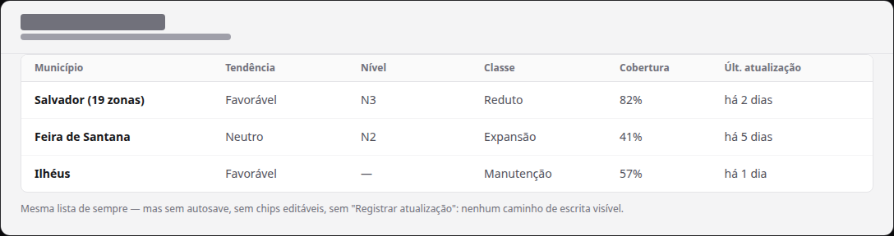
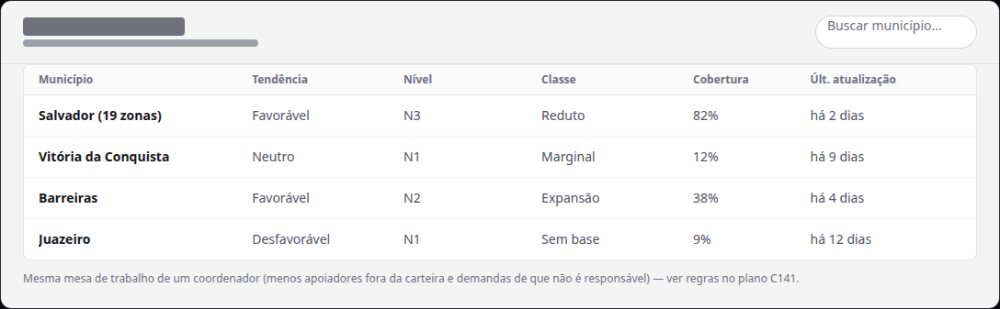

# Interface respeita o perfil de permissão (assessor somente-leitura sem controles de edição; visão Tudo no escopo completo)

Status: aguardando execução
Atualizado em: 2026-08-19
Issue: #107
Priority: P1
Model: cursor-grok-4.5-medium
Impeccable: B — passada de apresentação sobre as superfícies staff do `/campanha`
Rascunho UI: docs/plans/ui-respeita-perfil-permissao-ui-draft.html
Appetite: ~1–2 dias eng; telas passam a refletir o perfil (sem 403s à vista, escopo coerente)
Responsável: —

## Intenção

O item irmão (perfis de permissão por assessor) entrega o modelo e o enforcement no servidor. Sem esta passada, um assessor "Somente leitura" ainda **vê** todos os botões, células autosave, FABs e sheets de edição — e cada toque morre com erro de permissão, o oposto do produto que a mesa espera. E um assessor que ganhou "Visão Tudo" precisa que listas, detalhes e mapa carreguem o estado inteiro de forma coerente (contagens, facetas, filtros), não meia-lista.

## Persona e fluxo

- **Persona / contexto:** o assessor com perfil restrito, operando o `/campanha` no celular e no desktop — não pode, não deve e não quer tentar editar; e o assessor de visão total, querendo a mesa de trabalho completa.
- **Job principal:** a interface diz a verdade sobre o perfil: quem não edita não encontra edição; quem vê tudo vê tudo.
- **Fluxo desejado:**
  1. Assessor "Carteira · Somente leitura" abre `/campanha/municipios`: células são leitura pura, sem chips editáveis, sem "Registrar atualização", sem FAB de ações — nenhum controle de escrita à vista, sem aviso: a tela simplesmente não oferece edição.
  2. Assessor "Tudo · Edita carteira" abre as mesmas listas: vê o estado inteiro (todos os municípios/lideranças) e edita apenas o que administra — o controle de edição aparece só onde a carteira alcança.
  3. Assessor "Carteira · Edita carteira": exatamente o comportamento de hoje (nada muda).
- **Anti-goals de produto:** bloquear por mensagem de erro em vez de ocultar/desabilitar; cinza-fantasma que confunde o que é editável; redesenho de superfícies que não precisam mudar.

### Esboço de fluxo (B/C/D)

```text
[login assessor] → [perfil da conta resolve o que renderizar]
   → [visão: escopo completo ou carteira] × [edição: controles presentes ou ausentes]
   → [nenhum caminho leva a 403; nenhum dado fora do escopo é oferecido]
```

### Rascunho UI (B/C/D)






## Objetivo e aceite

- Assessor sem permissão de edição **não encontra nenhum controle de escrita** nas superfícies staff: células de autosave, chips removíveis, "Registrar atualização", FAB/ações rápidas, wizards, sheets e triggers de Popover — no desktop e no mobile. Sem aviso de modo leitura: a presença/ausência dos controles é a única linguagem _(decidido no gate: opção B)_.
- Assessor "Visão Tudo" navega listas, detalhes e mapa no escopo completo, com contagens, facetas e filtros coerentes com o que ele vê.
- Atalhos de escrita (ex.: busca global) seguem a mesma regra: destino de escrita some para quem não pode escrever; atalhos de navegação permanecem _(decidido no gate: opção A)_.
- Nada muda para coordenador/candidato/liderança e para o assessor "Carteira · Edita carteira".
- O enforcement de segurança não é relaxado em nenhum ponto: a apresentação acompanha o servidor, nunca o substitui.

## Dados (intenção)

- **Vou apresentar dados?** Não — passada de apresentação sobre superfícies existentes.
- **Decisões desbloqueadas:** nenhuma decisão de dado nova.

## Direção no codebase (hipótese)

- **Áreas prováveis:** componentes `src/components/campaign/<domínio>/*` — células edit-in-place e cascas compartilhadas (`CampaignCellEditOverlay`, `CampaignListSheetProvider`, colunas por papel), triggers de autosave por lista, FAB/ações rápidas, botões "Registrar atualização" em municípios/atividades, controles de status em demandas; predicados client-safe de perfil em `src/lib/campaignRoles.ts` (ou o helper do item irmão); dashboards/mapa (`MunicipalityMapPanel` e loaders escopados).
- **Precedente a olhar:** estados `readOnly` já existentes (`RelationChipCell`/`RelationOptionCell` com `readOnly`), a matriz por papel da célula de pessoas (C116: assessor edita só onde a carteira alcança, resto read-only), card mobile de municípios (B193).
- **Risco de acoplamento:** o mapa e as listas já leem "escopo do ator" — cuidado para não duplicar lógica de escopo no cliente; o fragmento de escopo continua vivendo uma vez só (convenção P3-D).

## Dependências

- **C141** (modelo + enforcement + configuração) — este item só faz sentido depois do perfil existir e valer no servidor.

## Fora de escopo

- Qualquer mudança no modelo de permissão ou no enforcement (é o item irmão).
- Redesenho de superfícies não relacionadas a permissão.
- Estado de leitura para liderança (lockdown já é outra superfície, intocada).

## Rabbit holes de produto

- **"Vou esconder tudo com um flag e rezar."** A passada precisa achar **cada** caminho de escrita real (autosave, sheets, wizards, links para formulários). **Corte:** varrer por superfície com a matriz de papéis, como a célula de pessoas já faz; o que não for achado agora aparece no aceite do item.
- **"Vou redesenhar a lista de municípios."** Tocar layout por tocar não é o pedido. **Corte:** manter layouts; mudar só presença/ausência de controles e o aviso de modo leitura.
- **"Cinza-fantasma em tudo."** Desabilitar tudo visualmente polui mais do que ajuda. **Corte:** controles de edição **ocultos** para leitura; aviso discreto no topo.

## Decisões do gate (2026-08-19)

- **Modo leitura sem aviso** (opção B) — controles ocultos; presença/ausência de edição é a única linguagem.
- **Atalhos de escrita seguem a regra** (opção A) — destino de escrita some para quem não pode escrever.

## Referências

- Item irmão: `docs/plans/permissao-granular-assessores.md` (C141) e `docs/plans/demandas-responsaveis.md` (C143 — a regra de demandas muda o que a demanda renderiza para quem não é responsável).
- Rascunho UI (gate): `docs/plans/ui-respeita-perfil-permissao-ui-draft.html` + PNGs acima.
- Para abrir primeiro: `src/components/campaign/shared/CampaignCellEditOverlay.tsx` (casca dos overlays de edição), `src/lib/campaignRoles.ts` (predicados por papel), a matriz por papel em `pessoas-*` (C116).
- `AGENTS.md` — convenção P3-D do escopo de assessor.
