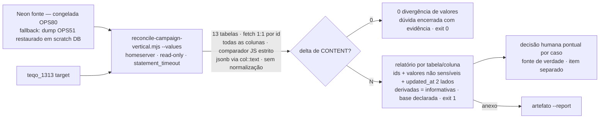

# Impl: Verificação de VALORES (não só entidades) da migração pt.jorgesolla.com.br → jorgesolla1313.com.br — foco nas estimativas de votos

Status: rascunho
Atualizado em: 2026-08-24
Issue: #828
Intenção: docs/plans/verificacao-valores-migracao-estimativas-votos.md
Appetite restante: herdado (~0,5–1 dia; cabe em 1 sessão — sem corte de escopo)

## Leitura da intenção

- **Outcome:** relatório read-only comparando os VALORES (todas as colunas de conteúdo, não só ids) das 13 tabelas da vertical campanha entre fonte congelada e base nova, com divergência por tabela/coluna e foco confirmado em `vote_pledge` (votos declarados + 3 cenários de estimativa) → aceite: "0 divergência de valores" (dúvida dos usuários encerrada com evidência) **ou** "N divergências listadas" → decisão humana pontual, documentada no relatório.
- **O que NÃO negociar:** nenhuma escrita no DB (verificação e report apenas; `default_transaction_read_only` + `statement_timeout`); sem re-migração/conserto automático de valores; sem julgamento (comparação 1:1 crua por registro/coluna, sem normalização/arredondamento que esconda delta); sem PII fora do homeserver (relatório só imprime ids/counts/valores não nominais); rodar antes do OPS81 (ou fallback dump OPS51); relatório declara qual base foi usada; leitura relativa/local e assimetria de votos preservadas (nada muda em `/campanha`).
- **O que reavaliar:** a hipótese de "Direção no codebase" (estender `scripts/reconcile-campaign-vertical.mjs`) está **correta** — o script herdado é o dono da verificação da vertical; a extensão natural é um modo novo de comparação de valores, sem criar twin. A comparação entre dois bancos **não pode ser feita em SQL** (conexões separadas) — o comparador vive em JS com regra estrita de representação (jsonb via `::text`). Divergências de colunas derivadas por hook (`declaredAt/By`, `estimatedAt/By`, …) são **esperadas** após edições legítimas no target pós-OPS51 — absorvidas por classe (padrão `ABSOLVED_MUNICIPALITY_RELS` do OPS79), nunca por tupla hardcoded de valores.

## Abordagem recomendada

**Opções consideradas:** A | B | C
**Recomendação:** A — modo novo `--values` **no script herdado** `reconcile-campaign-vertical.mjs` (default continua idêntico ao OPS79: contagem+IDs, esperado 19/19, exit por diff), com relatório de valores 1:1 cru por tabela/coluna nas 13 tabelas da vertical e absorção por classe das colunas derivadas. É o único caminho que cumpre "verificamos tudo, não só entidades" sem re-migrar nada, sem juízo de valor e sem criar superfície nova — e mantém o débito "connectReadOnly duplicado" do OPS79 **não disparado** (sem 3º script).
**Rejeitadas:** B — script novo (`reconcile-campaign-values.mjs`) duplicaria `new Client`/`connectReadOnly` (3º call site de conexão → gatilho do débito OPS79 de mover para `cli.mjs`) e criaria twin paralelo do dono do concern (engineering-standards). C — comparar valores sempre no default mudaria o contrato do `ops79:reconcile` (re-runs do runbook OPS79 falhariam por divergências informativas de timestamps; o id-mode é gate rápido barato).

### Decisões de engenharia

- **(i) Onde mora a comparação de valores.** Opções: A) novo modo `--values` no script herdado `reconcile-campaign-vertical.mjs` | B) script novo `scripts/reconcile-campaign-values.mjs` | C) valores comparados sempre (default). **Recomendação:** A — o script herdado é o dono da verificação da vertical (edite o dono, não crie twin); reusa `connectReadOnly`/`fetchIds`/`report` existentes e os helpers de `scripts/lib/cli.mjs` (`loadCliEnv`, `dieWithLabel`); o modo default (OPS79) permanece byte-a-byte igual (19/19, exit por diff) — re-runs do runbook não quebram. **Rejeitadas:** B porque reabre o débito OPS79 (`connectReadOnly` duplicado, gatilho "3º script → mover para `cli.mjs`") e duplica infra de conexão sem ganho; C porque muda contrato existente sem necessidade — a verificação de valores é mais cara e tem semântica própria (derivadas informativas), não deve contaminar o gate rápido de IDs.
- **(ii) Quais colunas comparar por tabela.** Opções: A) todas as colunas, tudo falha | B) todas as colunas, classificadas em 3 buckets — **content** (falha o run), **derived** (hook-derivadas + `created_at`/`updated_at`; informativas, não falham), **sensitive** (PII; contadas, valores nunca impressos) | C) lista manual de colunas de conteúdo por tabela. **Recomendação:** B — cumpre "todas as colunas de conteúdo" da intenção sem perder delta e sem falso-positivo em massa: colunas derivadas divergem falsamente porque edições legítimas pós-OPS51 no target as reestampam (`declared_at/by`, `estimated_at/by` em `vote_pledge` via `deriveVotePledgeAudit`; `result_recorded_by/at`, `level_changed_at`, `resolved_at`, `created_at`, `updated_at` em outras tabelas). O delta derivado não é escondido — é **contado, listado e classificado** (mesma filosofia do `ABSOLVED_MUNICIPALITY_RELS` do OPS79, só que por classe e não por tupla). A classificação é **grounded nos hooks** de `src/collections/*.ts` (leitura obrigatória na impl; conferir que nenhuma coluna estampada por hook escape do bucket derived e vice-versa). Sensitive por tabela: `supporter` (nome/telefone/email/whatsapp/…), `campaign_user` (email/nome), campos relacionais de pessoa — valores **nunca** impressos, só ids+counts. **Rejeitadas:** A (toda edição legítima no target pós-OPS51 derruba o run; relatório inútil) e C (toda coluna nova na collection vira coluna "não comparada" silenciosamente — o pior tipo de regressão para uma ferramenta de verificação).
- **(iii) Como comparar (cru, sem julgamento).** Opções: A) comparação SQL (`IS DISTINCT FROM` por coluna) | B) fetch das linhas dos dois lados (conexões separadas) + comparador JS estrito | C) comparador JS com normalização amigável (trim/round/coalesce). **Recomendação:** B — dois bancos não se juntam em uma query; o comparador JS usa regra de representação por tipo: colunas **jsonb** selecionadas com `col::text` no SQL (preserva a escala numérica como gravada — `1` vs `1.0` **divergem** — e canonicaliza só a ordem de chaves, que não é dado; SQL NULL vs JSON `null` se distinguem), demais colunas via `String(value)` com sentinela para SQL NULL, igualdade estrita; **zero** trim/round/coalesce (diferença de espaços em `estimate_note` é divergência e deve aparecer). **Rejeitadas:** A porque `IS DISTINCT FROM` em jsonb usa a igualdade semântica do Postgres (colapsa `1` vs `1.0`) — exatamente o delta que a intenção manda revelar — e nem é possível entre bancos distintos; C porque normalizar é "comparar com julgamento" — anti-goal explícito.
- **(iv) Como tratar divergências esperadas (baseline pós-OPS51).** Opções: A) absolver por tupla `(tabela, id, coluna)` hardcoded (estilo `ABSOLVED_MUNICIPALITY_RELS`) | B) absorção por **classe** (derived → informativo) + todo delta de conteúdo reportado e falha o run; cada linha de conteúdo divergente carrega `updated_at` dos dois lados como dica de recência (recomendação (c) da intenção — decisão humana por recência, sem o script julgar) | C) baseline file `--baseline` para persistir divergências já julgadas em re-runs. **Recomendação:** B — conteúdo é sempre visível e falha (aceite "N divergências listadas → decisão humana pontual"); nada de conteúdo é absorvido automaticamente; a recência sai como **dado** na linha (não como veredito). **Rejeitadas:** A (impossível pré-enumerar deltas de valor; qualquer tupla hardcoded mascararia divergência futura de fato — o próprio débito apontado no OPS79) e C (estado persistente sem necessidade para one-shot; adiado — ver "Adiado com gatilho").
- **(v) Formato do relatório.** Opções: A) só console (padrão OPS79) | B) console + artefato markdown opcional via `--report <path>` com a lista completa (ids, colunas, valores não sensíveis truncados, `updated_at` dos dois lados, hosts e timestamp no cabeçalho = base declarada) | C) dashboard/JSON estruturado. **Recomendação:** B — console para o operador (mesmo padrão OPS79); artefato markdown para a decisão humana ficar **documentada** (aceite da intenção) e anexável ao issue; cabeçalho com hosts + timestamp + rótulo da base (Neon vivo vs dump OPS51 — o runbook instrui o operador a rotular, e o script já ecoa o host). Valores de textarea (`estimate_note`) truncados a 120 chars no artefato. **Rejeitadas:** A (decisão humana precisaria re-rodar/copiar console — frágil) e C (consumidor é humano; dashboard = anti-goal "superfície nova de dados"; JSON é barato de adicionar depois se alguém pedir — sem gatilho pendente).

### Componentes / mudanças

- **`scripts/reconcile-campaign-vertical.mjs`** (extendido — mesmo arquivo, owner): modo `--values` com (a) introspect de colunas por tabela via `information_schema` (nome + tipo — mesmo padrão do `fetchRels`; identifica jsonb para `::text`), (b) mapas `DERIVED_COLUMNS`/`SENSITIVE_COLUMNS` por tabela (grounded nos hooks/collections), (c) fetch 1:1 por id presente nos dois lados (ids unilaterais já são território do id-mode), (d) comparador JS estrito, (e) relatório por tabela/coluna com buckets content/derived/sensitive + resumo com `vote_pledge` em destaque (foco declarado) + exit 1 em delta de conteúdo (0 se só informativas), (f) `--table <name>` para isolar tabelas (debug/iteração) e `--report <path>` opcional. Reusa `connectReadOnly` (mantida no script — sem 3º script, débito OPS79 não dispara), `fetchIds`, `report`, `die`, `loadCliEnv`; `statement_timeout` 60s no modo values. **Nunca imprime valores de colunas sensitive.**
- **`package.json`**: novo script `"ops84:reconcile-values": "node scripts/reconcile-campaign-vertical.mjs --values"` (linha junto de `ops79:reconcile`; nomes exatos do padrão).
- **Specs unit** (padrão dos testes de `scripts/lib/cli.mjs`): classificação de colunas (derived/sensitive/resolvidas via introspection), regra de representação (jsonb `::text`, sentinela NULL, `1` vs `1.0` diverge, SQL NULL vs JSON `null` diverge), montagem das linhas de relatório (truncamento, ocultação de sensitive), exit-code.
- **E2E local (2 scratch DBs)**: dois bancos descartáveis no container local (`pnpm db:start`) com tabelas espelhando a forma Payload (mínimo: `vote_pledge` com jsonb `estimated_votes` + uma tabela com colunas derivadas e sensitive); par idêntico → exit 0; deltas plantados (número, jsonb `1` vs `1.0`, SQL NULL vs chave ausente, sensitive) → exit 1 e linhas exatas. Nenhum dado real fora do homeserver (dados fabricados).
- **Runbook:** seção OPS84 em `docs/ops/teqo-1313-deploy.md` — envs (`NEON_DATABASE_URL` de `~/stack/.env`; `DATABASE_URL` de `~/stack/teqo-1313.env` com reescrita socat `127.0.0.1:5433`), comando `pnpm ops84:reconcile-values [--table …] [--report …]`, esperado, **fallback dump OPS51** (`pg_restore` de `/srv/hdd/backups/teqo-neon-pre-migracao/teqo-neon-full-20260817-204800.dump` em scratch DB local `teqo_1313_compare_src` → apontar `NEON_DATABASE_URL` para ele), declaração da base no relatório, falhas conhecidas.
- **Changelog:** `docs/changelog/2026-08-24-ops84.md` + `pnpm changelog:build`.
- **Migration:** sem migration (nenhum schema — verificação read-only).
- **Access / Consent:** N/A — nenhum write path; fail-closed é do próprio script (read-only estrito, exit≠0 em conteúdo).
- **UI:** Impeccable A — N/A (operação de dados).

### Dados → forma (se aplicável)

A "forma" é o relatório do script (console + artefato markdown opcional) — mesma filosofia do relatório do OPS79: sem dashboard, sem superfície de produto. O artefato é a forma de **documentar a decisão humana** exigida pelo aceite. Formas rejeitadas: dashboard (anti-goal), JSON estruturado (consumidor humano).

## Fases verificáveis

1. **Tracer — modo `--values` no `vote_pledge`** — introspect de colunas, mapas derived/sensitive, comparador JS (jsonb `::text`), linhas de relatório, exit-code; specs unit; e2e local com os deltas plantados (número, `1` vs `1.0`, NULL vs ausente, sensitive oculta). **Verificável:** `pnpm gate:fast` (unit) + e2e local verde.
2. **Vertical completa (13 tabelas)** — mapas por tabela grounded nos hooks de `src/collections/*.ts` (conferência do bucket derived); `--table`/`--report`; `ops84:reconcile-values` no package.json; e2e estendido para amostra (ex.: `leadership` com `level_changed_at`, `municipality` com `expected_votes` jsonb). **Verificável:** e2e local com 2–3 tabelas; modo default `ops79:reconcile` intocado (spec/regressão: output 19/19).
3. **Runbook + changelog** — seção OPS84 no `teqo-1313-deploy.md` (com fallback dump OPS51 e declaração da base), `docs/changelog/2026-08-24-ops84.md` + `pnpm changelog:build`.
4. **Gates + entrega** — `pnpm gate:fast`; push; PR `Closes #828`. **Execução em prod é operação via runbook, fora do repo, no homeserver, ANTES do OPS81** (gate operacional: Neon acessível; senão, fallback dump e base declarada).

## Rabbit holes / Não escopo (engenharia)

- **Normalizar para reduzir falso-positivo** (round/trim/coalesce no comparador) — "comparar com julgamento", anti-goal; corte: 1:1 crua.
- **Comparar jsonb via igualdade semântica** (`IS DISTINCT FROM`/parse JS) — colapsa `1` vs `1.0`; corte: `col::text` no SELECT.
- **Bucket derived errado** (coluna de conteúdo tratada como derivada esconde delta real; hook não conferido) — corte: mapa grounded nos hooks das collections + conferência na impl/revisão.
- **PII no relatório** (valores de `supporter`/`campaign_user`) — corte: sensitive por tabela, valores nunca impressos; e2e só com dados fabricados.
- **Rel-tables por valor** — sem colunas de conteúdo (só `path`/`order`/churn de row-id); já comparadas semanticamente por `(parent,path,child)` no id-mode; fora do modo values.
- **Tabelas de versão (`*_v`), `campaign_vote_summary_snapshot`, sessions, `election_candidate`** — não pertencem ao escopo das 13 do OPS79 (não-dado derivado/efêmero/cache, ou fora da vertical verificada).
- **Imprimir `estimate_note`/textareas completos** — truncar a 120 chars no artefato.
- **Baseline file/estado persistente** — adiado (ver débitos).
- **Rodar fora do homeserver** (ex.: e2e "mais fácil" contra dados reais) — nunca: dados reais só no homeserver.

## Riscos e mitigação

- **Neon inacessível quando o item rodar (OPS81 encerra a janela)** — fallback documentado: `pg_restore` do dump OPS51 em scratch DB local `teqo_1313_compare_src` → apontar `NEON_DATABASE_URL` para ele; relatório declara a base usada (dump é pré-freeze 2026-08-17 → deltas legítimos 08-17→08-23 aparecem; a dica de recência + decisão humana cobre); ideal: rodar com Neon vivo antes do OPS81.
- **Falso alarme em massa (timestamps/estamps em toda edição legítima pós-OPS51)** — classificação derived absorve por classe (informativo, não falha); conteúdo divergente é sinal real para decisão.
- **Timeout em tabelas grandes** — `statement_timeout` 60s no modo values; `--table` isola tabela problemática.
- **Vazar PII** — 100% homeserver; sensitive por tabela; e2e local fabricado; relatório só ids/counts/valores não nominais (truncados).
- **Regressão do contrato OPS79** — modo default intocado (mesmo output/exit); spec/regressão no e2e local.
- **Divergência derivada acompanhando conteúdo divergente** (ex.: `declared_at` mudou porque `declared_votes` mudou) — comportamento esperado; relatório mostra o par (conteúdo falha, derivada informativa na mesma linha) — sem supressão.
- **Rollback** — não há escrita; "rollback" = rodar de novo (idempotente, read-only).

## Aceite de engenharia

- [ ] Aceite de produto da intenção coberto: relatório read-only de VALORES das 13 tabelas (foco `vote_pledge`) → "0 divergência" ou "N listadas" com artefato para decisão humana; nenhuma escrita; sem julgamento; base declarada.
- [ ] Invariantes AGENTS/engineering-standards: read-only estrito (`default_transaction_read_only` + timeout), 100% homeserver, PII nunca impressa, sem migration de schema, sem UI, sem re-migração; dono do concern editado (sem twin); modo OPS79 default inalterado.
- [ ] Testes: specs unit dos helpers puros (classificação, comparador jsonb, linhas de relatório) + e2e local com 2 scratch DBs (deltas plantados: número, `1` vs `1.0`, NULL vs ausente, sensitive oculta); `pnpm gate:fast` verde.
- [ ] Docs: runbook OPS84 (envs, socat, fallback dump, esperado, falhas conhecidas) + changelog + `pnpm changelog:build`.

## Adiado com gatilho (débitos da sessão)

- **Baseline file (`--baseline`) para absorver divergências de conteúdo já julgadas em re-runs** — sem estado agora (one-shot; cada run é fresh; decisão é humana por aceite) — **gatilho**: ferramenta vira contínua/re-rodada com periodicidade → baseline versionado + guard de confirmação explícita (padrão `MEDIA_RECOVER_CONFIRM`).
- **Mover `connectReadOnly` para `scripts/lib/cli.mjs`** — mantido no script herdado (modo novo não cria 3º script; débito OPS79 permanece armado) — **gatilho**: qualquer 3º script que conecte em Postgres → mover (3 call sites, DRY legítimo).
- **`election_candidate` fora da reconciliação** — escopo do OPS79 são as 13 tabelas; fora da vertical verificada — **gatilho**: evidência de problema nos dados eleitorais de candidatos → item próprio.
- **Rel-tables por valor** — sem colunas de conteúdo hoje (path/order; churn já absorvido) — **gatilho**: modelo de rels ganhar conteúdo de negócio → revisitar o modo values.

## Self-score decision-quality (gate ≥4)

1. Decisões caras têm rejeitadas? Sim — (i)–(v) com Opções/Recomendação/Rejeitadas; decisão central (modo novo no dono vs script twin) deliberada com justificativa e consequência (débito OPS79). **1/1**
2. Abordagem cabe no appetite? Sim — ~0,5–1 dia, 1 sessão; extensão do script existente, sem estado novo, sem UI, sem migration. **1/1**
3. Rabbit holes nomeados? Sim — normalização/julgamento, jsonb `IS DISTINCT FROM`, bucket derived errado, PII, rel-tables/versões/`election_candidate`, baseline. **1/1**
4. Depth check? Sim — edita o dono do concern (script herdado), reusa `connectReadOnly`/`fetchIds`/`report`/`cli.mjs`, segue precedentes OPS79 (`ABSOLVED_MUNICIPALITY_RELS`, introspect de colunas, runbook) e padrão de guards; comparador puro testável. **1/1**
5. Intenção satisfeita? Sim — verifica e reporta valores (foco `vote_pledge`), zero escrita, decisão humana pontual, anti-goals respeitados; engenharia não reescreveu o outcome. **1/1**

**Self-score: 5/5**
