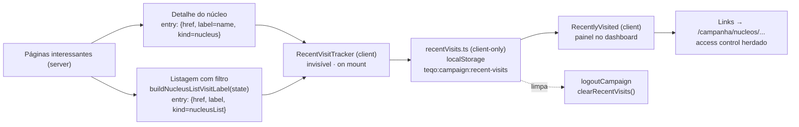

# Visitados recentemente

Status: implementado
Atualizado em: 2026-07-19
Item do roadmap: [docs/roadmap.md](../roadmap.md) (seção "Campanha → Próximos ciclos")
Responsável: —

## Contexto

Hoje o dashboard `/campanha` (Início) mostra agregados globais e o feed de atualizações, mas não oferece um atalho para os lugares que o usuário acabou de visitar. Um coordenador que volta da ficha de um núcleo ou de uma listagem filtrada precisa refazer a navegação manualmente — reabrir Núcleos, reaplicar o filtro, reencontrar o núcleo. A decisão de produto (2026-07-17) é adicionar uma seção **"Visitados recentemente"** que lista os últimos lugares acessados dentro de `/campanha`: um núcleo específico (`/campanha/nucleos/[slug]`) ou uma listagem de núcleos com filtro específico (`/campanha/nucleos?...`).

O requisito explícito é **não criar um modelo complexo**: nada de collection no servidor, migration, server action de escrita ou `Consent`. O histórico é mantido no próprio navegador do usuário.

### Realidade técnica do "histórico do browser"

A `window.history` **não expõe** a lista de entradas (URLs) da stack por motivo de privacidade — só `history.length` (um número) e `history.state` (estado da entrada atual). Não é possível enumerar o back/forward. Portanto "usar o histórico do browser" é interpretado como: **registrar a navegação do usuário client-side, em `localStorage`**, conforme ele acessa páginas "interessantes" da campanha. Isso cumpre o objetivo (nenhum modelo no servidor) e deriva da navegação real no navegador do usuário. A limitação (por dispositivo, não sincronizado entre dispositivos/navegadores) é aceita como trade-off e flagada abaixo.

## Objetivos

- Painel **"Visitados recentemente"** no dashboard `/campanha`, listando os últimos lugares acessados como links clicáveis.
- Registrar automaticamente, sem ação do usuário, visitas a:
  - núcleo específico (`/campanha/nucleos/[slug]`) — label = nome do núcleo;
  - listagem de núcleos com filtro específico (`/campanha/nucleos?...` com ao menos um filtro ativo) — label derivada do estado de filtro.
- Histórico **client-side** em `localStorage`: sem collection, sem migration, sem server action, sem `Consent`, sem escrita no servidor.
- Deduplicação por URL (pathname + search): revisitar o mesmo lugar atualiza o timestamp e sobe para o topo, sem duplicar.
- **Tempo mínimo de permanência (dwell)** antes de gravar, para não registrar páginas intermediárias enquanto o usuário monta um filtro.
- Lista limitada a 8 entradas, ordenadas da mais recente à mais antiga.
- Hidratação segura: `localStorage` é browser-only, então a lista só é renderizada após montagem no cliente (sem mismatch de hidratação).

## Decisões travadas

- **Sem modelo no servidor.** Nenhuma collection, nenhum campo em `campaignUser`, nenhuma migration, nenhuma server action de escrita, nenhum `Consent`. Todo o estado vive em `localStorage` no dispositivo do usuário. (Decisão de produto 2026-07-17; roadmap "Campanha → Próximos ciclos".)
- **`localStorage`, não `sessionStorage`.** A intenção é "voltar aonde eu estava" entre sessões; `sessionStorage` morre ao fechar a aba. `localStorage` persiste por origem+dispositivo até limpeza. Chave estável: `teqo:campaign:recent-visits`.
- **Por dispositivo, sem sync.** O histórico é local ao navegador. Não há sincronização entre dispositivos do mesmo usuário (isso exigiria modelo no servidor — fora de escopo). Aceito como trade-off do "sem modelo".
- **Registro client-side derivado da navegação real.** Como `window.history` não enumera entradas, um componente cliente invisível (`RecentVisitTracker`) registra cada visita "interessante" no `localStorage`. A entrada é produzida no servidor (label) e gravada no cliente (storage) — sem round-trip de escrita.
- **O que conta como "lugar".** Apenas: (a) detalhe de núcleo e (b) listagem de núcleos **com filtro ativo**. A listagem sem filtro (`/campanha/nucleos` puro) e o próprio dashboard (`/campanha`) **não** são registrados — são sempre um clique de distância e inundariam a lista. Outras rotas (convite público, login) ficam fora.
- **Dedup por `href` (pathname + search normalizado).** Revisitar atualiza `visitedAt` e reposiciona no topo. Filtros equivalentes com ordem de querystring diferente são considerados o mesmo lugar após normalização (reusar `resolveNucleusListUrl`/`NucleusListState` para canonicalizar).
- **Tempo mínimo de permanência (dwell) antes de registrar.** A visita só é gravada depois que o usuário permanece naquela URL por um tempo mínimo (default 2000 ms). Enquanto o usuário monta um filtro, a listagem atualiza a URL com `router.replace` **sem remontar** a página — cada mudança de `searchParams` muda o `href` e **re-arma o timer**, descartando os estados intermediários; só o filtro final, em que o usuário repousou pelo dwell, é registrado. Se o usuário sai antes do dwell, nada é gravado. Isso evita o acúmulo de páginas intermediárias e é o motivo de o tracker ser por-`href` com timer, e não gravação imediata no mount. (Decisão de produto 2026-07-17.)
- **Lista limitada a 8 entradas.** Suficiente para "voltar aonde estava" sem virar histórico completo. (`MAX_ENTRIES = 8`.)
- **Access control herdado, sem validação no render.** Entradas são só links para rotas autenticadas; a rota de destino continua aplicando seu escopo (`canReadElectoralNucleus` etc.). Se o usuário perdeu acesso a um núcleo (ex.: liderança desengajada), o link pode continuar aparecendo no histórico local, mas o destino negará acesso. Não há limpeza reativa — best-effort. (Ver "Questões em aberto".)
- **Sem `Consent`.** É o histórico de navegação do próprio usuário no próprio dispositivo, análogo ao histórico do browser — não há dado de terceiros nem transmissão ao servidor. Não configura tratamento de PII de terceiros sob LGPD. Se futuramente houver sync servidor, aí sim vira modelo + `Consent` (fora de escopo).
- **i18n e naming** seguem o AGENTS.md: identificadores em inglês (`RecentVisitTracker`, `RecentlyVisited`, `recordRecentVisit`, `listRecentVisits`, `buildNucleusListVisitLabel`), strings visíveis em pt-BR.

## Questões em aberto

Resolvidas na implementação (2026-07-19):

- **Registrar listagem só com filtro ativo?** Sim — `buildNucleusListVisitLabel` retorna `null` sem filtros; `q=` conta; só `page` não conta.
- **Valor exato do dwell.** 2000 ms (`RECORD_DWELL_MS` em `recentVisits.ts`).
- **Formato da label do filtro.** `Núcleos · {região} · {município} · Zona N · {cobertura} · {estimativa} · Busca "…"`, truncada em 80 caracteres.
- **Onde mais mostrar, além do dashboard?** Só no dashboard `/campanha` (três variantes por role).
- **Limpeza de entradas obsoletas.** Best-effort; botão "Limpar" no painel.
- **Dispositivo compartilhado.** Aceito; histórico limpo no logout.
- **Limpar ao deslogar?** Sim — `clearRecentVisits()` em `CampaignSidebar.handleLogout` (client-side, junto com `clearCampaignPwaCaches`).
- **PWA/offline.** Painel lê `localStorage`; funciona offline quando o PWA estiver ativo.

## Abordagem proposta

Componentes:

- **`src/utilities/recentVisits.ts`** (client-only, guarda `typeof window === 'undefined'`):
  - `STORAGE_KEY = 'teqo:campaign:recent-visits'`, `MAX_ENTRIES = 8`.
  - `type RecentVisitKind = 'nucleus' | 'nucleusList'`.
  - `type RecentVisitEntry = { href: string, label: string, kind: RecentVisitKind, visitedAt: number }`.
  - `recordRecentVisit(entry)`: lê a lista, remove entrada com mesmo `href` (dedup), insere `entry` no topo, trunca em `MAX_ENTRIES`, grava. No-op fora do browser.
  - `listRecentVisits(): RecentVisitEntry[]`: lê e parseia; retorna `[]` se ausente/inválido. No-op fora do browser.
  - `clearRecentVisits()`: remove a chave. Usado no logout.
  - Normalização de `href` antes de gravar/dedupar: para `nucleusList`, reusar a canonicalização de `resolveNucleusListUrl`/`NucleusListState` para que filtros equivalentes colidam.
- **`RecentVisitTracker`** (client, em `src/components/campaign/`, renderiza `null`):
  - Props: `{ entry: RecentVisitEntry }`.
  - `useEffect` dependente de `entry.href`: arma um `setTimeout(RECORD_DWELL_MS)` (default 2000). Quando dispara, chama `recordRecentVisit(entry)`. Se `entry.href` muda antes do disparo (usuário ainda montando filtro) ou o componente desmonta (saiu da página), o cleanup cancela o timer — nada é gravado. Sem UI.
  - Renderizado no detalhe do núcleo e na listagem (com filtro ativo).
- **`RecentlyVisited`** (client, em `src/components/campaign/`):
  - `useState` inicial `[]`; `useEffect` no mount popula com `listRecentVisits()`. Evita mismatch de hidratação (servidor renderiza vazio, cliente preenche).
  - Se vazio, renderiza `null` (painel some) ou um estado vazio curto — definir com produto (recomendação: `null`, sem UI órfã).
  - Caso contrário, painel com título "Visitados recentemente" e lista horizontal/vertical de links (label + ícone por `kind` + data relativa). Reusa `Card`/`Button`/ícones `lucide-react` e o `relativeFormatter` do `CampaignDashboard`.
  - Botão "Limpar" chama `clearRecentVisits()` e reseta o estado local.
- **`buildNucleusListVisitLabel(state: NucleusListState): string | null`** (em `src/utilities/nucleusUi.ts`):
  - Retorna `null` quando **nenhum** filtro está ativo (listagem nua não é registrada).
  - Caso contrário, compõe label curta a partir de `state` (território + cobertura + `q`), truncada. Formato exato a definir com produto (ver questões em aberto).
- **Integração no dashboard** (`src/app/(campaign)/campanha/(app)/page.tsx` + `CampaignDashboard.tsx`): renderizar `<RecentlyVisited />` como um painel (recomendação: no topo, antes dos agregados, como atalho de "voltar aonde estava"; confirmar com produto). Como é client-only, o servidor renderiza o placeholder vazio e o cliente preenche.
- **Integração no detalhe do núcleo** (`src/app/(campaign)/campanha/(app)/nucleos/[slug]/page.tsx`): renderizar `<RecentVisitTracker entry={{ href: \`/campanha/nucleos/${slug}\`, label: nucleus.name, kind: 'nucleus' }} />` (invisível).
- **Integração na listagem** (`src/app/(campaign)/campanha/(app)/nucleos/page.tsx`): computar `label = buildNucleusListVisitLabel(state)`; se `label` não for `null`, renderizar `<RecentVisitTracker entry={{ href: canonicalUrl.href, label, kind: 'nucleusList' }} />` (invisível).
- **Logout** ([`src/components/campaign/CampaignSidebar.tsx`](src/components/campaign/CampaignSidebar.tsx)): `clearRecentVisits()` em `handleLogout`, junto com `clearCampaignPwaCaches()` — protege dispositivo compartilhado.
- **Sem migration, sem collection, sem server action de escrita.** Tudo é leitura no servidor + estado client-side.

## Dependências

- Nenhuma de outro plano. Reusa `NucleusListState`, `resolveNucleusListUrl` (`src/utilities/nucleusUi.ts`), `CampaignDashboard`/`relativeFormatter` (`src/components/campaign/CampaignDashboard.tsx`) e UI `Card`/`Button` (`src/components/ui/`).
- Funciona online desde já; o modo offline depende do item PWA do roadmap (não é bloqueador deste plano).

## Não escopo

- Sincronização do histórico entre dispositivos — exigiria modelo no servidor + `Consent`, exatamente o que este plano evita.
- Histórico de outras rotas além de detalhe de núcleo e listagem filtrada (dashboard, convite público, login).
- Validação reativa de acesso (poda de entradas cujo destino deixou de ser acessível) — best-effort neste ciclo.
- Registro de telemetria/analytics — este é histórico de navegação local do usuário, não rastreamento para a campanha.
- Substituir a navegação principal (sidebar/bottom nav) — o painel é atalho complementar.

## Escala e DRY pós-MVP (VR+)

Três passagens `/simplify` (2026-07-19) aplicaram cleanup pontual no MVP. Débitos **maiores que cleanup** — refresh confiável após bfcache/multi-tab, unificação de tempo relativo no dashboard, shell compartilhado de linha de lista (`QueueList` ↔ `RecentlyVisited`), hoisting do painel no wrapper do dashboard — foram registrados no plano de follow-up **[escala-dry-pos-visitados-recentemente.md](escala-dry-pos-visitados-recentemente.md)** (item **VR+** em [docs/roadmap.md](../roadmap.md), fill-ins).

## Referências

- `docs/roadmap.md` (fill-ins: Visitados recentemente ✓, VR+)
- [escala-dry-pos-visitados-recentemente.md](escala-dry-pos-visitados-recentemente.md) — débitos pós-`/simplify`
- `src/app/(campaign)/campanha/(app)/page.tsx` e `src/components/campaign/CampaignDashboard.tsx` — onde o painel entra
- `src/app/(campaign)/campanha/(app)/nucleos/page.tsx` — listagem (registro de filtro)
- `src/app/(campaign)/campanha/(app)/nucleos/[slug]/page.tsx` — detalhe (registro de núcleo)
- `src/utilities/nucleusUi.ts` — `NucleusListState`, `resolveNucleusListUrl` (canonicalização do `href`/label)
- `src/app/(campaign)/campanha/actions/auth.ts` — `logoutCampaign` (server action; limpeza do histórico fica no client)
- AGENTS.md — Campaign auth, naming conventions (identificadores em inglês, strings em pt-BR)
