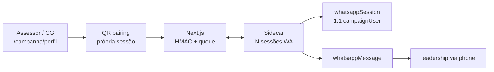

# D3 — Fundação do canal WhatsApp interno

Status: rascunho
Atualizado em: 2026-07-23
Item do roadmap: [docs/roadmap.md](../roadmap.md) (Trilha D, item D3; programa [whatsapp-interno-campanha.md](whatsapp-interno-campanha.md))
Impeccable: B — pareamento QR self-service por staff (sem inbox/compose de produto)
Appetite: ~3 dias eng; sidecar multi-sessão + migration + Consent + UI QR/status; **sem** envio/inbox de produto
Responsável: —

## Design (Impeccable)

Âncoras: `PRODUCT.md` (princípios 1 soberania, 2 clareza, 4 depth/simplicity) / `DESIGN.md` (register `product`) · tema `data-theme='campaign'` · shells `CampaignPageShell` · superfície de perfil existente (`/campanha/perfil` se houver).

Na implementação (`implement-roadmap-item`): craft compacto → critique → polish (fluxo QR + estados; sem redesign de CRM).

Brief compacto:

- **Persona / contexto:** Assessor ou Coordenador Geral no celular/notebook quer **ligar o próprio Zap** uma vez e seguir falando com lideranças “como sempre” — só que o Teqo passa a enxergar o fio.
- **Job principal:** parear a conta WhatsApp **pessoal** do `campaignUser` via QR no app e manter a sessão viva no sidecar.
- **Estratégia de cor:** Restrained; sessão caída = `destructive`/`cadence-overdue`; aviso ToS em muted, não modal de terror.
- **Edit where you see:** pairing self-service no **perfil** do staff (ação rara); não no CRM de lideranças.
- **Anti-goals:** número institucional único; admin pareando o chip de outra pessoa; chat UI; inbox; sync de histórico completo; esconder risco ToS/ban.

## Dados → decisão → apresentação

- **Vou apresentar dados?** Sim, superfície mínima neste item (status **da minha** sessão).
- **Decisões desbloqueadas:**
  - Assessor/CG: “meu WhatsApp está conectado ao Teqo? preciso escanear de novo?”
  - (Aggregate para D4/D5: sessão do ator healthy → habilitar compose/inbox daquela pessoa.)
- **Forma escolhida:** **número + contexto** (estado `conectado | aguardando QR | erro` + telefone mascarado da conta pareada + `lastSeenAt`). **Rejeitado:** dashboard de N sessões para o time inteiro na v1 (CG pode ter lista read-only “quem conectou” — Adiado); chart de uptime; KPI de conversas.
- **Profile:** categórico; 1 sessão por `campaignUser` staff.
- **Anti-goals de dado:** sem vanity de volume de msgs nesta fatia.

## Contexto

O programa exige que a liderança continue vendo o **Zap pessoal** do assessor/CG — não um robô institucional. Isso implica **N sessões** (uma por staff), pareadas no app (QR), não um chip compartilhado.

Socket WhatsApp não roda em Vercel serverless → sidecar multi-sessão. Sem fundação (sessão↔ `campaignUser`, adapter, log, Consent), D4/D5 não têm onde plugar.

## Objetivos

- Sidecar Node longo com **um** adapter não oficial, **N sessões** indexadas por `campaignUser.id` (só roles `coordinator` | `advisor`).
- Fluxo de pareamento no `/campanha`: `startPairing` → sidecar gera QR → UI mostra QR (refresh se expirar) → evento `paired` → status `connected` + telefone detectado (normalizado).
- App Next.js ↔ sidecar via API autenticada (HMAC); o Next **não** abre socket WA.
- Collections: `whatsappSession` (**1:1 com `campaignUser`**, unique) + `whatsappMessage` (log com `session` / `campaignUser`, direção, phones, texto, timestamps, match opcional `leadership`).
- Consent **`campanha-whatsapp-canal`** (fail-closed) + aceite explícito no UI de pairing (risco ToS/conta pessoal). Texto no lote jurídico.
- UI: status + QR + desconectar **só da própria sessão**; `leader` não pareia.
- Guardrails: allowlist inbound = phones de lideranças engajadas no CRM (e, para advisor, preferir as das Praças acessíveis — pode afrouxar para “todas lideranças engajadas” se match for só por phone); rate limit por sessão; secrets em env.

## Decisões travadas

- **Sessão = `campaignUser` staff, número pessoal.** UNIQUE `(campaignUser)`. **Rejeitado:** sessão singleton institucional; parear número digitado sem QR; um CG operar o chip de um assessor.
- **Login/pareamento = QR no app (estilo WhatsApp Web).** **Rejeitado:** só deep-link `wa.me`; pairing por SMS inventado; exigir app Companion oficial da Meta como único caminho (se o adapter oferecer código de pareamento sem QR como fallback técnico, ok — UX primária = QR).
- **Sidecar multi-sessão fora do Vercel.** Credenciais por sessão em volume do worker. **Rejeitado:** Baileys dentro de Server Action; Cloud API / WABA.
- **Um adapter na v1.** Baileys _ou_ Evolution self-hosted — um só. **Rejeitado:** multi-provider.
- **Log mínimo pós-`pairedAt`; sem histórico prévio; sem mídia binária na v1.** **Rejeitado:** dump completo do chip; gravar chats com não-CRM.
- **Consent `campanha-whatsapp-canal` + copy de risco pessoal.** **Rejeitado:** hardcode de ID; silêncio sobre ban/ToS.
- **i18n/naming:** `whatsappSession`, `whatsappMessage`, `startWhatsappPairing`, `whatsappBridge`; UI pt-BR (“Conectar meu WhatsApp”, “Escaneie o QR com o celular”).

## Questões em aberto

- **Onde hospedar o sidecar?** **Opções:** Fly.io / Railway / VPS. **Recomendação:** Fly/Railway com volume; runbook na implementação. _(ops)_
- **CG vê quem do time está conectado?** **Opções:** não na v1 | lista read-only de status. **Recomendação:** não na v1 (só a própria sessão); lista de saúde do time = Adiado com gatilho no programa.

## Abordagem proposta

Componentes:

- **`whatsappBridge`** (`src/utilities/whatsappBridge.ts`, `server-only`): `startPairing(userId)`, `getSessionStatus(userId)`, `disconnect(userId)`, (D4) `enqueueSend(userId, …)`; timeout curto.
- **Sidecar** (`workers/whatsapp-bridge/`): map `campaignUserId → adapter session`; emite QR/status/inbound; allowlist CRM.
- **`whatsappSession`**: `user` → `campaignUser` (unique, required), `status`, `pairedPhone`, `pairedAt`, `lastSeenAt`, `lastError`.
- **`whatsappMessage`**: `session`/`user`, `direction`, `peerPhone`, `leadership` (nullable), `body`, `providerMessageId`, timestamps.
- **UI** `WhatsappPairingPanel` no perfil: QR image/data-URL ou SVG, polling/SSE de status, botão desconectar, aviso Consent/ToS.
- **Actions** `startWhatsappPairing` / `disconnectWhatsappSession` / `getWhatsappSessionStatus` — actor só na própria sessão (`user.id`).
- **Migration:** `pnpm migrate:create add_whatsapp_channel` — session + message; sem backfill.
- **Reuse:** `normalizeBrazilianPhone`, `campaignConsent`, `withPayloadTransaction`, `overrideAccess: false`.

## Dependências

- **Dura:** remodelagem deployada (`campaignUser` roles + `leadership`/`Contact`).
- **Suave:** Onda 0 (texto Consent); telefones reais nas lideranças.
- **Não depende de D2.**

## Não escopo

- Compose/envio → [D4](whatsapp-envio-liderancas.md).
- Inbox / rascunhos → [D5](whatsapp-sugestao-atualizacoes.md).
- Número institucional / WABA / massa → fora.
- Mídia no log; grupos; histórico pré-pairing → Adiado.

## Rabbit holes

- **N sockets × memória no worker.** Mitigação: lazy connect on pairing; disconnect idle com re-QR; monitorar RSS antes de escalar horizontalmente (sticky sessions por user se shardear — Adiado).
- **Staff desconecta no celular e o Teqo não sabe.** Mitigação: health ping + status `erro` + CTA re-parear no compose D4.
- **Parear conta errada (pessoal demais / família).** Mitigação: mostrar telefone detectado pós-QR + “Desconectar”; copy de que deve ser o número que as lideranças já usam.

## Adiado com gatilho

- **Retention/expurgo do log.** Revisitar quando: volume ou pedido jurídico.
- **Lista CG “quem conectou”.** Revisitar quando: onboarding do time travar sem visão de cobertura.
- **Advisor-only allowlist por Praça no inbound.** Revisitar se falso positivo de match cruzado aparecer.

## Referências

- [whatsapp-interno-campanha.md](whatsapp-interno-campanha.md)
- `docs/roadmap.md` — Trilha D
- `src/utilities/phone.ts`, `campaignConsent.ts`, `campaignAccess.ts`
- `docs/plans/notifications.md` — D2
- `PRODUCT.md` / `DESIGN.md`
- AGENTS.md — Consent, migrations, campaign auth
