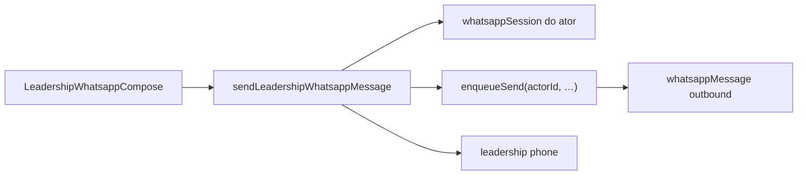

# D4 — Envio WhatsApp 1:1 para lideranças

Status: rascunho
Atualizado em: 2026-07-23
Item do roadmap: [docs/roadmap.md](../roadmap.md) (Trilha D, item D4; programa [whatsapp-interno-campanha.md](whatsapp-interno-campanha.md))
Impeccable: B — compose encaixado no CRM de liderança / detalhe (sem rota de “marketing blast”)
Appetite: ~1–2 dias eng; actions + UI compose + templates curtos; reusa sessão pessoal D3
Responsável: —

## Design (Impeccable)

Âncoras: `PRODUCT.md` (princípios 2, 3 Edit where you see, 4) / `DESIGN.md` (register `product`) · tema `campaign` · precedente `LeadershipInviteButtons` / share `wa.me`.

Na implementação: craft compacto → critique → polish.

Brief compacto:

- **Persona / contexto:** Assessor na estrada cobra atualização; CG manda um “como está Orolândia?” — a liderança deve ver a mensagem **no chat pessoal de sempre** com aquela pessoa.
- **Job principal:** enviar **uma** mensagem 1:1 pela **sessão WhatsApp do próprio ator** para **uma** liderança do escopo.
- **Estratégia de cor:** Restrained; ícone WA ok; primário Signal Red.
- **Edit where you see:** sim — Sheet “Mensagem” no detalhe `/campanha/liderancas/[id]`.
- **Anti-goals:** multi-destinatário; enviar pela sessão de outro staff; número institucional; templates de propaganda; matar `wa.me` de convites.

## Dados → decisão → apresentação

Dados: N/A — superfície de ação (compose). Feedback de entrega = Feel the action (§7), não KPI.

## Contexto

Com [D3](whatsapp-canal-fundacao.md), cada staff tem (ou não) a própria sessão pareada. O valor de produto é: **parece Zap pessoal** — a liderança não “fala com a campanha”, fala com o assessor/CG que já conhece.

## Objetivos

- Action `sendLeadershipWhatsappMessage({ leadershipId, body })`: access OK → resolve phone → exige **`whatsappSession` do `req.user` em `connected`** + Consent → `enqueueSend(actorUserId, …)` → log outbound com `user` = ator.
- UI compose: textarea + templates curtos editáveis; se sessão down → CTA “Conectar meu WhatsApp” (perfil D3) **e** fallback `wa.me` (“Abrir no seu WhatsApp”).
- Rate limit por ator/hora e por destinatário; **hard reject** N>1 destinatários.
- Guardrails: só `coordinator`/`advisor`; advisor só lideranças das Praças acessíveis; nunca `supporter`; nunca enviar usando sessão de terceiro.

## Decisões travadas

- **Remetente = sessão do ator logado.** A liderança recebe do número pessoal pareado daquela pessoa. **Rejeitado:** “enviar como campanha”; CG disparar pelo chip de um assessor; escolher remetente na UI.
- **Um destinatário por envio.** **Rejeitado:** lista/BCC; “todas as lideranças da Praça”.
- **Escopo = access da liderança.** **Rejeitado:** telefone livre digitado.
- **`wa.me` = fallback + convites.** **Rejeitado:** migrar convites para o bridge nesta fatia.
- **i18n/naming:** `sendLeadershipWhatsappMessage`, `LeadershipWhatsappCompose`; copy pt-BR (“Enviar pelo meu WhatsApp”).

## Questões em aberto

- **Templates: hardcoded vs collection?** **Opções:** 3–5 strings em código | collection. **Recomendação:** constantes na v1.
- **Thread no detalhe?** **Opções:** só compose | compose + últimas N do par **nesta sessão**. **Recomendação:** últimas 10 msgs do par na sessão do ator (não misturar threads de outro assessor). _(assumido)_

## Abordagem proposta

Componentes:

- **`LeadershipWhatsappCompose`**: Sheet; estados connected / needs-pairing / sending / failed; deep-link perfil se unpaired.
- **Action** em `actions/whatsapp.ts`: `overrideAccess: false`; nunca aceita `sessionUserId` do client (só `req.user.id`).
- **Reuse D3:** bridge, session, Consent, phone normalize.
- **Migration:** nenhuma se D3 já tem `user` no log.

## Dependências

- **Dura:** **D3** (sessão pessoal + log + Consent).
- **Suave:** telefones reais nas lideranças.

## Não escopo

- Inbox / rascunhos → [D5](whatsapp-sugestao-atualizacoes.md).
- Apoiadores / grupos / auto-resposta → fora.
- Push “mensagem enviada” → D2.

## Rabbit holes

- **Templates ricos.** Mitigação: `{nome}`, `{praca}` no máximo.
- **Fila com retry infinito.** Mitigação: retry curto + `failed` visível.

## Adiado com gatilho

- Bulk UI. Revisitar só com ok jurídico explícito.
- CG enviar “em cópia” vendo thread do assessor. Revisitar com o item de inbox agregado do programa (acesso cruzado).

## Referências

- [whatsapp-interno-campanha.md](whatsapp-interno-campanha.md), [whatsapp-canal-fundacao.md](whatsapp-canal-fundacao.md)
- `src/components/campaign/LeadershipInviteButtons.tsx`
- `src/app/(campaign)/campanha/(app)/liderancas/[id]/page.tsx`
- `src/utilities/campaignAccess.ts`, `phone.ts`
- `PRODUCT.md` / `DESIGN.md`
- AGENTS.md — access, transactions
