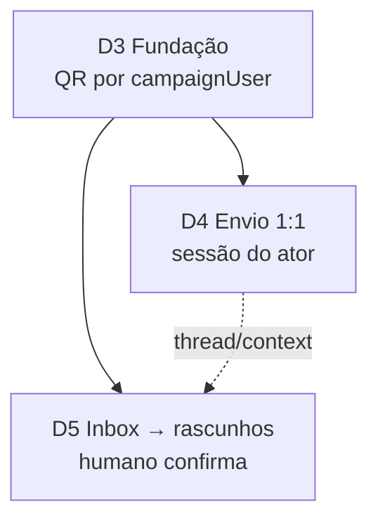

# WhatsApp interno da campanha (programa D3–D5)

Status: rascunho
Atualizado em: 2026-07-23
Item do roadmap: [docs/roadmap.md](../roadmap.md) (Trilha D, programa D3–D5)
Impeccable: N/A — plano-mestre; classes por fatia (D3 A/B, D4 B, D5 C)
Appetite: programa ~5–8 dias eng fatiados; **não** implementar como monólito
Responsável: —

## Dados → decisão → apresentação

Dados: N/A neste plano-mestre — cada fatia declara a sua. O programa existe para **fechar o Little Hire** (confiança no quadro atualizado): o canal real (ZAP) deixa de competir com o Field Desk e passa a alimentá-lo.

## Contexto

Feedback de produto (2026-07-23) + evidência de discovery/entrevista: lideranças e staff dificilmente sentirão segurança registrando só no `/campanha` enquanto o trabalho real continua no WhatsApp. O coordenador geral descreve o ZAP como o campo (“tudo após o ZAP”; mensagem > ligação). O [`IMPROVE-APP-PLAN.md`](../IMPROVE-APP-PLAN.md) nomeia o leak: assessores param de atualizar → WhatsApp/planilha → ferramenta defasada → abandono.

Hoje o produto só usa WhatsApp como **atalho `wa.me`** (convites, share, kit de apoiador): o humano envia no app dele; o Teqo não vê a conversa nem grava o sinal. **D2** (push + sino) cobre avisos _dentro_ do app — complementar, não substituto do canal de campo.

**Fronteira legal/produto já travada no roadmap:** WhatsApp Business API e disparo em massa continuam **fora de escopo** (Meta veda campanhas políticas; Res. TSE 23.610 art. 33). Este programa é **comunicação 1:1 interna** staff ↔ lideranças já cadastradas (`Contact`/`leadership`) — não propaganda a terceiros nem blast.

**Decisão de produto (2026-07-23):** o envio deve parecer o canal **pessoal** do assessor/coordenador (é o que a liderança espera), não um número institucional da campanha. Pareamento no próprio `/campanha` (QR, estilo WhatsApp Web).

## Objetivos do programa

- Trazer o canal ZAP para _dentro_ do fluxo de poder do Field Desk sem virar o sistema de registro (princípio 1 de `PRODUCT.md`: atalho pragmático; verdade no Teqo).
- Cada `coordinator`/`advisor` vincula **o próprio WhatsApp pessoal** e fala com lideranças **como se fosse o chip dele** — a liderança recebe no chat pessoal de sempre.
- Fatiar em três entregas shipáveis (D3 → D4 → D5), cada uma com appetite próprio.
- Humano no loop em qualquer escrita de domínio (`municipalityUpdate`, demanda, pledge) — alinhado a E11/C12.
- Fail-closed em Consent, access por papel/município, e auditoria mínima das mensagens processadas.

## Fatias (ordem de execução)

| ID  | Plano                                                                  | Entrega essencial                                                                | Classe | Appetite | Depende de                          |
| --- | ---------------------------------------------------------------------- | -------------------------------------------------------------------------------- | ------ | -------- | ----------------------------------- |
| D3  | [whatsapp-canal-fundacao.md](whatsapp-canal-fundacao.md)               | Bridge multi-sessão + **QR por staff** + log + Consent; **zero** envio em massa  | B      | ~3d      | remodelagem em prod (suave: Onda 0) |
| D4  | [whatsapp-envio-liderancas.md](whatsapp-envio-liderancas.md)           | Compose/envio 1:1 pela **sessão do ator** (CRM → liderança; parece chat pessoal) | B      | ~1–2d    | **D3**                              |
| D5  | [whatsapp-sugestao-atualizacoes.md](whatsapp-sugestao-atualizacoes.md) | Inbox inbound **na sessão de quem recebeu** → rascunhos com aceite humano        | C      | ~2–3d    | **D3** (suave: D4, C12)             |

## Decisões travadas (programa)

- **Canal interno 1:1, framework não oficial permitido.** Destinatários = lideranças já no CRM; never blast a apoiadores/eleitores. **Rejeitado:** WhatsApp Business API; disparo em massa / listas (TSE art. 33); bot que responde sozinho a terceiros.
- **Número pessoal por staff (`campaignUser`), não linha institucional.** Cada assessor/coordenador geral pareia o próprio WhatsApp; a liderança vê o remetente que já conhece. **Rejeitado:** chip único da campanha (quebra a relação pessoal — pedido explícito de produto 2026-07-23); um único CG enviando “em nome de” todos os assessores.
- **Pareamento no app via QR (estilo WhatsApp Web).** Staff abre `/campanha`, inicia pareamento, escaneia com o celular; sessão fica no sidecar. **Rejeitado:** só `wa.me` forever; pedir senha/OTP inventado; forçar app nativo Meta.
- **Teqo permanece system of record.** Mensagens são evidência/auditoria; commits de domínio só após ação humana (D5). **Rejeitado:** auto-criar `municipalityUpdate`/`votePledge` sem aceite.
- **Sidecar obrigatório (multi-sessão).** N sockets (um por staff vinculado); não vive em Vercel serverless. **Rejeitado:** “só mais uma API route” no Next.
- **Não substitui D2 nem `wa.me`.** D2 = push in-app; `wa.me` = fallback se a sessão do ator estiver down. **Rejeitado:** remover convites `wa.me` neste programa.
- **Risco ToS/ban é pessoal e explícito.** Consent + copy no pairing avisam que o vínculo usa cliente não oficial e pode afetar a conta WhatsApp da pessoa. **Rejeitado:** esconder o risco; usar conta do deputado/candidato como default.

## Questões em aberto (programa)

- **Onde vive o QR no IA?** **Opções:** `/campanha/perfil` | `/campanha/configuracoes/whatsapp` | Sheet no compose D4 (“conectar para enviar”). **Recomendação:** `/campanha/perfil` (self-service, cada um liga o seu) + estado “WhatsApp conectado/desconectado” no compose D4 com deep-link para parear. _(shape D3)_
- **LLM para classificar inbound em D5?** **Opções:** regras/heurística | LLM com revisão humana | só triagem manual. **Recomendação:** D5 v1 = heurística + templates + edição humana; LLM só com gatilho.

## Não escopo (programa)

- Business API / templates Meta / disparo a base nominal → continua fora de escopo.
- Chatbot eleitoral público / atendimento a cidadão → fora.
- Número institucional / “WhatsApp da campanha” compartilhado → fora (conflita com a decisão de canal pessoal).
- Substituir onboarding presencial / seed (Big Hire) → IMPROVE-APP-PLAN.

## Rabbit holes

- **Evolution API / Baileys / multi-device / grupos WA.** Mitigação: D3 escolhe **um** adapter; multi-**sessão** (N staff) sim; multi-**número por pessoa** e grupos = Adiado.
- **“Sincronizar todo o histórico do chip.”** Mitigação: só mensagens após pairing + filtro por telefones do CRM (e, no inbox, só o que chegou naquela sessão).
- **Espionar conversas pessoais do staff com não-lideranças.** Mitigação: allowlist estrita de phones do CRM; não indexar chats fora da allowlist.

## Adiado com gatilho

- Sessão secundária / segundo chip por pessoa. Revisitar quando: pedido explícito de um assessor com dois números de trabalho.
- LLM de classificação. Revisitar quando: D5 v1 com ≥50 rascunhos/semana e taxa de descarte >40% por “categoria errada”.
- Coordenador ver inbox agregado de todos os assessores. Revisitar quando: CG pedir visão transversal **e** jurídico ok com acesso cruzado a threads pessoais.

## Referências

- `docs/roadmap.md` — Trilha D; Fora de escopo (Business API / massa)
- Entrevista CG 2026-07-23 (`private/transcribe/general-coordinator-interview-20260723/`) — “ZAP é o campo”
- `docs/IMPROVE-APP-PLAN.md` — Little Hire / leak WhatsApp
- `PRODUCT.md` §1 soberania + atalho pragmático; §5 humano no loop
- `docs/plans/notifications.md` (D2) — complementar
- `src/utilities/phone.ts` — `buildWhatsAppUrl` (fallback `wa.me`)
- AGENTS.md — Contact, Consent por chave, campaign access, Vercel
