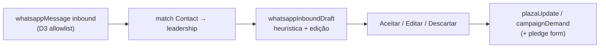

# D5 — Sugestões de atualização a partir do WhatsApp inbound

Status: rascunho
Atualizado em: 2026-07-23
Item do roadmap: [docs/roadmap.md](../roadmap.md) (Trilha D, item D5; programa [whatsapp-interno-campanha.md](whatsapp-interno-campanha.md))
Impeccable: C — superfície nova (inbox + revisão de rascunhos); sem design-ref
Appetite: ~2–3 dias eng; inbox staff + draft suggestions + aceite → domínio; **sem** auto-commit
Responsável: —

## Design (Impeccable)

Âncoras: `PRODUCT.md` (princípios 1, 2, 5 humano no loop, 7) / `DESIGN.md` (register `product`) · tema `campaign` · shells `CampaignPageShell`, feeds `PlazaUpdateFeed` / forms `PlazaUpdateForm` · paralelo E11 (menu + aceite/descarte).

Na implementação: shape → craft → critique → polish (classe C).

Brief compacto:

- **Persona / contexto:** Assessor que já conversou no ZAP com a liderança e precisa **não redigitar** o reporte no Teqo; Coordenador que quer o quadro atualizado sem caçar print no grupo.
- **Job principal:** transformar mensagem inbound em **rascunho editável** (`plazaUpdate` / demanda / nota de voto) e só gravar no domínio após aceite humano.
- **Estratégia de cor:** Restrained; fila por frescor, não por “AI score”.
- **Edit where you see:** sim — aceitar/editar/descartar no card do rascunho; deep-link para a Praça/liderança.
- **Anti-goals:** bot que grava sozinho; LLM obrigatório na v1; inbox estilo WhatsApp Web clone; “caça” a mensagens de não-lideranças.

## Dados → decisão → apresentação

- **Vou apresentar dados?** Sim, superfície neste item (fila de rascunhos + origem).
- **Decisões desbloqueadas:**
  - Assessor: “esta mensagem vira atualização da Praça X, demanda, ou só arquivo?”
  - Assessor/CG: “aceito o texto sugerido ou edito antes de gravar?”
  - Staff: “descarto (ruído / off-topic) para não poluir o frescor da Praça?”
- **Forma escolhida:** **lista/fila** de itens (mensagem → tipo sugerido → preview) + detalhe com editar/aceitar/descartar. **Rejeitado:** dashboard de % auto-classificados; chart de volume WA; mapa de mensagens.
- **Profile:** itens categóricos + texto; dezenas/dia típico (não milhares); granularidade liderança×praça.
- **Anti-goals de dado:** sem vanity “msgs processadas”; sem auto-atualizar `lastUpdateAt` sem aceite (frescor mentiroso).

## Contexto

O Little Hire falha quando o reporte vive só no ZAP ([IMPROVE-APP-PLAN](../IMPROVE-APP-PLAN.md); entrevista CG: canal real = mensagem). D3 grava inbound no log; D4 cobre outbound. Falta o caminho **ZAP → registro** com humano no loop — o mesmo estatuto de E11 (“sugestão nunca decide”).

Domínio alvo já existe: `plazaUpdate` (`PlazaUpdateForm` / feed), `campaignDemand`, `votePledge.declaredVotes` (liderança) / estimativas staff (assimetria).

## Objetivos

- Inbox staff (`/campanha/whatsapp` ou seção no dashboard): só mensagens inbound da **própria sessão** do ator (o Zap pessoal dele); match a `leadership` por phone; unmatched→triagem.
- Gerador de **draft** (heurística v1): classifica intent grosso (`atualizacao | demanda | voto | outro`) + sugere Praça (se liderança tem 1 Praça; se N, pede escolha) + texto pré-preenchido editável.
- Aceite cria o documento de domínio na transação (`withPayloadTransaction`), liga `whatsappMessage` → entidade criada (auditoria), respeita access/locks existentes (`plazaUpdate` locks).
- Descarte registra motivo curto (opcional na v1) e marca mensagem como `ignored` — não some do log.
- Guardrails: **nunca** auto-create; inbox = sessão do ator (não ver thread do colega na v1); advisor ainda filtrável às Praças acessíveis; `leader` não usa inbox; sem processar phones fora do CRM.

## Decisões travadas

- **Humano no loop obrigatório.** Draft ≠ commit. **Rejeitado:** auto-`plazaUpdate` por NLP; webhook que escreve domínio direto.
- **Inbox = sessão pessoal do ator.** Alinhado a D3/D4 (canal pessoal). **Rejeitado:** inbox único da “campanha”; CG ler todas as threads dos assessores na v1 (Adiado no programa).
- **Heurística v1, não LLM.** Palavras-chave / botões de tipo manual + textarea. **Rejeitado:** LLM na v1 (custo, indeterminismo, appetite); ver Adiado.
- **Teqo é o registro; WA é evidência.** `lastUpdateAt` e versões (C12) só mudam no aceite. **Rejeitado:** usar timestamp da msg WA como frescor oficial sem commit.
- **i18n/naming:** `whatsappInboundDraft`, `suggestPlazaUpdateFromMessage`, `acceptWhatsappDraft`; rotas/params em inglês; UI pt-BR (“Sugestões do WhatsApp”).

## Questões em aberto

- **Rota dedicada vs. painel?** **Opções:** `/campanha/whatsapp` | aba no dashboard | Sheet na liderança. **Recomendação:** rota `/campanha/whatsapp` (inbox) + entrada “Criar a partir do WhatsApp” no detalhe da liderança se houver msgs pendentes. _(shape fecha layout)_
- **Quais tipos de domínio na v1?** **Opções:** só `plazaUpdate` | update+demanda | update+demanda+voto. **Recomendação:** `plazaUpdate` + `campaignDemand` na v1; voto (declared/estimated) só se o texto for inequívoco **e** o aceite abrir o form de pledge existente — senão Adiado. _(assumido — validar)_

## Abordagem proposta

Componentes:

- **Collection ou table `whatsappInboundDraft`** (status `pending|accepted|discarded`, `suggestedKind`, `plaza`, `body`, rel `whatsappMessage`): migration própria desta fatia **ou** campos no `whatsappMessage` se depth preferir menos collections — **recomendação:** collection draft (ciclo de vida claro; não polui log imutável).
- **`suggestDraftFromMessage`** puro + action `acceptWhatsappDraft` / `discardWhatsappDraft` reusando creates existentes de update/demanda (não duplicar invariantes).
- **UI** `WhatsappInboxPage` + `WhatsappDraftReviewCard`; reusa `PlazaUpdateForm` fields onde der (depth check).
- **Suave C12:** se sinais tipados em `plazaUpdate` existirem, o aceite pode preencher `kind`/sinal — senão texto livre como hoje.
- **Migration:** `pnpm migrate:create add_whatsapp_inbound_draft`.

## Dependências

- **Dura:** **D3** (inbound log + match phone + Consent).
- **Suave:** **D4** (thread/contexto outbound); **C12** (sinais tipados); remodelagem/demandas já em prod.

## Não escopo

- Auto-resposta / chatbot → fora.
- Classificação LLM → Adiado com gatilho (programa).
- Envio em massa / apoiadores → fora.
- Clone de WhatsApp Web (sync de mídia, status, reactions) → fora.

## Rabbit holes

- **Resolver Praça quando liderança tem N Praças.** Mitigação: obrigar select no draft; sem “adivinhar” por NLP geográfico.
- **Mesclar com motor E11.** Mitigação: filas separadas (E11 = território/meta; D5 = inbox de mensagens); no máximo link “abrir Praça”.
- **Reprocessar histórico em massa.** Mitigação: só msgs após feature flag / `draftsEnabledAt`.

## Adiado com gatilho

- **LLM classifier.** Revisitar quando: ≥50 drafts/semana e descarte >40% por tipo errado (critério do programa).
- **Sugerir `declaredVotes` / cenários A10.** Revisitar quando: assessores pedirem explicitamente e houver padrão estável de msgs numéricas.
- **Mídia → anexo em `plazaUpdate`.** Revisitar quando: D3 passar a persistir mídia.

## Referências

- [whatsapp-interno-campanha.md](whatsapp-interno-campanha.md), [whatsapp-canal-fundacao.md](whatsapp-canal-fundacao.md), [whatsapp-envio-liderancas.md](whatsapp-envio-liderancas.md)
- `src/collections/PlazaUpdate.ts`, `src/components/campaign/PlazaUpdateForm.tsx`
- `docs/plans/motor-de-sugestoes.md` (E11) — precedente humano no loop
- `docs/IMPROVE-APP-PLAN.md` — Little Hire
- `PRODUCT.md` / `DESIGN.md`
- AGENTS.md — transactions, access, Consent
