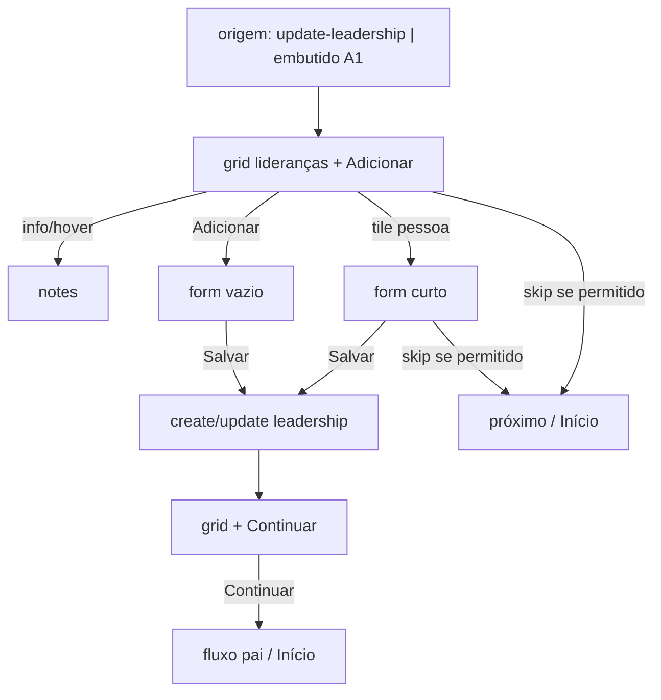

# Wizard atualizar liderança — grid + formulário curto

Status: rascunho
Atualizado em: 2026-07-29
Item do roadmap: [docs/roadmap.md](../roadmap.md) (Trilha B, item B70 — UX-1 wizards / A4)
Impeccable: C — UI nova (grid de lideranças + formulário de edição/criação no chassis B59)
Appetite: ~1,25–1,5 dia eng; 2 “modos” no B59 (grid → form); writes via actions `leadership` existentes; focus + skip + Continuar
Responsável: —

## Design (Impeccable)

Âncoras: `PRODUCT.md` / `DESIGN.md` · `Drawer`/`Tooltip` shadcn · tema `campaign` · sibling visual **B63**/**B64** (tiles) · focus policy do Field Desk.

Na implementação: shape → craft → critique → polish.

Brief compacto:

- **Persona:** CG/assessor no polegar (pacote Cairu); veio de “Atualizar liderança” ou do “Quer ajustar liderança?” do A1; Zap pode interromper.
- **Job principal:** ver a rede do município num grid, abrir a ficha curta de quem mudou (ou criar), gravar, e **continuar** o fluxo pai — ou pular se a liderança não era o motivo.
- **Estratégia de cor:** Restrained — tiles como B63 (fundo transparente / borda); status de apoio no canto (badge outline / cor já usada em `SupportStatusBadge`); “Não exclusivo” como exceção visual discreta (não competir com status).
- **Edit where you see:** não no grid (toque = abrir form); no form, **Salvar** explícito (exceção nota/confirmação). Sem spreadsheet mode.
- **Anti-goals:** formulário longo (org/setor/consentNote — mortos no **B69**); abrir `/liderancas/[id]/editar` no meio do ritual; auto-save silencioso no form do wizard; esconder “Adicionar” atrás de menu.

## Dados → decisão → apresentação

Dados: N/A como métrica — catálogo de pessoas do município + campos de ficha. Decisão = quem atualizar / criar / pular; exclusividade e status são leitura+escrita no form (**B69**).

## Contexto

Ação **A4** ([fluxos-acao-primeiro-inicio.md](fluxos-acao-primeiro-inicio.md)) e passo 7 opcional de A1. Catálogo B45 ✓ já tem `update-leadership`. Chassis **B59**; município via **B60** (standalone) ou pré-escolhido (embutido). Modelo limpo + `exclusive` em **B69**.

Pedido (2026-07-29) — substitui o rascunho A4 “ramos de intenção” por:

**Tela 1 — grid de lideranças do município**

- Grid: **2 col mobile / 3 tablet / 4 desktop**.
- Cada liderança = botão **quadrado grande**, cantos arredondados:
  - **Status** (supportStatus) no canto **superior esquerdo**.
  - Ícone/botão **informação** no canto **superior direito** → conteúdo de `notes` (observação); no **hover** do tile inteiro (e nos do mesmo tipo), o mesmo conteúdo do info (Tooltip fine / long-press ou title pattern já usado na strip — não só no ícone).
  - **Título** = nome (cortar na última palavra que couber inteira — ellipsis por palavra, não mid-word).
  - Abaixo, discreto: **telefone** (prioridade) ou e-mail se sem telefone.
- Um tile = **Adicionar nova** → form vazio.
- Clique no tile de pessoa → form de edição (fluxo raro vs. só olhar; ainda assim é o caminho de escrita).
- Topo direito: **“Pular atualização de liderança →”** quando a origem ≠ `update-leadership` (mesma regra de B63).
- Após Salvar no form com mudança: volta ao grid e aparece **“Continuar”** no canto **inferior direito** (avança o fluxo pai / commit do bloco). Sem dirty → sem Continuar (ou Continuar desabilitado — preferir **oculto** até dirty).

**Tela 2 — formulário único (editar / criar)**

- Campos: **Nome**, **Celular**, **E-mail**, **Status de apoio**, **Observação** (`notes`), **Apoio exclusivo** (`exclusive` — B69).
- Salvar → volta ao grid; create vincula ao município corrente (piso ≥1 município).
- Focus: ao abrir o form (e ao montar qualquer view nova do wizard com input), **focar automaticamente o input principal** (Nome no create; primeiro campo editável no edit — tipicamente Nome ou Status se nome read-only por access). Mesma regra ao abrir Drawer/modal de info se houver campo — senão foco no título do drawer (precedente B42).

Município sticky (**B59**) após escolha.

## Objetivos

- Passos no shell B59: `WizardLeadershipGridStep` + `WizardLeadershipFormStep` (ou um client island com modo `grid | form`).
- Loader: lideranças do município no escopo do ator (`loadMunicipalityLeaderships` / select enxuto: id, contact name/phone/email, supportStatus, notes, exclusive).
- Info/hover: `notes` truncado com scroll no Drawer se longo; empty = “Sem observação.”
- Truncamento de nome: helper puro em `lib/` (word-boundary ellipsis) + unit.
- Skip: trailing slot B59; **hidden** se `entryAction === 'update-leadership'`.
- Salvar edit: `updateLeadershipInternal` / action existente (contact name/phone/email + supportStatus + notes + exclusive); create: `createLeadership` mínimo + município atual.
- Dirty → `Continuar` no grid; Continuar **não** grava de novo — só avança (writes já no Salvar do form).
- Pending nos botões Salvar/Continuar (Feel the action).
- Sem migration (B69 já migrou). Sem Consent novo.
- Unit: truncamento; skip oculto no entry; dirty gate do Continuar. E2e smoke: grid → form → save → Continuar; add new foca Nome.

## Decisões travadas

- **Grid-first (não árvore de intenções do rascunho A4).** **Rejeitado:** passo “O que você quer fazer?” (trocar quem coordena / status / votos / incluir) — atrito extra; o tile + form curto cobrem status/obs/exclusivo/create; votos declarados ficam fora deste wizard (pledge = outro passo / lista).
- **Skip só se origem ≠ `update-leadership`.** **Rejeitado:** sempre (permitiria ação Início sem atualizar); nunca (quebra “quer também?” do A1).
- **Continuar só após dirty save.** **Rejeitado:** Continuar sempre (avança sem registro); auto-avançar no Salvar sem voltar ao grid (impede atualizar 2ª liderança no mesmo município — pacote Cairu).
- **Form curto = 6 campos (incl. exclusive).** **Rejeitado:** form completo da ficha interna; pledge/estimativa neste passo.
- **Focus automático no input principal ao entrar na view.** **Rejeitado:** só no create; depender de focus nativo do browser sem `autoFocus`/`requestFocus` no mount.
- **i18n:** `entryAction`, `exclusive`; copy “Pular atualização de liderança →” / “Continuar” / “Adicionar liderança”.

## Questões em aberto

- **Após Continuar no standalone A4: Início ou resumo?** **Opções:** A Início + toast | B tela resumo A1-like. **Recomendação:** A no v1; B quando o wiring A1 unificar commit. _(assumido)_
- **Nome do contact é editável no wizard para staff?** **Opções:** A sim (pedido) | B só admin Payload. **Recomendação:** A via action staff que já atualiza Contact nos forms internos — reusar o mesmo caminho; se access bloquear, falhar fechado com mensagem. _(assumido)_

## Abordagem proposta

Componentes:

- **`WizardLeadershipGridStep` / `WizardLeadershipFormStep`** em `components/campaign/leadership/` (ou `shared/` se o tile virar 3º call site com B63 — **não** extrair tile genérico no 2º; depth check: copiar padrão B63 até o 3º).
- **`truncateNameAtWordBoundary`** em `src/lib/` + unit.
- Reuso: B59 trailing skip + sticky município; `SupportStatusBadge` / labels; actions em `campanha/actions/leadership.ts`; Drawer info.
- Focus helper: `useFocusOnMount(ref)` se já existir no campaign shell; senão um hook mínimo no passo (não lib global prematura).
- **Migration:** Sem migration (depende de B69).

## Dependências

- Dura: **B59**, **B69**. Soft: **B60** (município standalone). Soft: B45 ✓ (`update-leadership`). Soft: B32 ✓ (labels/status).

## Não escopo

- Schema exclusive + drop org/setor/consentNote → **B69**.
- DeclaredVotes / estimativa no wizard → lista de pledges / passo futuro; **estimativa nunca neste fluxo**.
- Wiring completo A1 “Registrar atualização” → fatia A1.
- Abrir ficha completa `/liderancas/[id]`.

## Rabbit holes

- **Tile genérico compartilhado B63/B64/B70.** **Mitigação:** terceiro call site = gatilho; até lá copiar o padrão visual.
- **Optimistic multi-edit sem Salvar.** **Mitigação:** Salvar explícito no form; Continuar só navega.
- **Busca no grid quando N > ~20.** **Mitigação:** v1 sem busca; Adiado se município com rede grande doer.

## Adiado com gatilho

- **Busca/filtro no grid.** Revisitar se municipio típico do CG tiver >12 lideranças no loader.
- **Ramo “anotar votos declarados”.** Revisitar quando A1 pedir pledge no mesmo ritual (hoje fora do form curto).
- **Extrair `WizardChoiceTile`.** Revisitar no 3º grid irmão (já há B63+B64; este é o 3º — **pode** extrair neste item se o diff medir ≥~80 linhas duplicadas; senão defer explícito no `/simplify`).

## Referências

- [simplificar-modelo-lideranca.md](simplificar-modelo-lideranca.md) · [wizard-registro-sinal.md](wizard-registro-sinal.md) · [wizard-mudar-tendencia.md](wizard-mudar-tendencia.md) · [chassis-wizard-campanha.md](chassis-wizard-campanha.md) · [fluxos-acao-primeiro-inicio.md](fluxos-acao-primeiro-inicio.md) · [catalogo-acoes-inicio-por-persona.md](catalogo-acoes-inicio-por-persona.md)
- `campaignHomeActions.ts` (`update-leadership`) · `actions/leadership.ts` · `leadershipData.ts` · `LeadershipForm.tsx`
- AGENTS.md — `overrideAccess: false`; Contact; Feel the action
- `PRODUCT.md` / `DESIGN.md` · focus / B42 `initialFocus`
