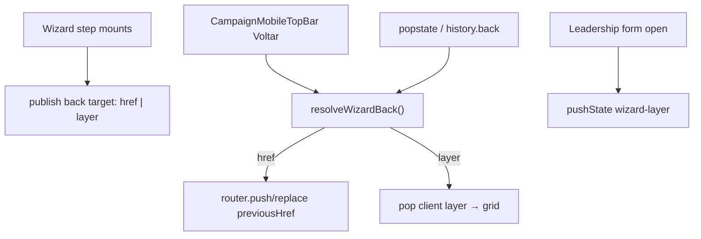

# Wizard — navegação robusta (Voltar header + Android back)

Status: em implementação (as-built parcial 2026-08-01)
Atualizado em: 2026-08-01 — freshness + Fase 1/2: `wizardBack` puro + `useWizardBackHistory` (pushState/popstate, paridade B106); chrome `onBack`; Voltar no top bar = botão → mesmo path do Android; previousHrefs canônicos (sinal/votos/tendência/liderança); form liderança = layer `leadership-form`. Sem migration.
Issue: #195
Priority: P0
Model: cursor-grok-4.5-high
Impeccable: B — chrome de fluxo `CampaignWizardShell` / history; encaixe em todos `/campanha/acoes/*`
Appetite: ~1,5–2d eng; investigação + contrato de stack + wiring nos passos (incl. modo form liderança); sem migration
Responsável: —

## Premissas

1. **Voltar** (seta do header) e **Android/browser back** devem ter a **mesma semântica**: um passo lógico para trás no wizard.
2. “Passo lógico” ≠ sempre `history.back()` cego nem sempre o `previousHref` atual — há passos que são **estado client** (ex. form de editar liderança dentro da mesma URL).
3. Precedente a reusar: `useHomeSearchFocusHistory` (B106) — `pushState` + `popstate` para camadas sem mudar a rota App Router.
4. `previousHref` hoje é calculado **por passo** de forma inconsistente (ex. liderança form herda o mesmo href do grid → header Voltar pula o grid; Android back sai para a ação/URL anterior no history).
5. Escopo = **navegação**; polish visual de tiles → **B113**.
   → Corrija no gate ou o implementador segue com estas.

## Design (Impeccable)

Âncoras: `PRODUCT.md` (Clarity under pressure) / `DESIGN.md` · B59/B75/B106/B110 · tema `campaign`.

Na implementação (`work-issue`): shape do contrato → craft → critique (fluxos) → polish.

Brief compacto:

- **Persona / contexto:** staff no Android no meio do ritual; espera que o botão do SO e a seta façam a mesma coisa.
- **Job principal:** voltar **um** passo previsível; nunca “ação aleatória” nem pular o grid de lideranças.
- **Estratégia de cor:** N/A (chrome).
- **Edit where you see:** não.
- **Anti-goals:** segundo router; sync history em todo click do app; `window.history` sem pin; confundir X/dismiss com Voltar.

### Wireframe (texto)

```text
Camadas (exemplo liderança):
  URL /acoes/atualizar-lideranca?municipio=foo
  ├─ grid (base da URL)
  └─ form edit (camada pushState)  ← Android back / Voltar → grid
       ↑ não /acoes anterior

Sinal:
  busca município → tipo → body
  Voltar/Android: body→tipo→busca→dismiss/origem
```

## Dados → decisão → apresentação

Dados: N/A — navegação.

## Contexto

**Sintoma (produto 2026-08-01, 3ª classe de pedido junto com drawer):** Voltar do header e o botão Android levam a destinos **diferentes e/ou errados** em vários passos do wizard.

### Investigação (Fase 1 — 2026-08-01)

| Superfície                | Header Voltar (`previousHref`)         | Android back (history)                      | Problema                            | Fix B114                                     |
| ------------------------- | -------------------------------------- | ------------------------------------------- | ----------------------------------- | -------------------------------------------- |
| Entry busca município     | (sem Voltar; X = dismiss/`returnPath`) | URL anterior à entrada                      | Android ≠ X se veio de deep link    | pushState + pop → dismissHref                |
| Passo tipo sinal          | busca **sem** município ✓              | stack real (pode divergir se replace/chain) | header Link **push** poluía stack   | contrato + `history.back` → replace canônico |
| Body sinal                | tipo (c/ município) ✓                  | idem                                        | idem                                | mapa `wizardStepPreviousHref`                |
| Tendência choice          | **mesmo URL** (c/ município) ✗         | stack                                       | Voltar no-op / refresh              | previous → busca sem município               |
| Tendência note            | choice ✓                               | idem                                        | push vs back                        | contrato                                     |
| Votos                     | busca sem município ✓                  | idem                                        | push vs back                        | contrato                                     |
| Liderança **grid**        | busca sem município ✓                  | idem                                        | push vs back                        | contrato                                     |
| Liderança **form**        | mesmo href do grid ✗                   | página/ação anterior                        | form não é URL — back abandona grid | `pushState` layer → pop → grid               |
| Encadeados + `returnPath` | misturam chain                         | stack real                                  | “ações aleatórias”                  | alvo canônico por passo + intercept          |

Chrome pré-B114: `CampaignMobileTopBar` só fazia `CampaignWizardNavLink` → `previousHref`. **Não havia** interceptor `popstate` no wizard (só no Início search, B106).

## Objetivos (critérios de aceite)

- [x] **Investigação registrada** no plano/PR: mapa passo→destino de Voltar para os 5 fluxos staff e onde header ≠ Android hoje.
- [x] **Contrato único** `wizardBack`: navigate href **ou** pop camada client. Header e Android consomem o **mesmo** contrato (`requestBack` → `history.back` → popstate).
- [x] Em **todos** os passos URL do wizard: Voltar header e Android back → passo anterior lógico (via replace canônico).
- [x] Em **liderança form**: Voltar/Android → **grid** da mesma URL.
- [x] Entry step: Android back = dismiss/`returnPath` (paridade com X via mesmo dismissHref).
- [x] Pins: unit do resolvedor de back; unit top bar onBack; pending Voltar via replace; e2e chrome Voltar botão.
- Guardrails: sem migration / Consent; não quebrar B110 (`returnPath`); staff gate intacto.

## Boundaries (desta entrega)

- **Always:** um contrato testável; `popstate` handlers com cleanup; não deixar listener órfão fora de `/acoes`.
- **Ask first:** `replace` vs `push` em toda transição de passo se mudar o modelo de stack App Router.
- **Never:** Neon; `history.go(-N)` mágico sem pin; tratar X e Voltar como iguais em continue steps.

## Decisões travadas

- **Um contrato compartilhado header ↔ hardware back** (não dois códigos). Fonte: produto 2026-08-01. **Rejeitado:** só corrigir `previousHref`s soltos; só documentar “Android = browser”.
- **Camadas client (form liderança) usam `history.pushState` marcado** (padrão B106), não mudam a URL App Router. **Rejeitado:** `?liderancaId=` obrigatório só para back (caro; URL shareable fica Adiado); ignorar Android na form.
- **Passos URL continuam sendo rotas** (`previousHref` canônico por passo); o contrato **valida** e centraliza esses hrefs para não divergirem. **Rejeitado:** wizard 100% client SPA sem URL.
- **Investigação first-class na Fase 1** (Grok High): CLAIM das causas → tabela passo×destino → só então wiring. **Rejeitado:** patch pontual só na liderança.
- **i18n:** ids `wizardBack`, `WizardHistoryLayer`; copy existente “Voltar”.

## Questões em aberto

- **Centralizar hrefs de previous num mapa puro `lib/wizardBack.ts` vs helper por fluxo?** **Opções:** A) mapa puro + pin | B) só hook. **Recomendação:** **A** — testável sem DOM. ✅
- **Encadeado: Voltar do 1º passo do subfluxo** (ex. sinal após votos) → fim do subfluxo anterior ou skip chain? **Opções:** A) passo URL anterior na sessão | B) `wizardChainContinue` inverso. **Recomendação:** **A** (histórico real da sessão). _(assumido)_ — v1 usa previous canônico (busca/tipo), não inverte a chain.

## Abordagem proposta



Componentes (as-built):

- **`src/lib/wizardBack.ts`** (puro): `resolveWizardBack`, `wizardStepPreviousHref`, marks `teqoWizardBack` / `teqoWizardLayer`.
- **`useWizardBackHistory`**: espelho de B106; open form → push layer; Voltar/Android → `history.back` → popstate → replace ou pop layer.
- **`CampaignWizardChromeContext`:** `onBack` no chrome.
- **`CampaignMobileTopBar`:** Voltar botão chama `onBack` (fallback Link se só `previousHref`).
- **Wiring:** previousHrefs canônicos nos steps; leadership `clientLayer`.
- **Migration:** Sem migration.

### Doubt (decisão cara — stack)

```text
CLAIM: Camadas client via pushState (B106) + previousHref canônico por URL step
       unificam Voltar/Android sem transformar o wizard em SPA.
WHY: Errar history = usuários perdem trabalho / “ações aleatórias” em campo.
→ Adversarial: pushState demais pode brigar com Next soft-nav; mitigar com
  marca no state + ignore pop programático; preferir replace em avanços de
  passo já usados (B97) para não inflar stack. Classificar: trade-off documentado.
```

## Fases verificáveis

### Fase 1 — Tracer: investigação + contrato puro + 1 fluxo

- **Quota:** ~0,5–0,75d
- **Entrega:** tabela de divergências; `wizardBack` unit; ligar **um** fluxo (recomendado: `register-signal`) header=Android.
- **Aceite:**
  - [x] Doc da investigação no PR/plano; pin unit; sinal body→tipo→busca coerente nos dois gestos.
- **Verify:** `pnpm gate:fast` + unit `wizardBack`
- **Files:** `lib/wizardBack.ts`, steps sinal, top bar mínimo
- **Tamanho:** M

### Fase 2 — Liderança layer + demais fluxos

- **Quota:** ~0,75–1d
- **Entrega:** form liderança pushState; votos/tendência/liderança grid alinhados; e2e smoke.
- **Aceite:**
  - [x] Form edit → Android/Voltar → grid; checklist Objetivos.
- **Verify:** `pnpm gate:fast` + e2e chrome
- **Files:** `WizardLeadershipStep`, hook history, chrome, demais previousHrefs
- **Tamanho:** M

### Checkpoint

- [x] Nenhuma divergência conhecida header×Android na tabela da Fase 1; rabbit hole SPA cortado.

## Dependências

- Soft: B59/B75/B106/B110 ✓.
- Soft paralelo: **B113** (UI); não bloqueia.

## Não escopo

- Cores/títulos/thumb-zone → **B113**.
- Drawer → **B112**.
- Mudar modelo de rotas `/campanha/acoes` → fora.
- Limpeza de marks órfãos no dismiss X (Link) — Adiado; risco baixo vs Voltar unificado.

## Rabbit holes

- **Wizard SPA com store global de stack.** **Mitigação:** contrato fino + pushState só para camadas client; URLs continuam source of truth dos passos.
- **Sincronizar todo `CampaignWizardNavLink` com history manual.** **Mitigação:** só back/dismiss; avanços seguem Link/router atuais (ajustar replace onde a investigação mostrar stack podre).

## Adiado com gatilho

- **Deep-link `?leadershipId=` para form.** Revisitar se compartilhar form no meio do ritual for pedido.
- **Desktop Voltar chrome.** Continua browser-only (B59).
- **Dismiss X limpa marks sintéticos antes do navigate.** Revisitar se back a partir do destino do X reabrir o wizard.

## Referências

- GitHub Issue #195 (spec + frontmatter `id/depends/serializes/priority/model`)
- [`CampaignWizardChromeContext.tsx`](../../src/components/campaign/shell/CampaignWizardChromeContext.tsx)
- [`CampaignMobileTopBar.tsx`](../../src/components/campaign/shell/CampaignMobileTopBar.tsx)
- [`useHomeSearchFocusHistory.ts`](../../src/components/campaign/dashboard/useHomeSearchFocusHistory.ts) — precedente B106
- [`WizardLeadershipStep.tsx`](../../src/components/campaign/leadership/WizardLeadershipStep.tsx) — form vs grid
- [`campaignActionRoutes.ts`](../../src/lib/campaignActionRoutes.ts) · [`wizardActionChain.ts`](../../src/lib/wizardActionChain.ts)
- `docs/plans/chassis-wizard-campanha.md` (B59) · `header-mobile-wizard-campanha.md` (B75)
- AGENTS.md — Campaign auth; naming
- `PRODUCT.md` — Clarity under pressure
