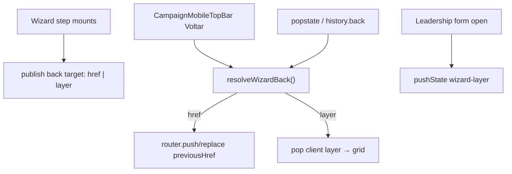

# Wizard — navegação robusta (Voltar header + Android back)

Status: registrado
Atualizado em: 2026-08-01
Issue: #195
Priority: P0
Model: cursor-grok-4.5-high
Impeccable: B — chrome de fluxo `CampaignWizardShell` / history; encaixe em todos `/campanha/acoes/*`
Appetite: ~1,5–2d eng; investigação + contrato de stack + wiring nos passos (incl. modo form liderança); sem migration
Responsável: —

## Premissas

1. **Voltar** (seta do header) e **Android/browser back** devem ter a **mesma semântica**: um passo lógico para trás no wizard.
2. “Passo lógico” ≠ sempre `history.back()` cego nem sempre o `previousHref` atual — há passos que são **estado client** (ex. form de editar liderança dentro da mesma URL).
3. Precedente a reusar: `useHomeSearchFocusHistory` (B106) — `pushState` + `popstate` para camadas sem mudar a rota App Router.
4. `previousHref` hoje é calculado **por passo** de forma inconsistente (ex. liderança form herda o mesmo href do grid → header Voltar pula o grid; Android back sai para a ação/URL anterior no history).
5. Escopo = **navegação**; polish visual de tiles → **B113**.
   → Corrija no gate ou o implementador segue com estas.

## Design (Impeccable)

Âncoras: `PRODUCT.md` (Clarity under pressure) / `DESIGN.md` · B59/B75/B106/B110 · tema `campaign`.

Na implementação (`work-issue`): shape do contrato → craft → critique (fluxos) → polish.

Brief compacto:

- **Persona / contexto:** staff no Android no meio do ritual; espera que o botão do SO e a seta façam a mesma coisa.
- **Job principal:** voltar **um** passo previsível; nunca “ação aleatória” nem pular o grid de lideranças.
- **Estratégia de cor:** N/A (chrome).
- **Edit where you see:** não.
- **Anti-goals:** segundo router; sync history em todo click do app; `window.history` sem pin; confundir X/dismiss com Voltar.

### Wireframe (texto)

```text
Camadas (exemplo liderança):
  URL /acoes/atualizar-lideranca?municipio=foo
  ├─ grid (base da URL)
  └─ form edit (camada pushState)  ← Android back / Voltar → grid
       ↑ não /acoes anterior

Sinal:
  busca município → tipo → body
  Voltar/Android: body→tipo→busca→dismiss/origem
```

## Dados → decisão → apresentação

Dados: N/A — navegação.

## Contexto

**Sintoma (produto 2026-08-01, 3ª classe de pedido junto com drawer):** Voltar do header e o botão Android levam a destinos **diferentes e/ou errados** em vários passos do wizard.

**Evidência no código (depth check pré-implementação):**

| Superfície                | Header Voltar (`previousHref`)       | Android back (history)           | Problema                                           |
| ------------------------- | ------------------------------------ | -------------------------------- | -------------------------------------------------- |
| Entry busca município     | (entry: sem Voltar; X = dismiss)     | URL anterior à entrada no wizard | OK se dismiss alinhado a B110                      |
| Passo tipo sinal          | `wizardActionHref` **sem** município | history = busca c/ município     | **diverge**                                        |
| Tendência choice          | href **com** município               | history                          | pode divergir se query/chain                       |
| Liderança **form**        | mesmo href do grid (busca município) | history = página/ação anterior   | **form não é passo de URL** — back abandona o grid |
| Encadeados + `returnPath` | misturam chain                       | stack real do browser            | “ações aleatórias”                                 |

Chrome: `CampaignMobileTopBar` só faz `CampaignWizardNavLink` → `previousHref`. **Não há** interceptor `popstate` no wizard (só no Início search, B106).

## Objetivos (critérios de aceite)

- [ ] **Investigação registrada** no plano/PR: mapa passo→destino de Voltar para os 5 fluxos staff (`update-votes`, `register-signal`, `change-trend`, `update-leadership`, + entry busca) e onde header ≠ Android hoje.
- [ ] **Contrato único** `wizardBack` (nome final no craft): dado o estado do passo, devolve a ação de voltar (navigate href **ou** pop camada client). Header e Android consomem o **mesmo** contrato.
- [ ] Em **todos** os passos URL do wizard: Voltar header e Android back → passo anterior lógico (não dismiss; não chain aleatória).
- [ ] Em **liderança form** (e qualquer camada client futura do wizard): Voltar/Android → **grid** da mesma URL, não a ação anterior.
- [ ] Entry step: Android back = dismiss/`returnPath` (paridade com X), sem empilhar lixo de history.
- [ ] Pins: unit do resolvedor de back; int ou e2e smoke ≥1 fluxo multi-passo + liderança form.
- Guardrails: sem migration / Consent; não quebrar B110 (`returnPath`); staff gate intacto.

## Boundaries (desta entrega)

- **Always:** um contrato testável; `popstate` handlers com cleanup; não deixar listener órfão fora de `/acoes`.
- **Ask first:** `replace` vs `push` em toda transição de passo se mudar o modelo de stack App Router.
- **Never:** Neon; `history.go(-N)` mágico sem pin; tratar X e Voltar como iguais em continue steps.

## Decisões travadas

- **Um contrato compartilhado header ↔ hardware back** (não dois códigos). Fonte: produto 2026-08-01. **Rejeitado:** só corrigir `previousHref`s soltos; só documentar “Android = browser”.
- **Camadas client (form liderança) usam `history.pushState` marcado** (padrão B106), não mudam a URL App Router. **Rejeitado:** `?liderancaId=` obrigatório só para back (caro; URL shareable fica Adiado); ignorar Android na form.
- **Passos URL continuam sendo rotas** (`previousHref` canônico por passo); o contrato **valida** e centraliza esses hrefs para não divergirem. **Rejeitado:** wizard 100% client SPA sem URL.
- **Investigação first-class na Fase 1** (Grok High): CLAIM das causas → tabela passo×destino → só então wiring. **Rejeitado:** patch pontual só na liderança.
- **i18n:** ids `wizardBack`, `WizardHistoryLayer`; copy existente “Voltar”.

## Questões em aberto

- **Centralizar hrefs de previous num mapa puro `lib/wizardBack.ts` vs helper por fluxo?** **Opções:** A) mapa puro + pin | B) só hook. **Recomendação:** **A** — testável sem DOM.
- **Encadeado: Voltar do 1º passo do subfluxo** (ex. sinal após votos) → fim do subfluxo anterior ou skip chain? **Opções:** A) passo URL anterior na sessão | B) `wizardChainContinue` inverso. **Recomendação:** **A** (histórico real da sessão). _(assumido)_

## Abordagem proposta



Componentes (depth — reusar, não reinventar):

- **`src/lib/wizardBack.ts`** (puro): tipos de alvo; resolução a partir de `{ actionSlug, searchParams, clientLayer }`; unit-pinned.
- **`useWizardHistoryLayer`** (client): espelho de `useHomeSearchFocusHistory` com chave distinta (`wizard-layer`); open form → push; close/pop → grid.
- **`CampaignWizardChromeContext` / shell:** publicar `onBack` ou alvo resolvido para o top bar (além de `previousHref` string).
- **`CampaignMobileTopBar`:** Voltar chama o contrato (navigate ou pop layer), não só `<Link href>`.
- **Wiring:** corrigir `previousHref` inconsistentes descobertos na Fase 1 (sinal tipo sem município, etc.).
- **Docs de framework:** App Router + History API na versão Next de `package.json` — verificar na implementação (source-driven).
- **Migration:** Sem migration.

### Doubt (decisão cara — stack)

```text
CLAIM: Camadas client via pushState (B106) + previousHref canônico por URL step
       unificam Voltar/Android sem transformar o wizard em SPA.
WHY: Errar history = usuários perdem trabalho / “ações aleatórias” em campo.
→ Adversarial: pushState demais pode brigar com Next soft-nav; mitigar com
  marca no state + ignore pop programático; preferir replace em avanços de
  passo já usados (B97) para não inflar stack. Classificar: trade-off documentado.
```

## Fases verificáveis

### Fase 1 — Tracer: investigação + contrato puro + 1 fluxo

- **Quota:** ~0,5–0,75d
- **Entrega:** tabela de divergências; `wizardBack` unit; ligar **um** fluxo (recomendado: `register-signal`) header=Android.
- **Aceite:**
  - [ ] Doc da investigação no PR/plano; pin unit; sinal body→tipo→busca coerente nos dois gestos.
- **Verify:** `pnpm gate:fast` + unit `wizardBack`
- **Files:** `lib/wizardBack.ts`, steps sinal, top bar mínimo
- **Tamanho:** M

### Fase 2 — Liderança layer + demais fluxos

- **Quota:** ~0,75–1d
- **Entrega:** form liderança pushState; votos/tendência/liderança grid alinhados; e2e smoke.
- **Aceite:**
  - [ ] Form edit → Android/Voltar → grid; checklist Objetivos.
- **Verify:** `pnpm gate:fast` + e2e ou int smoke
- **Files:** `WizardLeadershipStep`, hook history, chrome, demais previousHrefs
- **Tamanho:** M

### Checkpoint

- [ ] Nenhuma divergência conhecida header×Android na tabela da Fase 1; rabbit hole SPA cortado.

## Dependências

- Soft: B59/B75/B106/B110 ✓.
- Soft paralelo: **B113** (UI); não bloqueia.

## Não escopo

- Cores/títulos/thumb-zone → **B113**.
- Drawer → **B112**.
- Mudar modelo de rotas `/campanha/acoes` → fora.

## Rabbit holes

- **Wizard SPA com store global de stack.** **Mitigação:** contrato fino + pushState só para camadas client; URLs continuam source of truth dos passos.
- **Sincronizar todo `CampaignWizardNavLink` com history manual.** **Mitigação:** só back/dismiss; avanços seguem Link/router atuais (ajustar replace onde a investigação mostrar stack podre).

## Adiado com gatilho

- **Deep-link `?leadershipId=` para form.** Revisitar se compartilhar form no meio do ritual for pedido.
- **Desktop Voltar chrome.** Continua browser-only (B59).

## Referências

- GitHub Issue #195 (spec + frontmatter `id/depends/serializes/priority/model`)
- [`CampaignWizardChromeContext.tsx`](../../src/components/campaign/shell/CampaignWizardChromeContext.tsx)
- [`CampaignMobileTopBar.tsx`](../../src/components/campaign/shell/CampaignMobileTopBar.tsx)
- [`useHomeSearchFocusHistory.ts`](../../src/components/campaign/dashboard/useHomeSearchFocusHistory.ts) — precedente B106
- [`WizardLeadershipStep.tsx`](../../src/components/campaign/leadership/WizardLeadershipStep.tsx) — form vs grid
- [`campaignActionRoutes.ts`](../../src/lib/campaignActionRoutes.ts) · [`wizardActionChain.ts`](../../src/lib/wizardActionChain.ts)
- `docs/plans/chassis-wizard-campanha.md` (B59) · `header-mobile-wizard-campanha.md` (B75)
- AGENTS.md — Campaign auth; naming
- `PRODUCT.md` — Clarity under pressure
