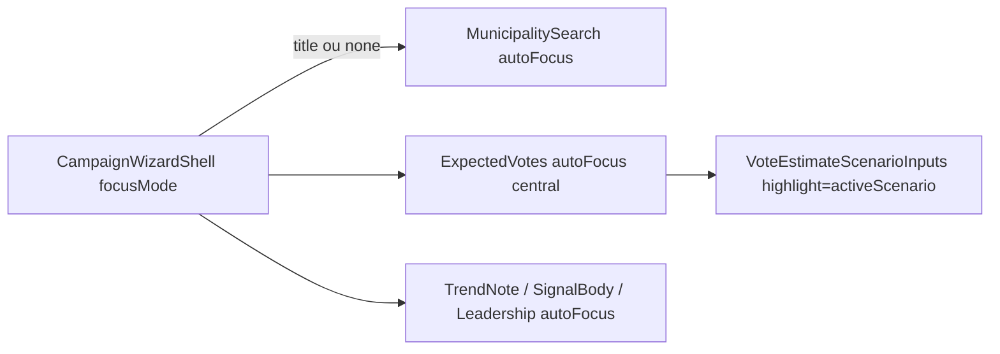

# Wizard — autofocus do primeiro input + destaque do último cenário focado

Status: registrado
Atualizado em: 2026-08-01
Issue: #143
Priority: P1
Model: composer-2.5
Impeccable: B — encaixe em `CampaignWizardShell` + steps com input + `VoteEstimateScenarioInputs` compact
Appetite: ~0,5–0,75d eng; foco/a11y + CSS de active scenario; sem migration
Responsável: —

## Design (Impeccable)

Âncoras: `PRODUCT.md` (Feel the action; Clarity under pressure) / `DESIGN.md` · B59 shell · B61 votos · tema `campaign`.

Na implementação: craft compacto → critique → polish (teclado mobile ao abrir cada step).

Brief compacto:

- **Persona / contexto:** assessor avança steps do wizard no celular; espera digitar na hora sem tocar de novo no campo.
- **Job principal:** ao abrir um step **com input**, o primeiro campo já está focado (e selecionado se numérico); no ajuste de votos, o input **visualmente** destacado é o **último focado**, não o central fixo — alinhado aos atalhos (+50, 2×) que já seguem `focusedScenario`.
- **Estratégia de cor:** Restrained — reusar `border-primary/50 bg-primary/5 ring-primary/15` no ativo; muted nos demais.
- **Edit where you see:** sim no sentido de affordance do cenário ativo (já existe strip); não abre editor novo.
- **Anti-goals:** autofocus em steps só de escolha (grid de tendência/tipo) sem input de texto; mudar validação `getWizardVoteViolation`; spreadsheet mode.

### Wireframe (texto)

```text
┌─ step município (após B107 sem h1) ─────────────────┐
│ ┌─ Nome do município… │← foco + teclado ao abrir     │
│ hits…                                               │
└─────────────────────────────────────────────────────┘

┌─ step votos estimados ──────────────────────────────┐
│  [strip marker sob o ativo]                         │
│  ┌─────┐ ┌─────┐ ┌─────┐                            │
│  │ 80  │ │ 100 │ │ 120 │  ← destaque = last focused │
│  └─────┘ └─────┘ └─────┘                            │
│  (ex.: foco em otimista → anel primary nele,        │
│   não no central)                                   │
│  [+50] [2×] … aplicam ao focusedScenario            │
└─────────────────────────────────────────────────────┘
```

## Dados → decisão → apresentação

Dados: N/A — affordance de edição; números já existentes.

## Contexto

`CampaignWizardShell` faz `titleRef.focus()` em todo `stepTitle` change — útil para screen readers em steps de escolha, mas **rouba** o foco do primeiro input.

`WizardExpectedVotesStep` já mantém `focusedScenario` (default `central`) e passa `activeScenario` / `onFocusScenario` para atalhos e strip (`markerMode: 'active-only'`). Porém em `VoteEstimateScenarioInputs` **compact**, a classe primary está hardcoded em `scenario === 'central'`, então o meio parece sempre “o” ativo mesmo quando o foco (e os botões) estão noutro cenário.

Pedido de produto (2026-08-01): autofocus do primeiro input em cada step com input; no votos, destaque = último focado.

## Objetivos

- Steps com `<input>` / textarea / search: ao montar (ou ao mudar de step), focar o primeiro campo editável; em campos numéricos de votos, manter `select()` no focus (já existe).
- Shell **não** foca o `h1` quando o step declara que vai autofocusar um input (ou quando `stepTitle` é null — B107).
- Compact votes: highlight primary segue `activeScenario` (último `onFocus`), não `central` fixo; erro (`errorScenarios`) continua a ganhar da highlight de foco.
- Default inicial inalterado: monta com `central` focado + `autoFocusScenario="central"` → meio destacado até o usuário focar outro.
- Sem migration / mudança de schema de pledge.
- Pins: unit na regra de classe compact (`activeScenario` vs central); RTL leve de autofocus no municipality step se barato.

## Decisões travadas

- **Um item para autofocus + highlight de votos.** Mesmo eixo “foco = sinal do controle ativo”; appetite cabe. **Rejeitado:** duas Issues cosméticas.
- **Opt-in por step (`autoFocusFieldId` / `focusMode: 'title' | 'first-input'`), não heurística DOM genérica no shell.** Cada step sabe seu primeiro input. **Rejeitado:** `querySelector('input')` no shell (frágil com hidden fields).
- **Highlight compact = `activeScenario`, em todos os call sites compact (wizard + lista B42).** Consistência; lista já passa foco. **Rejeitado:** prop `highlightCentralAlways` legacy.
- **Steps só de botões/grid (tendência, tipo de sinal): mantêm foco no título (ou primeiro radio/button se já existir).** Fora do “com input”. **Rejeitado:** forçar foco no primeiro botão do grid neste item (pode ser follow-up a11y).
- **i18n:** ids existentes; sem copy nova obrigatória.

## Questões em aberto

- **Município: `autoFocus` nativo vs `useEffect` + ref após paint?** **Opções:** A `autoFocus` no `CampaignSearchInput` | B effect no step. **Recomendação:** **A** se o shell parar de focar o h1; B se race com navegação pending. _(assumido — craft)_
- **Labeled variant (não compact) também destaca por foco?** **Opções:** A só compact | B ambos. **Recomendação:** **A** — pedido é o wizard/strip compact; labeled já tem labels por campo. _(assumido)_

## Abordagem proposta



Componentes:

- **`CampaignWizardShell`:** prop `contentFocus?: 'title' | 'none'` (default `'title'` para não regredir grids); quando `'none'`, skip `titleRef.focus()`. Steps com input passam `'none'`.
- **`WizardMunicipalitySearchStep`:** `contentFocus="none"` + `autoFocus` no search input (coordena com B107 sem h1).
- **`WizardExpectedVotesStep` / `WizardTrendNoteStep` / `WizardSignalBodyStep` / `WizardLeadershipStep`:** `contentFocus="none"` + autofocus no primeiro campo.
- **`VoteEstimateScenarioInputs` compact:** trocar `scenario === 'central'` por `scenario === activeScenario` na classe primary (erro destrutivo prevalece).
- **Testes:** unit da classe compact; smoke se houver spec do wizard votos.
- **Migration:** Sem migration.

## Dependências

- Soft: B59 ✓, ajuste votos wizard ✓. Coordena com **B107** (shell sem h1 no município) — se B107 landar antes, `contentFocus` no município é trivial; se este landar antes, funciona com h1 ainda presente desde que shell não foque o título.
- `serializes`: nenhum schema; preferir não editar `CampaignWizardShell` em paralelo com B107 no mesmo instante — se ambos claimed, **B107 primeiro** (título) ou um PR único se o mesmo agente pegar os dois.

## Não escopo

- Remover título / sticky busca → **B107**.
- Voltar/skeleton Início → **B106**.
- Mudar defaults de cenário (pessimista vs central) ou atalhos.

## Rabbit holes

- **Autofocus + leitores de tela (WCAG 2.4.3).** **Mitigação:** steps de escolha continuam no título; só steps de formulário movem foco para o campo — padrão de wizards mobile.
- **Autofocus em toda navegação client do wizard dispara teclado em loop.** **Mitigação:** focus só no mount do step / mudança de `stepTitle`+slug, não a cada re-render de pending.

## Adiado com gatilho

- **Foco no primeiro controle de steps só-grid.** Revisitar com auditoria a11y se VoiceOver reclamar do h1 sem atalho para o grid.
- **Sincronizar highlight da variant labeled.** Se a lista desktop compactar tudo em compact.

## Referências

- GitHub Issue #143
- `src/components/campaign/shared/CampaignWizardShell.tsx`
- `src/components/campaign/shared/WizardMunicipalitySearchStep.tsx`
- `src/components/campaign/shared/WizardExpectedVotesStep.tsx`
- `src/components/campaign/votePledge/VoteEstimateScenarioInputs.tsx`
- `src/components/campaign/municipality/WizardTrendNoteStep.tsx`
- `src/components/campaign/municipality/WizardSignalBodyStep.tsx`
- `src/components/campaign/leadership/WizardLeadershipStep.tsx`
- [chassis-wizard-campanha.md](chassis-wizard-campanha.md) (B59) · [ajuste-votos-wizard.md](ajuste-votos-wizard.md)
- `PRODUCT.md` / `DESIGN.md`

Qualidade de decisão: 5/5
